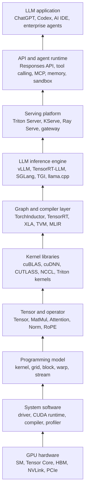
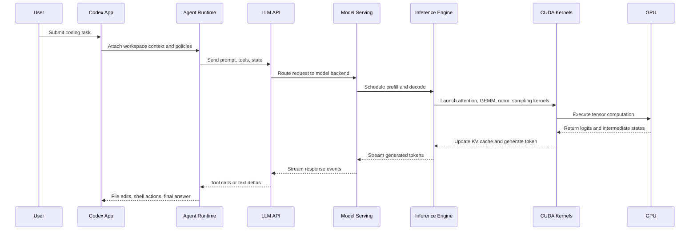
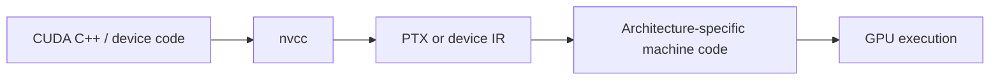
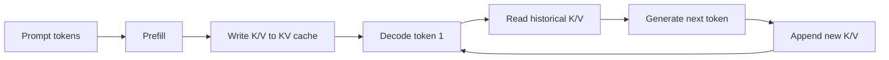

# GPU 到大模型应用技术栈总览

归档日期：2026-07-06

## 1. 主题定位

本文按自底向上的顺序整理从 GPU 硬件到大模型应用的技术栈。重点不是展开每个组件的实现细节，而是建立一张可定位的技术地图：每一层解决什么问题、常见技术有哪些、它如何把能力传递给上一层。

核心链路如下：

```text
GPU hardware
  -> GPU system software
  -> GPU programming model
  -> tensor and operator
  -> operator libraries and kernels
  -> graph compiler and runtime optimization
  -> LLM inference engine
  -> model serving platform
  -> LLM API and agent runtime
  -> LLM application
```

## 2. 总览图



从工程视角看，下层主要提供算力和执行效率，上层主要提供调度、接口、状态、工具和用户体验。大模型应用的稳定性通常不是单点能力决定的，而是这些层之间的组合效果。

## 3. 分层技术栈

| 层级 | 核心问题 | 代表技术 | 向上一层提供什么 |
| --- | --- | --- | --- |
| GPU 硬件 | 如何提供并行计算和高带宽访存 | NVIDIA H100/B200、AMD MI300、昇腾、HBM、NVLink、PCIe、InfiniBand | FLOPS、显存容量、显存带宽、互联带宽 |
| 系统软件 | 如何让程序访问 GPU | GPU driver、CUDA Runtime、CUDA Driver API、ROCm、CANN、Nsight | 设备管理、内存分配、kernel 启动、性能分析 |
| 编译工具链 | 如何把设备代码变成 GPU 可执行代码 | `nvcc`、PTX、SASS、HIP compiler、设备侧编译器 | 编译、链接、目标架构代码生成 |
| GPU 编程模型 | 如何组织并行执行 | kernel、thread、warp、block、grid、stream、event、shared memory | 可控的并行计算模型 |
| Tensor 与算子 | 如何表达 AI 计算 | Tensor、operator、kernel、MatMul、Softmax、RMSNorm、Attention | 框架可调度的计算单元 |
| 算子库 | 如何复用高性能底层实现 | cuBLAS、cuBLASLt、cuDNN、CUTLASS、CUB、NCCL、FlashAttention | 高性能 GEMM、归约、通信、attention |
| 图优化与 AI 编译器 | 如何优化整张计算图 | TorchInductor、TensorRT、XLA、TVM、MLIR、ONNX Runtime、Triton | 算子融合、layout 优化、kernel 选择、代码生成 |
| 大模型推理引擎 | 如何高效生成 token | vLLM、TensorRT-LLM、SGLang、TGI、llama.cpp、DeepSpeed Inference | KV cache 管理、batching、多卡推理、量化 |
| Serving 平台 | 如何把模型变成稳定服务 | Triton Inference Server、KServe、Ray Serve、BentoML、Kubernetes gateway | 部署、伸缩、路由、灰度、监控 |
| API 与 Agent Runtime | 如何让模型可被产品调用并执行任务 | Responses API、function calling、tool calling、MCP、workflow、memory、sandbox | 对话状态、工具调用、权限、审计、任务编排 |
| 应用层 | 如何解决用户任务 | ChatGPT、Codex、AI IDE、企业知识库、自动化 Agent | 交互体验、业务流程、工程生产力 |

## 4. 从一次请求看链路

用户在 Codex 中提出一个代码修改任务时，表面上是一次自然语言交互，底层会经过多层系统。



这条链路中，上层 Agent 看到的是工具、文件、命令和任务状态；中层推理系统看到的是 token、batch、KV cache 和调度队列；底层 GPU 看到的是 kernel、线程块、寄存器、shared memory 和 HBM 访问。

## 5. 基础 Infra 内容

### 5.1 GPU 硬件与集群

大模型推理依赖三类硬件资源：

- 计算吞吐：决定 prefill、GEMM、MLP 等密集计算阶段的上限。
- 显存容量和带宽：决定模型权重、KV cache 和 activation 的可承载规模。
- 互联带宽：决定多卡 tensor parallel、pipeline parallel、expert parallel 的通信成本。

关键基础设施包括：

- GPU / NPU / TPU 设备池。
- HBM、NVLink、PCIe、InfiniBand、RoCE。
- Kubernetes、Slurm、Ray、Kueue 等资源调度系统。
- 镜像、驱动、CUDA / ROCm / CANN 运行时版本管理。
- GPU metrics、DCGM、Prometheus、Grafana、OpenTelemetry。

### 5.2 CUDA 与设备编程

CUDA 是 NVIDIA 的并行计算平台和编程模型。它向开发者暴露 kernel、thread、block、grid、stream、device memory 等概念，使程序可以把计算密集任务卸载到 GPU。

设备编译链路可以抽象为：



对于算子开发者，CUDA 层重点关注：

- 线程映射是否匹配数据布局。
- global memory 访问是否合并。
- shared memory 是否有效复用数据。
- register 使用是否过高。
- warp divergence 是否严重。
- kernel launch、stream、CUDA Graph 是否降低调度开销。

### 5.3 Tensor 与算子

Tensor 是多维数组加上形状、数据类型、设备、stride 等元信息。AI 框架通过 Tensor 表达数据，通过算子表达计算。

```text
model = computation graph
computation graph = tensors + operators
operator = one or more kernels on target backend
```

大模型中高频算子包括：

- `MatMul` / `GEMM` / batched GEMM。
- `Attention` / `FlashAttention`。
- `RMSNorm` / `LayerNorm`。
- `RoPE`。
- `MLP` 中的 gate、up、down projection。
- `Softmax`、sampling、top-k、top-p。
- KV cache read / write / copy / quantize。

### 5.4 算子优化

算子优化目标是让数学等价的计算更贴近硬件执行特性。它通常围绕三个问题展开：数据是否以较低成本送到计算单元、计算单元是否被充分利用、多个算子之间是否产生了不必要的中间数据和调度开销。

更完整的优化流程、逐项说明和 CUDA 示例见 [Operator optimization](operator_optimization.md)。

| 优化方式 | 主要目标 | 典型适用场景 | 主要收益 | 主要风险 |
| --- | --- | --- | --- | --- |
| 访存合并 | 减少 global memory transaction | 连续 Tensor、矩阵行列访问、KV cache 读取 | 提高有效带宽，减少浪费带宽 | 数据 layout 不匹配时需要重排 |
| Tiling / Blocking | 提高片上数据复用 | GEMM、Conv、Attention、Reduce | 降低 HBM 访问，提高 arithmetic intensity | tile 过大会增加 shared memory 和 register 压力 |
| Shared memory 复用 | 避免重复读取 global memory | 矩阵乘法、转置、stencil、attention block | 复用块内数据，降低显存访问 | bank conflict、同步开销、occupancy 下降 |
| Register blocking | 在线程私有寄存器中复用数据 | GEMM micro-kernel、small reduction | 降低 shared/global memory 访问 | register pressure、spill 到 local memory |
| Warp-level 优化 | 利用 warp 内同步执行和数据交换 | reduction、scan、softmax、top-k | 减少 shared memory 和 block 级同步 | 分支发散会增加指令执行 |
| Tensor Core / MMA | 使用矩阵专用计算单元 | MatMul、Conv、Attention 的 QK / PV | 显著提高矩阵乘吞吐 | shape、layout、dtype 需要满足约束 |
| 混合精度与量化 | 降低计算和访存成本 | FP16/BF16/FP8/INT8/INT4 推理 | 降低显存占用，提高吞吐 | 数值误差、校准成本、精度回退 |
| 算子融合 | 减少中间 Tensor 和 kernel launch | MatMul + Bias + Activation、Norm + residual | 降低 HBM 往返和调度开销 | 融合后 kernel 更复杂，复用性下降 |
| Layout specialization | 让数据排列匹配 kernel 访问 | NHWC、blocked layout、paged KV cache | 提高 coalescing 和 cache locality | layout 转换本身可能抵消收益 |
| Asynchronous copy / pipeline | 重叠搬运和计算 | Ampere 及更新架构上的 tiled kernel | 隐藏 global-to-shared 复制延迟 | pipeline 阶段和同步关系更复杂 |
| CUDA Graph | 复用稳定执行图 | 固定 shape、固定 batch、重复调用链 | 降低 CPU launch overhead | 动态 shape 和动态控制流适配成本高 |
| Profiling 驱动调优 | 用指标定位瓶颈 | Nsight Compute / Systems、框架 profiler | 避免盲目调优 | 指标解释需要结合硬件和 workload |

## 6. 推理框架内容

大模型推理框架把 Transformer 权重、tokenizer、scheduler、KV cache、分布式通信和高性能 kernel 组合成可运行系统。

| 框架 | 典型定位 | 重点能力 |
| --- | --- | --- |
| vLLM | 通用高吞吐 LLM serving engine | PagedAttention、continuous batching、OpenAI-compatible server、量化、多后端 |
| TensorRT-LLM | NVIDIA GPU 上的深度优化推理栈 | TensorRT engine、in-flight batching、paged KV cache、多 GPU / 多节点、FP8 / INT8 / INT4 |
| SGLang | 面向复杂 LLM 程序和 serving 的运行时 | structured generation、radix cache、多请求调度、agentic workload |
| TGI | Hugging Face 文本生成服务 | transformers 生态集成、生产化 HTTP serving、streaming |
| llama.cpp | 本地和轻量部署 | GGUF、CPU/GPU 多后端、低比特量化、本地运行 |
| DeepSpeed Inference | 分布式推理与大模型并行 | tensor parallel、kernel injection、ZeRO 相关生态 |

推理框架的核心优化问题：

- Prefill 与 decode 的负载特征不同，前者更偏计算密集，后者更偏显存带宽和 KV cache 访问。
- KV cache 会随上下文长度和并发请求增长，是长上下文推理的关键资源。
- Continuous batching 通过动态合批提高吞吐，但需要处理不同请求长度和结束时间。
- Prefix cache 可以复用共享前缀，降低重复 prompt 的 prefill 成本。
- Speculative decoding 用草稿模型或多 token 预测减少主模型调用次数。
- Quantization 用精度损失换取显存、带宽和吞吐收益。
- Tensor parallel、pipeline parallel、expert parallel 用多 GPU 承载更大的模型或更高吞吐。

## 7. 从算子到推理系统的关键数据

推理时 GPU 显存中主要包括以下数据：

| 数据 | 来源 | 主要影响 |
| --- | --- | --- |
| 模型权重 | checkpoint / safetensors / GGUF / TensorRT engine | 常驻显存，决定基础显存占用 |
| activation | 当前层中间结果 | 随 batch、seq_len、hidden size 变化 |
| KV cache | 每层 attention 的历史 K/V | 随上下文长度和并发请求线性增长 |
| runtime workspace | 推理引擎和算子库 | 受 backend、batch、kernel 实现影响 |
| communication buffer | 多卡通信 | 受并行策略和 NCCL 通信模式影响 |

KV cache 是连接推理框架和底层 kernel 的关键对象：



## 8. 每层常见指标

| 层级 | 需要观察的指标 |
| --- | --- |
| GPU 硬件 | GPU utilization、SM occupancy、HBM bandwidth、显存占用、温度、功耗、ECC error |
| Kernel / 算子 | kernel latency、memory throughput、Tensor Core utilization、register pressure、shared memory usage |
| 推理引擎 | TTFT、TPOT、tokens/s、request throughput、batch size、KV cache usage、prefix cache hit rate |
| Serving 平台 | p50 / p95 / p99 latency、queue time、error rate、timeout、autoscaling event |
| API 层 | input tokens、output tokens、cost、rate limit、stream interruption |
| Agent 层 | tool call success rate、workflow success rate、human approval rate、rollback count、policy violation |

指标应按层定位。用户感知到“响应慢”时，可能是 API 排队、推理 scheduler 拥塞、KV cache 碎片、跨卡通信慢、kernel 访存低效，或 Agent 工具调用链路过长。

## 9. 技术栈选型视角

### 9.1 学习路线

适合从以下顺序建立基础：

1. GPU 硬件模型：SM、warp、HBM、Tensor Core。
2. CUDA 编程：kernel、block、grid、stream、memory hierarchy。
3. Tensor 和算子：MatMul、Attention、Norm、RoPE、KV cache。
4. 算子优化：tiling、fusion、FlashAttention、quantization。
5. 图优化：TensorRT、TorchInductor、Triton、ONNX Runtime。
6. 推理框架：vLLM、TensorRT-LLM、SGLang、TGI、llama.cpp。
7. Serving 与集群：Kubernetes、Triton Server、Ray Serve、KServe、gateway。
8. Agent Runtime：tool calling、MCP、memory、sandbox、workflow、eval。
9. 大模型应用：Codex、AI IDE、RAG 系统、企业自动化 Agent。

### 9.2 工程定位

不同角色关注的技术层不同：

| 角色 | 主要关注 |
| --- | --- |
| GPU kernel 工程师 | CUDA、Triton、CUTLASS、算子优化、profiling |
| 推理框架工程师 | scheduler、KV cache、batching、parallelism、quantization |
| 平台工程师 | serving、Kubernetes、GPU 调度、观测、成本 |
| Agent 工程师 | tool schema、workflow、权限、记忆、状态管理 |
| 应用工程师 | 用户体验、业务流程、RAG、API 集成、质量评测 |

## 10. 与已有笔记的关系

- `outline.md` 负责 AI Infra 的全局主题地图。
- `llm_inference_basics.md` 负责解释 LLM 模型加载和一次推理过程。
- 本文负责补齐从 GPU、CUDA、算子、推理框架到 Codex 类应用的纵向链路。

## 11. 参考资料

- [NVIDIA CUDA Programming Guide](https://docs.nvidia.com/cuda/cuda-programming-guide/index.html)
- [NVIDIA CUDA Best Practices Guide](https://docs.nvidia.com/cuda/cuda-c-best-practices-guide/index.html)
- [NVIDIA CUDA Compiler Driver NVCC](https://docs.nvidia.com/cuda/cuda-compiler-driver-nvcc/)
- [NVIDIA Mixed Precision Training Guide](https://docs.nvidia.com/deeplearning/performance/mixed-precision-training/index.html)
- [NVIDIA CUTLASS Documentation](https://docs.nvidia.com/cutlass/latest/)
- [NVIDIA NCCL Documentation](https://docs.nvidia.com/deeplearning/nccl/user-guide/docs/)
- [NVIDIA TensorRT Best Practices](https://docs.nvidia.com/deeplearning/tensorrt/latest/performance/best-practices.html)
- [NVIDIA TensorRT-LLM Documentation](https://docs.nvidia.com/tensorrt-llm/index.html)
- [NVIDIA Triton Inference Server Documentation](https://docs.nvidia.com/deeplearning/triton-inference-server/user-guide/docs/index.html)
- [Triton Language Documentation](https://triton-lang.org/main/index.html)
- [vLLM Documentation](https://docs.vllm.ai/)
- [FlashAttention: Fast and Memory-Efficient Exact Attention with IO-Awareness](https://arxiv.org/abs/2205.14135)
- [OpenAI Codex Documentation](https://developers.openai.com/codex)
- [OpenAI Tools Guide](https://developers.openai.com/api/docs/guides/tools)
