# 大模型基础知识概览

归档日期：2026-06-16

## 1. 定位

本文整理从原始数据到 tokenizer、Transformer、训练系统、推理系统、评测、数据治理和 post-training 的核心概念，并补充流程图、示例和引用。

主线可概括为：

> 从原始数据出发，构建 tokenizer、训练 Transformer 语言模型，理解 GPU / 分布式 / scaling / evaluation / inference / alignment，把大模型视为一个完整工程系统。

## 2. 总体流程图

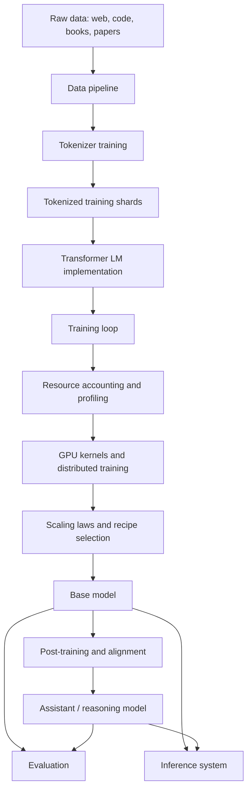

这张图体现了一个关键观点：模型不是孤立的神经网络，而是数据、算法、硬件、系统和评测共同作用的结果。

## 3. Language Model 与 Tokenization

### 3.1 语言模型是什么

语言模型对 token 序列建模，给定前文预测下一个 token。

```text
p(x1, x2, ..., xn) = p(x1) * p(x2 | x1) * ... * p(xn | x1, ..., x_{n-1})
```

训练时，模型通常在每个位置预测下一个 token：

```text
输入 tokens:  [The, capital, of, France, is]
目标 tokens:  [capital, of, France, is, Paris]
```

因此，语言模型不是直接处理自然语言字符串，而是处理 tokenizer 产生的整数序列。

### 3.2 Tokenizer 的角色

Tokenizer 负责：

- encode：字符串 -> token ids。
- decode：token ids -> 字符串。
- 控制文本压缩率。
- 决定模型看到的“原子单位”。

常见粒度对比：

```text
原始文本: "hello world"

字符级:
["h", "e", "l", "l", "o", " ", "w", "o", "r", "l", "d"]

词级:
["hello", "world"]

BPE / subword:
["hello", " world"]
```

### 3.3 BPE 的基本流程

BPE 全称是 **Byte Pair Encoding（字节对编码）**。它最初是一种数据压缩算法，后来被改造为 NLP 中常用的子词 tokenization 方法。

它的核心思想是：

> 从最细粒度的基本 token 开始，不断找出语料中出现频率最高的相邻 token 对，并把这一对合并成一个新 token。

经过多轮合并后：

- 常见的词或片段会被表示成较少的 token。
- 罕见词可以拆成多个较小的 token。
- vocabulary 大小可以通过合并轮数控制。
- 新词不需要统一映射为 `UNK`，因为仍可退回到基本字符或 byte。

例如，假设语料里多次出现 `low`、`lower`：

```text
初始:
l o w
l o w e r

发现 "l o" 出现频繁，合并:
lo w
lo w e r

发现 "lo w" 出现频繁，继续合并:
low
low e r
```

最终，常见片段 `low` 成为一个 token，而 `lower` 可以表示成 `[low, e, r]`。实际的 byte-level BPE 从 UTF-8 bytes 开始，因此原则上可以表示任意输入文本。

需要区分两个阶段：

1. **训练 tokenizer**：在语料中统计频率，学习 vocabulary 和 merge rules。
2. **使用 tokenizer**：按已经学好的 merge rules，把新文本编码成 token ids。

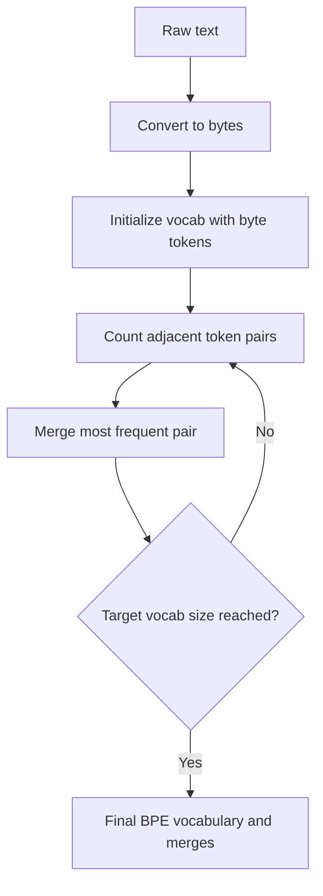

BPE 的价值是折中：

- 比字节级序列短。
- 比词级 vocabulary 更可控。
- 能处理没见过的新词，因为最差可以退回到 byte。

### 3.4 为什么压缩率重要

Transformer attention 成本和序列长度强相关。假设同一段 1000 bytes 文本：

```text
Tokenizer A -> 250 tokens
Tokenizer B -> 500 tokens
```

在 full attention 下，attention score matrix 的大小近似随 token 数平方增长：

```text
250^2 = 62,500
500^2 = 250,000
```

压缩率差一倍，attention 相关工作可能差四倍。这也是学习大模型时需要先理解 tokenization 的原因。

### 3.5 常见注意事项

- `"hello"` 和 `" hello"` 可能是不同 token。
- 数字经常被切成多个 token，影响算术和格式稳定性。
- `<|endoftext|>` 这类 special token 需要显式保护。
- tokenizer 不同会影响 perplexity 可比性。
- 多语言、代码、数学公式对 tokenizer 的压力不同。

参考：

- [Language modeling course notes: tokenization](https://cs336.stanford.edu/lectures/?trace=lecture_01)
- [Assignment 1: Basics](https://github.com/stanford-cs336/assignment1-basics)

## 4. Transformer 基础实现

### 4.1 Decoder-only Transformer 主干

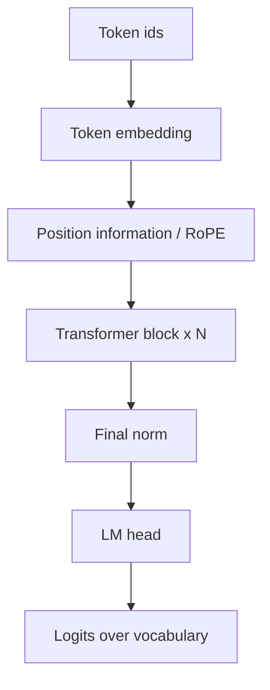

一个 Transformer block 可以写成：

```text
x = x + Attention(Norm(x))
x = x + MLP(Norm(x))
```

这对应现代 decoder-only LLM 常见的 pre-norm 结构。

### 4.2 Attention 的核心计算

```text
Q = X Wq
K = X Wk
V = X Wv
Attention(Q, K, V) = softmax(QK^T / sqrt(d_k)) V
```

对语言模型，需要 causal mask：

```text
第 i 个 token 只能看 <= i 的 token，不能看到未来。
```

### 4.3 训练 step

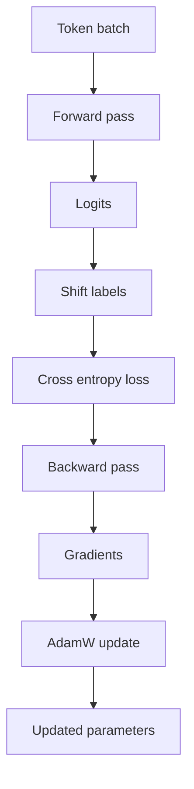

Cross entropy 示例：

```text
模型输出 logits:
Paris: 8.0
London: 3.2
Berlin: 2.9

目标 token:
Paris

loss 会鼓励 Paris 的 logit 相对其他 token 更高。
```

### 4.4 实现时最容易出错的地方

- shape：常见形状是 `[batch, sequence, hidden]`。
- attention heads：常见形状是 `[batch, heads, sequence, head_dim]`。
- logits/labels shift：位置 `t` 的 logits 预测位置 `t+1` 的 token。
- mask：causal mask 和 padding mask 不能混淆。
- initialization：尺度不稳会导致训练初期发散。
- optimizer：AdamW 的 weight decay 要和 Adam 更新解耦。

参考：

- [Assignment 1: Basics](https://github.com/stanford-cs336/assignment1-basics)
- [Attention Is All You Need](https://arxiv.org/abs/1706.03762)

## 5. Resource Accounting：FLOPs、显存与 Roofline

### 5.1 为什么要做资源核算

一个核心心智是：

> 不要只问模型结构是什么，还要问每个 step 在 compute、memory、communication 上花了多少。

训练成本的粗略公式：

```text
每个训练 step FLOPs ≈ 6 * tokens * parameters
```

其中：

```text
forward  ≈ 2 * tokens * parameters
backward ≈ 4 * tokens * parameters
```

例子：训练一个 7B 参数模型，处理 1M tokens：

```text
6 * 7e9 * 1e6 = 4.2e16 FLOPs
```

### 5.2 显存组成

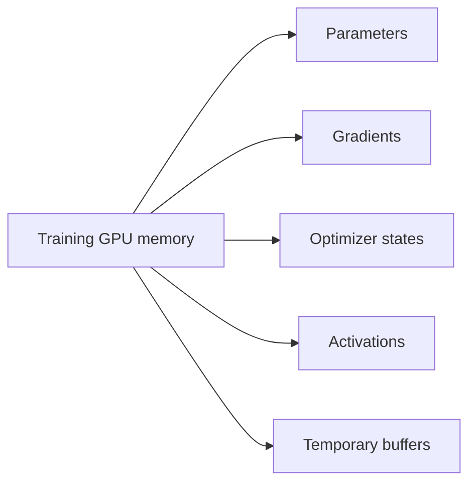

| 类别 | 说明 |
|---|---|
| parameters | 模型权重 |
| gradients | backward 后的梯度 |
| optimizer states | AdamW 的一阶/二阶状态 |
| activations | backward 需要的中间激活 |
| temporary buffers | attention、matmul、通信等临时空间 |

因此，一个 FP16 7B 模型权重约 14GB，但训练它需要远超 14GB 的显存。

### 5.3 Roofline 直觉

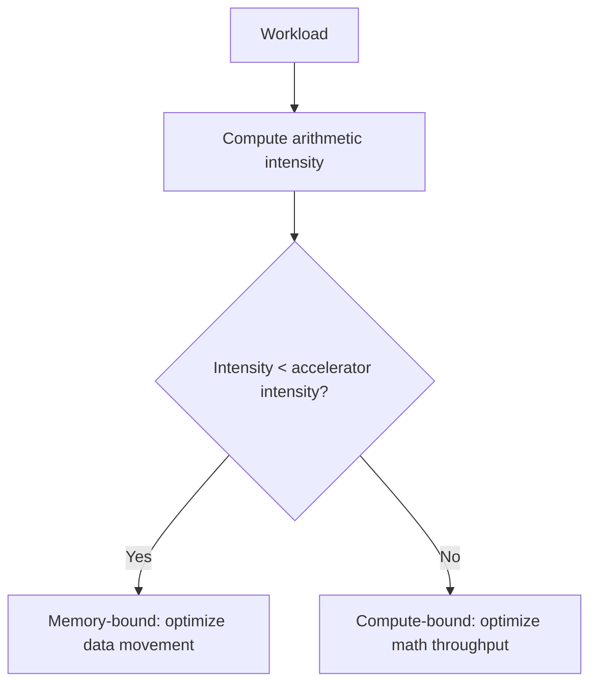

几个直觉：

- 大矩阵乘通常 compute-bound。
- elementwise activation 常常 memory-bound。
- batch 很小时的 decode 类似 matrix-vector product，常常 memory-bound。
- MFU 衡量实际 FLOP/s 与硬件峰值 FLOP/s 的比例。

```text
MFU = actual FLOP/s / peak FLOP/s
```

参考：

- [Language modeling course notes: resource accounting](https://cs336.stanford.edu/lectures/?trace=lecture_02)
- [Assignment 2: Systems](https://github.com/stanford-cs336/assignment2-systems)

## 6. GPU、Kernel 与 Triton

### 6.1 GPU Memory Hierarchy

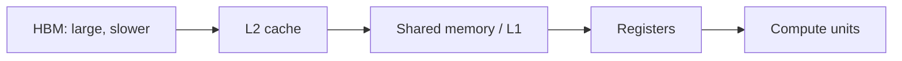

优化原则：

> 尽量减少 HBM 往返，把数据搬到更近的存储层后重复使用。

### 6.2 Kernel Fusion 示例

计算：

```text
y = gelu(x @ W)
```

朴素执行：

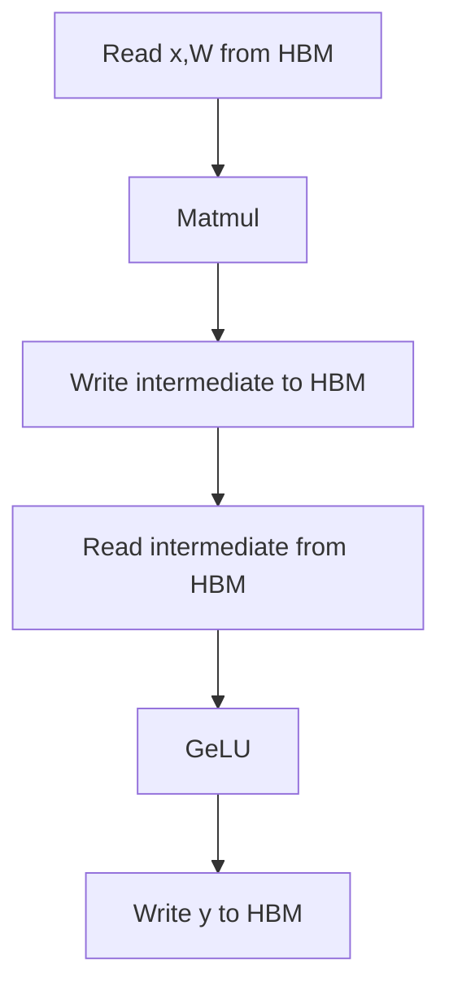

融合执行：

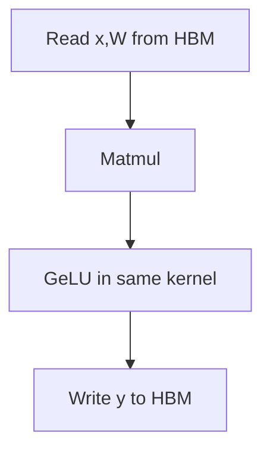

少一次中间结果的读写，就是 kernel fusion 的收益。

### 6.3 Tiling 示例

```text
C = A @ B
```

更高效的 matmul kernel 会把矩阵切成 tile：

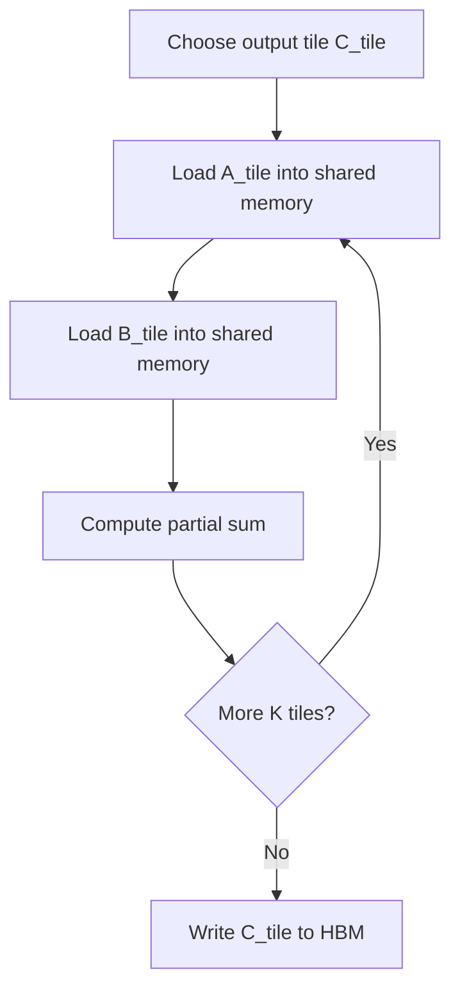

FlashAttention 也是类似思想：它不改变 attention 数学结果，而是通过 tiling 和 online softmax 减少 HBM IO。

### 6.4 性能问题清单

| 问题 | 含义 |
|---|---|
| memory coalescing 差 | warp 访问 HBM 不能合并成高效 transaction |
| bank conflict | shared memory 多个 thread 访问同一 bank，被串行化 |
| occupancy 低 | SM 上同时驻留的 warp/block 太少 |
| kernel launch 过多 | 小算子太多，调度开销显著 |
| wave quantization | block 数不能充分填满所有 SM |

参考：

- [Language modeling course notes: GPU kernels](https://cs336.stanford.edu/lectures/?trace=lecture_06)
- [FlashAttention](https://arxiv.org/abs/2205.14135)

## 7. 多 GPU Parallelism

### 7.1 为什么需要多 GPU

两个主要原因：

- 单 GPU 放不下参数、activation、gradient、optimizer state。
- 想用更多 FLOPs 缩短训练时间。

### 7.2 Collective Operations

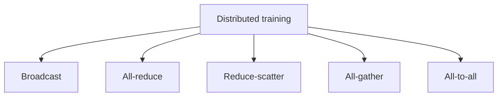

直觉：

```text
broadcast:
  rank 0 有一份参数，复制给所有 rank。

all-reduce:
  每个 rank 有本地 gradient，把所有 gradient 求和，并让每个 rank 都拿到结果。

reduce-scatter:
  求和后，每个 rank 只拿结果的一部分。

all-gather:
  每个 rank 有一片 tensor，把所有片段收集起来，让每个 rank 都拿到完整 tensor。

all-to-all:
  每个 rank 都给每个其他 rank 发一片数据，常用于 MoE expert routing。
```

### 7.3 并行策略

| 方式 | 切分对象 | 典型通信 |
|---|---|---|
| Data parallelism | batch | gradient all-reduce |
| FSDP / ZeRO | parameter / optimizer state / gradient | all-gather + reduce-scatter |
| Tensor parallelism | layer 内部矩阵维度 | 高频 all-reduce / all-gather |
| Pipeline parallelism | 层深度 | activation 传递，需处理 pipeline bubble |
| Sequence parallelism | 序列长度 | attention / activation 相关通信 |
| Expert parallelism | MoE expert | all-to-all |

Data parallelism：

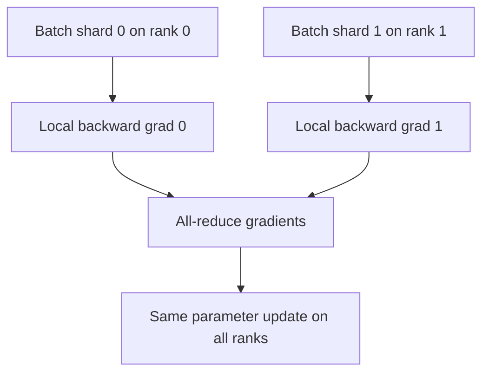

FSDP / ZeRO：

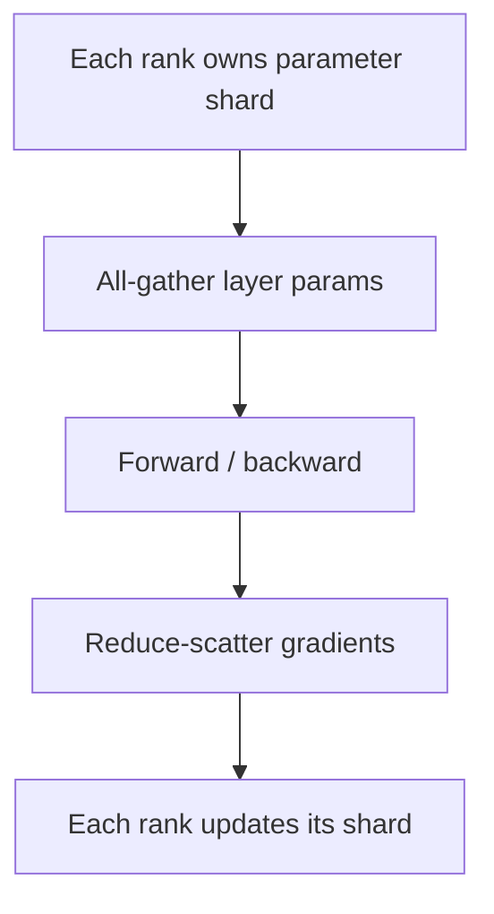

### 7.4 硬件拓扑

```text
同一 GPU 内: registers / shared memory / HBM
单机多 GPU: NVLink / NVSwitch
多机多 GPU: InfiniBand / RoCE / Ethernet
```

越往外越慢，因此 tensor parallelism 通常更依赖高速互联；pipeline parallelism 更能跨较慢互联扩展，但要处理 pipeline bubble。

参考：

- [Language modeling course notes: parallelism](https://cs336.stanford.edu/lectures/?trace=lecture_07)
- [Assignment 2: Systems](https://github.com/stanford-cs336/assignment2-systems)

## 8. Scaling Laws

### 8.1 要回答的问题

Scaling laws 解决的是：

> 给定固定 FLOPs 预算，应该用更大的模型，还是更多训练 token？

经典关系：

```text
C ≈ 6 N D
```

其中：

- `C` 是训练 FLOPs。
- `N` 是参数量。
- `D` 是训练 token 数。

### 8.2 Chinchilla 直觉

Chinchilla 风格的 compute-optimal scaling law 给出一个经验直觉：

```text
D ≈ 20N
```

例如：

```text
N = 70B parameters
D ≈ 20N ≈ 1.4T tokens
```

这说明许多早期大模型可能参数很多，但训练 token 不够，属于 undertrained。

### 8.3 Scaling Recipe

学习 scaling laws 时，不要只想一个固定模型，而要想一个 recipe：

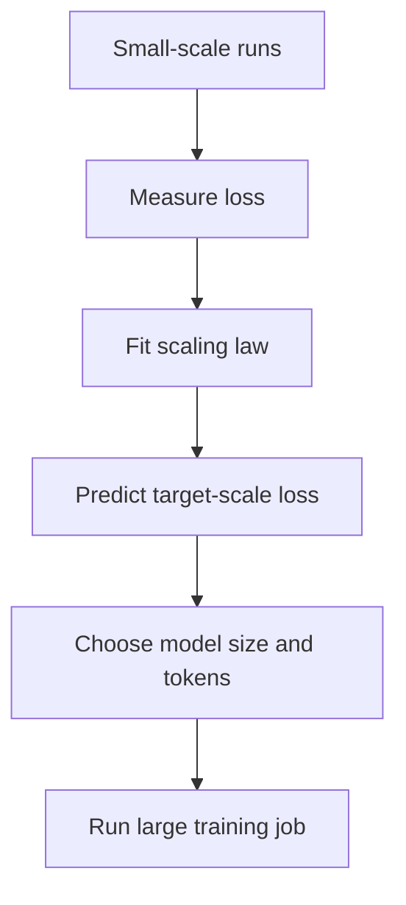

Scaling law 的价值：

- 帮助决定模型大小和数据量。
- 帮助判断训练曲线是否异常。
- 帮助做算力预算。
- 避免在 full-scale 上进行高成本试错。

限制：

- 小规模最优配置不一定完全迁移到大规模。
- 数据质量变化会改变曲线。
- 生产模型还要考虑 inference cost。
- 推理成本很高时，可能故意 overtrain 小模型。

参考：

- [Assignment 3: Scaling](https://github.com/stanford-cs336/assignment3-scaling)
- [Training Compute-Optimal Large Language Models](https://arxiv.org/abs/2203.15556)

## 9. Inference

### 9.1 两阶段

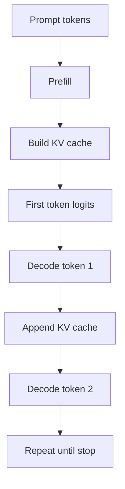

| 阶段 | 输入形态 | 典型瓶颈 | 主要指标 |
|---|---|---|---|
| Prefill | prompt 中所有 token | 长上下文 attention / compute | TTFT |
| Decode | 每步一个新 token | 权重读取、KV cache 读取、memory bandwidth | TPOT / tokens/s |

### 9.2 为什么 Decode 常常 Memory-bound

训练时：

```text
[batch, sequence, hidden] 是大矩阵，适合并行。
```

decode 时：

```text
每个请求每次只来一个新 token，像 matrix-vector product。
计算量小，但要读很多权重和 KV cache。
```

### 9.3 KV Cache 与 PagedAttention

传统 KV cache 可能造成碎片：

```text
请求 A: 预留 4096 tokens，只用了 800
请求 B: 预留 4096 tokens，只用了 1200
```

PagedAttention 的思想：

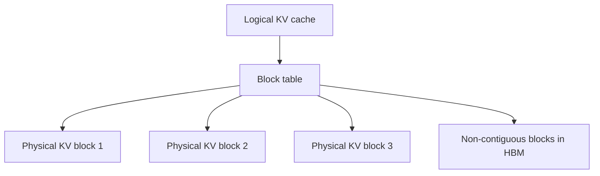

逻辑上连续，物理上可不连续，类似操作系统分页，从而减少碎片和浪费。

### 9.4 常见推理优化

| 方法 | 解决问题 |
|---|---|
| continuous batching | 动态请求到达和完成 |
| prefix caching | 复用共享 prompt 前缀 |
| GQA / MQA / MLA | 减少 KV cache 尺寸 |
| quantization | 减少权重/KV cache memory traffic |
| speculative decoding | 用小模型猜 token，大模型并行验证 |
| FlashAttention / FlashDecoding | 降低 attention IO 和 kernel overhead |

Speculative decoding：

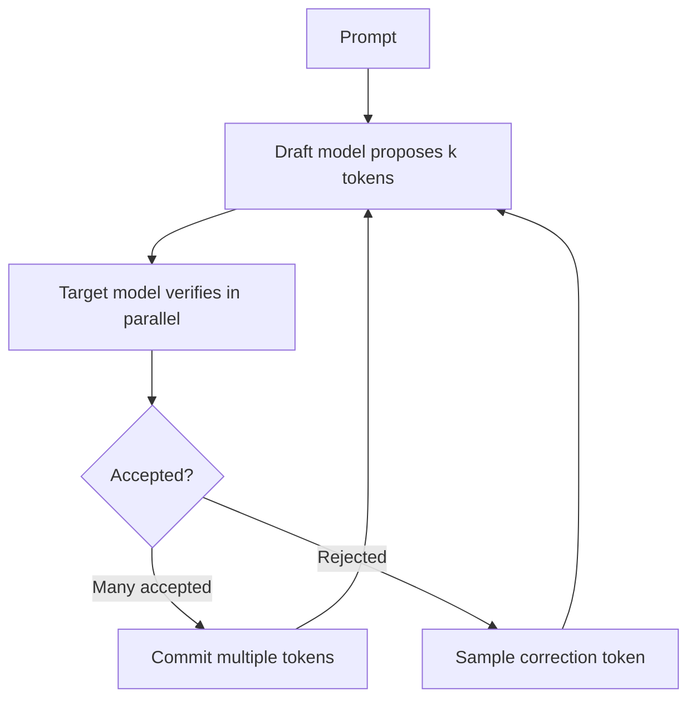

与 block-level attention pruning 的关系：

```text
Inference bottleneck
 -> attention / KV cache 是关键
 -> FlashAttention 减少 IO
 -> block-level pruning 跳过贡献较小的 attention block
```

参考：

- [Language modeling course notes: inference](https://cs336.stanford.edu/lectures/?trace=lecture_10)
- [PagedAttention / vLLM](https://arxiv.org/abs/2309.06180)
- [FlashAttention](https://arxiv.org/abs/2205.14135)

## 10. Evaluation

### 10.1 Evaluation 的本质

课程把 evaluation 定义为：

> 给定一个模型，如何判断它好不好？

但“好”不是单一指标。不同角色关心不同问题：

- 研究者：模型是否有更强原始能力。
- 开发者：模型是否帮助改进训练 recipe。
- 用户/企业：模型是否适合具体用例。
- 政策与安全团队：模型是否带来风险。

核心框架：

```text
abstract construct -> concrete metric
```

例如“推理能力”是抽象构念，MATH、GPQA、ARC-AGI、HLE 等只是不同测量方式。

### 10.2 Evaluation 谱系

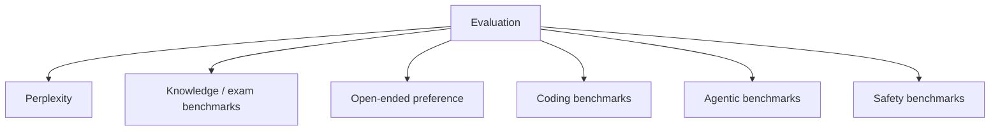

| 类型 | 示例 | 适合衡量 |
|---|---|---|
| Perplexity | WikiText、private corpora | 语言建模损失、scaling |
| 知识考试 | MMLU、MMLU-Pro、GPQA | 学科知识、问答 |
| 难题/推理 | HLE、ARC-AGI、AIME | 推理、抗饱和 |
| 开放回答 | AlpacaEval、Chatbot Arena | 对话偏好、主观质量 |
| 编程 | HumanEval、LiveCodeBench、SWE-Bench | 代码生成、修 bug |
| Agent | Terminal-Bench、MLEBench | 工具使用、长期任务 |
| Safety | HarmBench、jailbreak evals | 拒答、安全策略 |

### 10.3 常见风险

- benchmark 饱和。
- 数据污染和 train-test overlap。
- LLM judge 偏好长回答或特定风格。
- 私有评测抗污染但透明度低。
- agentic eval 评估的是 `LM + scaffold`，不只是模型。

SWE-Bench 示例：

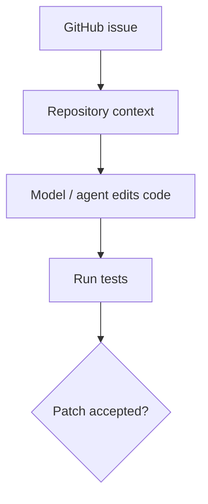

参考：

- [Language modeling course notes: evaluation](https://cs336.stanford.edu/lectures/?trace=lecture_12)
- [MMLU](https://arxiv.org/abs/2009.03300)
- [SWE-Bench](https://arxiv.org/abs/2310.06770)

## 11. Data

### 11.1 Data Pipeline

数据工程中的核心原则是：

> Data does not fall from the sky.

大模型数据不是“整个互联网”直接喂进去，而是复杂 pipeline 的结果。

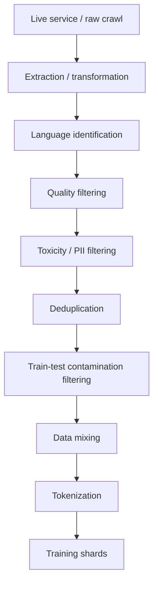

常见数据源：

- Common Crawl。
- Wikipedia。
- arXiv。
- Project Gutenberg / books。
- GitHub / Software Heritage。
- Stack Exchange / Reddit。
- synthetic data。

### 11.2 Filtering

Filtering 的目标是提高每个训练 token 的价值。

| 方法 | 目标 |
|---|---|
| language ID | 保留目标语言 |
| quality filtering | 保留更接近高质量源的文本 |
| toxicity filtering | 降低有害内容比例 |
| domain filtering | 保留数学、代码、医学等领域 |
| model-based filtering | 用强模型或 classifier 给文档打分 |

### 11.3 Deduplication

Exact duplicate 可以用 hash；near duplicate 通常需要 Jaccard、MinHash、LSH。

```text
Jaccard(A, B) = |A ∩ B| / |A ∪ B|
```

MinHash 的关键性质：

```text
Pr[h(A) = h(B)] = Jaccard(A, B)
```

```mermaid
flowchart TD
  A["Document"] --> B["Split into shingles"]
  B --> C["Compute MinHash signatures"]
  C --> D["Group by LSH bands"]
  D --> E["Candidate duplicate pairs"]
  E --> F["Remove or keep one copy"]
```

### 11.4 Data Mixing

数据混合问题：

```text
Source A: 10T web tokens，质量中等
Source B: 100B math tokens，质量高
Source C: 50B code tokens，质量高但领域窄
```

如果按 token 数比例采样，B/C 几乎没有存在感。如果均匀采样，B/C 又会被重复训练很多 epoch，可能过拟合。

```mermaid
flowchart TD
  A["Candidate mixtures"] --> B["Small-scale training runs"]
  B --> C["Measure downstream loss/evals"]
  C --> D["Fit mixture -> performance model"]
  D --> E["Choose large-scale mixture"]
```

### 11.5 法律与治理

课程强调：

- 互联网上大多数内容都有 copyright。
- fair use 是否适用于训练，并不完全确定。
- terms of service、robots.txt、server load、隐私和 PII 都会影响数据获取。
- permissive license 只解决一部分问题。
- 数据治理需要来源、授权、审计、去重、污染检测。

参考：

- [Language modeling course notes: data sources](https://cs336.stanford.edu/lectures/?trace=lecture_13)
- [Language modeling course notes: data processing](https://cs336.stanford.edu/lectures/?trace=lecture_14)
- [Assignment 4: Data](https://github.com/stanford-cs336/assignment4-data)

## 12. Alignment 与 Reasoning RL

### 12.1 Post-training 的位置

```mermaid
flowchart TD
  A["Pretraining"] --> B["Base model"]
  B --> C["Mid-training"]
  C --> D["SFT"]
  D --> E["Preference learning"]
  E --> F["RLHF / RLVR"]
  F --> G["Assistant / reasoning model"]
```

Base model 只学到：

```text
给定上文，预测下一个 token。
```

但 assistant / reasoning model 还需要：

- 按指令回答。
- 遵守格式。
- 拒绝不安全请求。
- 在数学或代码任务中产生可验证正确答案。
- 使用工具和环境反馈。
- 在长链路任务里保持状态和计划。

### 12.2 SFT、RLHF、DPO

SFT：

```text
prompt -> ideal response
```

RLHF：

```mermaid
flowchart TD
  A["SFT model"] --> B["Generate responses"]
  B --> C["Human preference data"]
  C --> D["Train reward model"]
  D --> E["PPO / RL optimization"]
  E --> F["Aligned policy"]
```

DPO：

```text
prompt
chosen response
rejected response
```

DPO 不显式训练 reward model 再跑 RL，而是把 preference optimization 写成更直接的 supervised-like loss，工程上更简单。

### 12.3 Reasoning RL / RLVR

Reasoning RL 的 reward 可以来自 verifier：

```text
数学题: 最终答案是否正确
代码题: 单元测试是否通过
工具任务: 环境状态是否达成目标
```

GRPO 的直觉：

```mermaid
flowchart TD
  A["One prompt"] --> B["Sample G responses"]
  B --> C["Verifier scores each response"]
  C --> D["Compute group-relative advantages"]
  D --> E["Update policy"]
```

它不训练单独 value function，而是用组内 reward 的相对分数更新模型。

### 12.4 为什么 Alignment 也是系统问题

```mermaid
flowchart TD
  A["Reasoning RL training"] --> B["Massive rollout inference"]
  B --> C["Verifier / judge"]
  C --> D["Reward signals"]
  D --> E["Policy update"]
  E --> A
```

系统难点：

- rollout 需要高吞吐推理。
- verifier / judge 要可靠且可扩展。
- on-policy 数据越新鲜，系统越复杂。
- 长 reasoning traces 会显著增加 token 成本。
- reward 设计不稳会导致 reward hacking。

这就是为什么要把 inference、evaluation、alignment 放在同一张知识图里：现代大模型训练中，它们已经互相纠缠。

参考：

- [Assignment 5: Alignment](https://github.com/stanford-cs336/assignment5-alignment)
- [Training language models to follow instructions with human feedback](https://arxiv.org/abs/2203.02155)
- [Direct Preference Optimization](https://arxiv.org/abs/2305.18290)

## 13. 关键关系图

```mermaid
flowchart LR
  A["Data quality"] --> B["Training loss"]
  B --> C["Base model capability"]
  C --> D["Evaluation"]
  C --> E["Inference cost"]
  C --> F["Post-training"]
  F --> G["Assistant behavior"]
  G --> D
  E --> H["Serving architecture"]
  H --> I["User experience"]
  D --> J["Next data / recipe decisions"]
  J --> A
```

这张图展示了大模型工程的核心关系：数据、训练、推理、评测、alignment 不是单向线性流程，而是迭代系统。

## 14. 参考资料

- [Stanford CS336: Language Modeling from Scratch](https://cs336.stanford.edu/)
- [Assignment 1: Basics](https://github.com/stanford-cs336/assignment1-basics)
- [Assignment 2: Systems](https://github.com/stanford-cs336/assignment2-systems)
- [Assignment 3: Scaling](https://github.com/stanford-cs336/assignment3-scaling)
- [Assignment 4: Data](https://github.com/stanford-cs336/assignment4-data)
- [Assignment 5: Alignment](https://github.com/stanford-cs336/assignment5-alignment)
- [Attention Is All You Need](https://arxiv.org/abs/1706.03762)
- [FlashAttention](https://arxiv.org/abs/2205.14135)
- [Training Compute-Optimal Large Language Models](https://arxiv.org/abs/2203.15556)
- [PagedAttention / vLLM](https://arxiv.org/abs/2309.06180)
- [MMLU](https://arxiv.org/abs/2009.03300)
- [SWE-Bench](https://arxiv.org/abs/2310.06770)
- [Training language models to follow instructions with human feedback](https://arxiv.org/abs/2203.02155)
- [Direct Preference Optimization](https://arxiv.org/abs/2305.18290)
