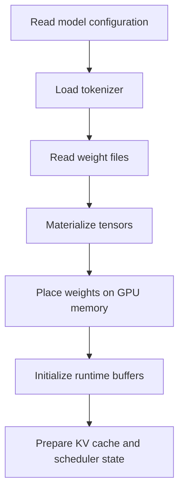
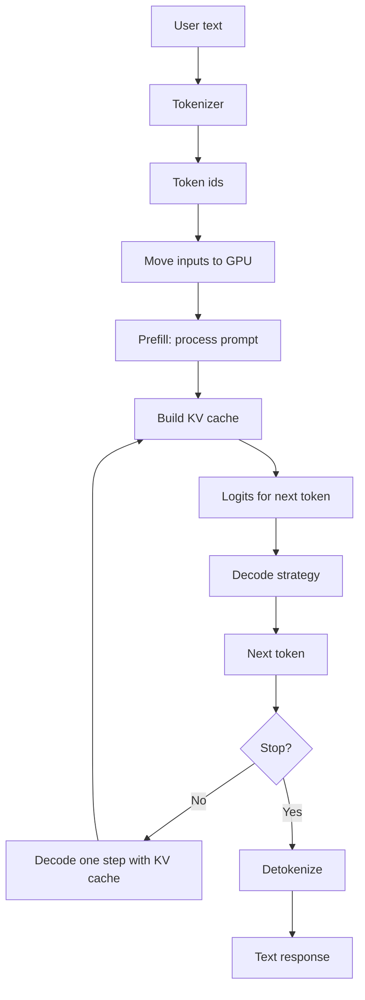

# LLM 模型与推理过程基础

归档日期：2026-06-15

## 1. 主题定位

本文归档 LLM 模型本质、模型加载到 GPU 显存后的形态，以及一次推理请求从文本输入到 token 输出的基本流程。

这部分知识是理解大模型推理优化、算子优化、KV cache、FlashAttention、vLLM、TensorRT-LLM 等系统的前置基础。

核心概括：

> LLM 是一个预测下一个 token 的巨大 Transformer 参数函数；加载到 GPU，就是把权重矩阵、缓存和运行时 buffer 放进显存；推理就是 token -> embedding -> 多层 attention/MLP -> logits -> 采样下一个 token。

## 2. LLM 本质是什么

LLM 本质上是一个参数规模很大的概率模型，更具体地说：

> 给定一串 token，预测下一个 token 的概率分布。

例如输入：

```text
The capital of France is
```

模型输出的不是一个确定字符串，而是整个词表上的概率分布：

```text
Paris: 0.72
London: 0.04
...
```

推理系统再根据 decoding 策略选择下一个 token。

Hugging Face Transformers 文档将 LLM 文本生成描述为：模型根据初始文本 prompt 以及自己已经生成的输出，继续生成下一个 token，直到达到预设长度或遇到 EOS token。

## 3. LLM 的基本组成

现代主流生成式 LLM 多数是 decoder-only Transformer。可以抽象成：

```text
LLM = tokenizer + embedding + 多层 Transformer block + LM head
```

其中：

- tokenizer：把自然语言字符串转换成 token id。
- embedding：把离散 token id 映射成连续向量。
- Transformer block：反复执行 self-attention、MLP、残差连接和归一化。
- LM head：把最后的 hidden state 映射回词表 logits。

每层 Transformer block 通常包含：

```text
LayerNorm
Self-Attention
Residual
LayerNorm
MLP / FFN
Residual
```

Self-Attention 的核心计算是：

```text
Attention(Q, K, V) = softmax(QK^T / sqrt(d_k)) V
```

因此，attention、KV cache、FlashAttention 等优化通常围绕 `QK^T`、softmax、`V` 的读取和矩阵乘展开。

## 4. 模型加载到 GPU 显存发生了什么

以 Hugging Face Transformers 为例，常见加载方式类似：

```python
model = AutoModelForCausalLM.from_pretrained(
    "model-name",
    device_map="auto",
    torch_dtype=torch.float16,
)
```

主要发生以下步骤。



### 4.1 读取模型配置

模型配置描述网络结构，例如：

- 层数。
- hidden size。
- attention heads。
- 词表大小。
- 最大上下文长度。
- RoPE / position embedding 配置。
- attention 类型，如 MHA、MQA、GQA、MLA。

### 4.2 读取 tokenizer

模型不直接处理自然语言字符串，而是处理 token id。

例如：

```text
"请解释算子优化"
```

会被 tokenizer 转换成：

```text
[151644, 872, 198, ...]
```

### 4.3 读取权重文件

模型权重通常存储在 `.safetensors`、`.bin`、TensorRT engine、GGUF 等文件中。

权重本质是大量张量，例如：

```text
embedding.weight
q_proj.weight
k_proj.weight
v_proj.weight
o_proj.weight
mlp.up_proj.weight
mlp.down_proj.weight
lm_head.weight
```

这些张量是模型训练后保留下来的参数，也是模型“能力”的主要载体。

### 4.4 将权重放入 GPU 显存

以 FP16 / BF16 为例，每个参数通常占 2 bytes。

一个 7B 参数模型的权重显存大约是：

```text
7B * 2 bytes ≈ 14GB
```

NVIDIA 的 LLM inference optimization 文章也用 Llama 2 7B 举例说明，16-bit precision 下约 14GB 显存用于模型参数。

### 4.5 初始化运行时缓存与 workspace

除了模型权重，还需要准备：

- CUDA kernel workspace。
- attention 临时 buffer。
- KV cache。
- batch / request 管理结构。
- 推理框架自己的内存池和调度状态。

如果使用 vLLM、TensorRT-LLM、SGLang 这类推理系统，还会有更复杂的 KV cache block 管理、continuous batching、prefix cache、in-flight batching 等机制。

因此，“加载 LLM 到 GPU”不是抽象能力的直接迁移，而是：

```text
把模型结构实例化
把大量矩阵参数加载成 GPU tensor
准备好执行这些矩阵计算的 kernel 和缓存
```

## 5. 一次推理请求的基本流程

LLM 推理通常分成两个主要阶段：

- prefill：处理输入 prompt，建立 KV cache，并生成第一个 token。
- decode：逐 token 生成后续输出，并持续追加 KV cache。

整体流程如下：



## 6. Prefill 阶段

Prefill 是把完整 prompt 一次性送进模型。

每一层主要执行：

```text
token ids
 -> embedding
 -> layer 1 attention + MLP
 -> layer 2 attention + MLP
 -> ...
 -> final hidden states
 -> lm_head
 -> logits
```

在 attention 中，会计算 prompt 内 token 之间的关系：

```text
Q = X Wq
K = X Wk
V = X Wv
scores = QK^T / sqrt(d)
probs = softmax(scores)
output = probs V
```

同时，系统会把每一层产生的 `K` 和 `V` 保存下来，形成 KV cache。

Prefill 的特点：

- 输入 token 已知。
- 可以大规模并行。
- 更像 matrix-matrix 运算。
- GPU 利用率通常较高。
- 输入越长，TTFT 越容易变大。

## 7. Decode 阶段

Decode 是自回归生成过程。模型每次只生成一个新 token。

生成一个 token 后，这个 token 会被再次喂回模型，用于生成下一个 token。

简化流程：

```text
logits -> softmax / sampling / greedy / top-p -> next token
next token -> model -> next logits -> next token -> ...
```

Decode 每一步只处理一个新 token，但它需要关注之前所有 token。为了避免每一步重新计算所有历史 token 的 K/V，推理系统会复用 KV cache：

```text
新 token -> 计算新的 Q/K/V
历史 K/V 从 KV cache 读取
当前 Q 与历史 K 做 attention
得到输出
生成下一个 token
把新的 K/V 追加进 KV cache
```

Decode 的特点：

- 自回归，一次生成一个 token。
- 强顺序依赖，难以完全并行。
- 大量读取模型权重和 KV cache。
- 常常是 memory-bound。

NVIDIA 的推理优化文章强调，decode 阶段的主要瓶颈通常不是计算吞吐，而是权重、K/V、activation 等数据从显存传输到计算单元的速度。

## 8. GPU 显存里主要装了什么

推理时，GPU 显存主要被以下几类数据占用：

```text
模型权重
KV cache
中间 activation / temporary buffer
runtime workspace
batch / request metadata
```

简化估算：

```text
总显存 ≈ 模型权重 + KV cache + 临时计算空间
```

其中，KV cache 会随以下因素增长：

- batch size。
- sequence length。
- num layers。
- hidden size。
- precision。

NVIDIA 给出的近似公式是：

```text
KV cache bytes =
batch_size * sequence_length * 2 * num_layers * hidden_size * bytes_per_value
```

这里的 `2` 是因为每个 token 每层都要缓存 K 和 V。

这解释了为什么长上下文推理很贵：

- KV cache 随上下文长度线性增长。
- attention 计算随上下文长度变重。
- decode 阶段会频繁读取历史 KV cache。

## 9. Decoding 策略

模型输出的是 logits，即词表上每个 token 的未归一化分数。

推理系统需要把 logits 转换成下一个 token。常见策略包括：

- greedy search：每次选择概率最高的 token。
- sampling：按概率分布随机采样。
- temperature：控制采样分布的平滑程度。
- top-k：只在概率最高的 k 个 token 中采样。
- top-p / nucleus sampling：只在累计概率达到 p 的候选集合中采样。
- beam search：维护多条候选路径，适合部分输入约束强的任务。

Hugging Face 文档指出，decoding strategy 会显著影响生成文本质量；greedy search 默认选择每步最可能 token，而 sampling 可以产生更有多样性的输出。

## 10. 与算子优化的关系

算子优化发生在上述推理流程的具体计算节点中。

例如 attention 通常要做：

```text
QK^T -> softmax -> 读取 V -> attention * V
```

部分 attention kernel 优化会针对上述计算链路中的局部步骤进行改写。

例如，在 block-wise online softmax 过程中，如果某个 attention block 的贡献可被判定为较小，系统可以跳过后续工作：

```text
跳过 softmax
跳过 V block 读取
跳过 attention * V
```

这类优化位于：

```text
LLM 推理流程
  -> Transformer block
    -> Self-Attention
      -> Attention kernel
        -> block-level attention optimization
```

它主要优化长上下文下 prefill / decode 的 attention 计算和显存访问。

## 11. 关键概念对照

| 概念 | 简要解释 |
|---|---|
| token | 模型处理文本的基本离散单位 |
| tokenizer | 文本与 token id 之间的转换器 |
| embedding | token id 到连续向量的映射 |
| logits | 模型对词表中每个 token 的预测分数 |
| decoding | 从 logits 选择下一个 token 的策略 |
| prefill | 处理完整 prompt，并建立 KV cache 的阶段 |
| decode | 逐 token 生成后续输出的阶段 |
| KV cache | 缓存历史 token 的 key/value，避免重复计算 |
| attention | 计算 token 之间相关性的机制 |
| MLP / FFN | Transformer block 中的前馈网络 |
| GPU HBM | GPU 高带宽显存，存放权重、KV cache、activation 等 |
| kernel | 在 GPU 上执行的底层计算程序 |
| 算子优化 | 将数学等价的计算改写成硬件上更高效的执行方式 |

## 12. 参考资料

- [Attention Is All You Need](https://arxiv.org/abs/1706.03762)
- [FlashAttention](https://arxiv.org/abs/2205.14135)
- [Efficient Memory Management for Large Language Model Serving with PagedAttention](https://arxiv.org/abs/2309.06180)
- [Hugging Face Transformers: Text generation](https://huggingface.co/docs/transformers/en/llm_tutorial)
- [Hugging Face Transformers: Generation strategies](https://huggingface.co/docs/transformers/en/generation_strategies)
- [NVIDIA Technical Blog: Mastering LLM Techniques: Inference Optimization](https://developer.nvidia.com/blog/mastering-llm-techniques-inference-optimization/)
- [vLLM project](https://github.com/vllm-project/vllm)
- [TensorRT-LLM documentation](https://docs.nvidia.com/tensorrt-llm/index.html)
- [SGLang project](https://github.com/sgl-project/sglang)
