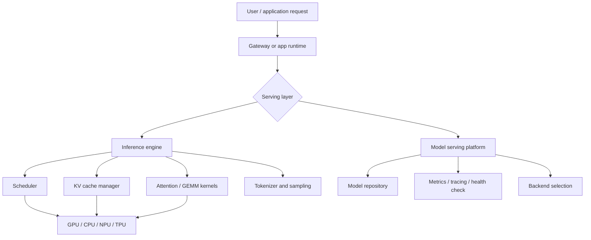
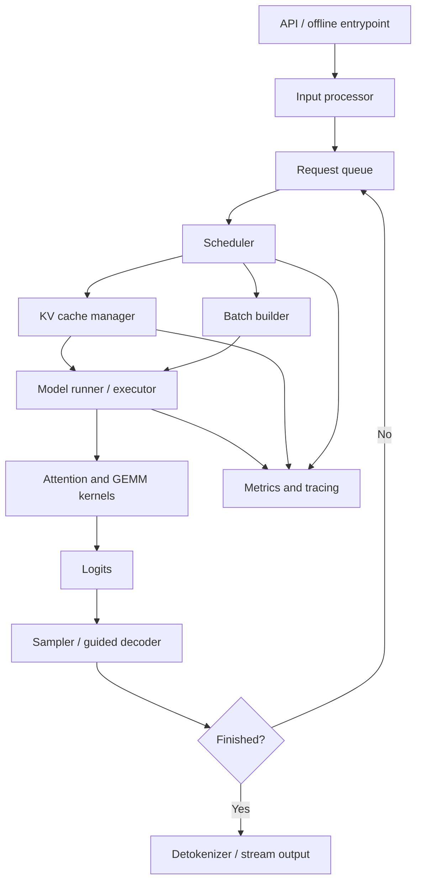
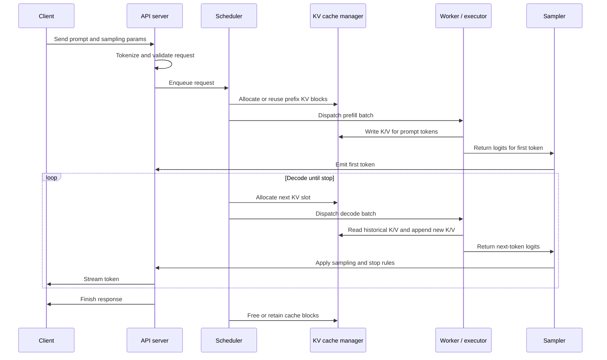
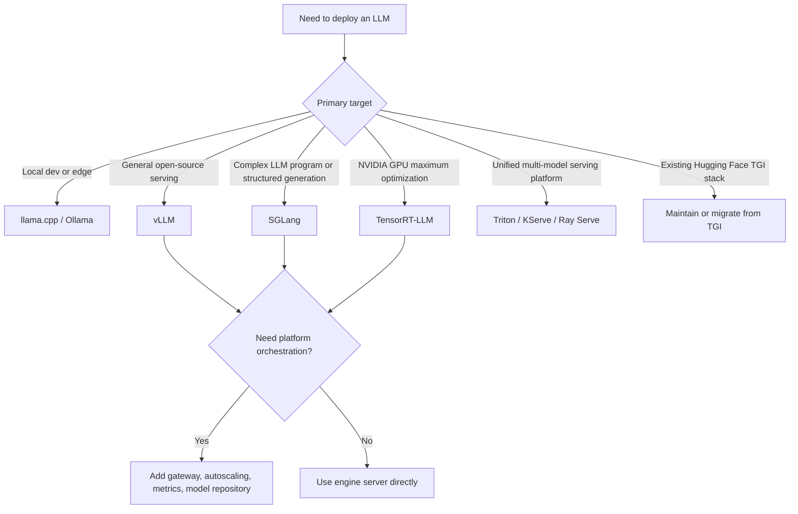

# 常见大模型推理框架调研

## 1. 问题定位

大模型推理框架负责把模型权重、tokenizer、KV cache、调度器、高性能 kernel、分布式通信和服务接口组合成可运行系统。它解决的不是“模型会不会回答”，而是：

- 如何在有限显存中承载模型权重、activation 和 KV cache。
- 如何在多请求并发下控制 TTFT、TPOT、吞吐和尾延迟。
- 如何支持 streaming、OpenAI-compatible API、structured output、tool calling、LoRA、量化和监控。
- 如何在单机、多 GPU、多节点、边缘设备或本地开发环境中部署。

推理框架不能只按“速度最快”排序。不同框架面对的主要场景不同：生产在线 serving、复杂 LLM program、本地运行、NVIDIA GPU 深度优化、多模型平台化管理，分别需要不同取舍。

## 2. 分层地图

常见系统可以粗略分为三层：

| 层级 | 代表项目 | 主要职责 |
| --- | --- | --- |
| 推理引擎 | vLLM、SGLang、TensorRT-LLM、TGI、llama.cpp、LMDeploy | 执行 LLM 推理，管理 KV cache、batching、sampling、并行和量化 |
| 本地运行时 | Ollama、llama.cpp server、MLX 相关工具 | 降低个人电脑、开发机和边缘设备上运行模型的门槛 |
| Serving 平台 | NVIDIA Triton Inference Server、Ray Serve、KServe、BentoML | 管理模型服务生命周期、协议、扩缩容、监控、多模型和后端插件 |

实际部署通常会组合使用。例如：业务网关负责鉴权和路由，vLLM / SGLang / TensorRT-LLM 负责模型执行，Triton / KServe / Ray Serve 负责平台化托管和弹性。

## 3. 推理引擎的作用

推理引擎是大模型 serving 系统中真正“执行模型”的核心层。上层网关、Agent runtime、RAG 服务或业务 API 负责组织请求；推理引擎负责把这些请求转换为高效的 token 计算过程，并把 GPU / CPU / NPU 等硬件资源调度起来。

更具体地说，推理引擎承担六类职责：

| 职责 | 说明 |
| --- | --- |
| 请求接入与输入处理 | 接收 prompt、chat messages、sampling 参数、streaming 标志、LoRA adapter、structured output 约束等，将文本和多模态输入转换为模型可执行的 token / tensor |
| 调度与 batching | 在多个并发请求之间选择本轮执行对象，组合 prefill 与 decode 请求，控制 batch size、token budget、优先级、抢占和公平性 |
| KV cache 管理 | 为每个请求分配、复用、回收 KV cache；支持 paged KV cache、prefix cache、KV offload、跨实例 KV 传输和长上下文优化 |
| 模型执行 | 加载权重，执行 attention、GEMM、MoE、norm、embedding、logits 等计算；使用 CUDA Graph、FlashAttention、Triton kernel、TensorRT engine、量化 kernel 等优化 |
| 采样与输出控制 | 对 logits 应用 temperature、top-k、top-p、beam search、stop words、bad words、guided decoding、JSON schema、tool calling parser 等策略 |
| 结果返回与观测 | 将 token 流式返回给上层，记录 TTFT、TPOT、吞吐、队列长度、cache 命中率、显存占用、错误和 tracing 信息 |

vLLM 的 V1 架构文档把在线 serving 拆成 API server process、engine core process、GPU worker process。API server 负责 HTTP 请求、tokenization、多模态数据加载和流式返回；engine core 负责 scheduler、KV cache 和跨 GPU worker 的模型执行协调；GPU worker 加载权重、执行 forward pass 并管理 GPU memory。TensorRT-LLM 的架构文档也给出类似抽象：`PyExecutor` 后台循环内部包含 `Scheduler`、`KVCacheManager`、`ModelEngine` 和 `Sampler`，每轮执行 request fetching、scheduling、resource preparation、model execution 和 output handling。

因此，推理引擎不是一个单独的 `model.forward()` 调用，而是一个围绕自回归生成组织起来的在线系统。

### 3.1 主要构成

| 组件 | 输入 | 输出 | 关键问题 |
| --- | --- | --- | --- |
| API / offline entrypoint | HTTP 请求、Python 调用、batch 文件 | 标准化 request | 协议兼容、鉴权、streaming、超时、取消 |
| Input processor | 文本、图片、chat template、tokenizer 配置 | token ids、multimodal tensors | tokenizer 开销、chat template 一致性、长输入截断 |
| Request queue | 等待执行的请求 | 可调度请求集合 | 排队延迟、优先级、多租户隔离 |
| Scheduler | 请求状态、token budget、cache 状态、GPU 资源 | 本轮执行计划 | prefill / decode 混排、continuous batching、抢占、公平性 |
| KV cache manager | 上下文长度、batch、cache block 状态 | cache 分配、复用、释放计划 | 显存碎片、prefix cache 命中、长上下文、offload |
| Model runner / executor | batch tensors、KV cache 指针、权重 | logits、hidden states、更新后的 KV cache | 多 GPU 并行、CUDA Graph、量化、kernel 选择 |
| Sampler / guided decoder | logits、sampling 参数、约束状态 | next token | 随机性、重复惩罚、JSON schema、stop condition |
| Output streamer | token ids、detokenizer 状态 | 文本片段或最终响应 | 流式延迟、UTF-8 边界、取消和错误处理 |
| Metrics / tracing | 调度、执行、cache、输出事件 | 指标、日志、trace span | TTFT、TPOT、p95 / p99、tokens/s、cache hit、OOM 定位 |

### 3.2 工作流程

一次在线生成请求通常经历以下流程：

关键阶段如下：

1. **初始化阶段**：加载 tokenizer、模型权重、量化参数、LoRA adapter、CUDA / Triton / TensorRT kernels，预分配显存池和 KV cache block。
2. **请求进入阶段**：API server 解析 chat template、sampling 参数和输出约束，把输入转为 token ids，并将请求放入队列。
3. **prefill 阶段**：模型一次性处理 prompt token，计算第一个输出 token 的 logits，并把每层 attention 的 key / value 写入 KV cache。该阶段通常更偏计算密集，直接影响 TTFT。
4. **decode 阶段**：模型每轮读取历史 KV cache，只对新增 token 做计算，再采样下一个 token。该阶段通常更受显存带宽、cache layout、batching 和调度影响，直接影响 TPOT。
5. **continuous batching 阶段**：不同请求会在不同时间进入和结束。调度器每轮动态组合仍在 decode 的请求和新进入的 prefill 请求，以提高硬件利用率。
6. **输出与回收阶段**：streamer 将 token detokenize 后返回；请求完成后，KV cache block 被释放、保留为 prefix cache，或转移到 CPU / 远端 cache 层。

### 3.3 核心数据结构

推理引擎围绕以下数据结构运行：

| 数据结构 | 作用 | 常见优化 |
| --- | --- | --- |
| Request state | 记录 prompt、已生成 token、停止条件、stream 状态、LoRA / adapter、输出约束 | 状态机化、取消处理、优先级调度 |
| Token buffer | 保存输入 token、已生成 token 和 batch 拼接后的 token | pinned memory、异步拷贝、减少 detokenize 阻塞 |
| KV cache block table | 将逻辑 token 位置映射到物理 KV cache block | PagedAttention、blocked KV cache、LRU eviction |
| Scheduler metadata | 记录每轮 batch、prefill / decode 阶段、slot mapping、sequence length | continuous batching、chunked prefill、preemption |
| Sampling state | 保存 top-k / top-p、temperature、beam、grammar / schema 约束状态 | fused sampling、guided decoding、CPU/GPU 协同 |
| Parallel state | tensor / pipeline / data / expert parallel 的 rank 和通信组 | NCCL 通信、MoE all-to-all、prefill-decode disaggregation |

KV cache 是最关键的数据结构。PagedAttention 将 KV cache 拆成固定大小 block，请求通过 block table 引用物理显存块，逻辑上连续的上下文不要求在物理显存中连续。这降低了长上下文和多并发请求下的显存碎片，并使 prefix cache、beam search、parallel sampling 等场景更容易共享缓存。

### 3.4 为什么不能直接用训练框架推理

PyTorch / Transformers 的 `generate()` 可以完成单请求推理，但它通常不是生产 serving 的完整答案。原因在于：

- 单请求 `generate()` 的控制流以“一个请求生成完”为中心，无法自然表达多请求 continuous batching。
- KV cache 多以张量形式随请求增长，不一定具备分页、复用、跨请求共享和高效回收能力。
- 高并发场景需要队列、调度、抢占、限流、streaming、取消、metrics 和故障隔离。
- 生产部署要处理多 GPU / 多节点并行、量化 kernel、CUDA Graph、prefix cache、structured output、LoRA 多租户和观测。

训练框架关注梯度、反向传播、优化器状态和训练吞吐；推理引擎关注请求生命周期、KV cache、调度和在线 SLA。二者都执行 Transformer，但系统目标不同。

### 3.5 和 Serving 平台的边界

推理引擎和 serving 平台经常一起出现，但边界不同：

| 层 | 关注点 | 典型问题 |
| --- | --- | --- |
| 推理引擎 | 单个模型实例如何高效生成 token | KV cache、batching、prefill / decode、sampling、kernel、并行 |
| Serving 平台 | 多个模型服务如何部署、扩缩、发现、监控和治理 | 模型仓库、版本、滚动发布、健康检查、路由、弹性、资源隔离 |
| 业务网关 | 如何对外提供统一 AI API | 鉴权、限流、计费、审计、多模型路由、fallback、用户级 SLA |

例如，vLLM / SGLang / TensorRT-LLM 更接近推理引擎；Triton / KServe / Ray Serve 更接近 serving 平台；LiteLLM / 自研 AI Gateway 更接近业务网关。生产系统往往三层都需要，只是小规模部署可以先用推理引擎自带的 OpenAI-compatible server。

## 4. 主流框架对比

| 框架 | 典型定位 | 关键能力 | 适合场景 | 主要注意点 |
| --- | --- | --- | --- | --- |
| vLLM | 通用高吞吐 LLM serving engine | PagedAttention、continuous batching、prefix caching、speculative decoding、量化、OpenAI-compatible server、多硬件后端 | 开源模型在线服务、GPU 集群 serving、希望快速获得较好吞吐 | 版本迭代快，模型兼容性、量化格式和后端能力需要按版本验证 |
| SGLang | 面向复杂 LLM program 和生产 serving 的运行时 | RadixAttention、prefix caching、structured output、OpenAI API、多 GPU 并行、多硬件后端 | 多轮对话、Agent、JSON / 结构化输出、RAG、复杂 prompt graph | 新特性较多，生产部署需要跟踪 runtime、模型和硬件组合的稳定性 |
| TensorRT-LLM | NVIDIA GPU 上深度优化的 LLM 推理栈 | TensorRT engine、in-flight batching、paged KV cache、FP8 / INT8 / INT4、多 GPU / 多节点 | NVIDIA 数据中心 GPU、追求极致性能、固定模型和较稳定 workload | 构建 engine、模型转换和调参成本更高；硬件生态更偏 NVIDIA |
| Hugging Face TGI | Hugging Face 生态文本生成服务 | streaming、tensor parallelism、continuous batching、FlashAttention / PagedAttention、Prometheus 指标 | 早期 Hugging Face 模型 serving、已有 TGI 部署的维护 | 官方文档已标注进入 maintenance mode，新项目通常优先评估 vLLM、SGLang 或本地引擎 |
| llama.cpp | C/C++ 本地推理引擎 | GGUF、低比特量化、CPU / Apple Silicon / CUDA / Vulkan 等多后端、llama-server | 本地开发、边缘设备、离线运行、低成本 CPU/GPU 推理 | 高并发在线 serving 和大规模多节点能力不是主要定位 |
| Ollama | 面向本地模型使用的应用运行时 | 模型拉取、CLI、本地 API、结构化输出、vision、embedding、工具调用、云端模型补充 | 个人电脑、开发者工具、Agent / IDE 本地模型入口 | 更偏产品化本地体验，不是底层高吞吐 GPU serving 引擎 |
| LMDeploy | OpenMMLab 的 LLM / VLM 部署工具包 | TurboMind、continuous batching、blocked KV cache、量化、多机多卡分发、OpenAI-compatible server | 中文开源生态、InternLM / Qwen 等模型部署、VLM serving | 社区和生产案例需要结合目标模型生态评估 |
| NVIDIA Triton | 通用推理服务平台 | 多 backend、动态 batching、sequence batching、模型仓库、metrics、HTTP/gRPC、Triton backend API | 多模型平台、统一托管 LLM 与传统 ML / CV / ASR 模型 | Triton 是 serving 平台，不等同于单个 LLM 推理 kernel；LLM 常通过 TensorRT-LLM 或 vLLM backend 接入 |

## 5. 关键框架说明

### 5.1 vLLM

vLLM 的核心价值是把 LLM serving 中最难管理的 KV cache 做成更高效的内存管理问题。PagedAttention 论文指出，高吞吐 serving 需要足够大的 batch，但 KV cache 会动态增长并造成碎片和重复存储；PagedAttention 借鉴操作系统分页思想，以块为单位管理 KV cache，从而提高可用显存和 batch 能力。

vLLM 文档当前覆盖 OpenAI-compatible server、自动 prefix caching、speculative decoding、structured outputs、quantization、production metrics、分布式部署和多硬件支持。因此它常被作为开源生产推理的默认候选。

适合优先评估 vLLM 的情况：

- 希望快速部署 Hugging Face 生态中的主流开源模型。
- 需要较好的吞吐、continuous batching、prefix cache 和 OpenAI-compatible API。
- 需要在 NVIDIA、AMD、CPU、TPU 等不同硬件上保持一定可迁移性。

### 5.2 SGLang

SGLang 的定位不只是“模型服务”，还强调“复杂语言模型程序”的高效执行。它的文档将其定义为面向大语言模型和多模态模型的高性能 serving 框架，强调低延迟、高吞吐、RadixAttention、prefix caching、多 GPU 并行、OpenAI API 兼容和多硬件支持。

SGLang 更适合复杂推理流程：

- 多轮对话和共享前缀较多，请求之间有大量可复用上下文。
- 需要 structured output、JSON schema、受约束解码或函数调用。
- Agent、RAG、few-shot、tree search 等场景中存在多次 generation call 和分支控制流。

### 5.3 TensorRT-LLM

TensorRT-LLM 是 NVIDIA GPU 生态中的 LLM 优化和 serving 工具链。它更接近“为特定模型和硬件构建高性能 engine”的路线，重点包括 engine 构建、多 GPU / 多节点、in-flight batching、paged KV cache 和 FP8 / INT8 / INT4 等低精度优化。

适合优先评估 TensorRT-LLM 的情况：

- 目标硬件明确是 NVIDIA 数据中心 GPU。
- 模型版本相对稳定，可以接受转换、构建 engine 和参数调优成本。
- 目标是极限吞吐、低延迟或更强的 NVIDIA 生态集成。

### 5.4 Hugging Face TGI

TGI 是 Hugging Face 早期推动开源 LLM serving 的重要项目，具备 launcher、streaming、tensor parallelism、continuous batching、FlashAttention / PagedAttention、量化和 Prometheus 指标等能力。

需要注意的是，Hugging Face 文档已经明确说明 TGI 进入 maintenance mode，并建议新方向更多依赖 vLLM、SGLang 以及 llama.cpp / MLX 等本地引擎。因此，在新项目中 TGI 更适合作为存量系统维护或 Hugging Face 生态理解对象，而不是默认首选。

### 5.5 llama.cpp

llama.cpp 的核心价值是“低依赖、本地、轻量、跨硬件”。项目 README 将其定位为 C/C++ 的 LLM inference，并强调 minimal setup、本地与云端运行、Apple Silicon、x86、RISC-V、低比特整数量化等能力。

适合优先评估 llama.cpp 的情况：

- 个人电脑、离线环境、边缘设备或低成本 CPU 推理。
- 模型以 GGUF 形式分发，追求易运行和低显存占用。
- 需要把推理能力嵌入桌面应用、CLI 工具或本地 Agent。

### 5.6 Ollama

Ollama 更像本地模型的产品化运行时。它提供模型获取、CLI、本地 API、structured outputs、vision、embedding、tool calling、Web search 等能力，并可连接本地模型和云端模型。

它适合开发者快速把开源模型接入编辑器、Agent 或本地应用。若目标是企业 GPU 集群上的高并发 serving，通常应把 Ollama 视为开发和本地体验层，而不是替代 vLLM / SGLang / TensorRT-LLM 的底层 serving engine。

### 5.7 LMDeploy

LMDeploy 是 OpenMMLab 的 LLM / VLM 压缩、部署和 serving 工具包。其文档强调 TurboMind、persistent batch / continuous batching、blocked KV cache、dynamic split&fuse、tensor parallelism、高性能 CUDA kernels、权重量化和 KV cache 量化。

它在中文模型生态和多模态模型部署中值得关注，尤其是 InternLM、Qwen、DeepSeek、LLaVA、InternVL 等模型相关部署。

### 5.8 NVIDIA Triton Inference Server

Triton 是通用推理服务平台，而不是单一 LLM 推理引擎。它支持 TensorRT、PyTorch、ONNX Runtime、OpenVINO、Python backend 等多种后端，也支持动态 batching、sequence batching、模型仓库、metrics、tracing、HTTP/gRPC 和 backend API。

在 LLM 场景中，Triton 常用于统一托管模型服务，把 TensorRT-LLM、vLLM 或其他后端接入平台层。若系统里同时存在 LLM、embedding、reranker、CV、ASR、传统 ML 模型，Triton 的统一服务能力更有价值。

## 6. 选型流程

可按以下顺序收敛：

1. 先确认硬件：NVIDIA GPU、AMD GPU、CPU、Apple Silicon、Ascend NPU、TPU 会直接限制候选框架。
2. 再确认 workload：短问答、高并发 chat、长上下文、RAG、Agent、structured output、批处理的瓶颈不同。
3. 再确认模型生态：Hugging Face safetensors、GGUF、TensorRT engine、AWQ / GPTQ / FP8 等格式会影响转换成本。
4. 再确认服务形态：是否需要 OpenAI-compatible API、streaming、tool calling、LoRA、多模型、多租户、Prometheus / OpenTelemetry。
5. 最后做压测：用实际 prompt 长度、输出长度、并发、SLA 和硬件测 TTFT、TPOT、p95 / p99、吞吐、显存和成本。

## 7. 经验结论

- 若没有强约束，新建开源 LLM 在线服务通常从 vLLM 和 SGLang 开始评估。
- 若目标是 NVIDIA GPU 上固定模型的极限优化，TensorRT-LLM 值得投入转换和调优成本。
- 若目标是本地、离线或边缘运行，llama.cpp 和 Ollama 的工程体验更直接。
- 若已有 Hugging Face TGI 部署，可以继续维护；新项目应注意其 maintenance mode 状态。
- 若系统需要统一托管多类模型，Triton、KServe、Ray Serve 等 serving 平台应与底层推理引擎组合考虑。
- 框架 benchmark 不能脱离请求分布。短 prompt、长上下文、长输出、并发 chat、JSON constrained decoding、LoRA 多租户会得到不同结论。

## 8. 参考资料

- [vLLM Documentation](https://docs.vllm.ai/en/latest/)
- [vLLM Architecture Overview](https://docs.vllm.ai/en/latest/design/arch_overview/)
- [vLLM Paged Attention Design](https://docs.vllm.ai/en/latest/design/paged_attention/)
- [vLLM / PagedAttention paper](https://arxiv.org/abs/2309.06180)
- [SGLang Documentation](https://docs.sglang.io/)
- [SGLang paper](https://arxiv.org/abs/2312.07104)
- [NVIDIA TensorRT-LLM Documentation](https://docs.nvidia.com/tensorrt-llm/index.html)
- [TensorRT-LLM Architecture Overview](https://nvidia.github.io/TensorRT-LLM/architecture/overview.html)
- [Hugging Face Text Generation Inference Documentation](https://huggingface.co/docs/text-generation-inference/index)
- [llama.cpp GitHub](https://github.com/ggml-org/llama.cpp)
- [Ollama Documentation](https://docs.ollama.com/)
- [LMDeploy Documentation](https://lmdeploy.readthedocs.io/en/latest/)
- [NVIDIA Triton Inference Server Documentation](https://docs.nvidia.com/deeplearning/triton-inference-server/user-guide/docs/index.html)
