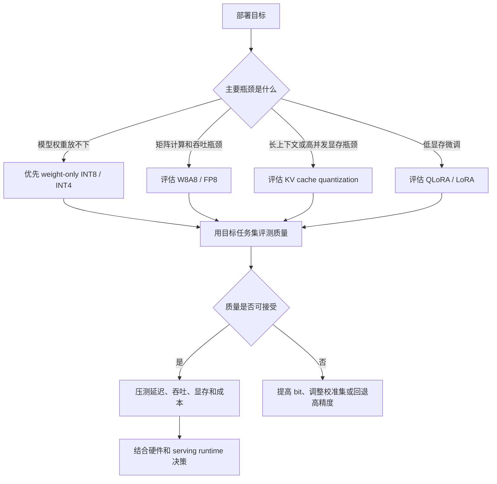

# 大模型量化基础

归档日期：2026-07-07

## 1. 主题定位

本文整理大模型量化的基本概念、主要收益、常见风险和代表性方法。

量化不是让模型“无损变小”，而是在可接受质量损失下，把权重、激活或 KV cache 从 FP16/BF16 等高精度表示转换为 INT8、INT4、FP8、FP4 等低精度表示，从而降低显存、带宽和推理成本。

核心概括：

> 量化是大模型推理和部署中的数值压缩技术：用更少 bit 表示模型计算中的张量，以精度损失换取显存、吞吐、延迟和部署成本收益。

NVIDIA TensorRT-LLM 文档将量化描述为：将权重或激活从 BF16 等高精度浮点格式转换到 INT8、FP8、FP4 等低精度格式，以降低内存占用和计算成本。[TensorRT-LLM Quantization](https://nvidia.github.io/TensorRT-LLM/features/quantization.html)

## 2. 量化到底在量什么

大模型推理中主要有三类张量会被量化。

| 对象 | 常见形式 | 目标 |
|---|---|---|
| 权重 | INT8 / INT4 / FP8 / FP4 weight | 减少模型参数显存和权重读取带宽 |
| 激活 | W8A8、FP8 activation | 降低矩阵乘法和中间张量成本 |
| KV cache | INT8 / FP8 / INT4 KV cache | 降低长上下文和高并发时的缓存显存 |

以权重量化为例，原始模型中每个权重可能是 FP16：

```text
w = 0.137462
```

量化后不再直接保存这个高精度浮点数，而是保存一个低 bit 整数或低精度浮点值，再配合 scale、zero-point 等元数据近似还原：

```text
q = round(w / scale)
w ~= q * scale
```

因此，量化的本质是把连续或高精度数值映射到较少的离散刻度。bit 数越低，刻度越粗，压缩越强，误差风险也越高。

## 3. 为什么大模型适合做量化

大模型的参数量巨大，权重和 KV cache 会直接转化为显存压力。

如果只粗略估算权重显存，一个 70B 参数模型在不同精度下大约需要：

| 精度 | 每参数字节数 | 70B 权重近似显存 |
|---|---:|---:|
| FP16 / BF16 | 2 bytes | 140 GB |
| INT8 | 1 byte | 70 GB |
| INT4 | 0.5 byte | 35 GB |

实际部署还需要 tokenizer、runtime buffer、scale metadata、KV cache、通信 buffer 等额外开销，但这个估算能说明量化的核心价值：模型参数越大，低 bit 表示带来的显存收益越明显。

vLLM 官方文档也将量化解释为在模型精度与更小内存占用之间进行权衡，使大模型能够运行在更多硬件上。[vLLM Quantization](https://docs.vllm.ai/en/stable/features/quantization/)

## 4. 常见量化类型

### 4.1 Weight-only quantization

Weight-only quantization 只量化模型权重，激活仍保持 FP16/BF16。

常见形式：

- W8A16：权重 INT8，激活 FP16/BF16。
- W4A16：权重 INT4，激活 FP16/BF16。
- GPTQ、AWQ 等离线权重量化方法。

这类方法实现相对稳健，收益主要来自减少权重显存和权重读取带宽。decode 阶段每生成一个 token 都需要读取大量权重，因此 weight-only 量化对大模型推理很有吸引力。

### 4.2 Weight-activation quantization

Weight-activation quantization 同时量化权重和激活，例如 W8A8。

这类方法理论上可以进一步提升矩阵乘法效率，但难点更高，因为 LLM 激活中经常存在 outlier。SmoothQuant 论文指出，LLM 权重相对容易量化，激活更难量化；其核心思路是把 activation outlier 的量化难度迁移到权重上，从而实现更稳定的 W8A8 量化。[SmoothQuant](https://arxiv.org/abs/2211.10438)

### 4.3 KV cache quantization

KV cache 是自回归生成时保存历史 token key/value 的缓存。上下文越长、batch 越大、并发越高，KV cache 显存压力越明显。

KV cache 量化的目标不是压缩模型文件，而是降低 serving 过程中的动态缓存开销。它对长上下文和高并发服务尤其重要，但可能影响长上下文质量，因此需要结合任务评测验证。

### 4.4 Quantization-aware training 与 post-training quantization

从时机上看，量化又可以分为：

| 类型 | 说明 | 特点 |
|---|---|---|
| PTQ | Post-training quantization，训练后量化 | 不需要重新训练或只需少量校准数据，部署方便 |
| QAT | Quantization-aware training，训练中感知量化误差 | 通常质量更稳，但训练成本更高 |

LLM 部署中常见 GPTQ、AWQ、SmoothQuant 多属于 PTQ 或校准式量化路线。QLoRA 则把基座模型以 4-bit 形式冻结，再训练 LoRA 适配参数，用于低显存微调。[QLoRA](https://arxiv.org/abs/2305.14314)

## 5. 量化的优势

### 5.1 降低显存占用

这是最直接的收益。Hugging Face Transformers 的 bitsandbytes 文档说明，8-bit 量化可以显著降低大模型内存占用，4-bit 量化可进一步减少显存需求。[Transformers bitsandbytes](https://huggingface.co/docs/transformers/main/en/quantization/bitsandbytes)

显存下降会带来几个连锁效果：

- 同一张 GPU 可以放下更大的模型。
- 同一模型可以支持更大的 batch。
- 服务端可以容纳更长上下文或更多并发。
- 本地设备和边缘设备部署更可行。

### 5.2 降低推理成本

量化减少权重和缓存的存储量，也降低内存带宽压力。对于 decode 阶段，模型持续逐 token 生成，权重读取和 KV cache 访问常常是瓶颈。低 bit 表示可以让同样显存和带宽承载更多请求。

GPTQ 论文面向 GPT 类模型提出 one-shot 权重量化方法，目标是在 3-bit / 4-bit 等低 bit 权重下保持较好精度，并降低推理成本。[GPTQ](https://arxiv.org/abs/2210.17323)

### 5.3 改善端侧和本地部署可行性

AWQ 论文强调 on-device LLM 的价值：本地推理可以降低云成本、改善隐私，但设备资源有限，因此需要低 bit 量化。AWQ 通过 activation-aware 的方式保护少量重要权重通道，常用于 4-bit 权重量化。[AWQ](https://arxiv.org/abs/2306.00978)

### 5.4 降低微调门槛

QLoRA 使用 4-bit 量化的冻结基座模型，再训练少量 LoRA 参数。论文报告其可以在单张 48GB GPU 上微调 65B 模型，并尽量保持接近 16-bit 微调的效果。[QLoRA](https://arxiv.org/abs/2305.14314)

## 6. 量化存在的问题

### 6.1 精度损失不可避免

量化把高精度数值映射到低 bit 离散刻度，天然会引入误差。INT8 通常较稳，INT4 需要更精细的校准和算法，INT2 或 ternary 量化风险更高。

对生产系统来说，不能只看 perplexity 或一个 benchmark。应至少覆盖：

- 通用问答质量。
- 代码、数学、推理等敏感任务。
- 指令跟随。
- 长上下文。
- 安全拒答和幻觉场景。
- 目标业务数据。

### 6.2 激活 outlier 会放大量化误差

LLM 的隐藏状态和激活分布可能存在 outlier。Hugging Face bitsandbytes 文档提到，大模型隐藏状态可能出现较大范围的异常值，LLM.int8() 会对 outlier 相关计算保留更高精度路径。[Transformers bitsandbytes](https://huggingface.co/docs/transformers/main/en/quantization/bitsandbytes)

这也是 SmoothQuant 关注 activation outlier 的原因：如果直接把激活压到 INT8，少数极端值可能显著影响整体量化误差。

### 6.3 不同任务对量化敏感度不同

量化不是统一地让所有能力下降同样比例。数学、代码、长上下文、多轮指令跟随、幻觉检测、安全拒答等任务可能比普通问答更敏感。

因此，量化模型上线前需要使用目标任务集评测，而不是只看“模型能跑起来”或“显存省了多少”。

### 6.4 低 bit 不一定带来端到端加速

低 bit 权重可以减少显存，但速度收益取决于硬件、kernel、batch size、模型结构和 serving runtime。

常见情况：

- 只做 weight-only 量化，可能主要省显存，矩阵计算仍有反量化开销。
- INT4 / FP8 需要硬件和 kernel 支持，否则不一定比 FP16 快。
- 小 batch 或短输出场景可能被调度、网络、tokenizer、框架开销主导。
- KV cache 量化可能改善长上下文吞吐，但也可能增加额外转换成本。

TensorRT-LLM 文档专门列出不同模型、硬件和量化格式的支持关系，说明量化能力需要和具体硬件后端一起看。[TensorRT-LLM Quantization](https://nvidia.github.io/TensorRT-LLM/features/quantization.html)

### 6.5 量化后训练能力受限

Hugging Face Transformers 文档说明，8-bit / 4-bit training 通常只支持训练额外参数。这意味着很多低 bit 工作流更适合 LoRA / adapter 微调，而不是直接全参数训练量化后的模型。[Transformers bitsandbytes](https://huggingface.co/docs/transformers/main/en/quantization/bitsandbytes)

## 7. 代表性方法

| 方法 | 类型 | 核心思想 | 适用理解 |
|---|---|---|---|
| LLM.int8() | INT8 推理 | 大部分计算走 INT8，对 outlier 使用高精度路径 | 稳健 8-bit 推理 |
| GPTQ | weight-only PTQ | 基于近似二阶信息做 one-shot 权重量化 | 常见 4-bit 离线量化 |
| AWQ | weight-only PTQ | 根据激活识别重要权重通道并保护 | 端侧和 4-bit 部署常用 |
| SmoothQuant | W8A8 PTQ | 将 activation outlier 难度迁移到权重 | 权重和激活一起 INT8 |
| QLoRA | 低 bit 微调 | 4-bit 冻结基座模型 + LoRA 训练 | 低显存微调 |
| FP8 / FP4 | 低精度浮点 | 利用新硬件低精度计算能力 | NVIDIA GPU 推理和训练优化 |

## 8. 选型思路



实践中可以按下面顺序思考：

1. 如果目标是“先让模型放进显存”，优先尝试 INT8 或 INT4 weight-only quantization。
2. 如果目标是“提升吞吐”，需要确认硬件是否有高效 INT8、FP8、INT4 kernel。
3. 如果目标是“长上下文或高并发”，单纯权重量化不够，还要看 KV cache 和 scheduler。
4. 如果目标是“低显存微调”，优先看 QLoRA 这类冻结低 bit 基座模型的方案。
5. 如果任务对精度高度敏感，必须用目标业务数据做 A/B 评测。

## 9. 和其他推理优化的关系

量化通常不是单独使用，而是和推理系统中的其他优化组合。

| 优化 | 解决问题 | 与量化的关系 |
|---|---|---|
| continuous batching | 提高 GPU 利用率 | 量化降低单请求显存，有助于增大 batch |
| PagedAttention | 管理 KV cache 碎片 | KV cache 量化可进一步降低 cache 成本 |
| FlashAttention | 降低 attention IO | 可与低精度 kernel 结合 |
| speculative decoding | 减少串行 decode 步数 | 与量化互补，一个减少步数，一个降低每步成本 |
| tensor parallel | 分摊超大模型权重 | 量化可降低每卡权重和通信压力 |

因此，量化更适合被理解为 LLM serving 优化工具箱中的一层，而不是替代高性能推理引擎。

## 10. 小结

量化的本质是低精度近似。它通过减少权重、激活或 KV cache 的 bit 数，换取显存、带宽、吞吐和部署成本收益。

它的主要价值是：

- 让更大的模型能放进有限显存。
- 让同一硬件支持更大 batch、更多并发或更长上下文。
- 降低本地部署、端侧部署和私有化部署门槛。
- 降低微调和实验成本。

它的主要风险是：

- 低 bit 会引入数值误差和质量下降。
- 激活 outlier 和长上下文可能放大问题。
- 不同任务对量化敏感度不同。
- 加速收益依赖硬件和 kernel，不是 bit 数越低一定越快。
- 量化后训练通常需要 LoRA / adapter 等额外参数路线。

生产实践中，判断量化方案不能只看“INT4 比 FP16 小多少”，而要同时看：目标任务质量、硬件支持、serving runtime、KV cache、batching、延迟、吞吐和单位成本。

## 11. 参考资料

- [TensorRT-LLM Quantization](https://nvidia.github.io/TensorRT-LLM/features/quantization.html)
- [vLLM Quantization](https://docs.vllm.ai/en/stable/features/quantization/)
- [Transformers bitsandbytes Quantization](https://huggingface.co/docs/transformers/main/en/quantization/bitsandbytes)
- [GPTQ: Accurate Post-Training Quantization for Generative Pre-trained Transformers](https://arxiv.org/abs/2210.17323)
- [SmoothQuant: Accurate and Efficient Post-Training Quantization for Large Language Models](https://arxiv.org/abs/2211.10438)
- [AWQ: Activation-aware Weight Quantization for LLM Compression and Acceleration](https://arxiv.org/abs/2306.00978)
- [QLoRA: Efficient Finetuning of Quantized LLMs](https://arxiv.org/abs/2305.14314)
