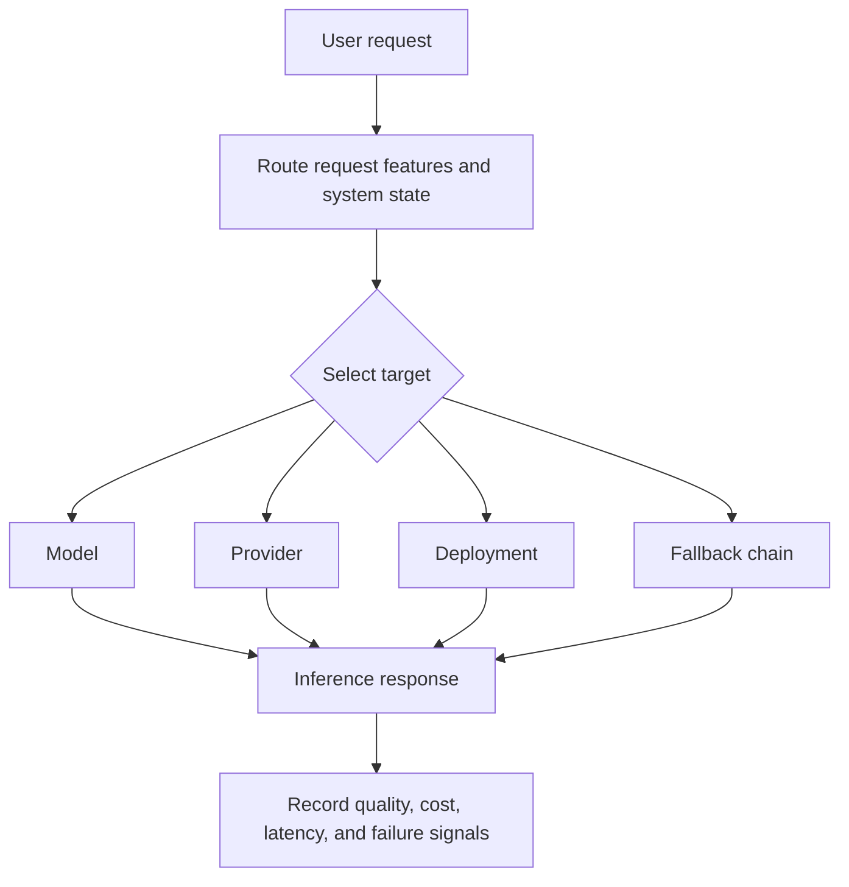
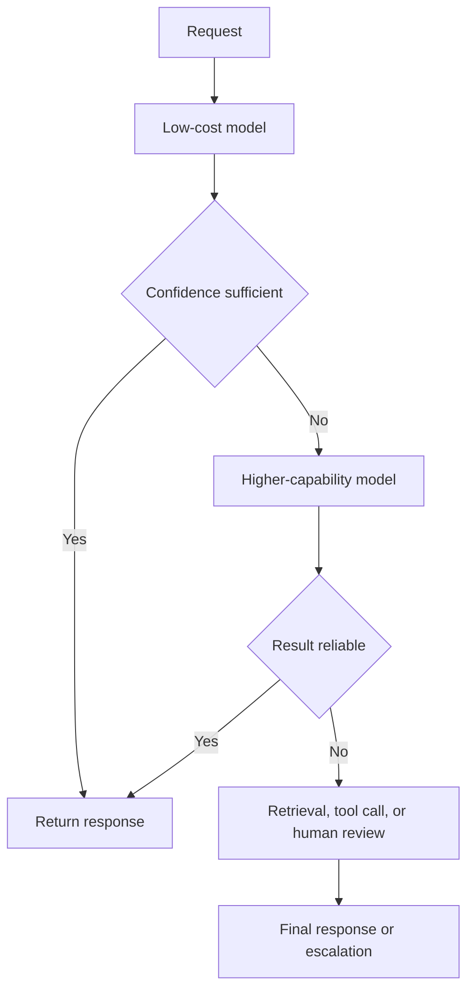
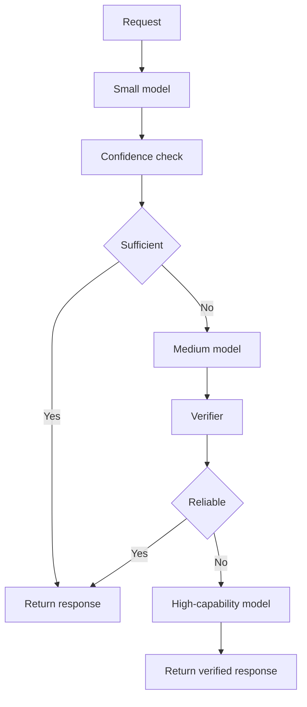
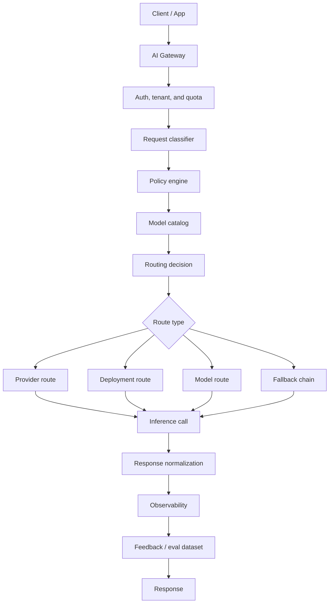
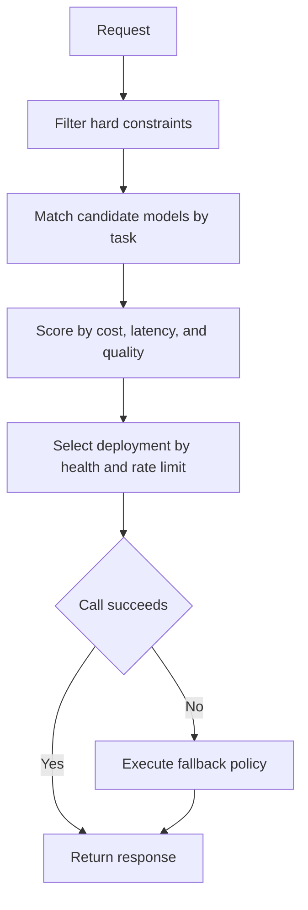
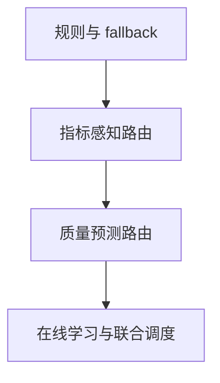

# 模型路由调研

## 1. 定义

模型路由（Model Routing）是在一次 AI 请求到来时，根据任务类型、质量要求、延迟目标、成本预算、上下文长度、安全策略、模型可用性等条件，动态选择“应该调用哪个模型、哪个供应商、哪个部署实例或哪条推理链路”的基础设施能力。

基本流程如下：



它解决的问题不是“哪个模型最好”，而是：

> 对这个请求，在当前约束下，哪个模型最合适。

## 2. 为什么需要模型路由

大模型系统进入生产后，会同时面对几个现实问题：

- 高能力模型质量上限较高，但成本和延迟通常较高。
- 低成本模型响应较快，但在复杂任务上失败率可能更高。
- 不同模型擅长领域不同，例如代码、数学、写作、长上下文、多模态、工具调用。
- 同一模型可能有多个 provider 或 region，稳定性、价格、限流、数据策略不同。
- 自托管模型会受 GPU 负载、KV cache、batching、队列长度影响。
- 线上请求复杂度差异很大，用同一个模型处理所有请求会浪费资源。
- 企业需要 fallback、审计、限额、数据合规和成本拆账。

因此模型路由是 AI Infra 从原型验证走向生产运行的关键能力之一。

## 3. 模型路由和普通负载均衡的区别

| 维度 | 普通负载均衡 | 模型路由 |
|---|---|---|
| 选择对象 | 同质服务实例 | 不同模型、不同 provider、不同部署 |
| 主要目标 | 可用性、吞吐、延迟 | 质量、成本、延迟、安全、可用性综合最优 |
| 输入特征 | 连接数、健康状态、权重 | prompt、任务类型、上下文长度、用户等级、策略、系统负载 |
| 输出差异 | 实例等价，结果通常一致 | 模型不同，结果质量和风格可能不同 |
| 失败处理 | 重试、换实例 | fallback、降级、换模型、换 provider、人工接管 |
| 评估方式 | p95、错误率、吞吐 | 还要评估答案质量、幻觉、安全、成本 |

普通负载均衡假设后端基本等价；模型路由的难点在于后端不等价，而且“质量”本身很难在线度量。

## 4. 路由粒度

### 4.1 Provider 路由

在同一个模型或等价模型之间选择供应商。

示例：

```text
gpt-4.1
  -> OpenAI
  -> Azure OpenAI
  -> 其他兼容 provider
```

目标：

- 提升可用性。
- 避免单个 provider 限流。
- 根据价格、地域、数据策略选择 provider。
- 在主 provider 故障时 fallback。

OpenRouter 的 provider routing 就是这一类。它允许通过 `provider` 对象控制 provider 顺序、是否允许 fallback、是否要求 provider 支持全部参数、是否允许数据收集等策略。

### 4.2 Deployment 路由

在同一模型的多个部署之间选择实例或集群。

示例：

```text
gpt-4o-mini
  -> azure-eastus-deployment
  -> azure-westus-deployment
  -> openai-default-deployment
```

目标：

- 按 RPM / TPM 限额分流。
- 按延迟或健康状态选择部署。
- 支持 cooldown、retry、timeout。
- 管理跨 region 的可靠性。

LiteLLM Router 属于典型实现。它支持多 deployment 负载均衡、请求排队、cooldown、fallback、timeout、retry，并支持 weighted pick、rate-limit aware、least-busy、latency-based、cost-based 等策略。

### 4.3 Model 路由

在不同能力和成本的模型之间选择。

示例：

```text
简单分类任务 -> 低成本模型
通用问答 -> 中等模型
复杂推理 / 代码生成 -> 高能力模型
敏感任务 -> 合规域内模型
```

目标：

- 在尽量不损失质量的情况下降低成本。
- 对复杂任务调用高能力模型，对低复杂度任务调用低成本模型。
- 根据领域选择专门模型。
- 在高能力模型不可用时选择可接受的替代模型。

RouteLLM、FrugalGPT、MixLLM 这类研究主要关注这一层。

### 4.4 Chain / Cascade 路由

不是一次只选一个模型，而是按阶段选择模型。

流程示例如下：



目标：

- 让多数低复杂度请求停留在低成本路径。
- 只把高复杂度请求升级到高成本路径。
- 通过 verifier 或 judge 控制质量。

FrugalGPT 提出的 LLM cascade 就是代表思路：学习对不同 query 使用不同模型组合，从而降低推理成本并保持甚至提升准确率。

### 4.5 Tool / Agent Provider 路由

在 Agent 系统中，同一种工具也可能有多个 provider。

示例：

```text
web_search
  -> provider A
  -> provider B
  -> internal search

retriever
  -> vector index
  -> keyword index
  -> hybrid retriever
```

这类路由不只适用于 LLM，也适用于检索器、搜索 API、代码执行器、数据库代理等“功能等价但质量、延迟、稳定性不同”的工具。

## 5. 常见路由策略

### 5.1 静态规则路由

基于明确规则选择模型。

```text
if context_tokens > 100k:
  use long-context model
elif task == "code":
  use code model
elif user_tier == "free":
  use cheap model
else:
  use default model
```

优点：

- 简单、可解释、容易上线。
- 适合早期系统。
- 适合合规、安全、权限等硬约束。

缺点：

- 规则维护成本会上升。
- 很难捕捉 query 难度。
- 容易把过多请求发送到高能力模型。

### 5.2 加权路由

按照权重把请求分到不同模型或部署。

用途：

- 灰度新模型。
- A/B 测试。
- 按容量比例分流。
- 平滑迁移 provider。

示例：

```text
model_a: 90%
model_b: 10%
```

### 5.3 限流感知路由

根据 RPM / TPM / 并发限制选择后端。

适合：

- 多个 API provider。
- Azure OpenAI 多 deployment。
- 自托管多集群。

需要记录：

- 当前请求数。
- 当前 token 数。
- provider 返回的 rate limit。
- 冷却时间。

### 5.4 延迟感知路由

根据近期延迟、队列长度、GPU 负载或 endpoint 健康状态选择。

关键指标：

- TTFT：time to first token。
- TPOT：time per output token。
- p95 / p99 latency。
- queue wait time。
- GPU utilization。
- KV cache hit rate。

注意：延迟不是模型的固定属性。RouterWise 等研究指出，在 GPU 集群中，模型延迟强烈依赖资源分配和路由策略本身，因此“路由”和“资源分配”需要联合考虑。

### 5.5 成本感知路由

根据 token 价格、GPU hour 成本、缓存命中和用户预算选择。

常见策略：

- 默认使用低成本模型。
- 复杂请求升级到高能力模型。
- 超出预算后降级。
- 对免费用户限制高成本模型。
- 对批处理任务使用离线低价路径。

成本模型需要包含：

```text
input_tokens * input_price
+ output_tokens * output_price
+ retrieval / tool cost
+ retry / fallback cost
+ self-hosted GPU amortized cost
```

### 5.6 质量预测路由

先预测某个模型对当前请求的成功概率，再选择模型。

可用特征：

- query embedding。
- task tag。
- prompt 长度。
- 是否需要数学 / 代码 / 多跳推理。
- 历史相似请求表现。
- 模型在离线评测集上的能力画像。
- LLM-as-judge 或人类偏好数据。

RouteLLM 使用偏好数据训练路由器，在高能力模型和低成本模型之间动态选择，目标是降低成本且尽量保持输出质量。

### 5.7 Bandit / 在线学习路由

把模型选择视为探索和利用问题：

- 已知某模型对某类 query 表现好，就更多使用它。
- 对不确定的 query 保留少量探索。
- 用用户反馈、judge 分数、重试行为、人工采纳率更新策略。

MixLLM 使用 contextual bandit 进行动态路由，在质量、成本、延迟之间做权衡，并支持候选模型集合变化后的持续学习。

### 5.8 Cascade / Escalation 路由

按“先低成本、后高能力”的顺序调用模型。



关键是设计“什么时候升级”：

- 低成本模型置信度低。
- 输出格式错误。
- judge 判定不可信。
- 检索证据不足。
- 用户是高价值请求。
- 任务属于高风险领域。

## 6. 生产模型路由器架构



### 6.1 Model Catalog

记录每个模型的能力和约束：

- model id / provider / endpoint。
- 上下文长度。
- 是否支持工具调用。
- 是否支持视觉、音频、结构化输出。
- 输入输出价格。
- 平均延迟、p95、错误率。
- 数据策略：是否零数据保留、是否跨境、是否允许训练。
- 适合任务：代码、数学、摘要、翻译、客服、长文本。
- 当前健康状态和限流状态。

### 6.2 Request Classifier

识别请求类型：

- 任务：问答、摘要、代码、数学、翻译、信息抽取、规划、工具调用。
- 难度：简单、中等、复杂。
- 风险：低风险、高风险、合规敏感。
- 输入：文本、图片、音频、长上下文、结构化数据。
- 用户：租户、套餐、预算、权限。

### 6.3 Policy Engine

处理硬约束：

- 禁止某些租户使用外部 provider。
- 敏感数据只能走私有模型。
- 必须支持 JSON schema / tool call。
- 必须满足最大价格。
- 必须满足最大延迟。
- 禁止 fallback 到不合规 provider。

### 6.4 Decision Engine

处理软目标：

- 质量最大化。
- 成本最小化。
- 延迟最小化。
- 可用性最大化。
- 碳排或能耗最小化。

实际系统通常不是单目标，而是分层决策：



### 6.5 Observability

每次路由都应该记录：

- route_id。
- 选择的模型、provider、deployment。
- 候选模型列表。
- 被过滤原因。
- 路由策略版本。
- prompt / completion token。
- latency、TTFT、TPOT。
- 成本。
- retry / fallback。
- 错误类型。
- 质量评分或用户反馈。

没有这些数据，路由器无法持续改进，也无法解释“为什么这次走了这个模型”。

## 7. 评估模型路由

模型路由的评估不能只看成本，也不能只看平均质量。

### 7.1 离线评估

准备一批带标签或可 judge 的请求集：

- 简单请求。
- 复杂推理。
- 代码任务。
- 长上下文。
- 安全边界。
- 业务高频请求。
- 业务高价值请求。

评估指标：

- 质量：accuracy、win rate、judge score、human preference。
- 成本：cost/request、cost/successful request。
- 延迟：p50、p95、TTFT、TPOT。
- 升级率：从低成本模型升级到高能力模型的比例。
- fallback 率：失败后换模型的比例。
- 违反策略次数：比如敏感数据走错 provider。

### 7.2 在线评估

线上要看：

- 路由决策分布是否异常。
- 某类 query 的失败率是否升高。
- 高能力模型调用比例是否异常升高。
- provider 故障时 fallback 是否生效。
- p95 是否被少数长请求拖垮。
- 成本是否按租户、业务线可解释。
- 用户是否重试或改写问题。

### 7.3 Pareto Frontier

模型路由的目标通常是找到质量、成本、延迟之间的 Pareto frontier。

```text
更低成本
  ^          x  低成本模型
  |       x
  |    x       组合路由策略
  | x
  +-----------------> 更高质量
        高能力模型
```

有效的路由器不要求每个请求都使用最高能力模型，而是在预算和延迟约束下尽量接近最佳质量。

## 8. 实践落地路线

落地过程可按以下阶段推进：



### 8.1 第一阶段：规则 + fallback

适合处于 AI Gateway 建设初期的团队。

能力：

- 统一模型调用入口。
- 模型别名。
- provider fallback。
- timeout / retry。
- 按租户限额。
- 基础日志和成本统计。

推荐策略：

- 明确硬约束优先。
- 对高风险请求固定走可靠模型。
- 对低价值请求固定使用低成本模型。
- 对 provider 故障做 fallback。

### 8.2 第二阶段：指标感知路由

当请求量增长后，需要加入系统状态。

能力：

- RPM / TPM 感知。
- latency-based routing。
- least-busy routing。
- 健康检查。
- 高能力模型预算控制。
- 失败自动降级。

### 8.3 第三阶段：质量预测路由

当业务积累足够反馈数据后，可以训练或配置质量预测能力。

能力：

- query classifier。
- query difficulty estimator。
- 模型能力画像。
- LLM-as-judge 评测。
- 路由策略 A/B。
- 失败样例回流。

### 8.4 第四阶段：在线学习与联合调度

适合大规模平台。

能力：

- contextual bandit。
- 持续学习。
- 多模型资源联合优化。
- GPU 资源分配和路由联动。
- KV cache / prefill-decode 约束纳入路由。

## 9. 常见风险

### 9.1 仅按价格路由

最低单价模型可能导致更多重试、更多人工修正和更高用户流失风险。评估时应关注 cost per successful task，而不是仅关注 token 单价。

### 9.2 仅按平均延迟路由

LLM 延迟受输出长度、队列、上下文、cache、GPU 负载影响。平均延迟容易掩盖 p95 / p99 问题。

### 9.3 缺少质量回流

没有质量信号，路由器只能优化成本和延迟，最终可能把流量推向低成本但低质量的模型。

### 9.4 fallback 改变语义

fallback 不是简单换 provider。不同模型可能不支持相同参数、工具调用、JSON schema、系统提示或安全策略。

### 9.5 没有解释性

生产事故发生时，平台必须能解释：

- 为什么选择这个模型。
- 为什么没有选择另一个模型。
- 哪条策略过滤了某个 provider。
- fallback 是否发生。

### 9.6 离线评测和线上分布不一致

路由器在 benchmark 上表现好，不代表线上表现好。真实流量有业务术语、脏输入、长尾问题、权限约束和突发负载。

## 10. 和 AI Infra 其他模块的关系

```text
模型路由
  ├─ 依赖模型目录：知道有哪些模型、能力和价格
  ├─ 依赖评测系统：知道模型在不同任务上的质量
  ├─ 依赖可观测系统：知道延迟、错误、成本和反馈
  ├─ 依赖网关：统一鉴权、限流、审计、fallback
  ├─ 依赖推理服务：知道 deployment 负载和健康状态
  └─ 依赖治理系统：执行数据、安全、合规策略
```

模型路由是 AI Gateway 的核心决策组件之一，但它不能单独工作。缺少模型目录、评测和可观测时，路由策略容易退化为难以维护的规则集合。

## 11. 关键判断

1. 模型路由是 AI Infra 的生产级能力，不只是 SDK 里的 if/else。
2. 早期最实用的是规则路由、fallback、限流和成本统计。
3. 中期应该加入延迟、健康状态、RPM / TPM、租户预算和任务分类。
4. 成熟阶段才适合引入质量预测、偏好数据、bandit 和联合资源调度。
5. 路由策略必须可观测、可解释、可回滚。
6. 对企业来说，硬约束优先于智能优化：权限、数据合规、安全策略必须先过滤。
7. 有效的模型路由目标不是始终使用最低成本模型，而是在质量、成本、延迟和风险之间做稳定权衡。

## 12. 参考资料

- LiteLLM Router - Load Balancing: https://docs.litellm.ai/docs/routing
- OpenRouter Provider Routing: https://openrouter.ai/docs/guides/routing/provider-selection
- FrugalGPT: How to Use Large Language Models While Reducing Cost and Improving Performance: https://arxiv.org/abs/2305.05176
- RouteLLM: Learning to Route LLMs with Preference Data: https://arxiv.org/abs/2406.18665
- MixLLM: Dynamic Routing in Mixed Large Language Models: https://arxiv.org/abs/2502.18482
- Dynamic Model Routing and Cascading for Efficient LLM Inference: A Survey: https://arxiv.org/abs/2603.04445
- RouterWise: Joint Resource Allocation and Routing for Latency-Aware Multi-Model LLM Serving: https://arxiv.org/abs/2604.10907
