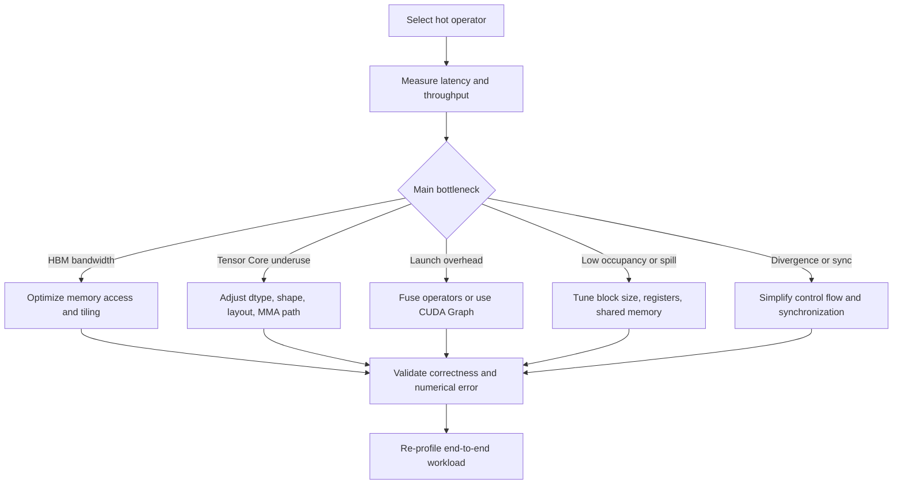

# 算子优化方法与 CUDA 示例

归档日期：2026-07-06

## 1. 主题定位

算子优化指在数学语义不变的前提下，调整数据布局、线程组织、访存路径、计算精度、kernel 边界和执行调度，使 GPU 更高效地完成 Tensor 计算。

本文从大模型推理常见算子出发，整理优化方式、适用场景和 CUDA 示例。示例用于解释优化模式，不代表完整生产级 kernel。

## 2. 优化方式概览

| 优化方式 | 主要目标 | 典型适用场景 | 主要收益 | 主要风险 |
| --- | --- | --- | --- | --- |
| 访存合并 | 减少 global memory transaction | 连续 Tensor、矩阵行列访问、KV cache 读取 | 提高有效带宽，减少浪费带宽 | 数据 layout 不匹配时需要重排 |
| Tiling / Blocking | 提高片上数据复用 | GEMM、Conv、Attention、Reduce | 降低 HBM 访问，提高 arithmetic intensity | tile 过大会增加 shared memory 和 register 压力 |
| Shared memory 复用 | 避免重复读取 global memory | 矩阵乘法、转置、stencil、attention block | 复用块内数据，降低显存访问 | bank conflict、同步开销、occupancy 下降 |
| Register blocking | 在线程私有寄存器中复用数据 | GEMM micro-kernel、small reduction | 降低 shared/global memory 访问 | register pressure、spill 到 local memory |
| Warp-level 优化 | 利用 warp 内同步执行和数据交换 | reduction、scan、softmax、top-k | 减少 shared memory 和 block 级同步 | 分支发散会增加指令执行 |
| Tensor Core / MMA | 使用矩阵专用计算单元 | MatMul、Conv、Attention 的 QK / PV | 提高矩阵乘吞吐 | shape、layout、dtype 需要满足约束 |
| 混合精度与量化 | 降低计算和访存成本 | FP16/BF16/FP8/INT8/INT4 推理 | 降低显存占用，提高吞吐 | 数值误差、校准成本、精度回退 |
| 算子融合 | 减少中间 Tensor 和 kernel launch | MatMul + Bias + Activation、Norm + residual | 降低 HBM 往返和调度开销 | 融合后 kernel 更复杂，复用性下降 |
| Layout specialization | 让数据排列匹配 kernel 访问 | NHWC、blocked layout、paged KV cache | 提高 coalescing 和 cache locality | layout 转换本身可能抵消收益 |
| Asynchronous copy / pipeline | 重叠搬运和计算 | Ampere 及更新架构上的 tiled kernel | 隐藏 global-to-shared 复制延迟 | pipeline 阶段和同步关系更复杂 |
| CUDA Graph | 复用稳定执行图 | 固定 shape、固定 batch、重复调用链 | 降低 CPU launch overhead | 动态 shape 和动态控制流适配成本高 |
| Profiling 驱动调优 | 用指标定位瓶颈 | Nsight Compute / Systems、框架 profiler | 避免盲目调优 | 指标解释需要结合硬件和 workload |

## 3. 基本优化流程

算子优化不应从修改代码开始，而应先确认瓶颈属于计算、访存、调度还是通信。NVIDIA CUDA Best Practices Guide 将性能优化描述为迭代过程：识别优化机会、应用优化、验证加速效果，然后重复。[NVIDIA CUDA Best Practices Guide](https://docs.nvidia.com/cuda/cuda-c-best-practices-guide/index.html)



## 4. 访存合并

访存合并指同一个 warp 内的线程尽量访问连续、对齐的 global memory 地址，使硬件可以把多个 load / store 合并成较少的内存事务。CUDA Best Practices Guide 将 global memory coalescing 列为重要性能因素，并建议尽可能保证 global memory 访问合并。[CUDA Best Practices: Coalesced Access](https://docs.nvidia.com/cuda/cuda-c-best-practices-guide/index.html#coalesced-access-to-global-memory)

典型适用场景：

- 向量算子，如 add、scale、copy。
- KV cache 顺序读取。
- 矩阵按连续维度读取。

CUDA 示例：

```cuda
__global__ void vector_add_coalesced(
    const float* __restrict__ a,
    const float* __restrict__ b,
    float* __restrict__ c,
    int n) {
  int i = blockIdx.x * blockDim.x + threadIdx.x;
  if (i < n) {
    c[i] = a[i] + b[i];
  }
}
```

该示例中，相邻线程访问 `a[i]`、`b[i]`、`c[i]` 的相邻地址，适合形成合并访存。反例是让线程访问 `a[i * stride]` 且 `stride` 较大，这会使一个 warp 内的地址分散，增加 memory transaction。

## 5. Tiling / Blocking

Tiling 把大规模计算切成多个小块，每个 thread block 或 warp 处理一个 tile。目标是让从 HBM 读入的数据在 shared memory 或 register 中参与多次计算。FlashAttention 论文指出，标准 attention 在长序列上受 HBM 读写影响显著；FlashAttention 通过 tiling 减少 HBM 与片上 SRAM 之间的数据移动，并避免物化完整 attention matrix。[FlashAttention paper](https://arxiv.org/abs/2205.14135)

典型适用场景：

- GEMM。
- convolution。
- attention 的 QK 和 PV。
- 大规模 reduce。

CUDA 示例：

```cuda
template<int TILE>
__global__ void matmul_tiled(
    const float* A, const float* B, float* C,
    int M, int N, int K) {
  __shared__ float As[TILE][TILE];
  __shared__ float Bs[TILE][TILE];

  int row = blockIdx.y * TILE + threadIdx.y;
  int col = blockIdx.x * TILE + threadIdx.x;
  float acc = 0.0f;

  for (int t = 0; t < K; t += TILE) {
    As[threadIdx.y][threadIdx.x] =
        (row < M && t + threadIdx.x < K) ? A[row * K + t + threadIdx.x] : 0.0f;
    Bs[threadIdx.y][threadIdx.x] =
        (t + threadIdx.y < K && col < N) ? B[(t + threadIdx.y) * N + col] : 0.0f;
    __syncthreads();

    for (int k = 0; k < TILE; ++k) {
      acc += As[threadIdx.y][k] * Bs[k][threadIdx.x];
    }
    __syncthreads();
  }

  if (row < M && col < N) {
    C[row * N + col] = acc;
  }
}
```

这个示例把 A/B 的 tile 读入 shared memory 后复用，减少同一数据从 global memory 被多个线程重复读取的次数。实际生产 kernel 还会进一步使用 register blocking、向量化加载、Tensor Core 和异步拷贝。

## 6. Shared Memory 复用

Shared memory 是 block 内线程共享的片上存储，常被用作用户显式管理的 cache。CUDA Best Practices Guide 说明，当多个线程使用同一份 global memory 数据时，可以把数据加载到 shared memory 一次后复用。[CUDA Best Practices: Shared Memory](https://docs.nvidia.com/cuda/cuda-c-best-practices-guide/index.html#shared-memory)

典型适用场景：

- 矩阵乘法缓存 tile。
- 矩阵转置改变访问顺序。
- block 内 reduction。
- softmax 中保存局部最大值和局部和。

CUDA 示例：

```cuda
__global__ void block_sum_shared(const float* x, float* block_sums, int n) {
  extern __shared__ float smem[];
  int tid = threadIdx.x;
  int i = blockIdx.x * blockDim.x + tid;

  smem[tid] = (i < n) ? x[i] : 0.0f;
  __syncthreads();

  for (int offset = blockDim.x / 2; offset > 0; offset >>= 1) {
    if (tid < offset) {
      smem[tid] += smem[tid + offset];
    }
    __syncthreads();
  }

  if (tid == 0) {
    block_sums[blockIdx.x] = smem[0];
  }
}
```

这个 reduction 示例用 shared memory 保存 block 内中间结果，避免每一轮归约都回写 global memory。实际调优时需要观察 shared memory bank conflict 和同步开销。

## 7. Register Blocking

Register 是单线程私有、延迟最低的存储位置。Register blocking 让一个线程在寄存器中维护多个累加器，从而提高每次加载后的计算量。CUDA Best Practices Guide 将 register pressure 定义为给定任务可用寄存器不足；寄存器使用过多会减少可驻留 block 数，影响 occupancy。[CUDA Best Practices: Register Pressure](https://docs.nvidia.com/cuda/cuda-c-best-practices-guide/index.html#register-pressure)

典型适用场景：

- GEMM micro-kernel。
- 每线程计算多个输出元素。
- 小规模 reduction。

CUDA 示例：

```cuda
__global__ void two_outputs_per_thread(
    const float* A, const float* B, float* C,
    int M, int N, int K) {
  int row = blockIdx.y * blockDim.y + threadIdx.y;
  int col0 = (blockIdx.x * blockDim.x + threadIdx.x) * 2;
  int col1 = col0 + 1;

  float acc0 = 0.0f;
  float acc1 = 0.0f;

  if (row < M) {
    for (int k = 0; k < K; ++k) {
      float a = A[row * K + k];
      if (col0 < N) acc0 += a * B[k * N + col0];
      if (col1 < N) acc1 += a * B[k * N + col1];
    }
    if (col0 < N) C[row * N + col0] = acc0;
    if (col1 < N) C[row * N + col1] = acc1;
  }
}
```

该示例让一个线程计算两个输出列，复用同一个 `a` 值。若每线程输出过多，寄存器压力会上升，可能导致 spill 到 local memory。

## 8. Warp-level 优化

Warp-level 优化利用 warp 内线程同步执行和快速数据交换能力，减少 shared memory 和 block 级同步。CUDA Best Practices Guide 建议避免同一 warp 内出现不同执行路径，因为分支发散会让不同路径分别执行，增加实际指令数。[CUDA Best Practices: Branching and Divergence](https://docs.nvidia.com/cuda/cuda-c-best-practices-guide/index.html#branching-and-divergence)

典型适用场景：

- softmax 最大值和归一化分母。
- LayerNorm / RMSNorm 的局部归约。
- top-k / top-p 的小范围筛选。

CUDA 示例：

```cuda
__inline__ __device__ float warp_sum(float v) {
  unsigned mask = 0xffffffffu;
  for (int offset = 16; offset > 0; offset >>= 1) {
    v += __shfl_down_sync(mask, v, offset);
  }
  return v;
}

__global__ void warp_reduce_sum(const float* x, float* y) {
  int lane = threadIdx.x & 31;
  int warp_id = (blockIdx.x * blockDim.x + threadIdx.x) >> 5;
  float v = x[warp_id * 32 + lane];
  float sum = warp_sum(v);
  if (lane == 0) {
    y[warp_id] = sum;
  }
}
```

该示例使用 `__shfl_down_sync` 在 warp 内完成求和，不需要 shared memory。对于小向量 softmax，类似模式可用于求最大值和求和。

## 9. Tensor Core / MMA

Tensor Core 是面向矩阵乘加的专用硬件单元。NVIDIA mixed precision 文档说明，Volta 引入 Tensor Core 后，矩阵乘和卷积可以通过半精度输入和累加路径获得更高吞吐，同时 Tensor Core 对矩阵维度和数据类型有约束。[NVIDIA Mixed Precision Training Guide](https://docs.nvidia.com/deeplearning/performance/mixed-precision-training/index.html)

典型适用场景：

- Q/K/V projection。
- attention 的 `QK^T` 和 `P x V`。
- MLP 的 gate / up / down projection。
- LM head。

CUDA 示例：

```cuda
#include <mma.h>
using namespace nvcuda;

__global__ void wmma_16x16x16(
    const half* A, const half* B, float* C,
    int lda, int ldb, int ldc) {
  wmma::fragment<wmma::matrix_a, 16, 16, 16, half, wmma::row_major> a_frag;
  wmma::fragment<wmma::matrix_b, 16, 16, 16, half, wmma::col_major> b_frag;
  wmma::fragment<wmma::accumulator, 16, 16, 16, float> c_frag;

  wmma::fill_fragment(c_frag, 0.0f);
  wmma::load_matrix_sync(a_frag, A, lda);
  wmma::load_matrix_sync(b_frag, B, ldb);
  wmma::mma_sync(c_frag, a_frag, b_frag, c_frag);
  wmma::store_matrix_sync(C, c_frag, ldc, wmma::mem_row_major);
}
```

该示例展示 WMMA 的基本形态：加载矩阵 fragment、执行 MMA、写回结果。生产级实现需要处理多 tile 循环、边界、shared memory staging、layout 和多 warp 协作。

## 10. 混合精度与量化

混合精度使用较低精度执行主要计算，同时在必要位置保留较高精度以控制误差。NVIDIA 文档指出，自动混合精度会在图中插入合适的 cast，使相关计算使用 FP16 执行和存储，从而同时利用 Tensor Core 和节省内存带宽。[NVIDIA Automatic Mixed Precision](https://docs.nvidia.com/deeplearning/performance/mixed-precision-training/index.html#automatic-mixed-precision)

典型适用场景：

- FP16 / BF16 推理。
- FP8 推理。
- INT8 activation / weight 量化。
- INT4 weight-only quantization。

CUDA 示例：

```cuda
__global__ void dequant_int8_to_fp16(
    const int8_t* q,
    const half* scale,
    half* out,
    int n,
    int group_size) {
  int i = blockIdx.x * blockDim.x + threadIdx.x;
  if (i < n) {
    half s = scale[i / group_size];
    out[i] = __hmul(__float2half(static_cast<float>(q[i])), s);
  }
}
```

该示例展示 group-wise dequantize：低比特权重或 activation 读取后乘以 scale，恢复到半精度路径。实际推理中常把 dequantize 融合进 GEMM 或 epilogue，避免单独写出中间 Tensor。

## 11. 算子融合

算子融合把多个相邻操作合并到一个 kernel 或一个执行单元中，减少中间 Tensor 的读写和 kernel launch 开销。TensorRT 性能最佳实践文档将 layer fusion、pointwise fusion、Q/DQ fusion 列为优化性能的重要方式。[TensorRT Best Practices](https://docs.nvidia.com/deeplearning/tensorrt/latest/performance/best-practices.html)

典型适用场景：

- `MatMul + Bias + Activation`。
- `Residual + LayerNorm`。
- `RMSNorm + quantize`。
- `RoPE + Q/K layout transform`。

CUDA 示例：

```cuda
__global__ void bias_relu_fused(
    const float* x,
    const float* bias,
    float* y,
    int n,
    int hidden) {
  int i = blockIdx.x * blockDim.x + threadIdx.x;
  if (i < n) {
    float v = x[i] + bias[i % hidden];
    y[i] = v > 0.0f ? v : 0.0f;
  }
}
```

如果拆成 `add bias` 和 `relu` 两个 kernel，中间结果需要写回并再读出。融合后每个元素只读一次输入和 bias，并直接写出最终结果。融合边界需要关注寄存器使用、动态 shape 和数值误差。

## 12. Layout Specialization

Layout specialization 根据算子访问方式选择数据排列。它不改变数学含义，但改变 Tensor 在内存中的物理顺序。

典型适用场景：

- NCHW / NHWC。
- Tensor Core blocked layout。
- paged KV cache layout。
- MoE 按 expert 重排 token。

CUDA 示例：

```cuda
__global__ void transpose_2d(
    const float* in,
    float* out,
    int rows,
    int cols) {
  int r = blockIdx.y * blockDim.y + threadIdx.y;
  int c = blockIdx.x * blockDim.x + threadIdx.x;
  if (r < rows && c < cols) {
    out[c * rows + r] = in[r * cols + c];
  }
}
```

该示例把 row-major 矩阵转成转置 layout。真实优化中会用 shared memory tile 优化转置，避免非合并写入。layout 优化必须计算端到端收益：如果 layout 转换成本大于后续 kernel 收益，应避免单独转换。

## 13. Asynchronous Copy 与 Pipeline

在 tiled kernel 中，常见瓶颈是从 global memory 把下一块数据搬到 shared memory 的等待时间。CUDA Best Practices Guide 说明，CUDA 11 引入的 async-copy 能在设备代码中显式管理 global-to-shared 的异步复制，并可与计算重叠；文档还指出异步复制可以避免传统路径中的中间寄存器访问。[CUDA Best Practices: Async Copy](https://docs.nvidia.com/cuda/cuda-c-best-practices-guide/index.html#asynchronous-copy-from-global-memory-to-shared-memory)

典型适用场景：

- GEMM tiled kernel。
- attention block。
- convolution tile。

CUDA 示例：

```cuda
#include <cuda/pipeline>

__global__ void async_copy_stage(const float* gmem, float* out) {
  __shared__ float tile[256];
  auto pipe = cuda::make_pipeline();
  int i = blockIdx.x * blockDim.x + threadIdx.x;

  cuda::memcpy_async(pipe, &tile[threadIdx.x], &gmem[i], sizeof(float));
  pipe.commit();
  pipe.wait_prior<0>();
  __syncthreads();

  out[i] = tile[threadIdx.x] * 2.0f;
}
```

该示例展示 global-to-shared 异步复制的基本形态。生产级 pipeline 通常使用双缓冲或多缓冲：计算 tile `k` 时预取 tile `k + 1`。

## 14. CUDA Graph

CUDA Graph 用于捕获并复用一组稳定的 GPU 操作。CUDA Programming Guide 将 CUDA Graphs 作为 CUDA 特性单独介绍。[CUDA Programming Guide: CUDA Graphs](https://docs.nvidia.com/cuda/cuda-c-programming-guide/index.html#cuda-graphs)

典型适用场景：

- 固定 shape decode 路径。
- 重复执行的 Transformer layer 序列。
- 高并发服务中的 launch overhead 降低。

CUDA 示例：

```cuda
cudaGraph_t graph;
cudaGraphExec_t graph_exec;
cudaStream_t stream;

cudaStreamCreate(&stream);
cudaStreamBeginCapture(stream, cudaStreamCaptureModeGlobal);

kernel_a<<<grid, block, 0, stream>>>(a, b);
kernel_b<<<grid, block, 0, stream>>>(b, c);

cudaStreamEndCapture(stream, &graph);
cudaGraphInstantiate(&graph_exec, graph, nullptr, nullptr, 0);

for (int step = 0; step < steps; ++step) {
  cudaGraphLaunch(graph_exec, stream);
}
```

该示例把两个 kernel 的稳定执行序列捕获为 graph，后续重复 launch graph。大模型 serving 中常对固定 batch size 或 shape bucket 使用 CUDA Graph，动态请求则保留回退路径。

## 15. Profiling 驱动调优

算子优化必须用 profiling 闭环验证。CUDA Best Practices Guide 强调实际吞吐和有效吞吐都重要，两者差异可以帮助估计非合并访问等原因造成的带宽浪费。[CUDA Best Practices: Bandwidth](https://docs.nvidia.com/cuda/cuda-c-best-practices-guide/index.html#bandwidth)

典型适用场景：

- 判断 kernel 是 compute-bound 还是 memory-bound。
- 定位 register spill、shared memory bank conflict、warp stall。
- 比较融合前后端到端收益。

CUDA 示例：

```cuda
cudaEvent_t start, stop;
cudaEventCreate(&start);
cudaEventCreate(&stop);

cudaEventRecord(start);
my_kernel<<<grid, block>>>(input, output, n);
cudaEventRecord(stop);
cudaEventSynchronize(stop);

float ms = 0.0f;
cudaEventElapsedTime(&ms, start, stop);
```

该示例只测量 kernel elapsed time。深入分析仍应使用 Nsight Systems 查看 CPU-GPU 时间线，用 Nsight Compute 查看单 kernel 的 SM 利用率、memory throughput、occupancy、warp stall 和 register 使用。

## 16. 大模型场景中的优先级

大模型推理中，算子优化优先级通常随阶段变化：

| 推理阶段 | 主要瓶颈 | 优先优化 |
| --- | --- | --- |
| Prefill | 大矩阵计算和 attention 计算 | Tensor Core、FlashAttention、GEMM tiling、算子融合 |
| Decode | 权重读取和 KV cache 访问 | KV cache layout、量化、paged cache、访存合并 |
| Sampling | 小算子和控制流 | top-k / top-p 优化、warp-level reduction、融合 |
| 多卡推理 | 通信和同步 | NCCL 通信重叠、tensor parallel 粒度、pipeline 调度 |
| 高并发 serving | 调度和 launch overhead | continuous batching、CUDA Graph、prefix cache、shape bucket |

因此，算子优化不是孤立的底层工作。它需要和模型结构、推理框架 scheduler、KV cache 管理、batching 策略和服务 SLA 一起评估。

## 17. 优质资料与阅读路径

现有公开资料可以分成三类：官方文档适合作为概念和 API 的依据，论文适合理解关键优化思想和系统设计，工程教程适合把优化方式映射到 kernel 写法。

### 17.1 推荐资料

| 方向 | 推荐资料 | 类型 | 适合补充的内容 |
| --- | --- | --- | --- |
| CUDA 基础优化 | [NVIDIA CUDA C++ Best Practices Guide](https://docs.nvidia.com/cuda/cuda-c-best-practices-guide/index.html) | 官方文档 | profiling、coalescing、shared memory、register pressure、occupancy、async copy |
| CUDA 编程模型 | [NVIDIA CUDA C++ Programming Guide](https://docs.nvidia.com/cuda/cuda-programming-guide/index.html) | 官方文档 | grid/block/thread、warp、memory hierarchy、CUDA Graph、WMMA |
| GEMM 与 Tensor Core | [NVIDIA CUTLASS Documentation](https://docs.nvidia.com/cutlass/latest/) | 官方文档 | GEMM 分层结构、layout、MMA、CuTe、pipeline、卷积的 implicit GEMM |
| Triton kernel 编写 | [Triton Matrix Multiplication Tutorial](https://triton-lang.org/main/getting-started/tutorials/03-matrix-multiplication.html) | 官方教程 | block-level matmul、pointer arithmetic、L2 cache 优化、autotune |
| Triton attention | [Triton Fused Attention Tutorial](https://triton-lang.org/main/getting-started/tutorials/06-fused-attention.html) | 官方教程 | fused attention kernel、block 化 softmax、Triton 表达方式 |
| Attention IO 优化 | [FlashAttention](https://arxiv.org/abs/2205.14135) | 论文 | IO-aware attention、HBM/SRAM 数据移动、tiling、online softmax |
| Hopper attention 优化 | [FlashAttention-3](https://arxiv.org/abs/2407.08608) | 论文 | asynchrony、Tensor Core 与 TMA、warp specialization、FP8 |
| Attention 理论分析 | [Fine-grained Attention I/O Complexity](https://arxiv.org/abs/2410.09397) | 论文 | attention 前向和反向的 IO complexity、FlashAttention 理论边界 |
| 带 bias attention | [FlashBias](https://arxiv.org/abs/2505.12044) | 论文 | relative position bias、attention bias 场景中的高效计算 |
| LLM serving 内存管理 | [PagedAttention](https://arxiv.org/abs/2309.06180) | 论文 | KV cache 分页、block table、连续 batching、vLLM 系统设计 |
| PagedAttention 工程实现 | [vLLM Paged Attention Design](https://docs.vllm.ai/en/latest/design/paged_attention/) | 项目文档 | QK、softmax、value 阶段的 paged attention kernel 结构 |
| KV cache 虚拟内存方案 | [vAttention](https://arxiv.org/abs/2405.04437) | 论文 | 基于 CUDA virtual memory 的 KV cache 管理，和 PagedAttention 的取舍 |
| LLM 推理框架 | [NVIDIA TensorRT-LLM Documentation](https://docs.nvidia.com/tensorrt-llm/index.html) | 官方文档 | LLM engine、in-flight batching、paged KV cache、quantization、多 GPU 推理 |
| KV cache 量化 | [KVQuant](https://arxiv.org/abs/2401.18079) | 论文 | 低比特 KV cache、per-channel key quantization、custom CUDA kernel |
| Serving 约束下的 KV 量化 | [SAW-INT4](https://arxiv.org/abs/2604.19157) | 论文 | paged layout、fused attention、真实 serving 约束下的 INT4 KV cache |

### 17.2 阅读顺序

如果目标是系统学习算子优化，可以按以下顺序阅读：

1. 先读 CUDA Best Practices Guide 的 profiling、memory optimization、shared memory、register pressure 和 control flow 章节。
2. 再读 CUDA Programming Guide 中的 execution model、memory hierarchy、WMMA 和 CUDA Graph。
3. 用 CUTLASS 和 Triton matmul 教程理解 GEMM kernel 的层次：tile、warp、MMA、layout、pipeline、autotune。
4. 读 FlashAttention，重点理解为什么 attention 的瓶颈不是只看 FLOPS，而是要看 HBM 与 SRAM 之间的数据移动。
5. 读 FlashAttention-3，理解 Hopper GPU 上异步执行、TMA、warp specialization 和 FP8 如何进入 attention kernel。
6. 读 PagedAttention 和 vLLM Paged Attention Design，把单算子优化扩展到 KV cache layout、batching 和 serving scheduler。
7. 读 KVQuant、SAW-INT4 等 KV cache 量化论文，理解量化如何和 layout、kernel fusion、serving 约束共同设计。
8. 最后读 TensorRT-LLM 文档，把 kernel、图优化、batching、量化和多 GPU 推理放入完整 serving runtime 中理解。

### 17.3 与本文章节的对应关系

| 本文主题 | 主要参考 |
| --- | --- |
| 访存合并、shared memory、register pressure、async copy、profiling | CUDA Best Practices Guide |
| CUDA Graph、WMMA、CUDA 编程模型 | CUDA Programming Guide |
| GEMM tiling、Tensor Core、layout、pipeline | CUTLASS Documentation、Triton Matrix Multiplication Tutorial |
| Attention tiling、online softmax、IO-aware 算法 | FlashAttention、FlashAttention-3、Triton Fused Attention Tutorial |
| KV cache layout、paged attention、serving 内存管理 | PagedAttention、vLLM Paged Attention Design、vAttention |
| 混合精度、低比特推理、KV cache 量化 | NVIDIA Mixed Precision Training Guide、KVQuant、SAW-INT4 |
| 推理框架和生产 serving | TensorRT-LLM Documentation、vLLM Documentation |

## 18. 参考资料

- [NVIDIA CUDA Best Practices Guide](https://docs.nvidia.com/cuda/cuda-c-best-practices-guide/index.html)
- [NVIDIA CUDA Programming Guide](https://docs.nvidia.com/cuda/cuda-c-programming-guide/index.html)
- [NVIDIA Mixed Precision Training Guide](https://docs.nvidia.com/deeplearning/performance/mixed-precision-training/index.html)
- [NVIDIA CUTLASS Documentation](https://docs.nvidia.com/cutlass/latest/)
- [NVIDIA TensorRT Best Practices](https://docs.nvidia.com/deeplearning/tensorrt/latest/performance/best-practices.html)
- [NVIDIA TensorRT-LLM Documentation](https://docs.nvidia.com/tensorrt-llm/index.html)
- [Triton Matrix Multiplication Tutorial](https://triton-lang.org/main/getting-started/tutorials/03-matrix-multiplication.html)
- [Triton Fused Attention Tutorial](https://triton-lang.org/main/getting-started/tutorials/06-fused-attention.html)
- [FlashAttention: Fast and Memory-Efficient Exact Attention with IO-Awareness](https://arxiv.org/abs/2205.14135)
- [FlashAttention-3: Fast and Accurate Attention with Asynchrony and Low-precision](https://arxiv.org/abs/2407.08608)
- [Fine-grained Attention I/O Complexity: Comprehensive Analysis for Backward Passes](https://arxiv.org/abs/2410.09397)
- [FlashBias: Fast Computation of Attention with Bias](https://arxiv.org/abs/2505.12044)
- [Efficient Memory Management for Large Language Model Serving with PagedAttention](https://arxiv.org/abs/2309.06180)
- [vLLM Paged Attention Design](https://docs.vllm.ai/en/latest/design/paged_attention/)
- [vAttention: Dynamic Memory Management for Serving LLMs without PagedAttention](https://arxiv.org/abs/2405.04437)
- [KVQuant: Towards 10 Million Context Length LLM Inference with KV Cache Quantization](https://arxiv.org/abs/2401.18079)
- [SAW-INT4: System-Aware 4-Bit KV-Cache Quantization for Real-World LLM Serving](https://arxiv.org/abs/2604.19157)
