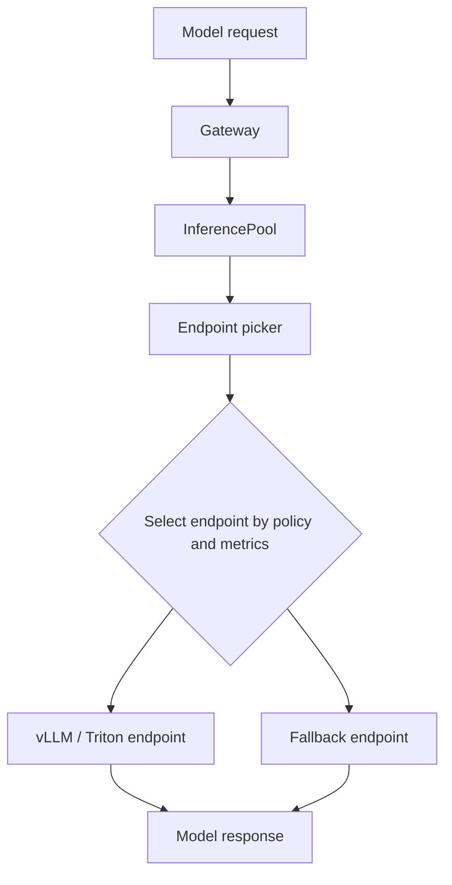
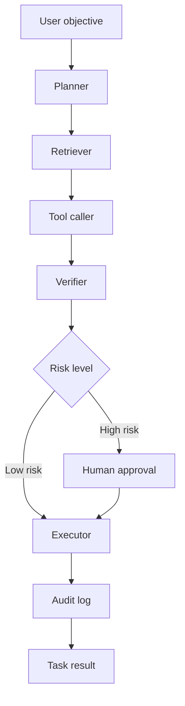
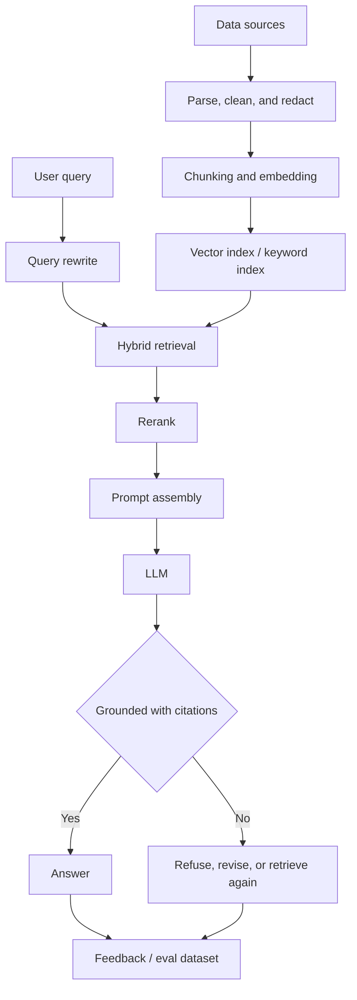
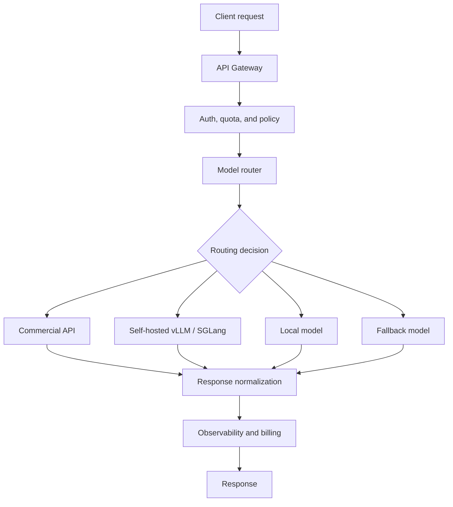
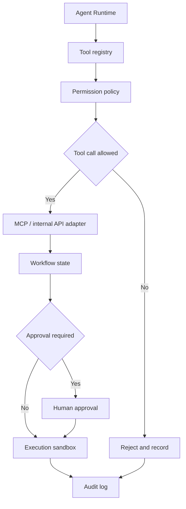
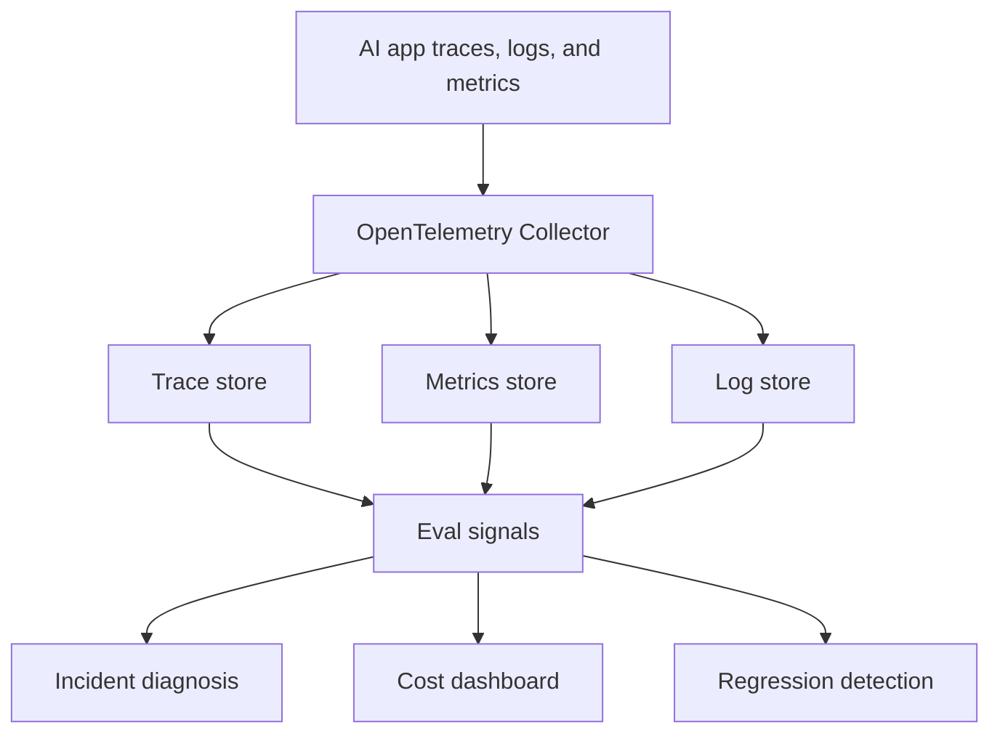
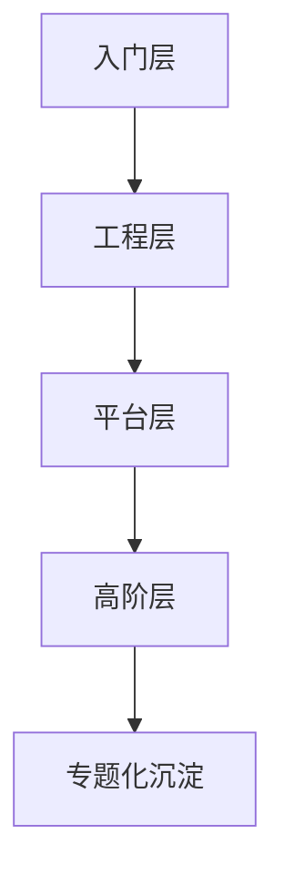

# AI Infra 调研大纲

## 1. 主题定位

AI Infra 指支撑 AI 应用从研发、训练、评测、部署到运行治理的基础设施体系。它不是单一工具，而是一组围绕模型、数据、算力、服务、观测和安全形成的工程能力。

在大模型时代，AI Infra 的重点正在从“训练一个模型”扩展为“稳定、低成本、可治理地运行 AI 系统”。

核心问题包括：

- 如何获得和调度 GPU / NPU / TPU 等加速算力。
- 如何训练、微调、压缩和管理模型。
- 如何把模型以低延迟、高吞吐、可扩缩的方式提供给业务。
- 如何构建 RAG、Agent、工具调用、多模型路由等上层能力。
- 如何评测质量、成本、延迟、安全性和可靠性。
- 如何观察线上行为，定位故障，控制风险。

## 2. 总体技术地图

```text
AI Infra
  ├─ 算力与硬件层
  │   ├─ GPU / NPU / TPU / ASIC
  │   ├─ 高速网络：InfiniBand / RoCE / NVLink / Spectrum-X
  │   ├─ 存储：对象存储、并行文件系统、NVMe、KV cache offload
  │   └─ 集群资源：Kubernetes、Slurm、Ray、Kueue
  │
  ├─ 数据与特征层
  │   ├─ 数据湖、向量库、特征库、文档索引
  │   ├─ 数据清洗、标注、脱敏、版本管理
  │   └─ 训练数据、RAG 语料、反馈数据、评测集
  │
  ├─ 模型研发层
  │   ├─ 预训练、SFT、RLHF / RLAIF、DPO
  │   ├─ PEFT：LoRA、Adapter、Prompt Tuning
  │   ├─ 模型压缩：量化、蒸馏、剪枝、MoE 路由
  │   └─ 实验追踪、模型注册、模型版本
  │
  ├─ 推理服务层
  │   ├─ 推理引擎：vLLM、SGLang、TensorRT-LLM、TGI、llama.cpp
  │   ├─ Serving：KServe、Ray Serve、Triton、NIM、自研网关
  │   ├─ 调度：continuous batching、prefix caching、KV-aware routing
  │   ├─ 多节点：tensor / pipeline / data parallel、prefill-decode disaggregation
  │   └─ SLA：限流、降级、弹性扩缩、冷启动优化
  │
  ├─ 应用编排层
  │   ├─ RAG：切分、嵌入、召回、重排、引用、grounding
  │   ├─ Agent：任务规划、工具调用、MCP、记忆、权限边界
  │   ├─ Prompt / Workflow：模板、版本、灰度、回滚
  │   └─ 多模型路由：成本优先、质量优先、延迟优先、fallback
  │
  ├─ 评测与质量层
  │   ├─ 离线评测：准确性、相关性、鲁棒性、安全性
  │   ├─ 在线评测：A/B、shadow traffic、人工反馈
  │   ├─ CI gate：prompt / RAG / agent 变更准入
  │   └─ 数据闭环：失败样例、回归集、持续学习
  │
  └─ 可观测与治理层
      ├─ Traces：请求链路、模型调用、工具调用、Agent span
      ├─ Metrics：tokens、TTFT、TPOT、p95、GPU 利用率、cache hit
      ├─ Logs：输入输出摘要、错误、拒答、策略命中
      ├─ 安全：权限、审计、PII、prompt injection、数据外泄
      └─ FinOps：按 token / GPU hour / 用户 / 业务线拆账
```

## 3. 前沿趋势

### 3.1 推理成为 AI Infra 的核心运行环节

训练仍然重要，但大多数企业落地 AI 时，成本和稳定性压力首先出现在推理阶段：

- 请求量不可预测，峰谷明显。
- 长上下文和多轮对话让 KV cache 成为核心资源。
- reasoning model 拉长输出时间，TTFT 和 TPOT 都更难控制。
- 多租户、LoRA adapter、多模型混部让调度更复杂。
- GPU 利用率、排队延迟和服务等级目标之间需要动态权衡。

vLLM 的 PagedAttention、continuous batching、prefix caching、chunked prefill、speculative decoding 等能力，代表了当前开源推理引擎的关键优化方向。更上层的 Dynamo / AIBrix 类框架，则把重点放到多节点编排、KV-aware routing、prefill/decode 分离、SLA 驱动扩缩容和总拥有成本优化。

### 3.2 Kubernetes 正在补齐 GenAI workload 原语

传统 Kubernetes 擅长无状态服务和通用容器编排，但 GenAI 推理需要理解模型、副本、token 预算、KV cache、LoRA adapter、GPU 拓扑和请求目标。

Kubernetes Gateway API Inference Extension 是值得关注的方向：它把推理池、endpoint selection、指标感知路由等概念引入 Kubernetes 网关体系，使请求可以根据模型服务端状态和目标函数选择后端。它当前重点和 vLLM、Triton 等模型服务框架对接。

流程关系如下：



### 3.3 AI 应用基础设施从 RAG 走向 Agent Runtime

RAG 解决“把外部知识接入模型”的问题；Agent Runtime 进一步解决“让模型按步骤调用工具完成任务”的问题。

RAG Infra 关注：

- 文档解析、清洗、切分。
- embedding 模型和向量索引。
- hybrid search、rerank、query rewrite。
- grounding、引用、反事实检查。
- 召回质量和答案质量评测。

Agent Infra 关注：

- 工具注册、schema、权限、审计。
- MCP 等工具连接协议。
- workflow / graph orchestration。
- 人工审批和风险分级。
- 任务记忆、状态管理和回滚。
- 工具调用链路观测。

更完整的 Agent Runtime 流程如下：



### 3.4 可观测从 APM 扩展到 GenAI Observability

传统 APM 关注 HTTP、DB、RPC、CPU、内存等信号。AI 系统还需要额外观察：

- prompt / completion token 数。
- 模型名、模型版本、provider、region。
- TTFT、TPOT、总延迟、流式中断。
- 召回命中文档、rerank 分数、grounding 证据。
- tool call 成功率、重试、权限拒绝。
- 质量信号：幻觉、拒答、格式错误、策略命中。
- 成本信号：每次请求成本、每用户成本、缓存节省。

OpenTelemetry 已经提供 Generative AI semantic conventions，覆盖 GenAI events、exceptions、metrics、model spans、agent spans，并包含 OpenAI、Anthropic、AWS Bedrock、Azure AI Inference、MCP 等方向的语义约定。虽然仍处于 development 状态，但它代表了 AI 可观测逐渐标准化的方向。

### 3.5 评测会变成发布流程的一部分

AI 系统无法只依赖单元测试。一次 prompt、检索策略、模型版本、工具 schema 或 rerank 参数变更，都可能改变线上行为。

因此需要把评测前移到 CI/CD：

- 离线 golden set：固定问题集、标准答案、边界样例。
- RAG 指标：retrieval hit rate、context precision、faithfulness、citation accuracy。
- Agent 指标：workflow success、tool call accuracy、policy compliance、human intervention rate。
- 运行指标：p95、TTFT、TPOT、tokens/request、cost/request。
- 安全指标：prompt injection、越权工具调用、PII 泄露、jailbreak。

成熟 AI Infra 应提供发布准入判断，而不仅是展示运行指标。

### 3.6 成本治理成为基础设施能力

AI 成本不是单纯的云账单问题，而是架构问题。

常见成本杠杆：

- 缓存：prompt cache、prefix cache、response cache、embedding cache。
- 模型路由：低复杂度任务使用低成本模型，高复杂度任务使用能力更强的模型。
- 量化：FP8、INT8、INT4、AWQ、GPTQ、KV cache quantization。
- batch：continuous batching、offline batch inference。
- 长短请求分池：短上下文高吞吐池，长上下文大显存池。
- prefill / decode 分离：分别使用适合计算密集和带宽密集阶段的资源。
- LoRA 多租户：共享 base model，按任务动态加载 adapter。
- 限额：按用户、租户、业务线控制 token 和 QPS。

## 4. 典型架构模式

### 4.1 企业 RAG 平台



适合场景：

- 内部知识库问答。
- 客服辅助。
- 研发文档助手。
- 法务、财务、售前资料检索。

关键风险：

- 文档权限穿透。
- 召回不到正确材料。
- 检索到了材料但模型没有忠实引用。
- 索引更新滞后。
- 多租户数据隔离不足。

### 4.2 多模型推理平台



适合场景：

- 企业内部统一 LLM 网关。
- 多业务线共享模型资源。
- 需要跨供应商降级和成本优化。

关键能力：

- OpenAI-compatible API 或统一 SDK。
- 模型能力画像：上下文长度、工具调用、视觉、结构化输出、价格。
- 策略路由：质量、成本、延迟、数据合规。
- fallback：超时、限流、provider 故障时自动切换。
- 精细化账单：按 token、模型、用户、业务线拆分。

### 4.3 Agent 工具平台



适合场景：

- DevOps / SRE 自动诊断。
- 代码仓库助手。
- 数据分析助手。
- 企业流程自动化。

关键能力：

- 工具 schema 可机器理解。
- 工具权限默认最小化。
- 高风险操作需要人工确认。
- 每一步可追踪、可回放。
- 工具输出需要验证和结构化。

### 4.4 AI SRE / AI Observability 平台



适合场景：

- RAG 或 Agent 已经进入生产环境。
- 需要追踪回答质量、成本和失败原因。
- 需要把 prompt、retrieval、tool call 纳入统一链路。

关键能力：

- 每次 AI 请求有 trace_id。
- 模型调用、检索、工具调用都进入同一条 trace。
- 支持按模型版本、prompt 版本、数据版本聚合。
- 支持失败样例自动进入回归集。

## 5. 技术选型维度

### 5.1 自托管还是 API 优先

| 维度 | API 优先 | 自托管 |
|---|---|---|
| 上手速度 | 快 | 慢 |
| 质量上限 | 取决于供应商 | 取决于模型和工程能力 |
| 成本结构 | 按 token 付费 | GPU 固定成本 + 运维成本 |
| 数据控制 | 受供应商策略限制 | 更可控 |
| 延迟控制 | 受网络和供应商影响 | 可深度优化 |
| 运维复杂度 | 低 | 高 |

经验判断：

- 早期产品验证：优先 API。
- 有明确安全合规或高 QPS 成本压力：考虑自托管。
- 大多数企业会采用混合模式：核心能力自托管，高能力模型或低频能力通过 API 调用。

### 5.2 单模型服务还是统一模型网关

单模型服务适合原型验证或单业务线。统一模型网关适合组织级 AI 平台。

统一网关应该提供：

- 鉴权、限流、审计。
- 模型路由和 fallback。
- prompt / response 统一记录。
- 成本拆账。
- 安全策略。
- provider 抽象。

### 5.3 向量库还是搜索引擎

RAG 不能仅依赖向量库。

常见组合：

- 向量检索：语义相似。
- BM25 / 全文检索：关键词、编号、专有名词。
- Graph / metadata filter：权限、时间、业务域、实体关系。
- Reranker：提高最终上下文质量。

更稳妥的默认方案是 hybrid retrieval + rerank，而不是纯向量召回。

### 5.4 Workflow 还是自由 Agent

自由 Agent 灵活，但生产风险高。企业场景更适合：

- 高确定流程用 workflow / graph。
- 低风险探索用 agent。
- 高风险操作加 human-in-the-loop。
- 工具调用必须有权限、审计和回滚策略。

## 6. 学习路线

学习路径可按以下阶段推进：



### 6.1 入门层

- 了解 LLM 请求生命周期：prompt -> prefill -> decode -> streaming。
- 了解 token、context window、KV cache、batching。
- 搭建一个最小 RAG：文档切分、embedding、向量检索、回答引用。
- 使用一个 OpenAI-compatible API 网关或本地 vLLM 服务。

### 6.2 工程层

- 学习 vLLM / SGLang / TensorRT-LLM 的推理优化概念。
- 学习 Kubernetes GPU 调度、node pool、resource quota。
- 学习 Ray Serve / KServe / Triton / Gateway API Inference Extension。
- 搭建 AI observability：trace model call、retrieval、tool call。
- 建立 prompt / RAG eval regression set。

### 6.3 平台层

- 设计统一 LLM Gateway。
- 设计模型注册、prompt 版本、数据版本和评测版本。
- 设计多租户权限和成本拆账。
- 设计 Agent tool registry 与 MCP 接入。
- 设计线上反馈到评测集的闭环。

### 6.4 高阶层

- 多节点推理和 prefill/decode disaggregation。
- KV cache 管理、offload、prefix-aware routing。
- SLA 驱动 autoscaling。
- 多模型路由和 cost-quality Pareto 优化。
- AI safety red team、policy engine、敏感数据治理。

## 7. 推荐专题拆分

后续可以继续拆成以下专题笔记：

- `ai_infra_inference_serving.md`：LLM 推理服务与 vLLM / SGLang / TensorRT-LLM。
- `ai_infra_kubernetes.md`：Kubernetes 上的 GenAI workload 编排。
- `ai_infra_rag.md`：企业 RAG 工程体系。
- `ai_infra_agent_runtime.md`：Agent Runtime、MCP 与工具治理。
- `ai_infra_observability.md`：GenAI observability 与 OpenTelemetry。
- `ai_infra_eval.md`：LLM / RAG / Agent 评测体系。
- `ai_infra_finops.md`：AI 成本治理和容量规划。
- `ai_infra_security.md`：AI 安全、权限、审计与数据保护。

## 8. 关键判断

1. AI Infra 的主线已经从“模型训练平台”扩展到“推理、RAG、Agent、评测、治理”的完整生产体系。
2. 推理服务是当前变化最快、成本压力最大的层，KV cache、batching、routing 和 autoscaling 是核心。
3. Kubernetes 仍会是企业基础设施底座，但需要新的推理原语和模型感知路由。
4. RAG 和 Agent 不只是应用逻辑，它们正在变成平台能力。
5. 没有评测和可观测的 AI 应用，很难稳定进入生产。
6. 成本优化应纳入架构设计阶段，而不是在费用异常后被动削减调用量。
7. 企业落地更适合混合模式：API + 自托管 + 统一网关 + 严格治理。

## 9. 参考资料

- vLLM Documentation: https://docs.vllm.ai/en/latest/
- vLLM / PagedAttention paper: https://arxiv.org/abs/2309.06180
- NVIDIA Dynamo: https://github.com/ai-dynamo/dynamo
- AIBrix paper: https://arxiv.org/abs/2504.03648
- Kubernetes Gateway API Inference Extension: https://gateway-api-inference-extension.sigs.k8s.io/
- OpenTelemetry Semantic Conventions for Generative AI: https://opentelemetry.io/docs/specs/semconv/gen-ai/
- Engineering the RAG Stack: https://arxiv.org/abs/2601.05264
- LLM Readiness Harness: https://arxiv.org/abs/2603.27355
- Evaluating Kubernetes Performance for GenAI Inference: https://arxiv.org/abs/2602.04900
