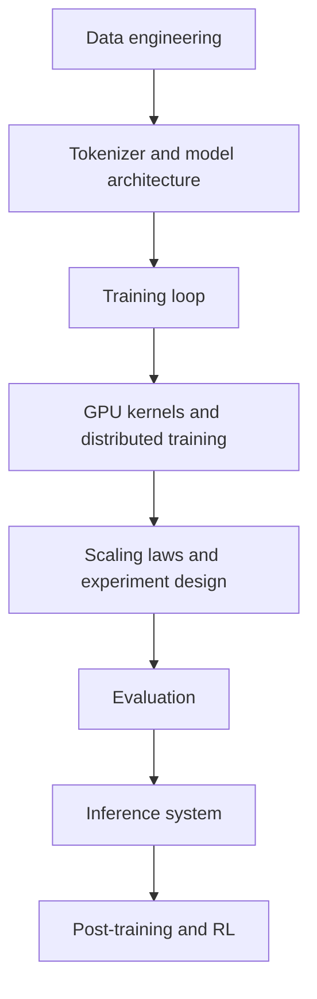
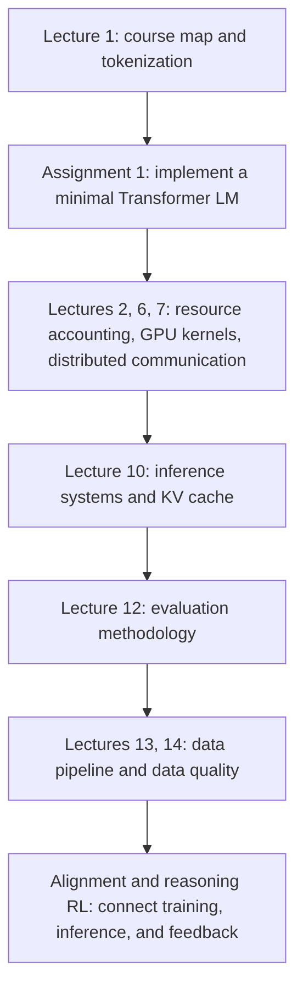

# Stanford CS336：Language Modeling from Scratch

归档日期：2026-06-15

## 1. 课程定位

Stanford CS336: Language Modeling from Scratch 是一门以“从零构建语言模型”为主线的实现型课程。

课程主页把它类比为操作系统课中的“从零写一个 OS”：不是只讲 Transformer 或调用现成框架，而是带学生走完整个语言模型创建过程：

- 数据收集、清洗与预训练数据构造。
- tokenizer、Transformer 架构、优化器和训练循环。
- GPU 性能、kernel、Triton、分布式训练。
- scaling laws 与固定算力预算下的模型/数据配比。
- evaluation、数据质量、数据混合。
- SFT、RLHF / RLVR、DPO、GRPO 等 post-training。
- 推理系统、KV cache、batching、quantization、speculative decoding。

核心概括：

> CS336 不是“使用大模型”的课，而是“理解并亲手搭建大模型训练与推理栈”的课。

## 2. 课程回答的核心问题

课程围绕以下核心问题展开：

> 在给定数据、算力、显存、通信带宽和时间预算下，如何训练并部署一个尽可能好的语言模型？

这背后包含三类知识：

| 知识类型 | 含义 |
|---|---|
| Mechanics | Transformer、tokenizer、optimizer、parallelism、kernel 等组件如何工作 |
| Intuitions | 哪些数据、结构、超参数和训练策略更可能提升模型质量 |
| Mindset | 把硬件、数据和模型当成一个整体，不断做资源核算和效率优化 |

课程特别强调：frontier models 本身可能不公开，但底层机制和工程心智是可迁移的。

## 3. 课程结构

根据 2026 年课程主页，CS336 的主线如下：

| 模块 | 主题 |
|---|---|
| Overview / Tokenization | 语言模型是什么，tokenizer 为什么重要，BPE 如何工作 |
| PyTorch / Resource accounting | tensor、FLOPs、memory、arithmetic intensity、MFU |
| Architecture | Transformer 架构、attention、MLP、normalization、position encoding |
| Attention alternatives / MoE | sparse/local attention、GQA、MLA、MoE |
| GPUs / Kernels / Triton | GPU memory hierarchy、kernel fusion、tiling、profiling |
| Parallelism | data/tensor/pipeline/sequence/expert parallelism，NCCL collectives |
| Scaling laws | 用小规模实验预测大规模训练结果 |
| Inference | prefill/decode、KV cache、batching、PagedAttention、quantization |
| Evaluation | perplexity、benchmarks、Chatbot Arena、agentic evals、safety evals |
| Data | Common Crawl、books、code、filtering、deduplication、mixing、legal issues |
| Alignment / Reasoning RL | SFT、RLHF、DPO、GRPO、RLVR、reasoning 数据 |

## 4. 作业设计

课程作业也对应完整语言模型栈。

| 作业 | 核心内容 |
|---|---|
| Assignment 1: Basics | 实现 tokenizer、Transformer、cross-entropy、AdamW、training loop，并训练一个最小语言模型 |
| Assignment 2: Systems | benchmark/profile 模型和层，实现 Triton / FlashAttention2 相关优化，做内存高效和分布式训练 |
| Assignment 3: Scaling | 理解 Transformer 各组件作用，查询训练 API，拟合 scaling law，预测大规模训练表现 |
| Assignment 4: Data | 将 Common Crawl 等原始数据转为预训练数据，做 filtering、deduplication，提升模型性能 |
| Assignment 5: Alignment | 用 SFT 和 RL 训练模型做数学推理；可选安全 alignment、DPO 等方法 |

课程强调通过实现关键部件理解抽象机制背后的工程约束，而不是仅阅读论文或调用现成框架。

## 5. 核心内容提取

本章已独立为专题笔记：[大模型基础知识概览](../ai_infra/large_language_model_fundamentals.md)。

专题笔记按以下结构展开，并补充了流程图、示例和引用：

- Language model 与 tokenization。
- Transformer 基础实现。
- Resource accounting：FLOPs、显存与 roofline。
- GPU、kernel 与 Triton。
- 多 GPU parallelism。
- Scaling laws。
- Inference。
- Evaluation。
- Data。
- Alignment 与 reasoning RL。

## 6. 这门课与 AI Infra 的关系

CS336 覆盖 AI Infra 中更接近模型训练与推理基础设施的部分：

它和传统“应用层 LLM 开发”不同：

- 不主要讲 prompt engineering。
- 不主要讲 RAG。
- 不主要讲产品化 agent workflow。
- 重点是模型本身如何被训练、扩展、评测和高效运行。

如果把 AI Infra 分层，CS336 最相关的是：

- 数据与预训练数据 pipeline。
- 模型研发层。
- 训练系统层。
- 推理引擎层。
- 评测与质量层。
- post-training / alignment pipeline。

## 7. 适合如何学习

如果目标是理解大模型工程栈，建议按下面顺序学习。

## 8. 检索结论

本次检索中，高可信公开材料主要来自：

- Stanford CS336 官方课程主页。
- 官方 GitHub assignment repositories。
- 官方 lecture viewer 背后的 executable lecture traces。
- 课程主页链接的 YouTube 录播与 lecture PDFs。

公开搜索中未找到足够稳定、系统、可交叉验证的第三方完整课程笔记。因此本文以官方材料为主，第三方内容未作为主要依据。

## 9. 参考资料

- [Stanford CS336: Language Modeling from Scratch](https://cs336.stanford.edu/)
- [CS336 Lecture 1 executable trace](https://cs336.stanford.edu/lectures/?trace=lecture_01)
- [CS336 Lecture 2 executable trace](https://cs336.stanford.edu/lectures/?trace=lecture_02)
- [CS336 Lecture 6 executable trace](https://cs336.stanford.edu/lectures/?trace=lecture_06)
- [CS336 Lecture 7 executable trace](https://cs336.stanford.edu/lectures/?trace=lecture_07)
- [CS336 Lecture 10 executable trace](https://cs336.stanford.edu/lectures/?trace=lecture_10)
- [CS336 Lecture 12 executable trace](https://cs336.stanford.edu/lectures/?trace=lecture_12)
- [CS336 Lecture 13 executable trace](https://cs336.stanford.edu/lectures/?trace=lecture_13)
- [CS336 Lecture 14 executable trace](https://cs336.stanford.edu/lectures/?trace=lecture_14)
- [Assignment 1: Basics](https://github.com/stanford-cs336/assignment1-basics)
- [Assignment 2: Systems](https://github.com/stanford-cs336/assignment2-systems)
- [Assignment 3: Scaling](https://github.com/stanford-cs336/assignment3-scaling)
- [Assignment 4: Data](https://github.com/stanford-cs336/assignment4-data)
- [Assignment 5: Alignment](https://github.com/stanford-cs336/assignment5-alignment)
- [Attention Is All You Need](https://arxiv.org/abs/1706.03762)
- [FlashAttention: Fast and Memory-Efficient Exact Attention with IO-Awareness](https://arxiv.org/abs/2205.14135)
- [Training Compute-Optimal Large Language Models](https://arxiv.org/abs/2203.15556)
- [Efficient Memory Management for Large Language Model Serving with PagedAttention](https://arxiv.org/abs/2309.06180)
- [Measuring Massive Multitask Language Understanding](https://arxiv.org/abs/2009.03300)
- [SWE-bench: Can Language Models Resolve Real-World GitHub Issues?](https://arxiv.org/abs/2310.06770)
- [Training language models to follow instructions with human feedback](https://arxiv.org/abs/2203.02155)
- [Direct Preference Optimization](https://arxiv.org/abs/2305.18290)
