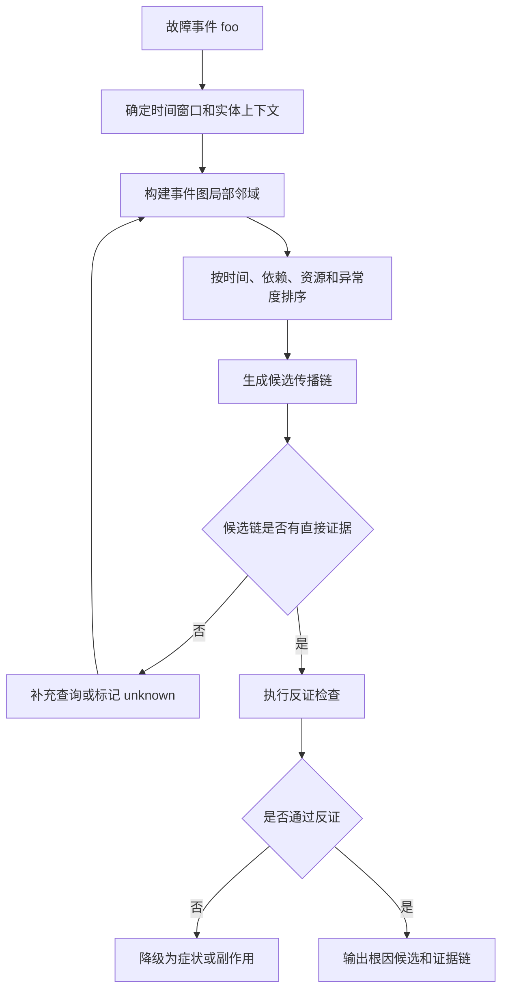
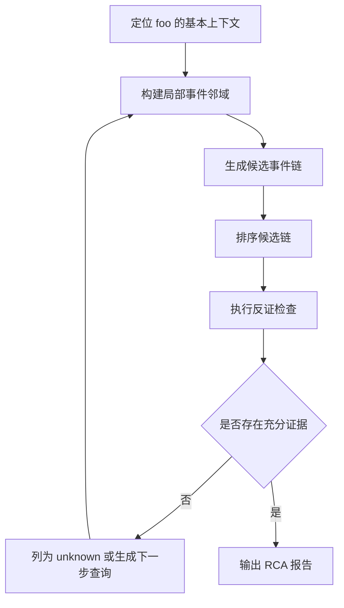

# 基于 Trace 的 RCA 问题调研

## 1. 问题定义

基于 trace 的 RCA（Root Cause Analysis）关注的是：给定一个故障现象或故障事件，从大量 trace、日志、指标、事件和拓扑数据中找出相关证据链，并定位最可能的根因。

如果已知 `foo` 是故障事件，可以把问题描述为：

```text
Given a failure event foo and a large set of trace events,
identify correlated events, reconstruct possible event chains,
and infer the most likely root cause.
```

中文表述：

```text
给定故障事件 foo，从 trace 事件流中检索相关事件，构建事件链或依赖图，并推断导致 foo 的根因。
```

这类问题并非仅是相似事件检索，而是组合了：

- Event Correlation：找出与 `foo` 在时间、实体、资源、调用链上相关的事件。
- Fault Localization：定位可疑服务、线程、span、主机、资源或代码区域。
- Root Cause Analysis：区分根因、直接症状、传播症状和无关噪声。
- Causal/Temporal Analysis：分析事件先后关系、传播路径和因果候选。
- Evidence Ranking：对相关事件和根因候选排序。

## 2. 典型输入与输出

### 2.1 输入

```text
failure_event:
  id: foo
  timestamp: 10:05:12.341
  type: request_timeout
  service: order-service
  trace_id: abc
  message: POST /orders timeout

trace_events:
  - span events
  - syscall events
  - sched events
  - block io events
  - network events
  - log events
  - metric anomaly events
  - deployment/change events
```

### 2.2 输出

```text
related_event_chains:
  chain_1:
    foo <- payment timeout <- mysql lock wait <- deployment v1.8.2
  chain_2:
    foo <- order retry storm <- downstream saturation

root_cause_candidates:
  1. payment-service v1.8.2 introduced database lock contention
  2. mysql storage latency spike
  3. traffic surge caused queue saturation

evidence:
  - trace span ids
  - log lines
  - metric anomaly windows
  - change events

confidence:
  top1: medium
  top3: high
```

## 3. 问题分类

| 名称 | 关注点 | 与 `foo` 场景的关系 |
| --- | --- | --- |
| Trace-based RCA | 从 trace/call graph 中定位根因 | 核心问题 |
| Event Graph RCA | 将事件抽象为图节点和因果边 | 适合围绕 `foo` 做 k-hop 检索 |
| Fault Localization | 定位故障组件或代码区域 | 输出根因所在对象 |
| Anomaly Propagation Analysis | 分析异常沿调用链或资源依赖传播 | 区分根因和症状 |
| Multimodal RCA | 联合 trace、log、metric、change | 解决 trace 单模态证据不足 |
| LLM-based RCA | 用大模型做假设生成、解释和工具编排 | 适合与 Skill/MCP 结合 |

## 4. 关键建模方式

### 4.1 事件图

把 trace 事件建模为图：

```text
node = event
edge = relation
```

常见节点：

- 故障事件：timeout、error、panic、oom、5xx。
- 调用事件：span start/end、rpc call、http request。
- 系统事件：syscall、sched、block io、network。
- 资源事件：cpu、memory、disk、socket、lock。
- 变更事件：deployment、config change、scaling、restart。

常见边：

```text
happens_before
same_trace_id
same_pid
same_tid
same_fd
same_socket
same_cgroup
same_resource
parent_child_span
service_dependency
issue_complete
enter_exit
wakeup_after_block
within_time_window
deployment_affects_service
```

围绕 `foo` 的分析可以转化为以下流程：



```text
1. 以 foo 为中心取时间窗口。
2. 在事件图中做 k-hop 邻域扩展。
3. 按异常度、时间先后、依赖方向和资源共享关系排序。
4. 生成候选传播链。
5. 对根因候选做反证。
```

### 4.2 调用图与依赖图

分布式 trace 中，调用图通常天然存在：

```text
api-gateway
  -> order-service
    -> payment-service
      -> mysql
```

RCA 需要判断：

- `foo` 所在 span 是 root span、leaf span 还是中间 span。
- 高延迟 span 是否覆盖上游延迟。
- 多个异常 trace 是否共享同一个下游依赖。
- 异常是否从下游向上游传播。
- 是否存在刚发生的部署或配置变更。

### 4.3 异构图

实际系统中，单一 trace graph 不够，需要异构图：

```text
service node
span node
metric node
log node
host node
pod node
deployment node
resource node
code node
```

异构图适合表达：

- 服务调用关系。
- 主机和容器承载关系。
- 服务与指标、日志、trace 的观测关系。
- 代码提交与服务版本关系。
- 资源竞争关系。

CHASE、Eadro、AnoMod 等研究都强调了多源数据融合的重要性。

## 5. 主流方法路线

### 5.1 规则与统计相关性

典型思路：

- 时间邻近：某事件是否早于 `foo` 出现。
- 实体共享：是否同 trace、同线程、同 socket、同服务。
- 异常共现：相关指标是否同时偏离基线。
- 调用覆盖：下游耗时是否解释上游延迟。
- 频率变化：某类事件是否在故障窗口爆发。

优点：

- 可解释。
- 计算稳定。
- 适合做 MCP 工具的基础能力。

缺点：

- 对复杂传播链和隐含因果关系能力有限。

### 5.2 图搜索与图排序

典型思路：

- 构建事件图、调用图或服务依赖图。
- 从 `foo` 反向沿依赖边搜索。
- 根据异常分数、拓扑位置、时间先后、传播方向排序。
- 剪枝无关节点，减少搜索空间。

MicroHECL、TraceDiag、Groot 都体现了图构建、传播链分析或图剪枝的思想。

### 5.3 因果推断

典型思路：

- 从指标、trace 和日志构造因果图。
- 分析异常传播方向。
- 区分相关性和因果性。
- 定位根因服务或根因指标。

CausalRCA、CHASE 等研究属于这个方向。

优点：

- 更接近“为什么”。
- 有助于区分症状和根因。

缺点：

- 对数据质量、采样频率和假设条件敏感。

### 5.4 多源融合

仅使用 trace 可能遗漏：

- CPU、内存、磁盘、网络指标。
- 应用日志中的异常语义。
- 发布、配置、扩缩容事件。
- 代码变更和 feature flag。

因此，较可靠的 RCA 通常联合：

```text
trace + logs + metrics + topology + changes + runbooks
```

Eadro、CHASE、RCAEval、AnoMod 等工作都把多模态 telemetry 作为重要方向。

### 5.5 LLM / Agent 方法

LLM 适合做：

- 根据 `foo` 生成下一步查询。
- 解释事件链。
- 合并多源证据。
- 生成根因假设。
- 做反事实追问。
- 输出 RCA 报告。

但 LLM 不适合直接执行：

- 全量 trace 扫描。
- 大规模相关性计算。
- 稳定的 percentile 统计。
- 原始事件配对。

RCLAgent、MicroRCA-Agent、OpenRCA、RCACopilot 等工作体现了 LLM 在 RCA 中的使用方式：将模型放在推理、解释和编排层，而不是替代观测系统。

## 6. 与 Skill + MCP 的结合

### 6.1 MCP 工具负责确定性分析

围绕 `foo` 的 MCP 工具可以设计为：

```text
get_failure_event(foo_id)
get_event_neighbors(event_id, relation_types, hops, time_window)
find_events_before(event_id, filters, limit)
find_shared_resource_events(event_id, resource_types)
build_event_graph(center_event_id, time_window, max_nodes)
rank_related_events(center_event_id, scoring_policy)
build_propagation_chains(center_event_id)
compare_fault_window_with_baseline(entity, metric, fault_window, baseline_window)
```

对 Linux trace：

```text
find_syscalls_before_event(foo, pid?, tid?)
correlate_foo_with_sched_wait(foo)
correlate_foo_with_block_io(foo)
correlate_foo_with_network(foo)
get_thread_timeline_around_event(foo)
```

对分布式 trace：

```text
get_trace_critical_path(trace_id)
get_upstream_downstream_spans(span_id)
find_common_downstream_dependency(failed_traces)
correlate_span_with_logs(span_id)
correlate_service_with_changes(service, time_window)
```

### 6.2 Skill 负责诊断流程

Skill 可以规定：

```text
1. 确认 foo 的类型、时间、实体和影响面。
2. 先查 foo 的局部邻域，不直接扩大到全系统。
3. 按 trace_id / pid / tid / service / resource 逐步扩展。
4. 先找最早异常，再找共同依赖，再找最近变更。
5. 对每个候选根因要求至少一条直接证据和一条反证检查。
6. 输出 root cause、symptom、unknown 三类结论。
```

### 6.3 大模型负责解释与反证

大模型应被要求输出：

```text
related_events:
  - event_id
  - relation_to_foo
  - evidence
  - direction: cause_candidate | symptom | side_effect | unknown

candidate_chains:
  - chain
  - why_this_chain_matters
  - missing_evidence

root_cause_candidates:
  - candidate
  - confidence
  - supporting_evidence
  - counter_evidence
  - next_query
```

## 7. 相关研究梳理

### 7.1 Groot：事件图 RCA

Groot 是工业场景中的 event-graph-based RCA 方法。它把 metrics、logs、activities 等事件汇总为事件图，并支持 SRE 自定义事件和规则。论文报告其在 5,000 个生产服务中使用，并在 952 个真实生产事故数据集上取得较高 Top-1 和 Top-3 准确率。

对 `foo` 场景的启发：

- 将 `foo` 作为事件图中心节点。
- 用领域规则定义事件之间的因果边。
- 用 SRE 知识补充自动推理不足。

### 7.2 MicroHECL：传播链与调用图剪枝

MicroHECL 面向大规模微服务 availability issue，基于动态服务调用图分析异常传播链，并通过剪枝减少无关调用。它强调性能、可靠性、流量等不同异常类型需要不同检测模型。

对 `foo` 场景的启发：

- 从 `foo` 沿调用图回溯异常传播链。
- 通过剪枝避免把无关服务纳入分析。
- 将不同故障类型分开建模。

### 7.3 TraceDiag：大规模 trace 图剪枝

TraceDiag 针对大规模微服务 RCA，使用强化学习学习服务依赖图剪枝策略，再在剪枝图上运行因果方法。其目标是减少大系统中的 RCA 搜索空间。

对 `foo` 场景的启发：

- 先缩小与 `foo` 相关的候选子图。
- 再在子图中进行因果或根因排序。

### 7.4 CausalRCA：细粒度因果定位

CausalRCA 使用因果结构学习构建加权因果图，并定位根因指标，强调从粗粒度服务定位走向细粒度服务 + 指标定位。

对 `foo` 场景的启发：

- 根因不一定只是服务，也可能是某个服务上的具体指标或资源。
- 需要输出“哪个对象 + 哪个指标/资源异常”。

### 7.5 CHASE：多模态异构图

CHASE 将 trace、log、metric 等多模态数据编码进异构调用图，并用因果流进行根因定位。

对 `foo` 场景的启发：

- `foo` 的根因证据可能跨越 trace、log、metric。
- 异构图比单一 trace graph 更适合真实系统。

### 7.6 Eadro：端到端多源故障排查

Eadro 将 anomaly detection 和 root cause localization 放到同一框架中，使用 trace、logs、KPIs 建模服务内行为和服务间依赖。

对 `foo` 场景的启发：

- 如果异常检测不准，后续 RCA 会被误导。
- 检测和定位应共享证据，而不是分离成两个孤立阶段。

### 7.7 RCAEval / AnoMod：评测基准

RCAEval 提供微服务 RCA benchmark 和多种 baseline；AnoMod 提供包含 logs、metrics、distributed traces、API responses、code coverage reports 的多模态异常数据集。

对 `foo` 场景的启发：

- 需要构造可评测数据集，而不是只靠个案经验。
- 评价应包含粗粒度和细粒度定位。

### 7.8 OpenRCA 与 RCLAgent：LLM 参与 RCA

OpenRCA 关注 LLM 是否能基于 telemetry 定位软件故障根因。RCLAgent 则强调多 Agent、递归推理、跨模态分析和工具辅助。

对 `foo` 场景的启发：

- LLM 可以围绕 `foo` 生成查询和解释证据链。
- 真实 RCA 需要工具和图结构辅助，否则可能导致上下文规模不可控。

## 8. 面向 `foo` 的分析流程



### 8.1 步骤一：定位 foo 的基本上下文

```text
foo:
  timestamp
  event_type
  service/process/thread/span
  severity
  trace_id/request_id
  resource_id
```

### 8.2 步骤二：构建局部事件邻域

优先取：

- `foo` 前后固定时间窗口。
- 同 trace/request 的事件。
- 同 pid/tid/cgroup 的事件。
- 同 fd/socket/inode/device 的事件。
- 同服务上下游 span。
- 同主机或 pod 的资源异常。

### 8.3 步骤三：生成候选事件链

示例：

```text
chain_a:
  deployment v1.8.2
    -> mysql lock wait increase
    -> payment span timeout
    -> order span timeout
    -> foo

chain_b:
  disk await spike
    -> block_rq_complete latency high
    -> read syscall latency high
    -> thread D state
    -> foo
```

### 8.4 步骤四：排序和反证

排序特征：

- 是否早于 `foo`。
- 是否在调用链或资源链上。
- 是否能解释 `foo` 的主要耗时或错误。
- 是否在多个失败样本中重复出现。
- 是否有同窗口指标或日志支持。
- 是否与近期变更一致。

反证问题：

- 是否存在更早的异常？
- 该事件是否只是上游等待下游的症状？
- 是否有正常样本也出现同样事件？
- 是否存在共同下游或共同资源？
- 是否有变更事件解释异常开始时间？

### 8.5 步骤五：输出 RCA 报告

```markdown
## Foo Event

- event_id:
- time:
- type:
- affected entity:

## Related Event Chains

1. chain:
   - relation:
   - evidence:
   - confidence:

## Root Cause Candidates

1. candidate:
   - object:
   - failure mode:
   - supporting evidence:
   - counter evidence:
   - next verification:

## Symptoms

## Unknowns

## Recommended Actions
```

## 9. 评价指标

### 9.1 定位准确性

- Top-1 Root Cause Accuracy。
- Top-k Root Cause Recall。
- Faulty Service Accuracy。
- Faulty Instance Accuracy。
- Faulty Metric Accuracy。
- Faulty Code Region Accuracy。

### 9.2 事件相关性质量

- Related Event Precision：返回相关事件中实际有效的比例。
- Related Event Recall：关键相关事件是否被找出。
- Chain Completeness：事件链是否缺关键环节。
- Symptom-vs-Cause Accuracy：是否把症状误判为根因。

### 9.3 工程效率

- Time to First Candidate。
- Time to RCA。
- 查询次数。
- 图节点压缩比。
- LLM token 消耗。
- 人工接受率。

## 10. 关键难点

### 10.1 Trace 不完整

采样、丢点、异步调用、跨线程执行都会让事件链断裂。

### 10.2 相关不等于因果

同一时间窗口内出现的事件未必导致 `foo`，需要结合方向、拓扑和反证。

### 10.3 多根因和级联故障

真实故障可能是配置变更、流量突增、资源耗尽共同作用，不能强行输出单一根因。

### 10.4 粒度不一致

Linux trace 是事件级，分布式 trace 是 span 级，指标是时间序列，日志是文本，需要统一到可关联的实体和时间轴上。

### 10.5 LLM 上下文规模不可控

围绕 `foo` 的候选事件数量可能较大，必须由工具先筛选、聚合、排序。

## 11. 与当前文档体系的关系

- `outline.md`：大模型自动维测和 RCA 总览。
- `trace_skill_mcp_analysis.md`：如何用 Skill + MCP 封装 trace 分析能力。
- `trace_based_rca.md`：基于 trace 的 RCA 问题定义、方法路线和研究脉络。

推荐阅读顺序：

```text
outline.md
  -> trace_based_rca.md
  -> trace_skill_mcp_analysis.md
```

## 12. 参考资料

- Groot: An Event-graph-based Approach for Root Cause Analysis in Industrial Settings  
  https://arxiv.org/abs/2108.00344
- MicroHECL: High-Efficient Root Cause Localization in Large-Scale Microservice Systems  
  https://arxiv.org/abs/2103.01782
- TraceDiag: Adaptive, Interpretable, and Efficient Root Cause Analysis on Large-Scale Microservice Systems  
  https://arxiv.org/abs/2310.18740
- CausalRCA: Causal Inference based Precise Fine-grained Root Cause Localization for Microservice Applications  
  https://arxiv.org/abs/2209.02500
- CHASE: A Causal Heterogeneous Graph based Framework for Root Cause Analysis in Multimodal Microservice Systems  
  https://arxiv.org/abs/2406.19711
- Eadro: An End-to-End Troubleshooting Framework for Microservices on Multi-source Data  
  https://arxiv.org/abs/2302.05092
- RCAEval: A Benchmark for Root Cause Analysis of Microservice Systems with Telemetry Data  
  https://arxiv.org/abs/2412.17015
- AnoMod: A Dataset for Anomaly Detection and Root Cause Analysis in Microservice Systems  
  https://arxiv.org/abs/2601.22881
- OpenRCA: Can Large Language Models Locate the Root Cause of Software Failures?  
  https://github.com/microsoft/OpenRCA
- RCLAgent: Adaptive Root Cause Localization for Microservice Systems with Multi-Agent Recursion-of-Thought  
  https://arxiv.org/abs/2508.20370
- MicroRCA-Agent: Microservice Root Cause Analysis Method Based on Large Language Model Agents  
  https://arxiv.org/abs/2509.15635

## 13. 结论

给定 `foo` 故障事件后，基于 trace 的 RCA 应先将大量事件转成可搜索、可剪枝、可排序的事件图或异构证据图，再围绕 `foo` 做邻域扩展、传播链重建、候选根因排序和反证。大模型适合通过 Skill + MCP 参与查询编排和证据解释，但不应直接承担全量 trace 计算。
