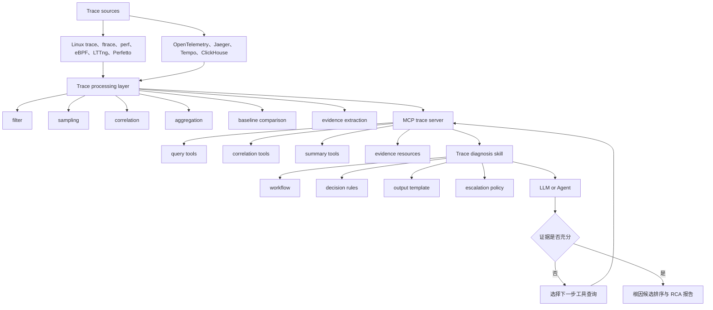
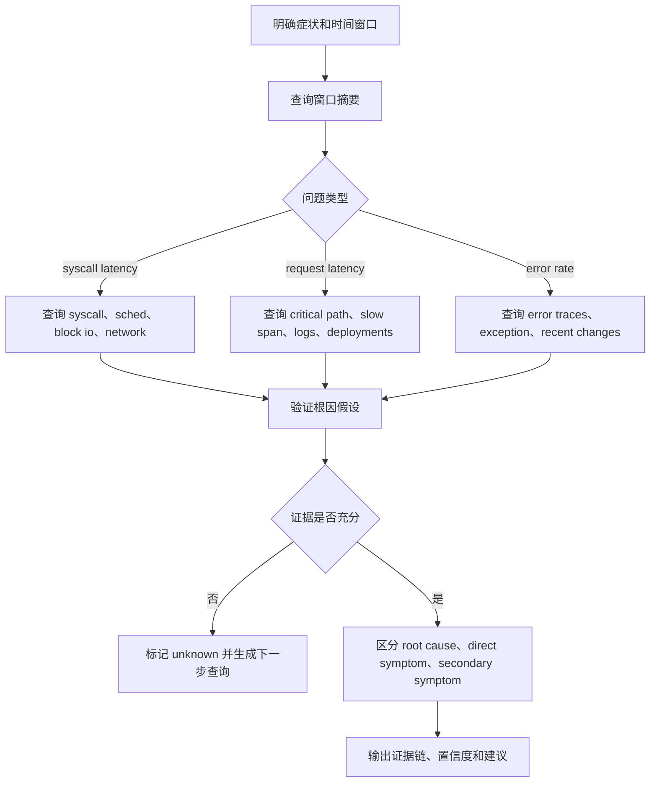
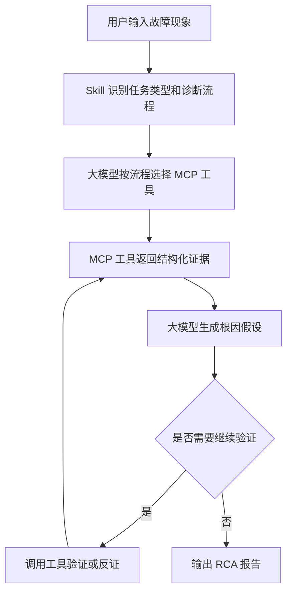

# 面向 Trace 数据的 Skill + MCP 大模型维测分析方案

## 1. 主题定位

本文关注一个具体问题：如何利用大模型分析大量 trace 数据，辅助完成维测场景中的问题定位、根因分析和排障建议。

这里的 trace 包括两类：

- 系统级 trace：Linux trace、ftrace、perf、eBPF、LTTng、Perfetto 事件流，每条记录通常是一个内核或用户态事件。
- 分布式 trace：OpenTelemetry、Jaeger、Tempo 等系统中的 trace/span，通常用于描述一次请求跨服务的调用链。

核心观点：

> 大模型不宜直接计算海量 trace 原始数据。较可靠的架构是：trace 后端负责采集、过滤、关联、聚合和统计；MCP 封装查询与分析工具；Skill 固化诊断流程；大模型负责诊断编排、假设生成、证据解释和报告输出。

## 2. 直接输入原始 Trace 的限制

### 2.1 数据量太大

Linux trace 或分布式 trace 都可能在短时间内产生大量事件。一次故障窗口内可能包含：

- 数十万到数千万条内核事件。
- 上千条请求 trace。
- 多个服务、主机、容器、线程、fd、socket、block device 的关联关系。

直接输入大模型会遇到上下文窗口、成本和延迟问题。

### 2.2 原始事件缺少语义

Linux trace 常见字段是：

```text
timestamp, cpu, pid, tid, comm, event_type, fields
```

单条事件通常只能说明事件事实，不能直接说明故障成因。例如：

```text
sys_enter_read
block_rq_issue
sched_switch state=D
block_rq_complete latency=84ms
sys_exit_read
```

这些事件需要按线程、fd、block device、时间窗口和调用关系串成事件链后，才适合交给大模型解释。

### 2.3 大模型不擅长稳定计算

trace 分析需要大量确定性计算：

- enter/exit 事件配对。
- syscall duration 计算。
- P95/P99 延迟聚合。
- slow span 排序。
- block IO issue/complete 关联。
- sched wakeup/switch 关联。
- 时间窗口与基线对比。

这些工作应由程序、查询引擎或观测平台完成，而不是让大模型凭文本自行推断。

### 2.4 可能把症状识别为根因

如果缺少拓扑、时间线和反证机制，大模型可能做出过度解释：

- 看到某服务错误多，就判断它是根因。
- 看到某线程阻塞后，忽略它可能是在等待下游 IO。
- 看到接口超时，就忽略发布、配置、连接池、磁盘或网络事件。

所以 trace 分析需要先构建证据链，再让模型做解释。

## 3. 总体架构



分工原则：

| 层次 | 负责内容 | 不负责内容 |
| --- | --- | --- |
| Trace 后端 | 采集、过滤、聚合、统计、索引 | 自然语言诊断 |
| MCP | 暴露可控工具和资源 | 复杂业务判断 |
| Skill | 固化排障流程和输出规范 | 读取海量原始数据 |
| 大模型 | 编排、解释、假设、报告 | 稳定计算和全量扫描 |

## 4. Trace 数据处理方式

### 4.1 系统级 Linux Trace

Linux trace 更像事件流，需要先进行事件关联。

常用关联键：

- `pid` / `tid`
- `comm`
- `cpu`
- `cgroup` / `container_id`
- `fd`
- `socket tuple`
- `inode`
- `block device`
- `sector`
- `lock address`
- `syscall enter/exit`
- `timestamp window`

典型事件链：

```text
sys_enter_read
  -> block_rq_issue
  -> sched_switch state=D
  -> block_rq_complete latency=84ms
  -> sys_exit_read
```

适合先生成以下摘要：

- 慢 syscall Top N。
- 线程阻塞时间 Top N。
- block IO latency Top N。
- 网络重传 Top N。
- run queue latency Top N。
- 同一 cgroup/container 内异常事件聚合。
- 同一 fd/socket/inode 的相关事件链。

### 4.2 分布式 Trace

分布式 trace 通常已经有 trace/span 结构，但仍需要压缩。

建议保留：

- root span。
- critical path。
- error span。
- slow span。
- retry/timeout span。
- 关键属性：service、operation、duration、status、peer、db statement 摘要、http status、exception。
- 与日志、指标、发布事件的关联信息。

适合生成：

```text
critical path:
api-gateway /orders 3520ms
 -> order-service create_order 3480ms
   -> payment-service charge 3200ms timeout
     -> mysql update_payment 2900ms lock_wait_timeout
```

### 4.3 采样与过滤

大规模 trace 需要在采集和管道层控制体量：

- 保留 error trace。
- 保留 slow trace。
- 丢弃健康检查和低价值成功请求。
- 对关键服务提高采样率。
- 对普通成功请求低采样。
- 使用 tail sampling 按请求结果、延迟、状态码决定是否保留。

OpenTelemetry Collector 的 processor、tail sampling、filter、transform 等能力可以承担这类工作。

### 4.4 证据化输出

给大模型的输入应该是证据摘要，而不是原始事件流：

```json
{
  "symptom": "java read syscall latency increased",
  "time_window": "10:00:00-10:05:00",
  "critical_event_chain": [
    "sys_enter_read fd=12",
    "block_rq_issue dev=sda",
    "sched_switch state=D",
    "block_rq_complete latency=84ms",
    "sys_exit_read duration=91ms"
  ],
  "correlation_features": {
    "syscall_duration_ms": 91,
    "block_io_duration_ms": 84,
    "cpu_run_queue_wait_ms": 1,
    "network_retransmit_count": 0
  },
  "candidate_relations": [
    {
      "relation": "read syscall latency explained by block io latency",
      "strength": "strong",
      "evidence": ["block io covers 84ms of 91ms syscall duration"]
    }
  ]
}
```

## 5. MCP 工具设计

### 5.1 MCP 的作用

MCP 适合把 trace 系统封装为大模型可调用的工具层。它解决的是：

- 大模型如何访问 trace 后端。
- 如何限制查询范围和权限。
- 如何返回结构化结果。
- 如何避免模型直接接触海量原始数据。

MCP 工具应尽量面向诊断任务，而不是只提供一个无限制的通用查询接口。

### 5.2 推荐工具清单

#### 通用查询工具

```text
list_trace_sources()
get_time_range_summary(time_range, filters)
search_trace_events(time_range, filters, limit)
get_trace_context(trace_id)
```

#### Linux Trace 工具

```text
find_slow_syscalls(time_range, process?, threshold_ms?)
get_thread_timeline(pid, tid, time_range)
find_sched_wait(time_range, pid?, tid?, threshold_ms?)
find_block_io_latency(time_range, device?, threshold_ms?)
find_network_retransmits(time_range, process?)
correlate_syscall_with_block_io(pid, tid, syscall, time_range)
correlate_syscall_with_sched_wait(pid, tid, syscall, time_range)
build_event_chain(pid, tid, start_ts, end_ts)
```

#### 分布式 Trace 工具

```text
find_slow_traces(service, time_range, threshold_ms?)
find_error_traces(service, time_range)
get_critical_path(trace_id)
find_abnormal_spans(trace_id)
compare_span_latency(service, operation, current_window, baseline_window)
correlate_trace_with_logs(trace_id)
correlate_trace_with_deployments(service, time_range)
```

#### RCA 辅助工具

```text
summarize_incident_trace(time_range, symptom)
rank_root_cause_candidates(evidence_set)
find_similar_incidents(symptom, evidence)
get_runbook(topic)
generate_next_queries(current_hypothesis)
```

### 5.3 工具返回格式

每个 MCP 工具返回结果应包含：

- 查询参数。
- 结果摘要。
- 关键证据。
- 置信度或规则评分。
- 数据截断说明。
- 下一步建议查询。

示例：

```json
{
  "tool": "correlate_syscall_with_block_io",
  "query": {
    "pid": 5678,
    "tid": 5678,
    "syscall": "read",
    "time_range": "10:00:00-10:00:01"
  },
  "summary": {
    "syscall_duration_ms": 91,
    "block_io_duration_ms": 84,
    "thread_state": "D",
    "correlation": "strong"
  },
  "evidence": [
    {
      "ts": "10:00:00.004",
      "event": "sys_enter_read",
      "fd": 12
    },
    {
      "ts": "10:00:00.006",
      "event": "block_rq_issue",
      "dev": "sda"
    },
    {
      "ts": "10:00:00.090",
      "event": "block_rq_complete",
      "latency_ms": 84
    }
  ],
  "next_queries": [
    "find_block_io_latency(time_range='09:55-10:05', device='sda')",
    "find_similar_incidents(symptom='block_io_latency')"
  ]
}
```

### 5.4 工具安全边界

MCP trace 工具需要限制：

- 查询时间窗口上限。
- 返回原始事件数量上限。
- 敏感字段脱敏。
- 按服务、主机、环境、租户做权限控制。
- 高风险操作只读化。
- 所有查询留审计日志。

不宜向大模型暴露无限制的 `query_raw_trace(sql)`。

## 6. Skill 设计

### 6.1 Skill 的作用

Skill 适合封装“如何用这些 MCP 工具完成一次诊断”的方法。它不是数据接口，而是工作方法。

一个 trace 诊断 Skill 应包含：

- 触发条件：用户描述延迟、错误率、线程阻塞、IO 抖动、请求超时等问题。
- 输入要求：症状、时间窗口、服务、主机、pid/tid、trace_id。
- 工具使用顺序。
- 证据判断规则。
- 反证步骤。
- 输出模板。
- 人工接管条件。

### 6.2 Skill 工作流示例



```text
1. 明确症状和时间窗口。
2. 查询窗口摘要，确认异常对象和规模。
3. 根据问题类型选择路径：
   - syscall 慢：查 syscall -> sched -> block io -> network。
   - 请求慢：查 critical path -> slow span -> logs -> deployments。
   - 错误率升高：查 error traces -> exception -> recent changes。
4. 对每个根因假设调用工具验证。
5. 区分 root cause、direct symptom、secondary symptom。
6. 输出证据链、置信度、下一步查询和修复建议。
7. 若证据不足，明确标记 unknown，不强行给结论。
```

### 6.3 判断规则示例

#### Linux Trace

- 如果 syscall duration 大部分被 block IO latency 覆盖，且线程处于 D state，则优先怀疑磁盘或文件系统路径。
- 如果 syscall duration 高，但 block IO 正常，run queue wait 高，则优先怀疑 CPU 调度或负载。
- 如果请求延迟升高同时出现 TCP retransmit、RTO、连接重建，则优先怀疑网络。
- 如果异常开始时间紧邻部署或配置变更，必须把 change event 纳入根因候选。

#### 分布式 Trace

- 如果上游 span 延迟主要由下游 span 覆盖，不应把上游服务直接判为根因。
- 如果多个上游同时受影响，优先检查共同下游依赖。
- 如果 error span 发生在重试之后，需要区分初始错误和最终失败。
- 如果 trace 中没有异常 span，但用户体验变差，应检查客户端、队列、缓存、采样缺失或异步链路。

### 6.4 输出模板

```markdown
## Diagnosis Summary

- Symptom:
- Time window:
- Affected services/processes:
- Confidence:

## Root Cause Candidates

1. Candidate:
   - Confidence:
   - Evidence:
   - Counter evidence:
   - Next verification:

## Event / Span Chain

...

## Symptoms vs Root Cause

- Root cause:
- Direct symptoms:
- Secondary symptoms:
- Unknowns:

## Recommended Actions

- Immediate:
- Verification:
- Prevention:
```

## 7. Skill + MCP 协同模式

### 7.1 大模型的工作方式



### 7.2 示例：Linux read 慢

用户：

```text
java 进程请求变慢，怀疑是系统层问题，请分析 trace。
```

执行：

```text
1. find_slow_syscalls(process="java", time_range="10:00-10:05")
2. get_thread_timeline(pid=5678, tid=5678, time_range="10:00:00-10:00:01")
3. correlate_syscall_with_block_io(pid=5678, tid=5678, syscall="read")
4. correlate_syscall_with_sched_wait(pid=5678, tid=5678, syscall="read")
5. find_block_io_latency(device="sda", time_range="09:55-10:05")
```

输出结论：

```text
read syscall 91ms，其中 84ms 被 block IO 覆盖，线程处于 D state，CPU run queue wait 只有 1ms。
磁盘 IO 或文件系统路径是优先级更高的根因候选，CPU 调度问题的证据不足。
```

### 7.3 示例：微服务请求超时

执行：

```text
1. find_slow_traces(service="order-service", time_range="10:00-10:10")
2. get_critical_path(trace_id="...")
3. find_abnormal_spans(trace_id="...")
4. correlate_trace_with_logs(trace_id="...")
5. correlate_trace_with_deployments(service="payment-service", time_range="09:30-10:10")
```

输出结论：

```text
order-service 延迟主要由 payment-service charge span 覆盖；payment-service 又等待 mysql update_payment。
故障开始前 8 分钟 payment-service 发布 v1.8.2，日志出现 lock wait timeout。
优先根因候选：payment-service 新版本引入数据库锁等待问题。
```

## 8. 工程落地建议

### 8.1 MVP

初始阶段采用只读诊断，不执行自动修复：

- 选一个故障类型，例如接口延迟升高或 syscall 慢。
- 固定 5-10 个 MCP 工具。
- 用 Skill 固化诊断路径。
- 输出结构化 RCA 报告。
- 由 SRE 人工评分。

### 8.2 工程化

- 接入 OpenTelemetry Collector、Jaeger、Tempo、ClickHouse、eBPF 或 Perfetto 等已有系统。
- 增加 baseline comparison。
- 增加相似历史事故检索。
- 增加工具调用审计。
- 对 prompt、Skill、工具 schema 做版本管理。

### 8.3 生产化

- 设置置信度阈值。
- 低置信只给候选，不给确定结论。
- 高风险动作必须人工审批。
- 每次人工确认的根因沉淀为案例和评测集。
- 定期评估 Top-k RCA、证据准确率和人工接受率。

## 9. 评价指标

### 9.1 定位效果

- Top-1 RCA Accuracy。
- Top-k RCA Recall。
- Evidence Precision。
- Symptom-vs-Cause Accuracy。
- Time to Diagnosis。
- Human Acceptance Rate。

### 9.2 工具效果

- 工具调用成功率。
- 查询平均延迟。
- 返回结果压缩比。
- 截断率。
- 无效查询率。
- 重复查询率。

### 9.3 安全效果

- 敏感字段泄露率。
- 越权查询拦截率。
- 高风险动作误触发率。
- 低置信人工接管率。

## 10. 风险与反模式

### 10.1 反模式：大模型直接读取原始 trace

问题：

- 成本高。
- 延迟高。
- 不可重复。
- 可能遗漏关键事件。
- 难以审计。

### 10.2 反模式：只提供通用 SQL 工具

问题：

- 查询空间太大。
- 权限难控。
- 大模型可能生成低效查询。
- 结果缺少诊断语义。

更合理的方式是提供面向诊断任务的工具。

### 10.3 反模式：没有反证流程

定位系统必须要求模型回答：

- 为什么不是 CPU？
- 为什么不是网络？
- 为什么不是上游流量？
- 是否存在共同下游？
- 结论是否被具体 trace/log/metric/change 支持？

### 10.4 反模式：自动修复过早

在没有足够评测和审批机制前，不应让大模型直接执行：

- 回滚。
- 重启。
- 扩容。
- 切流。
- 删除数据。
- 修改配置。

## 11. 参考工具与资料

### 11.1 Trace 与观测系统

- OpenTelemetry Concepts: https://opentelemetry.io/docs/concepts/
- OpenTelemetry Sampling: https://opentelemetry.io/docs/concepts/sampling/
- OpenTelemetry Collector Processors: https://opentelemetry.io/docs/collector/components/processor/
- Jaeger: https://www.jaegertracing.io/
- Grafana Tempo: https://grafana.com/oss/tempo/
- ClickHouse: https://clickhouse.com/
- Perfetto Linux tracing: https://perfetto.dev/docs/getting-started/ftrace
- bpftrace: https://github.com/bpftrace/bpftrace
- LTTng: https://lttng.org/docs/

### 11.2 MCP 与 Agent 工具化

- Model Context Protocol: https://modelcontextprotocol.io/
- MCP Tools: https://modelcontextprotocol.io/docs/concepts/tools
- MCP Resources: https://modelcontextprotocol.io/docs/concepts/resources
- MCP Prompts: https://modelcontextprotocol.io/docs/concepts/prompts

### 11.3 RCA 与大模型维测分析

- RCACopilot: https://www.microsoft.com/en-us/research/publication/automatic-root-cause-analysis-via-large-language-models-for-cloud-incidents/
- Automated Root Causing with GPT-4: https://www.microsoft.com/en-us/research/publication/automated-root-causing-of-cloud-incidents-using-in-context-learning-with-gpt-4/
- OpenRCA: https://github.com/microsoft/OpenRCA
- o11y-bench: https://o11ybench.ai/

## 12. 结论

面向 trace 数据的大模型维测分析，较可靠的工程路线是：使用既有 trace 系统和确定性程序完成采集、过滤、关联、聚合与统计；使用 MCP 将这些能力包装成受控工具；使用 Skill 固化诊断流程和输出规范；由大模型在证据摘要之上完成假设生成、工具编排、反证检查和 RCA 报告。
