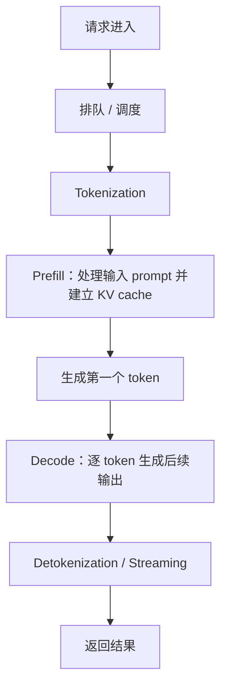
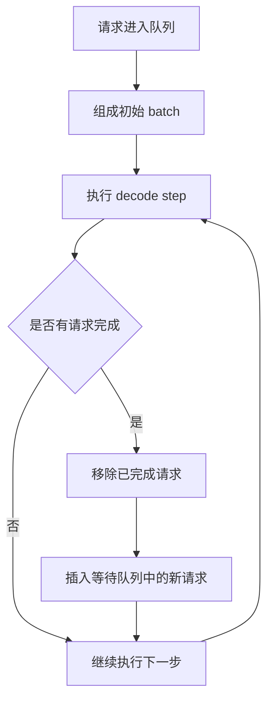
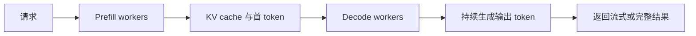
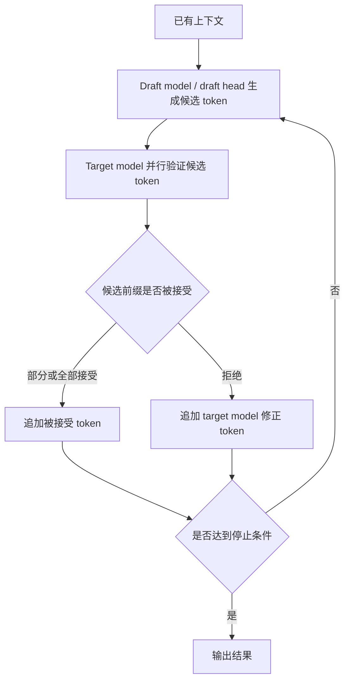
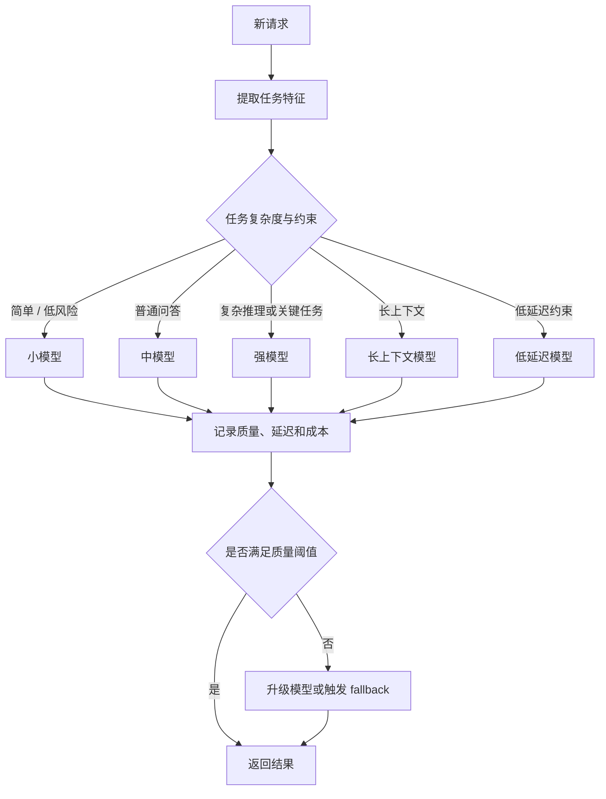
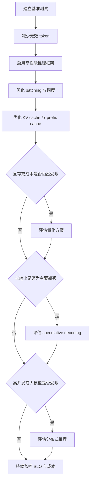

# 大模型推理性能系统调研

归档日期：2026-06-11

## 1. 主题定位

本文关注大模型推理性能，即模型在部署和服务阶段处理请求、生成 token、满足延迟和吞吐目标的能力。

推理性能不是单一指标。它至少包括：

- 用户看到第一个 token 的等待时间。
- 模型每秒能生成多少 token。
- 一个请求从开始到完成需要多久。
- 系统在延迟约束下每秒能服务多少请求。
- 单位成本能生成多少有效 token 或完成多少任务。
- 在长上下文、多并发、工具调用、RAG、Agent 场景下是否稳定。

一个实用定义：

> 推理性能是在给定模型、硬件、服务框架、请求分布和质量约束下，以尽可能低的延迟和成本稳定完成推理请求的能力。

## 2. 基本指标

### 2.1 核心指标

| 指标 | 含义 | 常见单位 | 主要影响因素 |
|---|---|---|---|
| TTFT | Time To First Token，首 token 延迟 | ms / s | 输入长度、prefill、排队、网络、缓存 |
| TPOT | Time Per Output Token，每个输出 token 平均耗时 | ms/token | decode 速度、batch、KV cache、硬件 |
| Output speed | 输出速度 | tokens/s | decode 吞吐、采样、算子、显存带宽 |
| End-to-end latency | 请求总耗时 | ms / s | TTFT + 输出长度 * TPOT + 网络/工具开销 |
| Throughput | 系统吞吐 | tokens/s、requests/s | batch、并发、GPU 利用率、调度 |
| Goodput | 满足 SLO 的有效吞吐 | requests/s under SLO | 尾延迟、调度、资源隔离 |
| Cost efficiency | 单位成本产出 | tokens/$、tasks/$ | 模型大小、硬件、量化、缓存、路由 |

### 2.2 为什么只看 tokens/s 不够

`tokens/s` 主要描述输出生成速度，但交互质量还受首 token 延迟和总耗时影响。

示例：

```text
模型 A：TTFT = 5s，输出速度 = 120 tokens/s
模型 B：TTFT = 0.5s，输出速度 = 60 tokens/s
```

如果回答只有 50 token，模型 B 可能具有更低的用户可感知延迟；如果回答有 3000 token，模型 A 可能具有更低的总完成时间。

所以推理性能需要按场景看：

- 短问答：TTFT 是关键指标。
- 长文生成：tokens/s 和总延迟是关键指标。
- 高并发服务：throughput 和 tail latency 是关键指标。
- Agent：工具调用轮次、上下文增长和状态压缩是关键因素。
- RAG：检索、rerank、文档拼接和 prefill 都可能成为瓶颈。

## 3. 推理过程拆解：prefill 与 decode

大模型自回归生成通常分成两个阶段。



### 3.1 Prefill 阶段

Prefill 处理输入 prompt 中的所有 token。

特点：

- 可以并行处理输入序列。
- 输入越长，prefill 越慢。
- 更偏 compute-bound，较容易提升 GPU 计算利用率。
- 直接影响 TTFT。
- RAG、长系统提示、长对话历史会显著增加 prefill 成本。

Sarathi-Serve 论文将 LLM 请求明确拆成 prefill 和 decode 两阶段，并指出 prefill 处理整个输入 prompt、产生第一个输出 token，decode 再逐 token 生成其余输出。[Sarathi-Serve](https://arxiv.org/abs/2403.02310)

### 3.2 Decode 阶段

Decode 每次生成一个新 token。

特点：

- 自回归串行，无法一次性生成完整答案。
- 每生成一个 token 都要读取 KV cache。
- 单请求 decode 往往 GPU 利用率低。
- 多请求 batching 对 decode 吞吐具有重要影响。
- 输出越长，总耗时越长。

Sarathi 论文指出，decode 每次只处理每个请求的一个 token，低 batch 时 GPU 利用率较低，因此调度和 batching 是提升吞吐的关键。[SARATHI](https://arxiv.org/abs/2308.16369)

### 3.3 两阶段的核心矛盾

Prefill 和 decode 的资源特征不同：

| 阶段 | 目标 | 典型瓶颈 | 优化重点 |
|---|---|---|---|
| Prefill | 快速处理输入并尽快生成首 token | 长 prompt、排队、attention 计算 | prompt 压缩、prefix cache、chunked prefill、并行 |
| Decode | 持续输出 token | KV cache 读写、显存带宽、低 GPU 利用率 | batching、KV cache 管理、投机解码、量化 |

如果将 prefill 和 decode 直接混合到同一个 batch 中，可能出现互相干扰：

- 新请求 prefill 太重，拖慢已有请求 decode。
- 已有请求 decode 优先级太高，新请求 TTFT 变差。
- batch 越大吞吐越高，但单请求延迟和尾延迟可能变差。

DistServe 将 prefill 和 decode 分离到不同 GPU 上，目标是在 TTFT 与 TPOT 约束下提升 goodput。[DistServe](https://arxiv.org/abs/2401.09670)

## 4. 影响推理速度的主要因素

### 4.1 模型规模与结构

影响因素：

- 参数量：模型越大，矩阵乘法和权重读取成本越高。
- 层数和 hidden size：影响每 token 计算量。
- attention 结构：MHA、MQA、GQA、MLA 等会影响 KV cache 大小和读取成本。
- MoE：每个 token 只激活部分专家，但引入路由和通信开销。
- 上下文长度：attention 和 KV cache 都随序列增长。
- reasoning tokens：推理模型可能在最终答案前产生额外内部推理 token。

经验判断：

- 小模型通常 TTFT 和 TPOT 更低，但能力可能不足。
- 大模型质量高，但成本、延迟和显存压力更大。
- MoE 模型可能有较高参数规模，但每 token 激活参数较少；实际速度取决于专家路由、并行和通信。

### 4.2 输入与输出 token 数

输入 token 主要影响 prefill 和 TTFT。

输出 token 主要影响 decode 和总延迟。

```text
总延迟 ≈ 排队时间 + prefill 时间 + 输出 token 数 * TPOT + 网络/工具开销
```

因此，同一个模型在不同请求上的速度差异可能较大：

- 短 prompt + 短输出：网络和 TTFT 占比高。
- 长 prompt + 短输出：prefill 占比高。
- 短 prompt + 长输出：decode 占比高。
- 长 prompt + 长输出：prefill 和 decode 都重。

### 4.3 KV cache

Transformer decode 阶段会缓存历史 token 的 key 和 value，避免每次都重新计算前文。

KV cache 的价值：

- 显著降低自回归生成的重复计算。
- 让 decode 每步只需要处理新增 token。

KV cache 的代价：

- 随序列长度线性增长。
- 随 batch size 和并发请求数增长。
- 占用大量 GPU 显存。
- decode 阶段频繁读取 KV cache，容易受显存带宽限制。

vLLM / PagedAttention 论文指出，高吞吐 LLM serving 需要同时 batch 足够多请求，但 KV cache 动态增长、碎片和重复存储会限制 batch size；PagedAttention 借鉴操作系统分页思想管理 KV cache，从而减少浪费。[vLLM / PagedAttention](https://arxiv.org/abs/2309.06180)

### 4.4 Batch 与并发

Batching 是提升吞吐的核心手段。

常见形态：

- 静态 batching：攒一批请求一起跑。
- dynamic batching：按时间窗口动态组 batch。
- continuous batching：请求完成后立即插入新请求，不必等整个 batch 结束。
- decode-maximal batching：尽量让 decode 请求填满 batch。
- chunked prefill：将长 prefill 拆分为多个块，避免长 prefill 阻塞 decode。

权衡：

- batch 大，吞吐更高。
- batch 大，排队和单请求延迟可能增加。
- 长短请求混合时，调度不佳会造成 tail latency。

Orca 是较早系统化讨论 transformer 生成服务 continuous batching 的工作。[Orca](https://www.usenix.org/conference/osdi22/presentation/yu)

### 4.5 推理框架和内核

同一模型和同一硬件条件下，不同推理框架的速度可能存在显著差异。

常见框架 / 引擎：

- vLLM：PagedAttention、continuous batching、prefix caching、speculative decoding、quantization 等。
- TensorRT-LLM：NVIDIA GPU 上的 engine 构建、in-flight batching、paged KV cache、FP8/INT8/INT4 等。
- SGLang：面向结构化生成和多调用程序，强调 RadixAttention、结构化输出和 KV cache 复用。
- Hugging Face TGI：生产化文本生成服务，支持 streaming、continuous batching、量化等。
- llama.cpp：CPU / 本地 / 边缘部署常用，支持 GGUF 和多种量化。

vLLM 文档列出自动 prefix caching、speculative decoding、quantized KV cache、benchmarking、production metrics 等推理服务功能。[vLLM docs](https://docs.vllm.ai/en/latest/)

TensorRT-LLM 文档定位为 NVIDIA GPU 上优化和服务 LLM 的工具链。[TensorRT-LLM docs](https://nvidia.github.io/TensorRT-LLM/)

Hugging Face TGI 是面向文本生成推理的服务框架。[Hugging Face TGI docs](https://huggingface.co/docs/text-generation-inference/index)

### 4.6 硬件

关键硬件因素：

- GPU 算力：影响矩阵乘法和 prefill。
- 显存容量：决定能放多大模型、多大 batch、多长 KV cache。
- 显存带宽：decode 阶段经常受显存带宽影响。
- GPU 间互联：多卡 tensor parallel、pipeline parallel、expert parallel 依赖 NVLink / InfiniBand 等。
- CPU 与主存：tokenizer、调度、数据预处理、模型加载可能受影响。
- 网络：API 跨 region、工具调用、RAG 检索会增加端到端延迟。

## 5. 推理性能优化方法谱系

### 5.1 请求侧优化：先减少不必要 token

这是成本较低、稳定性较高的优化层。

方法：

- 压缩系统提示词。
- 删除无关历史对话。
- RAG 只放最相关片段。
- 对工具返回结果做截断和摘要。
- 控制最大输出 token。
- 避免让模型输出无意义长解释。
- 使用结构化输出时精简 schema。
- 对重复前缀启用缓存。

适合解决：

- TTFT 高。
- 长上下文成本高。
- RAG prompt 过长。
- Agent 多轮后上下文膨胀。

风险：

- 压缩过度会损失必要信息。
- RAG top-k 太低可能降低召回。
- 输出限制过短可能影响任务完整性。

### 5.2 Prefix caching / prompt caching

许多请求共享相同前缀：

- 系统提示词。
- 工具说明。
- few-shot examples。
- 长文档前缀。
- 多轮对话中不变的历史部分。

Prefix caching 的思路是复用这些前缀对应的 KV cache，避免重复 prefill。

适合：

- 同一应用有固定 system prompt。
- 多轮对话。
- 多请求共享同一文档或同一模板。
- Agent 中重复使用工具说明。

局限：

- 请求前缀必须完全或可匹配地复用。
- 缓存管理会占显存或外部存储。
- 缓存命中率决定收益。

SGLang 的 RadixAttention 就是围绕多调用和共享前缀场景做 KV cache 复用。[SGLang](https://arxiv.org/abs/2312.07104)

### 5.3 Continuous batching

传统 batch 的问题是：一个 batch 中部分请求完成后，资源可能无法立即被新请求复用。



Continuous batching 允许：

- 请求完成后立即移出。
- 新请求动态插入。
- decode 阶段保持较高 batch size。
- 提升 GPU 利用率。

收益：

- 提升吞吐。
- 改善高并发 serving。
- 对 decode 阶段尤其重要。

风险：

- 调度复杂度上升。
- tail latency 需要单独控制。
- 长短请求混合时可能出现不公平。

### 5.4 Chunked prefill

长 prompt 的 prefill 可能阻塞正在 decode 的请求。

Chunked prefill 将一个长 prefill 拆分为多个块，与 decode 请求交错执行。

收益：

- 降低长 prompt 对 decode 的干扰。
- 改善 TTFT / TPOT 的折中。
- 更容易构造稳定 batch。

Sarathi 和 Sarathi-Serve 都把 chunked prefill 作为核心调度手段，用来缓和 throughput-latency tradeoff。[SARATHI](https://arxiv.org/abs/2308.16369), [Sarathi-Serve](https://arxiv.org/abs/2403.02310)

### 5.5 分离 prefill 与 decode

Prefill 和 decode 的资源需求差异较大：

- Prefill 更偏 compute-bound。
- Decode 更偏 memory-bandwidth-bound 和 KV cache 访问。

因此可以将两者部署到不同资源池：



收益：

- 减少 prefill / decode 互相干扰。
- 分别优化 TTFT 和 TPOT。
- 针对不同阶段选择不同并行策略。

代价：

- KV cache 需要跨设备传输。
- 系统复杂度上升。
- worker placement 需要考虑网络带宽。

DistServe 的核心就是 disaggregated prefill / decode serving，并以 TTFT 和 TPOT SLO 下的 goodput 作为优化目标。[DistServe](https://arxiv.org/abs/2401.09670)

### 5.6 KV cache 管理与压缩

优化方向：

- PagedAttention：减少 KV cache 碎片和预留浪费。
- KV block sharing：共享相同前缀或 beam search 分支。
- KV offloading：显存不足时把部分 cache 放到 CPU / 远端存储。
- KV quantization：降低 cache 精度，减少显存占用和带宽压力。
- KV eviction / sliding window：长上下文场景下淘汰不必要 cache。

适合：

- 长上下文。
- 高并发。
- beam search / parallel sampling。
- 多轮对话。
- RAG / Agent 大量上下文。

风险：

- KV offloading 可能增加延迟。
- KV quantization 可能损害长上下文精度。
- eviction 策略不当会影响回答质量。

### 5.7 算子与内核优化

核心思路是减少 GPU 内存读写、提升并行度、融合操作。

代表方法：

- FlashAttention：用 IO-aware tiling 减少 HBM 与 SRAM 间读写。
- fused kernels：把多个小算子融合，减少 kernel launch 和中间张量读写。
- CUDA Graphs：减少重复执行图的调度开销。
- optimized attention kernels：针对 paged KV、GQA、MQA、FP8 等优化。
- tensor parallel kernels：优化多卡切分和通信。

FlashAttention 论文指出，标准 attention 在长序列下慢且耗内存，FlashAttention 通过 IO-aware 精确 attention 降低内存读写。[FlashAttention](https://arxiv.org/abs/2205.14135)

### 5.8 量化

量化把权重、激活或 KV cache 从 FP16/BF16 降到 INT8、INT4、FP8 等低精度表示。

常见类型：

| 类型 | 例子 | 主要收益 |
|---|---|---|
| weight-only quantization | GPTQ、AWQ、INT4 | 降低模型权重显存，提升带宽效率 |
| weight + activation quantization | SmoothQuant W8A8 | 提升矩阵乘法效率，改善硬件适配性 |
| KV cache quantization | INT8 / INT4 KV cache | 降低长上下文和高并发显存压力 |
| native low-bit model | 低比特训练模型 | 需要模型训练阶段配合 |

GPTQ 是经典 one-shot 权重量化方法，面向 GPT/OPT 等生成模型，目标是在低 bit 权重下保持精度并降低推理成本。[GPTQ](https://arxiv.org/abs/2210.17323)

SmoothQuant 通过迁移 activation outlier 的量化难点，实现 W8A8 量化。[SmoothQuant](https://arxiv.org/abs/2211.10438)

AWQ 通过 activation-aware 的方式保护少量重要权重通道，常用于 4-bit 权重量化。[AWQ](https://arxiv.org/abs/2306.00978)

收益：

- 显存占用下降。
- 更容易增大 batch。
- 部署成本降低。
- 在支持低精度算子的硬件上可提升速度。

风险：

- 质量可能下降。
- 不同任务对量化敏感度不同。
- 低 bit 速度收益依赖硬件和 kernel。
- 部分量化只省显存，不一定明显提升端到端延迟。

### 5.9 投机解码

自回归 decode 的核心瓶颈是“一步生成一个 token”。

Speculative decoding 的思路：



如果 draft 模型接受率较高，目标模型一次 forward 可以确认多个 token，从而减少目标模型调用次数。

Leviathan 等人的 speculative decoding 论文提出，在不改变目标模型输出分布的前提下，用近似模型并行提出多个 token，再由大模型验证，可加速自回归推理。[Speculative Decoding](https://arxiv.org/abs/2211.17192)

适合：

- decode-bound 场景。
- 输出较长的请求。
- draft 模型便宜且命中率高。
- 主模型规模较大。

局限：

- draft 模型质量太差时收益低。
- 短输出场景收益有限。
- 系统实现复杂。
- 需要平衡 draft 长度、接受率和验证成本。

变体：

- 小 draft model。
- n-gram speculation。
- Medusa / 多头预测。
- EAGLE / feature-level draft。
- tree-based speculative inference。

### 5.10 并行与分布式推理

常见并行方式：

| 方式 | 含义 | 适合场景 | 代价 |
|---|---|---|---|
| tensor parallel | 将矩阵乘法切分到多张 GPU | 单卡无法容纳或需要更高算力 | 高频通信 |
| pipeline parallel | 按层切分到多张 GPU | 超大模型 | pipeline bubble |
| data parallel | 多副本服务不同请求 | 高并发 | 需要负载均衡 |
| expert parallel | MoE 专家分布到多卡 | MoE 模型 | all-to-all 通信 |
| context parallel | 长上下文切分 | 超长上下文 | attention 通信复杂 |

优化方向：

- 减少跨卡通信。
- 选择合适 parallelism。
- 根据 prefill / decode 阶段分别配置。
- 使用高带宽互联。
- 做请求路由和负载均衡。

### 5.11 模型路由和降级

不是所有请求都需要最大模型。

可按任务路由：

- 简单分类、改写、提取：小模型。
- 普通问答：中模型。
- 复杂推理、代码、关键决策：强模型。
- 长上下文：长上下文模型。
- 低延迟交互：低延迟模型。



收益：

- 降低平均延迟。
- 降低成本。
- 释放强模型资源。
- 高峰期可降级。

风险：

- 路由错误会损害质量。
- 需要在线质量监控。
- 需要 fallback 和重试策略。

## 6. 优化方法与目标指标映射

| 目标 | 优先方法 |
|---|---|
| 降低 TTFT | 减少输入 token、prefix cache、chunked prefill、prefill/decode 分离、靠近部署 region |
| 降低 TPOT | batching、KV cache 优化、量化、优化 attention kernel、投机解码 |
| 提高 tokens/s | 高性能推理框架、continuous batching、量化、speculative decoding、更强硬件 |
| 提高吞吐 | continuous batching、PagedAttention、增加 batch、data parallel、多副本 |
| 降低显存 | 量化、KV cache 分页、KV cache 量化、offloading、减少上下文 |
| 降低成本 | 小模型、模型路由、缓存、量化、减少 output tokens |
| 降低尾延迟 | SLO-aware scheduler、chunked prefill、请求隔离、优先级队列 |
| 支持长上下文 | FlashAttention、KV cache 优化、context parallel、RAG 压缩 |

## 7. 常见瓶颈诊断

### 7.1 TTFT 过高

可能原因：

- prompt 太长。
- RAG 放入过多文档。
- 请求排队。
- prefill 被 decode 或其它长 prefill 阻塞。
- prefix cache 命中率低。
- tokenizer / 网络 / 冷启动开销高。

优先动作：

- 统计 input tokens 分布。
- 拆分排队时间、prefill 时间、网络时间。
- 启用 prefix caching。
- 压缩 RAG 上下文。
- 使用 chunked prefill。
- 分离 prefill 和 decode。

### 7.2 输出 tokens/s 低

可能原因：

- batch 太小，GPU 利用率低。
- decode 受显存带宽限制。
- KV cache 太大或碎片严重。
- attention kernel 不适合当前模型结构。
- 采样策略复杂。
- 多卡通信成为瓶颈。

优先动作：

- 增大并发或 batch。
- 使用 continuous batching。
- 检查 GPU 利用率和显存带宽。
- 使用 vLLM / TensorRT-LLM / SGLang 等优化引擎。
- 尝试量化和 KV cache 优化。
- 对长输出尝试 speculative decoding。

### 7.3 吞吐较高但交互质量较差

可能原因：

- batch 过大导致排队。
- decode 优先导致新请求 TTFT 差。
- 长请求拖累短请求。
- 缺少优先级和 SLO-aware 调度。

优先动作：

- 同时监控 average latency 和 p95/p99 latency。
- 按请求长度分队列。
- 设置最大等待时间和最大 batch size。
- 使用 chunked prefill。
- 做优先级调度和多副本隔离。

### 7.4 显存占用快速增长

可能原因：

- 模型太大。
- batch 太大。
- 上下文太长。
- KV cache 未有效管理。
- 多轮 Agent / RAG 上下文无限增长。

优先动作：

- 模型权重量化。
- KV cache 量化或分页。
- 减少 max context 和 max output。
- 对历史上下文做摘要。
- 对工具结果做截断。
- 使用更小模型或模型路由。

## 8. 实践落地建议

### 8.1 建立基准测试

不要只跑一个 prompt。

至少构造四类请求：

- 短输入、短输出。
- 长输入、短输出。
- 短输入、长输出。
- 长输入、长输出。

记录：

- input tokens。
- output tokens。
- TTFT。
- TPOT。
- end-to-end latency。
- tokens/s。
- GPU utilization。
- GPU memory。
- p50 / p95 / p99 latency。
- requests/s under SLO。

### 8.2 分阶段优化

推荐顺序：

1. 先减少无效 token。
2. 再启用高性能推理框架。
3. 再做 batching 和调度优化。
4. 再做 KV cache 与 prefix cache。
5. 再尝试量化。
6. 长输出场景再考虑 speculative decoding。
7. 高并发和大模型场景再考虑分布式推理。



### 8.3 对 RAG / Agent 特别注意

RAG：

- 检索数量增加不一定提升结果质量。
- top-k、rerank、摘要压缩会直接影响 prefill。
- 引用证据要保留，噪声文档要删掉。

Agent：

- 每一步都会增加 token。
- 工具返回结果不应无上限写回上下文。
- 需要定期总结状态。
- 需要限制最大步骤数。
- 需要区分“给模型看的状态”和“给用户看的完整日志”。

## 9. 代表论文与资料

### 9.1 推理服务与调度

- vLLM / PagedAttention: [Efficient Memory Management for Large Language Model Serving with PagedAttention](https://arxiv.org/abs/2309.06180)
- Orca: [Orca: A Distributed Serving System for Transformer-Based Generative Models](https://www.usenix.org/conference/osdi22/presentation/yu)
- SARATHI: [Efficient LLM Inference by Piggybacking Decodes with Chunked Prefills](https://arxiv.org/abs/2308.16369)
- Sarathi-Serve: [Taming Throughput-Latency Tradeoff in LLM Inference with Sarathi-Serve](https://arxiv.org/abs/2403.02310)
- DistServe: [Disaggregating Prefill and Decoding for Goodput-optimized LLM Serving](https://arxiv.org/abs/2401.09670)
- SGLang: [Efficient Execution of Structured Language Model Programs](https://arxiv.org/abs/2312.07104)

### 9.2 Attention、KV cache 与内核

- FlashAttention: [Fast and Memory-Efficient Exact Attention with IO-Awareness](https://arxiv.org/abs/2205.14135)
- vLLM docs: [vLLM documentation](https://docs.vllm.ai/en/latest/)
- TensorRT-LLM docs: [TensorRT-LLM documentation](https://nvidia.github.io/TensorRT-LLM/)
- Hugging Face TGI docs: [Text Generation Inference](https://huggingface.co/docs/text-generation-inference/index)

### 9.3 量化

- GPTQ: [Accurate Post-Training Quantization for Generative Pre-trained Transformers](https://arxiv.org/abs/2210.17323)
- SmoothQuant: [Accurate and Efficient Post-Training Quantization for Large Language Models](https://arxiv.org/abs/2211.10438)
- AWQ: [Activation-aware Weight Quantization for LLM Compression and Acceleration](https://arxiv.org/abs/2306.00978)

### 9.4 投机解码

- Speculative Decoding: [Fast Inference from Transformers via Speculative Decoding](https://arxiv.org/abs/2211.17192)

## 10. 一句话总结

大模型推理性能的核心矛盾是：prefill 决定首 token 延迟，decode 决定持续生成速度，KV cache 和 batching 决定并发吞吐，调度策略决定尾延迟。优化时应先减少无效 token，再使用高性能 serving 引擎、continuous batching、prefix/KV cache、量化、投机解码和分布式调度逐层提升，避免仅依据单个 `tokens/s` 指标做结论。
