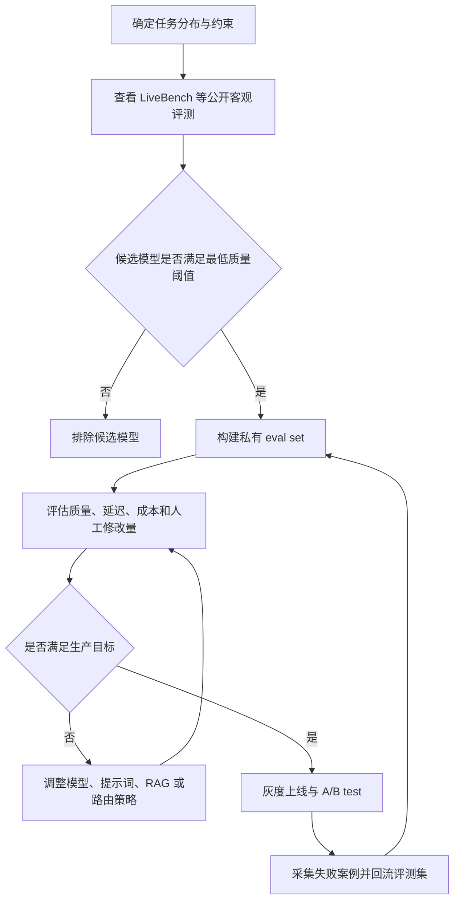

# 模型性能定义、差异指标与客观排行资料归档

归档日期：2026-06-11

## 1. 如何定义模型的性能

“模型性能”不应只等同于榜单第一名，也不应只看准确率。对大模型而言，性能更适合定义为：

> 在给定任务、输入分布、运行约束和风险边界下，模型稳定地产生有用、正确、可控输出的综合能力。

因此，模型性能至少包含五层含义。

### 1.1 任务能力

模型能不能解决问题本身。

典型维度包括：

- 通用知识与理解：事实问答、学科知识、常识理解、阅读理解。
- 推理能力：数学、逻辑、多步推理、科学问题、复杂规划。
- 代码能力：函数生成、调试、仓库级修改、测试修复、软件工程任务。
- 指令遵循：是否严格遵守格式、约束、角色、输出长度和多轮上下文。
- 多模态能力：图像、图表、视频、音频与文本的联合理解和生成。
- 工具 / Agent 能力：函数调用、浏览、检索、代码执行、桌面操作、长流程任务完成。

### 1.2 输出质量

模型回答是否满足任务质量要求。

常见评价包括：

- 正确性：答案是否事实正确、逻辑一致。
- 完整性：是否覆盖问题中的关键约束。
- 可解释性：是否能给出可信的中间理由、证据链或引用。
- 语言质量：表达清晰度、结构、风格、可读性。
- 任务贴合度：是否解决用户意图，避免无关或过泛的回答。

### 1.3 稳定性与可靠性

模型是否能持续可靠地工作。

常见指标包括：

- 鲁棒性：面对同义改写、噪声、长上下文、边界条件时性能是否稳定。
- 一致性：同一问题多次回答是否差异过大。
- 校准性：模型对“不确定”的表达是否与真实正确率匹配。
- 幻觉率：无依据生成事实、引用、代码接口或结论的频率。
- 拒答与安全边界：该拒绝时是否拒绝，不该拒绝时是否误拒。

### 1.4 工程性能

模型作为线上服务时是否可用、可扩展、可负担。

关键指标包括：

- 延迟：首 token 延迟、首答案 token 延迟、端到端响应时间。
- 吞吐：tokens/s、并发能力、批处理效率。
- 成本：输入 token、输出 token、缓存 token、工具调用、推理时长。
- 上下文窗口：最大上下文长度、长上下文有效利用率。
- 可用性：限流、失败率、区域可用性、provider 稳定性。
- 部署特性：是否支持流式输出、JSON mode、函数调用、缓存、批处理、微调、私有部署。

工程性能要把质量、价格、速度、延迟和上下文窗口放在同一个框架里看。线上选型时，端到端用户体验通常比硬件理论峰值更重要。

### 1.5 风险与治理表现

越是强模型，越需要衡量风险。

常见维度包括：

- 安全性：有害内容、越权指导、网络安全风险、隐私泄露风险。
- 偏见与公平性：对群体、语言、地域、文化的系统性偏差。
- 透明度：模型卡、训练数据说明、评测报告、已知限制。
- 可审计性：日志、引用、证据、可复现实验配置。
- 合规性：数据驻留、版权、许可证、行业监管要求。

综合评测框架提醒业界：语言模型评测不能只看 accuracy，而应同时看 calibration、robustness、fairness、bias、toxicity、efficiency 等多维指标。

## 2. 分析模型差异的指标体系

下面是一套较通用的模型差异分析框架。

### 2.1 能力指标

| 维度 | 代表问题 | 常见指标类别 |
|---|---|---|
| 通用知识 | 是否掌握广泛学科知识 | 学科选择题、事实问答、常识推理 |
| 高难推理 | 是否能处理专家级问题 | 数学、科学、逻辑、多步推理 |
| 代码生成 | 是否能写出可运行代码 | 函数生成、单元测试、代码执行 |
| 软件工程 | 是否能修复真实仓库问题 | issue 修复率、测试通过率、补丁质量 |
| 工具调用 | 是否能选择并正确调用函数 | 工具选择准确率、参数正确率、状态一致性 |
| 长上下文 | 是否能检索、综合长文档信息 | 长文档检索、摘要、跨段落推理 |
| 多模态 | 是否理解图像、图表、视觉推理 | 图像问答、图表理解、视觉推理 |
| 指令遵循 | 是否遵守复杂约束 | 格式遵循、约束遵循、多轮一致性 |
| 中文能力 | 是否适合中文知识和语境 | 中文知识、中文推理、中文表达 |

真实软件工程评测通常用 issue 修复率、测试通过率和任务完成率衡量模型/Agent 的仓库级能力。

工具调用评测通常关注模型是否能选择正确工具、生成正确参数，并在多轮调用中保持状态一致。

### 2.2 质量指标

| 指标 | 含义 | 适用场景 |
|---|---|---|
| Accuracy / Exact Match | 标准答案是否匹配 | 选择题、数学、事实问答 |
| Pass@k | k 次生成中是否至少一次通过 | 代码生成、测试驱动任务 |
| Win Rate | 与另一个模型相比被偏好的比例 | 开放式问答、写作、聊天 |
| Elo / Bradley-Terry 分 | 成对比较后的相对强度 | Arena 类榜单 |
| Human Preference | 人类偏好哪一个输出 | 主观质量、对话体验 |
| LLM-as-a-Judge | 用强模型按 rubric 打分 | 大规模开放式评测 |
| Factuality / Groundedness | 是否忠于来源材料 | RAG、摘要、问答 |
| Refusal Accuracy | 拒答是否恰当 | 安全策略、合规场景 |

注意：开放式任务难以用单一“正确答案”评分。人类偏好可以反映交互质量，但会受到风格、长度、排版、用户群体和题目分布影响。LLM-as-a-Judge 成本较低且易于扩展，但会受到裁判模型偏见、位置偏差、长度偏差和同源模型偏好影响。

### 2.3 可靠性指标

| 指标 | 关注点 |
|---|---|
| Robustness | prompt 改写、噪声、对抗样本下是否稳定 |
| Calibration | 置信度和真实正确率是否匹配 |
| Consistency | 多次采样是否给出一致结论 |
| Hallucination Rate | 事实、引用、API、路径、数字是否编造 |
| Abstention Quality | 不知道时是否能承认不知道 |
| Sensitivity | 对系统提示、温度、上下文顺序是否过敏 |

### 2.4 效率与成本指标

| 指标 | 含义 |
|---|---|
| TTFT | Time to First Token，首 token 延迟 |
| Time to First Answer Token | 对推理模型更有意义，排除思考 token 后的首答案 token |
| Output Speed | 输出 tokens/s |
| End-to-End Response Time | 从请求到完整答案的总时间 |
| Throughput | 单位时间可处理请求或 token 数 |
| Cost per 1M tokens | 每百万输入/输出 token 价格 |
| Cost per solved task | 每解决一个任务的平均成本 |
| Context Window | 标称最大上下文长度 |
| Effective Context | 长上下文中真实可用的信息提取能力 |

工程选型时应把质量指标与价格、速度、延迟、上下文窗口放在同一张表中比较，避免只看模型能力分数。

### 2.5 业务指标

真正落地时，模型差异常常要回到业务目标。

| 场景 | 优先观察的指标 |
|---|---|
| 客服 | 首次解决率、人工转接率、用户满意度、误答率 |
| 编程助手 | PR 通过率、测试修复率、代码审查缺陷率、开发者节省时间 |
| RAG 问答 | 引用准确率、答案可溯源率、拒答质量、召回/生成归因 |
| Agent | 任务完成率、步骤数、工具错误率、预算消耗、人工接管率 |
| 内容生产 | 采纳率、编辑距离、风格一致性、事实错误率 |
| 安全合规 | 越权率、敏感信息泄露率、审计通过率 |

## 3. 当前较为客观的模型排行工作

不存在一个绝对客观、适用于所有任务的“总榜”。较客观的排行通常满足：

- 数据集和评分规则公开或可审计。
- 评测协议统一，推理参数一致。
- 覆盖多维任务，而不是只看单点能力。
- 能控制污染、题目泄露和榜单过拟合。
- 报告置信区间、成本、延迟、失败样例或原始输出。
- 持续更新，能跟上模型发布速度。

如果只保留一个公开模型排行入口，当前建议保留 LiveBench。

### 3.1 LiveBench：适合观察“污染控制 + 自动客观评分”

特点：

- 通过近期来源持续加入新题，降低训练集污染风险。
- 使用有客观答案的自动评分，避免纯人类偏好或 LLM 裁判带来的主观偏差。
- 覆盖数学、代码、推理、语言、指令遵循、数据分析等任务。
- 论文说明其题目会按月添加和更新。

适合回答：

- 模型在较新的、较难污染的客观任务上表现如何？
- 在避免依赖人类偏好评分时，哪个公开榜单更适合作为参考？

局限：

- 仍然主要衡量可自动评分的任务。
- 对真实产品体验、写作风格、复杂业务工作流的覆盖有限。

资料：

- [LiveBench paper](https://arxiv.org/abs/2406.19314)
- [LiveBench website](https://livebench.ai/)

## 4. 如何判断一个榜单是否“客观”

可以用下面的清单快速审查。

### 4.1 数据是否可靠

- 是否公开数据集来源？
- 是否有训练集污染控制？
- 是否有隐藏测试集或定期更新机制？
- 是否覆盖真实任务，而不是只覆盖考试题？
- 是否有人工校验题目质量？

### 4.2 评分是否可靠

- 选择题、代码、数学是否有客观答案或测试用例？
- 开放式任务是否有明确 rubric？
- LLM-as-a-Judge 是否控制位置偏差、长度偏差、自我偏好？
- 是否报告方差、置信区间或统计显著性？
- 是否公开模型输出，便于复查？

### 4.3 实验是否公平

- 是否统一 prompt 模板？
- 是否统一 temperature、top_p、max_tokens 等推理参数？
- 是否允许工具、检索、代码执行？
- 推理预算是否一致？
- 对 reasoning model 是否区分 thinking token 和 answer token？

### 4.4 结果是否可用

- 是否只给总分，还是能拆分到任务维度？
- 是否同时报告成本和延迟？
- 是否能看到失败样例？
- 是否能区分模型能力、Agent 框架能力和 provider 性能？

## 5. 实用结论

### 5.1 不要问“哪个模型最好”，要问“哪个模型在我的约束下最好”

建议把模型选择问题改写为：

```text
在我的任务分布、质量阈值、延迟预算、成本预算、安全要求、数据合规约束下，
哪个模型/推理链路的综合收益最高？
```

### 5.2 当前保留的公开榜单

只保留 LiveBench 作为公开模型排行入口。它更偏客观自动评分和污染控制，适合用来观察模型在较新题目上的数学、代码、推理、语言、指令遵循和数据分析能力。

### 5.3 生产选型建议

第一步，用公开榜单排除明显不满足要求的模型。

第二步，建立自己的私有 eval set：

- 取 100-500 条真实业务请求。
- 覆盖高频任务、困难任务、边界任务和安全敏感任务。
- 标注期望答案、拒答规则、引用要求、格式要求。
- 同时记录质量、延迟、成本、人工修改量。

第三步，用线上观测闭环：

- A/B test。
- 用户采纳率。
- 人工接管率。
- 失败案例回流。
- 按任务类型做模型路由，而不是所有请求固定一个模型。



## 6. 大模型排行网站导航

这一节只保留 LiveBench。

| 网站 | 地址 | 主要看什么 | 适合场景 | 注意事项 |
|---|---|---|---|---|
| LiveBench | [livebench.ai](https://livebench.ai/) | 持续更新、自动评分、污染控制的综合任务 | 观察较客观的数学、代码、推理、语言、数据分析能力 | 更适合可自动评分任务，对主观体验覆盖有限 |

## 7. 资料索引

- LiveBench: [paper](https://arxiv.org/abs/2406.19314), [website](https://livebench.ai/)

## 8. 一句话总结

模型性能是“能力、质量、可靠性、效率、成本和风险”的综合体；模型差异要按任务拆维度看；公开排行入口当前只保留 LiveBench，因为它更偏污染控制和自动客观评分。
