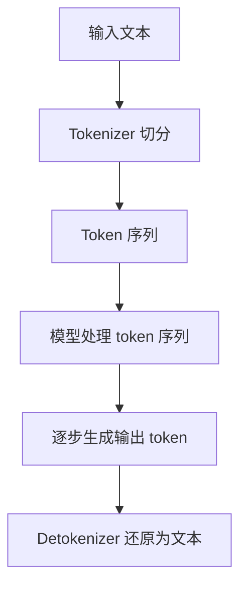
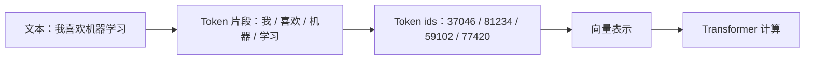
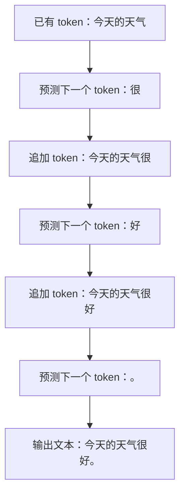
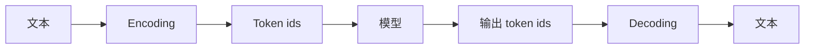
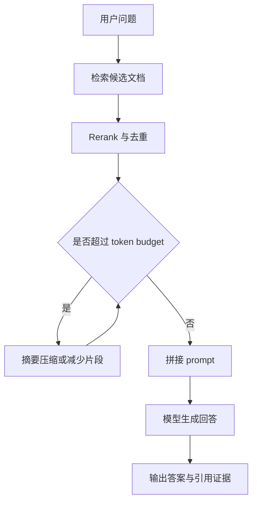
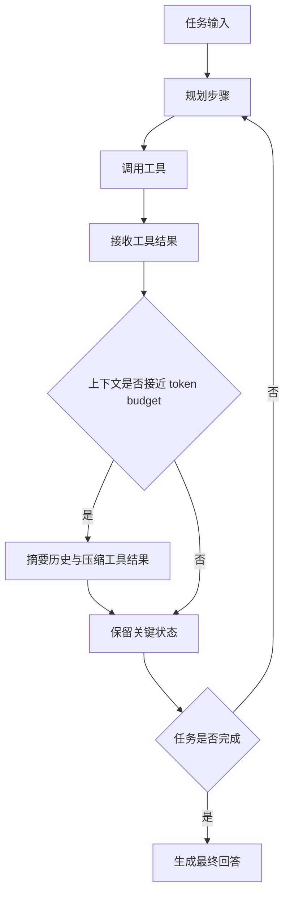

# Token 概念详解

归档日期：2026-06-11

## 1. 一句话理解

Token 是大模型处理文本时使用的基本计量单位。

它可以理解为：

> 模型 tokenizer 把文本切分后得到的文本片段。

Token 不完全等于“字”“词”或“字符”。它可能是一个汉字、一个英文单词、一个单词片段、一个标点、一个空格，也可能是特殊控制标记。

大模型不是直接读取自然语言中的“句子”，而是先把文本转换成 token 序列，再基于已有 token 预测下一个 token。



## 2. Token 不是字，也不是词

### 2.1 中文示例

一句中文：

```text
我喜欢机器学习
```

可能被切成：

```text
我 / 喜欢 / 机器 / 学习
```

也可能被切成：

```text
我 / 喜 / 欢 / 机器 / 学习
```

具体怎么切，取决于模型使用的 tokenizer。

### 2.2 英文示例

一个英文单词：

```text
unbelievable
```

可能被切成：

```text
un / believable
```

也可能被切成：

```text
un / believ / able
```

常见英文词可能是一个 token，罕见词、长词、拼写变体通常会被拆成多个 token。

### 2.3 标点、空格和换行

这些内容也可能占 token：

- 标点：`,`、`.`、`。`、`：`
- 空格：尤其是英文单词前的空格
- 换行：`\n`
- Markdown 符号：`#`、`-`、````
- 代码缩进和括号：`  `、`{}`、`()`

因此，同样字数的文本如果包含大量代码、表格、JSON 或 Markdown，token 数可能明显增加。

## 3. 为什么模型要用 token

模型内部处理的是数字，不是自然语言本身。

Tokenizer 会先把文本切成 token，然后把每个 token 映射成一个整数 id。

映射流程：



这些数字 id 会被转换成向量，送入 Transformer 模型进行计算。

因此，大模型生成文本时，本质上是在不断做：

```text
给定前面的 token 序列，预测下一个最可能的 token。
```

生成过程：



## 4. Tokenizer 是什么

Tokenizer 是负责文本和 token 序列互相转换的组件。

它通常做两件事：

- Encoding：把文本转换成 token ids。
- Decoding：把 token ids 转换回文本。



不同模型可能使用不同 tokenizer，所以同一句话在不同模型里 token 数可能不一样。

例如：

- 一个模型可能把“人工智能”切成 1 个 token。
- 另一个模型可能把它切成“人工 / 智能”两个 token。
- 还有模型可能按单字或更细粒度切分。

这也是为什么不能用“字数”精确替代 token 数。

## 5. Token 和上下文窗口

模型上下文窗口通常用 token 表示。

例如：

```text
上下文窗口：128k tokens
```

意思是一次请求中，模型最多能处理约 128,000 个 token。

这里的 token 通常包括：

- 系统提示词。
- 开发者提示词。
- 用户输入。
- 对话历史。
- 工具调用参数和结果。
- RAG 检索出来的文档片段。
- 模型即将生成的输出。

也就是说：

```text
总 token = 输入 token + 输出 token
```

如果输入已经占满上下文窗口，模型就没有空间继续生成很长输出。

## 6. Token 和计费

大模型 API 通常按 token 计费。

常见计费方式：

| 类型 | 含义 |
|---|---|
| input tokens | 用户输入、系统提示、历史上下文、检索文档等 |
| output tokens | 模型生成的回答 |
| cached input tokens | 被缓存命中的重复输入，价格可能更低 |
| reasoning tokens | 推理模型内部思考消耗的 token，部分 API 会单独统计 |

为什么输出 token 往往更贵？

因为生成输出是逐 token 自回归完成的。模型每生成一个 token，都要基于前文再次计算下一个 token 的概率分布。相比一次性读取输入，生成过程更耗时，也更占推理资源。

## 7. Token 和推理速度

模型推理速度常用 `tokens/s` 表示，也就是每秒生成多少个 token。

相关指标：

| 指标 | 含义 | 常见单位 |
|---|---|---|
| TTFT | Time To First Token，首 token 延迟 | ms / s |
| TPOT | Time Per Output Token，每个输出 token 平均耗时 | ms/token |
| Output speed | 输出速度 | tokens/s |
| Latency | 完整请求耗时 | ms / s |
| Throughput | 系统吞吐量 | tokens/s 或 requests/s |

它们关注点不同：

- `tokens/s`：模型的输出生成速度。
- `TTFT`：用户多久能看到第一个输出。
- `Latency`：整个请求多久完成。
- `Throughput`：服务整体能承载多少请求或 token。

## 8. Token 和文本长度的粗略换算

不同 tokenizer 差异较大，但可以做粗略估算：

| 文本类型 | 粗略换算 |
|---|---|
| 英文 | 1 token 大约 3-4 个字符，或约 0.75 个英文词 |
| 中文 | 1 token 常接近 1 个汉字，也可能一个词占 1-2 个 token |
| 代码 | 取决于语言、缩进、符号和变量名，通常比普通文本更碎 |
| JSON / 表格 | 标点、引号、括号较多，token 数可能偏高 |

实践中不要用字数精确估算 token。需要精确值时，应该使用对应模型的 tokenizer 或 API 返回的 usage 字段。

## 9. Token 和模型能力的关系

Token 影响模型的几个关键能力。

### 9.1 长上下文能力

上下文窗口越大，理论上能放入的材料越多。

但要注意：

```text
大上下文窗口 != 一定能有效理解所有内容
```

模型可能接收大量 token，但不一定能稳定检索、比较、归纳其中的关键信息。

因此长上下文要同时看：

- 标称上下文长度。
- 有效上下文能力。
- 长文档检索准确率。
- 长文档摘要质量。
- 跨段落、多证据推理能力。

### 9.2 输出长度控制

如果希望模型输出很长文章、报告或代码，需要预留足够的输出 token。

例如：

```text
上下文窗口 8k tokens
输入已经用了 7k tokens
最多只剩约 1k tokens 给输出
```

这时模型可能无法生成完整长文。

### 9.3 成本控制

Prompt 越长，input tokens 越多。

回答越长，output tokens 越多。

因此控制成本的常用方法包括：

- 减少无关上下文。
- 压缩历史对话。
- 对 RAG 检索结果做去重和摘要。
- 避免将整份文档无差别放入 prompt。
- 明确输出长度和格式。
- 使用缓存或上下文复用能力。

## 10. Token 在 RAG 和 Agent 中的意义

### 10.1 RAG

RAG 系统会将检索到的文档片段放入 prompt。

这会直接消耗 input tokens。

如果检索片段太多：

- 成本上升。
- 延迟增加。
- 关键信息被噪声淹没。
- 可能挤占输出空间。

因此，RAG 不应只追求检索数量，还需要控制 token budget。



常见做法：

- chunk 切分。
- top-k 检索。
- rerank。
- 摘要压缩。
- 去重。
- 只放入和问题相关的证据。

### 10.2 Agent

Agent 的每一步都会消耗 token：

- 任务规划。
- 工具调用参数。
- 工具返回结果。
- 中间推理。
- 观察结果摘要。
- 最终回答。

长流程 Agent 容易出现 token 消耗快速增长。

所以 Agent 系统通常需要：

- 控制最大步骤数。
- 压缩工具结果。
- 对历史步骤做摘要。
- 只保留关键状态。
- 为不同工具设置返回长度上限。



## 11. 常见误解

### 11.1 “1 token = 1 个字”

不准确。

中文里可能接近，但不是严格等价。英文、代码、符号、空格都会让 token 分布不同。

### 11.2 “上下文窗口越大，模型能力越强”

不一定。

上下文窗口大，只表示能接收更多 token。模型是否能有效利用这些 token，需要看长上下文检索、推理和抗干扰能力。

### 11.3 “tokens/s 越高，交互质量一定越高”

不一定。

交互质量还取决于：

- 首 token 延迟。
- 总延迟。
- 输出质量。
- 是否需要长时间 reasoning。
- 是否流式输出。

### 11.4 “只压缩用户输入就能省成本”

不完整。

成本还来自系统提示、历史对话、检索文档、工具返回结果和模型输出。生产系统需要管理完整 token budget。

## 12. 实践检查清单

设计大模型应用时，可以检查：

- 这个请求大约会消耗多少 input tokens？
- 需要预留多少 output tokens？
- 历史对话是否必须全部放入？
- 检索文档是否有去重、rerank 和压缩？
- 工具返回结果是否过长？
- 是否需要缓存重复 prompt？
- 是否需要限制最大输出长度？
- 是否记录 usage，方便后续分析成本？
- 是否按任务类型设置不同 token budget？

## 13. 一句话总结

Token 是模型处理文本的基本片段单位。它由 tokenizer 生成，不等同于字或词；上下文窗口、API 计费、推理速度、RAG 检索、Agent 步骤控制都围绕 token 展开。理解 token，本质上是在理解大模型如何读取、计算、生成和消耗资源。
