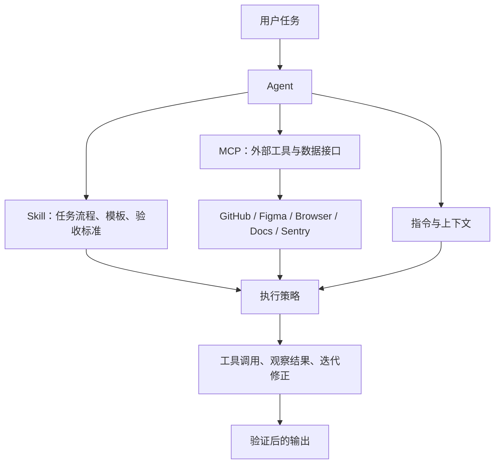

# Agent engineering

整理日期：2026-06-12

## 核心结论

Agent 工程不是单纯的 prompt engineering，也不是先训练一个新模型。它关注的是：如何围绕大模型构建一个可控、可复用、可验证的任务执行系统。

一个实用定义是：

```text
Agent = 大模型 + 目标 + 指令 + 上下文 + 工具 + 权限 + 运行循环
```

其中，大模型是推理与生成核心；Agent 是带有目标、上下文、工具和执行边界的完整工作单元。MCP 和 Skill 都不是 Agent 本身，而是 Agent 工程中的两个重要构件：MCP 负责连接外部工具和上下文，Skill 负责沉淀可复用任务流程。

## 术语边界

### 大模型

大模型负责理解输入、推理、规划、生成文本或结构化输出。它是 Agent 的能力基础，但单独的大模型通常不具备稳定的任务执行能力。

大模型不等于 Agent。只有当模型被放入一个可以接收目标、维护上下文、调用工具、观察结果并继续迭代的系统中，才形成 Agent。

### Agent

Agent 是可执行任务的智能体。它可以根据目标进行规划，调用工具，观察工具结果，并在多轮循环中调整下一步行动。

一个 Agent 通常包含：

- 任务目标：它要完成什么。
- 角色指令：它应如何工作，哪些行为禁止。
- 上下文：对话、文件、知识库、历史决策和业务规则。
- 工具：shell、文件系统、浏览器、搜索、数据库、GitHub、Slack、MCP 工具等。
- 权限：可读写范围、联网权限、命令审批、安全沙箱。
- 运行循环：计划、行动、观察、修正、验证和输出。

### Thread / Session

在 Codex 语境中，thread 或 session 更接近 Agent 工作的上下文容器。它保存对话、工具调用历史、当前工作目录、权限配置和任务状态。

日常使用时，可以近似理解为“一个 thread 中有一个主 Agent 在工作”。但严格说，thread 是容器，Agent 是在容器内执行任务的主体。

### Subagent

Subagent 是由主 Agent 派生或调度的子 Agent，用于并行处理某个明确子任务。例如一个主 Agent 负责总体审查，三个 subagents 分别检查安全风险、测试缺口和可维护性。

Subagent 适合读多写少、可并行、可独立总结的任务。对于多个 Agent 同时编辑同一代码区域的场景，需要更谨慎，因为容易产生冲突和协调成本。

### MCP

MCP 是 Model Context Protocol，用于把模型或 Agent 连接到外部工具和上下文。它解决的是“Agent 如何访问外部系统”的问题。

MCP server 可以暴露工具、资源和服务端说明。例如：

- GitHub MCP：读取 issue、PR、review 信息。
- Figma MCP：访问设计稿。
- Sentry MCP：访问错误日志。
- OpenAI Docs MCP：搜索和读取官方文档。
- Playwright 或 Browser MCP：控制和检查浏览器。

MCP 本身通常不是 Agent。它更像工具接口层，负责把外部能力以统一协议暴露给 Agent。

### Skill

Skill 是面向 Agent 的可复用任务流程包。它通常包含 `SKILL.md`，也可以包含 `references/`、`scripts/`、`assets/` 等资源。

Skill 解决的是“Agent 应该如何稳定完成某类任务”的问题。它可以规定触发条件、工作流程、工具调用顺序、异常处理方式、输出模板和验收标准。

Skill 本身不是 Agent。它是 Agent 在特定任务中读取和执行的方法说明。

## Agent、MCP、Skill 的关系

三者可以这样区分：

| 概念 | 角色 | 解决的问题 | 类比 |
| --- | --- | --- | --- |
| Agent | 执行主体 | 谁来理解目标、规划步骤、调用工具并产出结果 | 工作者 |
| MCP | 工具与上下文协议 | 如何连接外部系统、数据和工具 | 工具接口 |
| Skill | 可复用流程 | 如何稳定完成一类任务 | 操作手册 |

关系可以概括为：

```text
Agent 使用 Skill 中的流程，
并通过 MCP 连接外部工具或上下文，
在权限边界内完成任务。
```



## 如何定制一个 Agent

定制 Agent 的关键不是给模型起一个名字，而是确定它的职责、上下文、工具、权限和质量标准。

### 1. 定义任务边界

先明确 Agent 负责什么、不负责什么。

示例：

```text
你是 notebook 仓库的调研归档 Agent。
负责把调研内容整理为结构化 Markdown 笔记。
不负责无关代码修改，不随意改动既有文件结构。
```

任务边界应回答：

- 输入是什么。
- 输出是什么。
- 允许做哪些操作。
- 禁止做哪些操作。
- 什么时候需要向用户确认。

### 2. 固化工作流程

Agent 的指令应描述可执行步骤，而不是空泛目标。

示例：

```text
1. 判断主题应放入哪个目录。
2. 使用英文小写 snake_case 路径。
3. 保留原始材料的重要结构、表格和代码块。
4. 补充概念边界、实践清单和来源。
5. 检查 Markdown 目录索引是否需要更新。
6. 输出创建或修改的文件路径。
```

### 3. 配置上下文

上下文决定 Agent 能理解什么。常见上下文来源包括：

- 当前 prompt。
- 当前 thread 历史。
- 仓库文件。
- `AGENTS.md` 中的仓库规则。
- Skill 的 `references/`。
- 记忆系统。
- 通过 MCP 获取的外部资料。

上下文管理的重点不是“越多越好”，而是让 Agent 拿到足够且相关的信息，避免无关日志、长文件和旧历史污染当前判断。

### 4. 连接工具

工具决定 Agent 能做什么。常见工具包括：

- 文件读写。
- shell 命令。
- 搜索和浏览器。
- Git 和 GitHub。
- 数据库查询。
- Figma、Slack、Sentry 等外部系统。
- 自定义 MCP server。

工具设计应尽量结构化：名称清晰、参数明确、错误可读、输出稳定、权限可控。

### 5. 设定权限和安全边界

Agent 的能力越强，越需要明确边界。

需要区分：

- 只读操作。
- 工作区内写操作。
- 联网操作。
- 执行 shell 命令。
- 修改 Git 状态。
- 访问私有服务。
- 发送消息、创建 PR、修改生产数据等有外部副作用的动作。

高风险动作应加入人工确认、审批策略、沙箱、审计日志或回滚机制。

### 6. 加入验证机制

一个可靠 Agent 不应只产出结果，还应验证结果。

常见验证方式：

- 代码任务：运行测试、lint、build、类型检查。
- 文档任务：检查目录、链接、标题、格式和来源。
- 前端任务：浏览器截图、交互检查、移动端视口检查。
- 数据任务：检查 schema、行数、异常值、公式和图表。
- 运营任务：检查收件人、语气、权限和发送范围。

## Agent 工程的规范化方向

Agent 工程目前还没有像 HTTP 或 SQL 那样统一的硬标准，但已经形成一组正在收敛的工程实践。

### 1. 优先选择最简单可行方案

不要把所有 LLM 应用都做成自由自治 Agent。复杂度应逐级增加：

```text
单次 LLM 调用
-> 固定 prompt 模板
-> prompt chaining
-> workflow
-> 带工具的 Agent
-> 多 Agent 编排
```

如果任务步骤固定、输入输出稳定，workflow 往往比自治 Agent 更可靠。如果任务需要根据工具反馈动态决定下一步，才更适合 Agent。

### 2. 区分 workflow 和 agent

Workflow 是预先定义好的流程，控制权主要在代码或编排系统中。Agent 是由模型在运行时决定下一步行动，控制权更多在模型推理中。

| 类型 | 控制方式 | 优点 | 风险 |
| --- | --- | --- | --- |
| Workflow | 预定义步骤和分支 | 稳定、可测、易审计 | 灵活性较弱 |
| Agent | 模型动态规划和行动 | 适合开放任务和复杂反馈 | 成本、延迟和不确定性更高 |

工程上应优先 workflow，必要时再引入 Agent。

### 3. 使用常见编排模式

常见 Agentic workflow 模式包括：

- Prompt chaining：一个步骤的输出作为下一个步骤的输入。
- Routing：根据任务类型路由到不同模型、prompt、工具或 Agent。
- Parallelization：并行处理多个子问题，再合并结果。
- Orchestrator-workers：主 Agent 拆任务，worker Agent 执行子任务。
- Evaluator-optimizer：一个 Agent 生成，另一个或同一个流程评估并迭代优化。
- Human-in-the-loop：高风险或高不确定性节点由人确认。

### 4. 将工具接口工程化

Agent 的稳定性很大程度取决于工具是否好用。

工具接口应具备：

- 清晰名称。
- 明确参数 schema。
- 稳定结构化输出。
- 明确错误类型和修复建议。
- 幂等性或副作用说明。
- 权限要求。
- 输入输出示例。
- 超时、重试和限流策略。

不清晰的工具会让 Agent 把精力浪费在猜参数、猜路径、猜错误原因上。

### 5. 管理上下文，而不是堆满上下文

Agent 工程需要控制上下文质量。

常见策略：

- 将长资料放入 references，按需读取。
- 对工具结果做摘要，而不是保留全部日志。
- 用结构化证据替代大段原始数据。
- 将稳定规则放入 `AGENTS.md`、Skill 或系统配置。
- 定期压缩或总结长任务状态。
- 避免把过期决策和当前任务混在一起。

### 6. 设置 guardrails

Guardrails 是对输入、输出和工具调用的约束与检查。

可分为：

- 输入 guardrails：检查用户请求是否越权、危险、缺少关键信息。
- 工具 guardrails：检查工具调用是否安全、参数是否合规、是否需要审批。
- 输出 guardrails：检查输出是否符合格式、事实来源和安全要求。

高风险操作尤其要关注工具 guardrails，因为真正产生副作用的是工具调用。

### 7. 评估最终结果，也评估执行轨迹

Agent 评估不应只看最终答案，还要看执行过程。

需要评估：

- 是否完成用户目标。
- 是否调用了正确工具。
- 工具调用顺序是否合理。
- 是否做了不必要或危险的操作。
- 是否在证据不足时停止并说明不确定性。
- 是否通过必要验证。
- 多轮任务中是否保持一致状态。

这类评估也可以称为 trajectory evaluation，即对 Agent 的行动轨迹进行评估。

### 8. 保持可观测性和可审计性

Agent 工程需要能复盘：

- 它看到过哪些上下文。
- 它为什么选择某个工具。
- 工具返回了什么。
- 哪一步失败了。
- 哪些审批被触发。
- 最终输出依据是什么。

因此 trace、日志、计划、工具调用记录和测试结果都属于 Agent 工程的重要资产。

## Codex 语境中的落地方式

在 Codex 中，可以按以下方式映射 Agent 工程构件：

| 需求 | 推荐载体 |
| --- | --- |
| 一次性任务约束 | 当前 prompt 或 thread 上下文 |
| 仓库长期规则 | `AGENTS.md` |
| 可复用任务流程 | Skill |
| 外部工具或私有系统访问 | MCP server 或 app connector |
| 多任务并行 | 多 thread、worktree 或 subagent |
| 周期性任务 | Automation |
| 高风险动作控制 | Sandbox、approval、managed configuration |
| 可复盘执行 | 工具调用记录、terminal 输出、trace、测试结果 |

### 示例：调研归档 Agent

```text
Agent:
  Codex 当前 thread 中的主 Agent。

目标:
  将调研内容归档为 notebook 仓库中的结构化 Markdown。

Skill:
  归档流程、路径命名、输出结构、来源格式、检查清单。

MCP:
  OpenAI Docs MCP、GitHub MCP、web search 或其他资料源。

上下文:
  现有目录结构、SUMMARY.md、历史笔记风格、用户偏好。

验证:
  检查文件路径、Markdown 结构、目录索引和来源链接。
```

### 示例：前端还原 Agent

```text
Agent:
  负责读设计、改代码、验证 UI 的 Codex thread。

Skill:
  前端实现流程、组件复用原则、视觉验收标准。

MCP:
  Figma MCP 读取设计稿，Browser MCP 或 in-app browser 检查页面。

验证:
  截图、交互测试、移动端视口、无文本重叠、无控制台错误。
```

### 示例：代码审查 Agent

```text
Agent:
  只读或低权限的审查 Agent。

目标:
  找出 bug、回归风险、缺失测试和安全问题。

工具:
  git diff、rg、测试命令、GitHub PR 评论读取。

输出:
  按严重程度排序的 findings，包含文件位置和复现理由。

验证:
  每个 finding 都应能被代码证据或测试缺口支撑。
```

## 设计检查清单

定制 Agent 前，可以检查以下问题：

- 这个任务是否真的需要 Agent，还是 workflow 就够了。
- Agent 的职责边界是否清楚。
- 输入、输出和失败条件是否明确。
- 是否有稳定工作流程可以沉淀为 Skill。
- 是否需要外部工具或上下文，是否应通过 MCP 接入。
- 工具参数和错误输出是否足够结构化。
- 权限是否遵循最小化原则。
- 高风险工具调用是否需要人工审批。
- 是否有验证步骤。
- 是否能记录和复盘执行轨迹。
- 是否能用真实任务样本评估质量。

## 延伸决策指南

如果需要判断某个问题应使用 Skill、MCP、Agent 还是 Workflow，可以参考独立笔记：[Skill, MCP, and Agent decision guide](skill_mcp_agent_decision_guide.md)。该文档按问题类型整理了选择标准、组合方式、反例和落地检查清单。

## 参考资料

- OpenAI Codex Manual: [Codex overview](https://developers.openai.com/codex/overview)
- OpenAI Codex Manual: [Agent Skills](https://developers.openai.com/codex/skills)
- OpenAI Codex Manual: [Model Context Protocol](https://developers.openai.com/codex/mcp)
- OpenAI Codex Manual: [Subagents](https://developers.openai.com/codex/concepts/subagents)
- OpenAI Agents SDK: [Documentation](https://openai.github.io/openai-agents-python/)
- Anthropic: [Building effective agents](https://www.anthropic.com/engineering/building-effective-agents)
- Microsoft Azure Architecture Center: [AI agent orchestration patterns](https://learn.microsoft.com/en-us/azure/architecture/ai-ml/guide/ai-agent-design-patterns)
- Google Agent Development Kit: [Evaluate agents](https://google.github.io/adk-docs/evaluate/)
