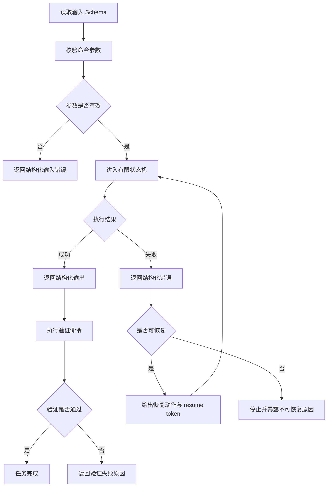
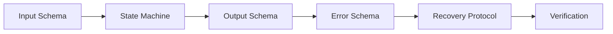
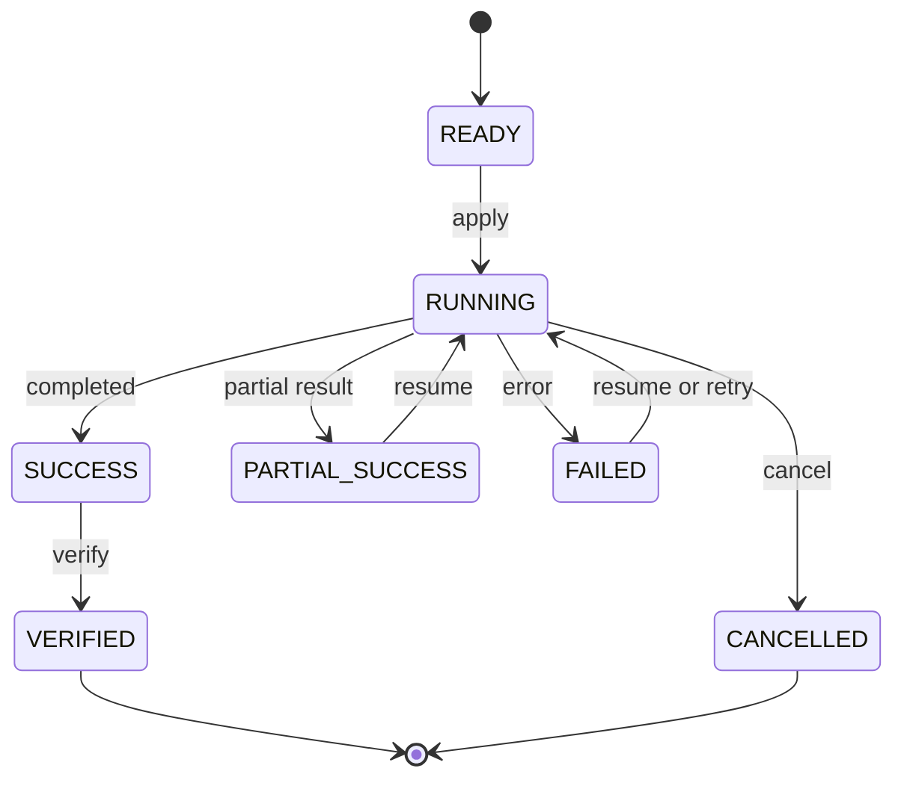
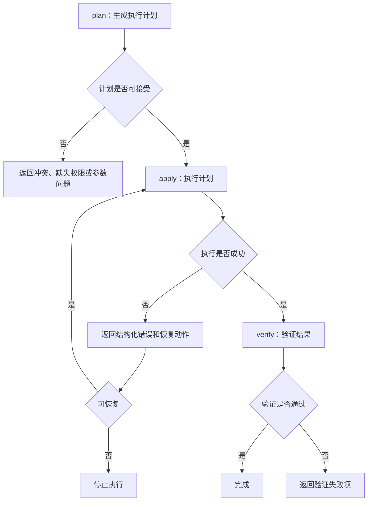

# Agent-friendly CLI design

调研日期：2026-06-29

## 核心结论

Agent-friendly CLI 的核心目标不是让 Agent 适应不稳定的命令行交互，而是让 CLI 自身提供可枚举、可验证、可恢复的执行协议。它应将输入、状态、输出、错误和恢复动作都结构化，使 Agent 能够基于确定性信号完成闭环执行。

更准确地说，面向 Agent 的 CLI 应被设计为命令执行协议，而不仅是人类用户可读的命令集合。协议的关键能力包括输入 Schema、有限状态机、结构化输出、结构化错误、恢复协议、任务续跑和结果验证。

## 问题背景

传统 CLI 通常面向人类用户设计，依赖 `--help`、自然语言日志、颜色输出和人工判断。Agent 在使用这类 CLI 时会遇到几个稳定性问题：

- 无法可靠判断允许输入和参数关系。
- 需要从自然语言日志中推断当前状态。
- 失败原因缺少稳定错误码。
- 恢复动作依赖经验和试错。
- 长任务中断后难以安全续跑。
- 命令成功退出不等于任务结果已经验证。

这些问题会迫使 Agent 把大量精力用于推理 CLI 行为，而不是执行任务本身。Agent-friendly CLI 的设计方向，是将这些推理负担下沉到 CLI 协议中。

## 执行闭环

执行闭环指 Agent 在任意时刻都能回答四个问题：

- 当前状态是什么。
- 为什么进入当前状态。
- 下一步应该执行什么。
- 如何判断任务真正完成。

如果 CLI 不能提供这些信息，Agent 就只能通过自然语言推理、日志猜测或重复执行来补足状态信息。闭环设计应让 CLI 返回足够明确的机器信号，使 Agent 可以按状态机分支继续执行。



## 协议化模型

Agent-friendly CLI 可以抽象为以下协议链路：



每一层都应减少自然语言解释的比例，增加稳定、可解析、可测试的结构化信号。

## 关键设计要素

### 1. 输入 Schema

CLI 应让输入空间有限化。Agent 不应只依赖解析 `--help` 来理解参数，而应能读取稳定的输入 Schema。

输入 Schema 至少描述：

- 参数名称和类型。
- 是否必填。
- 默认值。
- 枚举值。
- 参数依赖关系。
- 参数互斥关系。
- 参数的副作用或权限要求。

这种设计可以让 Agent 在执行前完成参数校验，减少无效调用和重复无效尝试。

### 2. 有限状态机

CLI 应将执行状态限制在稳定集合中，例如：

```text
READY
RUNNING
SUCCESS
FAILED
PARTIAL_SUCCESS
CANCELLED
NOOP
```

状态集合应长期稳定，状态迁移应可预测。Agent 需要根据状态决定是否继续、重试、恢复、验证或停止。

典型状态迁移如下：



### 3. 结构化输出

所有机器消费场景都应支持稳定 JSON 输出。自然语言可以用于人类阅读，但不应成为 Agent 判断结果的唯一依据。

示例：

```json
{
  "status": "success",
  "task_id": "abc123",
  "artifacts": ["build.tar"],
  "next_actions": [
    {
      "type": "verify",
      "command": "tool verify --task-id abc123 --json"
    }
  ]
}
```

结构化输出应区分结果、产物、下一步动作和验证入口。这样 Agent 不需要从日志中猜测应该检查哪个文件或运行哪个命令。

### 4. 结构化错误

错误空间也应有限化。错误码应稳定、可分类，并与恢复策略绑定。

常见错误类别包括：

| 错误码 | 含义 | 典型恢复方式 |
| --- | --- | --- |
| `E_INPUT` | 参数、格式或输入缺失 | 修正参数后重试 |
| `E_CONFIG` | 配置缺失或配置冲突 | 读取配置修复建议 |
| `E_PERMISSION` | 权限、登录或授权失败 | 登录、授权或请求审批 |
| `E_NETWORK` | 网络或远端服务异常 | 按退避策略重试 |
| `E_TIMEOUT` | 执行超时 | 查询状态、续跑或扩大超时 |
| `E_CONFLICT` | 状态冲突或并发冲突 | 刷新状态后重试 |
| `E_INTERNAL` | 工具内部错误 | 停止自动恢复并暴露诊断信息 |

错误返回中应包含 `recoverable`、`retryable`、`next_actions`、`details` 等字段，使 Agent 能明确判断是否继续。

### 5. 恢复协议

恢复协议应把“失败后怎么办”转化为结构化动作，而不是只返回错误描述。

示例：

```json
{
  "status": "failed",
  "code": "E_PERMISSION",
  "recoverable": true,
  "retryable": false,
  "next_actions": [
    {
      "type": "login",
      "command": "tool login"
    },
    {
      "type": "resume",
      "command": "tool resume --token task-001 --json"
    }
  ],
  "resume_token": "task-001"
}
```

恢复动作应尽量明确到命令、参数和前置条件。对于不可自动恢复的问题，CLI 应明确返回停止原因，避免 Agent 继续执行高风险猜测。

### 6. 长任务续跑

长任务应支持 `status`、`resume` 和 `cancel`。当任务中断、超时或进入部分成功状态时，CLI 应返回可持久化的 `task_id` 或 `resume_token`。

基本接口可以包括：

```text
tool status --task-id <id> --json
tool resume --token <token> --json
tool cancel --task-id <id> --json
```

续跑能力可以降低重复执行的副作用风险，也能让 Agent 在工具调用中断后恢复上下文。

### 7. 验证命令

命令执行成功不等于任务目标完成。CLI 应提供显式验证入口，例如：

```text
tool verify --task-id <id> --json
```

验证结果应返回检查项，而不是只返回布尔值：

```json
{
  "verified": true,
  "checks": [
    {
      "name": "artifact_exists",
      "passed": true
    },
    {
      "name": "service_running",
      "passed": true
    }
  ]
}
```

验证命令将“退出码为 0”与“业务结果符合预期”区分开，是闭环执行的最后一环。

## 机器友好输出约定

面向 Agent 的 CLI 应统一支持以下选项：

- `--json`：输出稳定 JSON。
- `--quiet`：减少人类提示和进度输出。
- `--verbose`：输出更多诊断信息。
- `--trace`：输出可关联的执行轨迹。
- `--no-color`：关闭颜色控制字符。

输出通道建议分离：

- `stdout` 只输出机器可解析结果。
- `stderr` 输出日志、警告和诊断信息。

这种约定能避免日志污染 JSON，也能让 Agent 在失败时优先解析结构化结果，再按需读取诊断日志。

## Plan / Apply / Verify 模式

高风险或有副作用的 CLI 不宜把所有动作压缩成一个命令。更稳定的模式是 `plan -> apply -> verify`。



`plan` 阶段应展示将要产生的副作用、依赖、风险和预计产物。`apply` 阶段执行计划。`verify` 阶段检查产物、服务状态或外部系统状态。

## 幂等性

Agent 可能因为超时、工具异常或状态不明确而重复执行命令。CLI 应尽量提供幂等语义，避免重复执行产生额外副作用。

常见做法包括：

- 使用 `ensure` 类命令表达目标状态。
- 支持 `--idempotency-key`。
- 在输出中返回已存在、已完成或无需变更的 `NOOP` 状态。
- 对高风险动作要求 `plan_id` 或确认令牌。

幂等性与状态查询、续跑能力结合后，可以显著降低自动化执行风险。

## 设计检查清单

| 维度 | 检查问题 |
| --- | --- |
| 输入 | 参数是否有 Schema，依赖和互斥关系是否明确 |
| 状态 | 是否存在有限状态集合和可预测迁移 |
| 输出 | 是否支持稳定 JSON，结果和日志是否分离 |
| 错误 | 是否有稳定错误码，是否避免只返回自然语言 |
| 恢复 | 是否返回可执行的下一步动作 |
| 续跑 | 长任务是否支持 status、resume、cancel |
| 验证 | 是否提供 verify 命令和结构化检查项 |
| 幂等 | 重复执行是否不会产生额外副作用 |
| 审计 | 是否能记录 trace、task_id、plan_id 或 resume_token |

## 与 Skill、MCP 和 Agent 设计的关系

Agent-friendly CLI 与 Skill、MCP 和 Agent 并不冲突，它更像是底层工具契约。

- Skill 可以说明何时调用 CLI、如何选择参数、如何处理错误码。
- MCP 可以把 CLI 能力封装为结构化工具，并继承其状态、错误和恢复协议。
- Agent 可以基于 CLI 返回的状态和恢复动作进行多步决策。
- Workflow 可以在固定流程中稳定编排 `plan -> apply -> verify`。

如果 CLI 本身缺少结构化协议，Skill 和 Agent 往往需要补充大量解释性规则。如果 CLI 已经具备输入 Schema、有限状态、结构化错误和验证命令，上层 Agent 的执行路径会更短、更稳定，也更容易测试。

## 资料来源

本文依据本地资料 `Agent-Friendly-CLI-Design.md` 整理，源文件位于 `/Users/fanghaolei/Downloads/Agent-Friendly-CLI-Design.md`。
