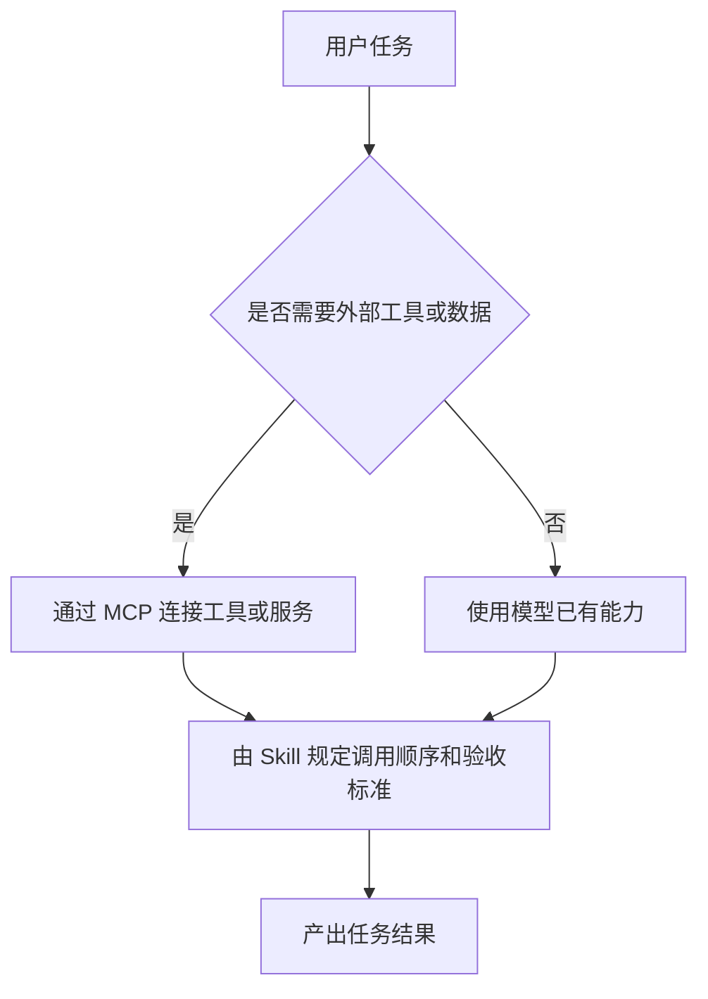
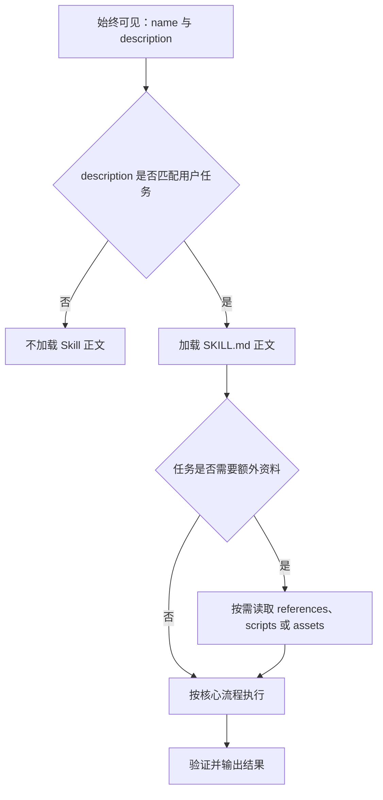
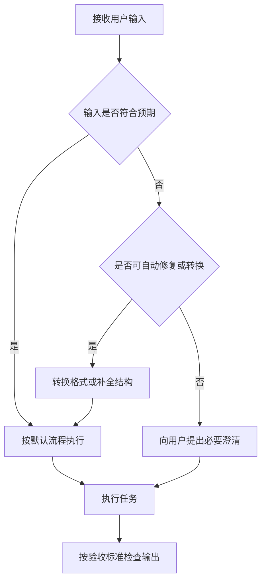
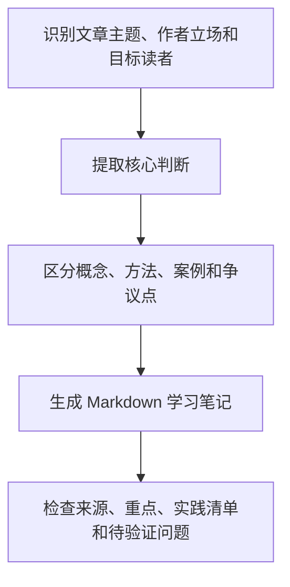
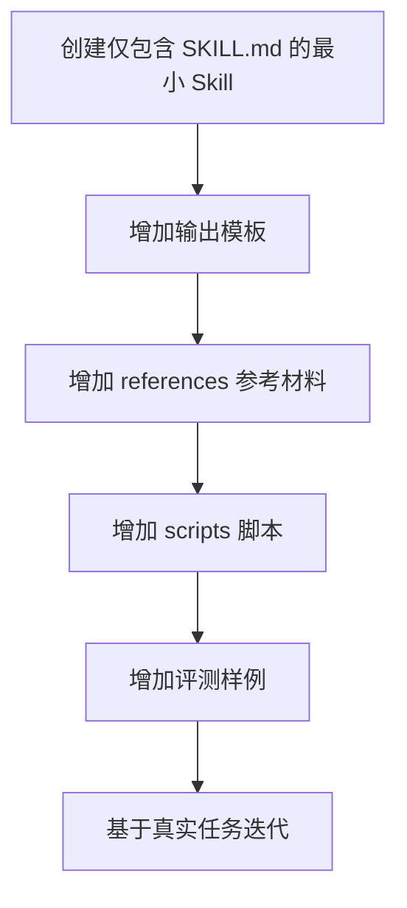

# Agent Skills guide notes

来源：[少数派《Agent Skills 终极指南：入门、精通、预测》](https://sspai.com/post/105230)

整理日期：2026-06-09
整改日期：2026-06-11

## 核心结论

Skill 的主要价值在于将 Agent 的任务流程、领域知识、脚本、模板和素材组织为可复用的能力包。它并非单纯扩展提示词，而是将一类任务的执行方法沉淀为结构化上下文和可执行资源，使通用 Agent 能够在特定任务中保持更高的一致性。

## 关键概念

### Skill 是能力包

文章将 Skill 描述为面向 Agent 的能力扩展单元。一个 Skill 通常可以包含：

- 任务执行流程与背景知识
- 工具使用说明
- 模板、素材和历史案例
- 常见问题、规范和解决方案
- 可直接运行的脚本

因此，Skill 更接近“指令、资源和可执行能力的组合”，而不是单一提示词。

### Skill 与 MCP 的分工

MCP 主要解决 Agent 如何连接外部工具、数据和服务的问题。Skill 主要解决 Agent 如何稳定完成一类任务的问题。两者可以组合使用：MCP 提供外部能力接口，Skill 提供任务策略、调用顺序、异常处理和验收标准。



### 标准结构

Skill 的最小形态可以只有 `SKILL.md`。当任务复杂度提高时，可以增加脚本、参考资料和资源文件。

```text
my_skill/
  SKILL.md
  scripts/
  references/
  assets/
  templates/
```

各目录的职责如下：

- `SKILL.md`：核心说明，包含元数据、触发条件、流程、约束和最佳实践。
- `scripts/`：可执行脚本，用于提升重复任务的稳定性。
- `references/`：领域知识、规范、说明文档和长篇参考材料。
- `assets/`：图片、Logo、示例文件等输出素材。
- `templates/`：输出模板、文档模板和提示模板。

### 渐进式披露

Skill 的重要设计原则是渐进式披露。Agent 不应一次性加载全部内容，而应根据任务需要逐层读取信息。



这种机制可以降低上下文占用，使 Agent 在安装多个 Skills 时仍能保持可控的上下文成本。

## 值得关注的设计判断

### 领域经验可以被产品化

Skill 可以将专家经验转化为 Agent 可执行的任务规范。例如：

- 写作 Skill：沉淀选题、资料处理、大纲和正文风格。
- 品牌设计 Skill：沉淀品牌色、字体、Logo 和版式规范。
- 数据分析 Skill：沉淀指标定义、异常值处理和图表规范。
- 项目复盘 Skill：沉淀文件扫描、结论提炼和输出模板。

这种方式适合先验证垂直 Agent 的任务可行性，再决定是否开发完整产品。

### Skill 可以增强复杂任务的鲁棒性

传统 Workflow 往往要求预先定义入口、字段和分支。Skill 与 Agent 结合时，可以将流程约束与模型推理能力结合，使 Agent 在输入不完整或格式异常时仍能根据规则处理。



### 多个 Skills 可以组合

Skills 可以在复杂任务中协同使用。例如，产品分析报告可能同时需要网页抓取、PDF 提取、数据分析、品牌规范和演示文稿生成能力。组合时应明确每个 Skill 的职责边界，避免多个 Skills 对同一决策给出冲突指令。

## 是否应编写 Skill 的判断信号

适合沉淀为 Skill 的任务通常具有以下特征：

1. 用户需要反复向 AI 解释同一组规则。
2. 任务依赖特定知识、模板、素材或组织规范。
3. 任务需要多个步骤协同完成。
4. 输出质量依赖固定验收标准。
5. 某些步骤需要脚本化以获得稳定结果。

## Skill 开发优先级

### 1. 写清触发元数据

`description` 决定 Agent 是否会自动触发 Skill。它应说明：

- Skill 解决的任务类型。
- Skill 适用的输入场景。
- Skill 的预期输出。
- 与相邻任务的边界。

示例：

```yaml
---
name: article_summary
description: 用于阅读长文章并输出结构化中文学习笔记。当用户提供文章链接、网页内容、PDF 或长文本，并希望提炼观点、方法、行动建议或复习卡片时使用。
---
```

### 2. 将流程写成可执行步骤

流程应描述 Agent 的操作顺序，而不是只描述目标。



对应的 `SKILL.md` 片段可以写为：

```md
## Workflow

1. 识别文章主题、作者立场和目标读者。
2. 提取核心判断，避免按原文顺序机械摘录。
3. 区分概念、方法、案例、争议点和行动建议。
4. 输出 Markdown，包含来源、重点、实践清单和待验证问题。
```

### 3. 将稳定任务交给脚本

适合脚本化的任务包括：

- 转换文件格式。
- 批量读取目录。
- 生成固定结构的 Markdown。
- 校验输出字段。
- 处理表格、PDF、PPTX 等复杂文件。

脚本的运行结果可以进入上下文，而脚本本身不必每次完整加载。因此，脚本有助于降低上下文消耗，并提升重复任务的稳定性。

### 4. 将大体量材料放入 references 或 assets

`SKILL.md` 应保持简洁，承载核心流程和导航信息。长篇资料应按需放入 `references/` 或 `assets/`。

适合放到 `references/` 的内容：

- 术语表。
- 公司规范。
- 写作风格说明。
- 业务流程文档。
- 评审标准。

适合放到 `assets/` 的内容：

- Logo。
- 图片素材。
- 示例文件。
- 设计资源。

## 学习路径



建议从文章学习笔记类 Skill 开始，因为该任务同时覆盖触发描述、工作流程、输出模板和边界条件。

## 设计检查清单

- `name` 是否简短、清晰、唯一。
- `description` 是否覆盖触发场景和边界。
- `SKILL.md` 是否说明输入、输出和工作流程。
- 是否区分必须遵守的规则和可灵活处理的建议。
- 是否将大段参考材料移到 `references/`。
- 是否将重复、机械、易错的任务脚本化。
- 是否提供输出模板或示例。
- 是否说明缺失信息时应追问、假设或继续。
- 是否避免一次性加载全部内容。

## 参考链接

- [少数派原文：Agent Skills 终极指南：入门、精通、预测](https://sspai.com/post/105230)
- [Anthropic 官方 Skills 仓库](https://github.com/anthropics/skills/tree/main)
- [Agent Skills 开放标准](https://agentskills.io/home)
- [Agent Skills 规格说明](https://agentskills.io/specification#skill-md-format)
