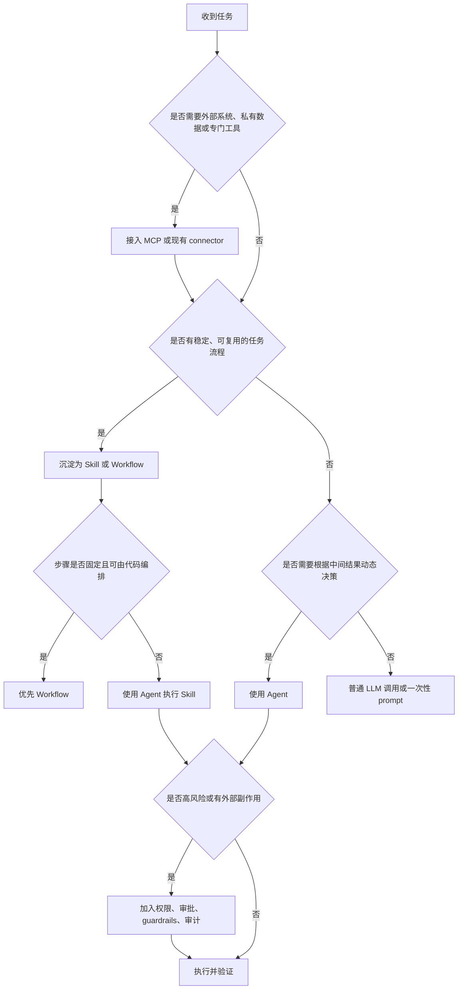

# Skill, MCP, and Agent decision guide

整理日期：2026-06-12

## 核心结论

选择 Skill、MCP 还是 Agent，关键不是看名字是否高级，而是看问题主要缺少什么。

```text
缺流程一致性 -> 优先 Skill
缺外部工具或上下文 -> 优先 MCP
缺动态规划和多步执行 -> 使用 Agent
缺稳定可测流程 -> 优先 Workflow，不急着做 Agent
```

更精确地说：

- Skill 解决“怎么做”的问题。
- MCP 解决“连到哪里、调用什么”的问题。
- Agent 解决“谁来根据目标持续决策并执行”的问题。
- Workflow 解决“已知步骤如何稳定编排”的问题。

## 快速判断表

| 问题特征 | 优先选择 | 原因 |
| --- | --- | --- |
| 用户反复要求同一类输出格式、流程或验收标准 | Skill | 需要把任务方法沉淀成可复用说明 |
| 任务依赖仓库规范、组织流程、模板或领域知识 | Skill | 需要在适用场景中稳定加载规则 |
| 任务需要访问外部系统、私有数据或专门工具 | MCP | 需要把外部能力暴露给 Agent |
| 任务需要读取 GitHub、Slack、Figma、Sentry、数据库等 | MCP | 主要缺少受控数据和工具接口 |
| 任务步骤固定、分支有限、可由代码稳定控制 | Workflow | 不需要让模型自由决定下一步 |
| 任务需要根据工具返回结果动态决定下一步 | Agent | 需要规划、观察、修正的执行循环 |
| 任务很大，需要并行调查多个相互独立的问题 | 多 Agent / Subagent | 可分解为多个独立子任务 |
| 任务有高风险副作用，如发消息、删数据、改生产配置 | Agent + Guardrails + Human-in-the-loop | 需要权限、审批、审计和回滚 |
| 任务主要是一次性问答或改写 | 普通 LLM 调用 | 不需要工具、长期上下文或执行循环 |

## 决策流程



## 何时使用 Skill

Skill 适合把稳定的任务经验变成 Agent 可读取、可复用、可验证的流程。

### 适用问题

适合使用 Skill 的信号：

- 用户经常重复同一组规则。
- 任务有明确产物格式。
- 任务依赖组织规范、项目约定或领域知识。
- 任务有固定检查清单。
- 任务需要模板、参考资料或脚本辅助。
- 模型默认能力能做，但稳定性不够。

典型场景：

- 调研归档：固定目录、命名规则、引用格式和 Markdown 结构。
- PR review：固定审查维度、严重程度排序和输出格式。
- 文档生成：固定章节、语气、样式和渲染检查。
- 表格分析：固定字段校验、图表规范和异常值处理。
- 前端实现：固定设计还原流程、浏览器验证和响应式检查。

### 不适用问题

以下情况不应优先做 Skill：

- 只是一次性问答。
- 没有可复用流程。
- 主要问题是缺少外部系统访问能力。
- 任务本身应由确定性程序完成。
- 规则还没有经过真实任务验证，边界很模糊。

### Skill 的产物形态

最小形态：

```text
skill_name/
  SKILL.md
```

复杂任务可以扩展为：

```text
skill_name/
  SKILL.md
  references/
  scripts/
  assets/
  templates/
```

`SKILL.md` 应包含触发条件、输入输出、工作流程、边界、验证方式和资源导航。长资料放入 `references/`，重复机械任务放入 `scripts/`。

## 何时使用 MCP

MCP 适合把外部工具、数据源或服务以标准方式接入 Agent。

### 适用问题

适合使用 MCP 的信号：

- Agent 需要访问外部系统。
- 数据不在当前上下文中。
- 需要调用专门工具，而不是只靠模型生成。
- 需要结构化工具参数和返回值。
- 需要统一鉴权、超时、审批和工具策略。

典型场景：

- 读取 GitHub PR、issue、review comments。
- 查询 Slack 消息或频道摘要。
- 读取 Figma 设计稿。
- 查询 Sentry、Datadog、Grafana 或 trace 后端。
- 操作浏览器并获取截图、DOM 或控制台信息。
- 查询内部知识库、数据库或文档系统。

### 不适用问题

以下情况不应优先做 MCP：

- 数据已经在 prompt 或仓库文件中。
- 只是需要一套工作流程，而不是接外部工具。
- 工具调用可以由现有 CLI 或脚本直接完成。
- 外部系统没有稳定 API，或者权限边界尚未清楚。

### MCP 的设计重点

MCP server 暴露给 Agent 的不是越多越好，而是越清晰越好。

工具设计应关注：

- 工具名称是否表达动作。
- 参数 schema 是否明确。
- 返回值是否结构化。
- 错误信息是否可行动。
- 是否说明副作用。
- 是否支持分页、过滤、时间范围和 dry-run。
- 是否设置超时、限流和权限。
- 是否对高风险工具启用审批。

## 何时使用 Agent

Agent 适合处理需要动态规划、工具反馈和多步迭代的任务。

### 适用问题

适合使用 Agent 的信号：

- 任务目标明确，但路径不固定。
- 需要多次读取、搜索、运行、修改、验证。
- 每一步依赖上一步工具结果。
- 需要在不完整信息下做合理假设，并在证据不足时追问。
- 需要综合多个来源，形成判断或执行方案。
- 需要在失败后重试或切换策略。

典型场景：

- 修复测试失败：先复现，再定位，再修改，再验证。
- 代码迁移：扫描用法，分批修改，运行测试，处理回归。
- 复杂故障排查：查询指标、日志、trace，形成证据链。
- 前端实现：读代码、改组件、启动页面、截图验证。
- 长文档处理：拆分资料、提炼结构、生成笔记、校验引用。

### 不适用问题

以下情况不应优先做 Agent：

- 任务可以由单个函数或脚本确定性完成。
- 步骤固定且没有复杂分支。
- 没有工具可用，只有一次性文本输出。
- 风险很高但没有审批、审计或回滚机制。
- 需求边界不清，连成功标准都无法描述。

## 何时使用 Workflow

Workflow 不是 Skill、MCP 或 Agent 的替代品，而是更稳定的编排方式。很多场景应优先使用 Workflow，再在必要节点引入模型或 Agent。

适合 Workflow 的问题：

- 步骤固定。
- 输入输出 schema 清楚。
- 分支条件可枚举。
- 需要高稳定性和可测试性。
- 需要低成本、低延迟。

示例：

```text
读取 CSV -> 校验 schema -> 计算指标 -> 生成图表 -> 输出报告
```

如果中间只有“生成报告文字”需要模型，整个系统不必做成 Agent。可以只在报告生成节点调用 LLM。

## 组合方式

实际工程中，Skill、MCP、Agent 通常组合使用。

### Skill + Agent

适合有稳定方法、但执行路径仍需动态判断的任务。

示例：

```text
调研归档 Skill
+ Codex Agent
= Agent 按固定归档方法处理不同主题资料
```

### MCP + Agent

适合需要外部工具或私有数据的动态任务。

示例：

```text
GitHub MCP
+ Codex Agent
= Agent 读取 PR 上下文并进行审查或修复
```

### Skill + MCP + Agent

适合复杂、可复用、需要外部系统的任务。

示例：

```text
Trace diagnosis Skill
+ Observability MCP
+ Agent
= Agent 按诊断流程查询 trace、生成证据链并输出 RCA
```

### Workflow + Agent

适合总体流程固定，但某些节点需要模型灵活判断。

示例：

```text
固定部署检查 Workflow
+ Agent 分析失败日志
= 稳定流程内的智能诊断节点
```

## 问题类型映射

| 问题类型 | 推荐组合 | 说明 |
| --- | --- | --- |
| 一次性解释概念 | 普通 LLM 调用 | 不需要持久流程或工具 |
| 长期写作规范 | Skill | 沉淀风格、结构和检查清单 |
| 仓库级开发约定 | `AGENTS.md` + Skill | 长期规则放 `AGENTS.md`，任务流程放 Skill |
| 查询外部文档 | MCP + Agent | MCP 提供资料源，Agent 负责筛选和解释 |
| 私有业务系统操作 | MCP + Guardrails | 重点是鉴权、权限和工具副作用 |
| 修复代码问题 | Agent + 工具 + 验证 | 需要读写代码、运行测试、迭代修复 |
| 固定数据报表 | Workflow + 少量 LLM | 可测流程优先，LLM 只处理解释性输出 |
| 故障排查 | Agent + MCP + Skill | MCP 查数据，Skill 固化排障路径，Agent 编排 |
| 多角度代码审查 | Subagents + Review Skill | 并行检查安全、测试、维护性等维度 |
| 高风险生产操作 | Workflow/Agent + Human-in-the-loop | 必须有审批、审计、回滚和最小权限 |

## Codex 中的选择建议

在 Codex 当前工作方式中，可以这样选择：

| 需求 | Codex 载体 |
| --- | --- |
| 当前这次任务的临时约束 | 当前 prompt |
| 一个仓库长期遵守的规则 | `AGENTS.md` |
| 重复出现的一类任务流程 | Skill |
| 连接外部工具、私有系统或实时数据 | MCP / connector |
| 独立并行任务 | 新 thread、worktree 或 subagent |
| 周期性检查或提醒 | Automation |
| 高风险动作控制 | sandbox、approval、managed configuration |

不要把所有规则都塞进 Skill。稳定的仓库约定更适合 `AGENTS.md`；可复用任务方法更适合 Skill；外部系统访问更适合 MCP；需要持续行动和动态决策时才需要 Agent。

## 设计反例

### 把外部系统访问写进 Skill

错误倾向：

```text
在 Skill 中描述如何登录某内部系统并复制数据。
```

更好的方式：

```text
用 MCP 或 connector 暴露受控查询工具；
Skill 只规定查询顺序、判断规则和输出格式。
```

### 把固定流程做成自治 Agent

错误倾向：

```text
让 Agent 自己决定如何生成每天固定格式的报表。
```

更好的方式：

```text
用 Workflow 固定读取、计算、渲染步骤；
只在摘要解释处调用 LLM。
```

### 把所有知识塞进 prompt

错误倾向：

```text
每次都把完整规范、模板、样例和历史记录粘贴给 Agent。
```

更好的方式：

```text
把长期规则放入 AGENTS.md；
把任务流程做成 Skill；
把长资料放入 references；
让 Agent 按需读取。
```

### 把 MCP server 当成 Agent

错误倾向：

```text
认为接了 GitHub MCP 就等于有了 GitHub Agent。
```

更准确的说法：

```text
GitHub MCP 提供 GitHub 工具；
Agent 调用这些工具完成 PR 审查、issue triage 或代码修复。
```

## 落地检查清单

开始设计前，按顺序回答：

1. 这个问题是否只是一次性文本任务。
2. 是否存在稳定可复用流程。
3. 是否需要访问外部系统或私有数据。
4. 是否需要根据工具结果动态规划下一步。
5. 是否存在高风险副作用。
6. 是否有明确的成功标准。
7. 是否有验证方式。
8. 是否需要审计执行轨迹。

对应选择：

```text
一次性文本任务 -> 普通 LLM 调用
稳定流程 -> Skill 或 Workflow
外部系统访问 -> MCP
动态多步执行 -> Agent
并行独立子任务 -> Subagent
高风险副作用 -> Guardrails + Human-in-the-loop
```

## 与相关笔记的关系

- [Agent engineering](agent_engineering.md)：解释 Agent 工程的总体概念、术语边界和工程原则。
- [Skill writing methodology](skill_writing_methodology.md)：深入说明如何编写高质量 Skill。
- [Agent Skills guide notes](agent_skills_guide_notes.md)：整理 Skill 的结构、渐进式披露和设计要点。
- [Trace Skill and MCP analysis](../model_evaluation/trace_skill_mcp_analysis.md)：以 trace 诊断为例，说明 Skill、MCP 和大模型的分工。

## 参考资料

- OpenAI Codex Manual: [Agent Skills](https://developers.openai.com/codex/skills)
- OpenAI Codex Manual: [Model Context Protocol](https://developers.openai.com/codex/mcp)
- OpenAI Codex Manual: [Subagents](https://developers.openai.com/codex/concepts/subagents)
- OpenAI Agents SDK: [Documentation](https://openai.github.io/openai-agents-python/)
- Anthropic: [Building effective agents](https://www.anthropic.com/engineering/building-effective-agents)
- Microsoft Azure Architecture Center: [AI agent orchestration patterns](https://learn.microsoft.com/en-us/azure/architecture/ai-ml/guide/ai-agent-design-patterns)
- Google Agent Development Kit: [Evaluate agents](https://google.github.io/adk-docs/evaluate/)
