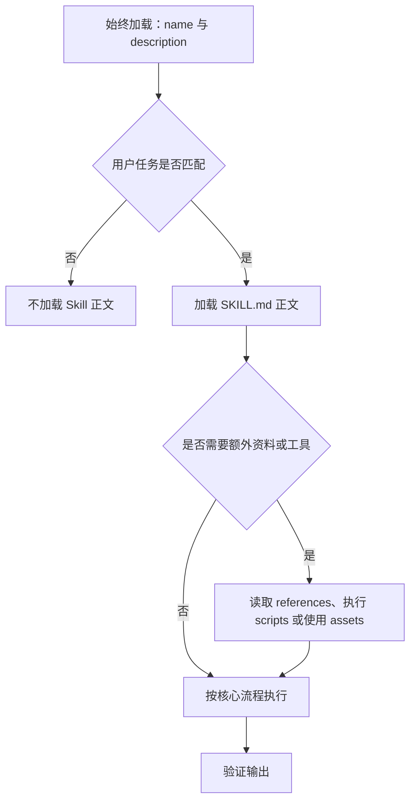
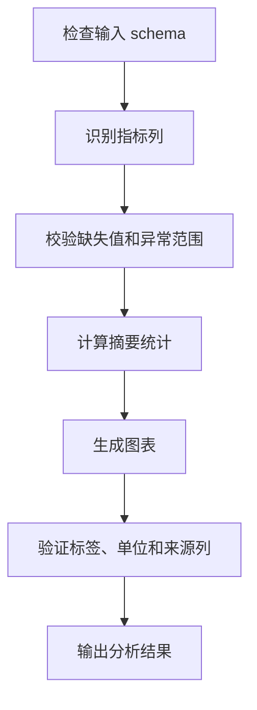
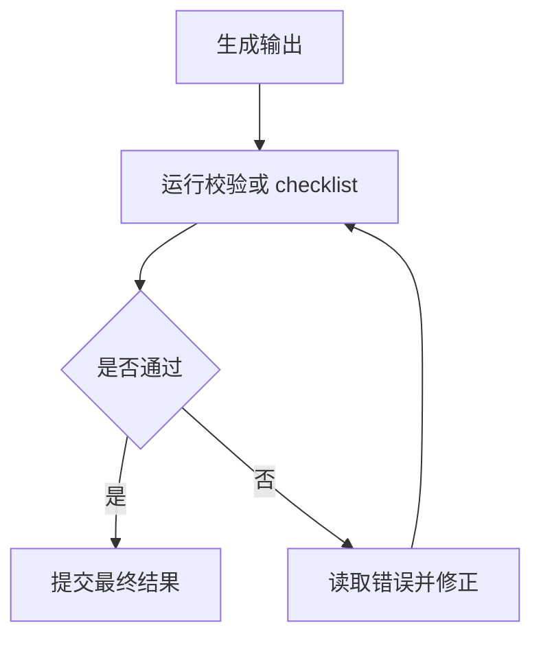
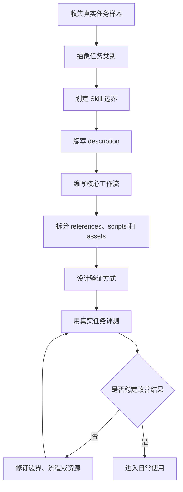
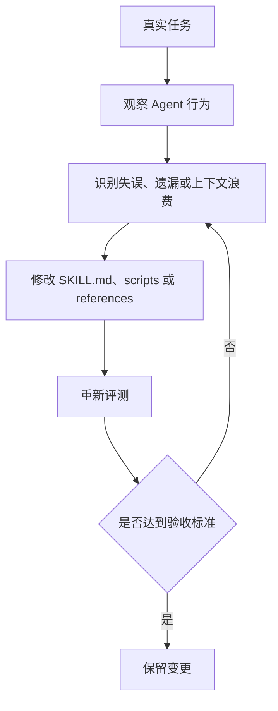
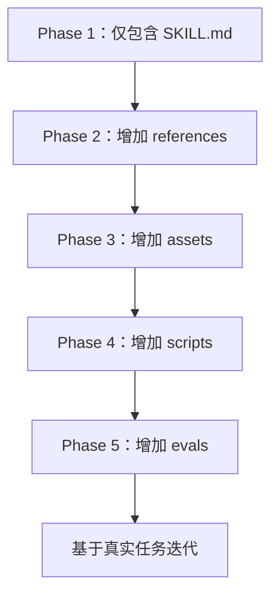

# Skill writing methodology

调研日期：2026-06-10

整改日期：2026-06-11

## 结论

高质量 Skill 的目标不是扩展提示词长度，而是将某类任务中模型缺少、容易遗漏、执行不稳定或需要复用的知识与流程封装为可发现、可加载、可验证的能力单元。

Skill 应使 Agent 在适用任务中自动识别相关能力，读取必要流程，并在需要时调用脚本、参考资料和模板。其价值取决于是否能降低重复解释成本、提升任务一致性，并提供明确的验证方式。

## Skill 的基本定义

根据 Agent Skills 规范和 Anthropic 的公开说明，Skill 是一个目录，至少包含一个 `SKILL.md` 文件，也可以包含 `scripts/`、`references/`、`assets/` 等资源。

典型结构：

```text
skill_name/
  SKILL.md
  scripts/
  references/
  assets/
```

`SKILL.md` 必须包含 YAML frontmatter 和 Markdown 指令：

```md
---
name: skill-name
description: A clear description of what this skill does and when to use it.
---

# Skill Name

Follow these instructions when the skill is active.
```

核心组成：

- `name`：Skill 的机器可识别名称。
- `description`：Agent 判断是否触发 Skill 的主要依据。
- `SKILL.md` 正文：触发后加载的操作方法。
- `scripts/`：重复、确定性强、易错步骤的脚本实现。
- `references/`：按需读取的领域知识、规范、API 文档或 schema。
- `assets/`：模板、图片、字体、样例文件或脚手架。

## 好 Skill 的判断标准

### 1. 触发准确

Skill 应在适用任务中被触发，并避免在相邻但不适用的任务中误触发。`description` 应描述用户意图，而不是只描述内部实现。

不充分的写法：

```yaml
description: Helps with PDFs.
```

更明确的写法：

```yaml
description: Use this skill when the user needs to extract text or tables from PDFs, fill PDF forms, merge PDF files, inspect form fields, or transform PDF content into structured outputs.
```

判断标准：

- 是否说明任务类型。
- 是否说明适用场景。
- 是否覆盖用户不会直接说出 Skill 名称的情况。
- 是否限制了相邻任务的误触发。

### 2. 增量价值明确

Skill 应提供模型默认不知道或不能稳定执行的内容，例如：

- 项目约定。
- 组织流程。
- 特定 API 的使用方式。
- 业务规则。
- 文件格式陷阱。
- 常见失败模式。
- 输出验收标准。
- 用户已明确表达的偏好。

不宜纳入 Skill 的内容包括通用常识、空泛原则和不会影响执行质量的背景说明。

### 3. 范围清晰

Skill 应解决一类边界明确的任务，并能够与其他 Skills 组合。范围过窄会导致任务需要加载过多 Skills；范围过宽会造成触发边界模糊和正文过长。

设计时应检查：

- Skill 是否服务同一类用户意图。
- 是否能用一句话描述工作对象和产物。
- 是否包含本应由其他 Skill 负责的任务。
- 是否与已有 Skill 存在职责重叠。

### 4. 使用渐进式披露

Skill 应控制上下文成本。只有触发判断所需的信息应始终可见，复杂资料应按需加载。



写法原则：

- `SKILL.md` 保留核心流程、关键风险和资源导航。
- 长篇背景知识放到 `references/`。
- 固定模板放到 `assets/`。
- 重复逻辑放到 `scripts/`。
- 在 `SKILL.md` 中明确何时读取或执行额外资源。

### 5. 提供默认路径

Skill 应给出默认方法和少量条件化分支，而不是列出一组平等选项。

不充分的写法：

```md
You can use pdfplumber, pypdf, PyMuPDF, OCR tools, or any other PDF library.
```

更明确的写法：

```md
Use `pdfplumber` for text extraction. For scanned PDFs, fall back to OCR with `pdf2image` and `pytesseract`.
```

### 6. 描述流程而非目标

Skill 正文应描述可执行步骤，并说明输入、决策点和输出。



对应的步骤可以写为：

```md
1. Inspect the input schema and identify metric columns.
2. Validate missing values and abnormal ranges.
3. Compute summary statistics.
4. Create the requested chart.
5. Verify labels, units, and source columns before finalizing.
```

### 7. 具备验证机制

Skill 应说明如何判断输出是否符合要求。常见验证方式包括：

- 运行脚本校验。
- 对照 checklist。
- 与 schema 或模板比对。
- 使用测试 prompt 回归。
- 与无 Skill baseline 对比。



### 8. 安全、透明、可审计

Skill 可能包含指令、脚本和资产，因此需要审计其行为边界。

安全要求：

- 不隐藏网络访问、文件访问或外部依赖。
- 不包含越权、外传或规避审计的指令。
- 对脚本依赖和权限写清楚。
- 使用第三方 Skill 前检查 `SKILL.md`、脚本和资产。
- 对高风险操作采用 plan-validate-execute 流程。

## Skill 编写流程



### Step 1: 从真实任务开始

应先收集已经发生或高频出现的任务，而不是从抽象能力名称开始。

需要收集：

- 真实用户请求。
- 成功完成任务的步骤。
- Agent 被纠正过的位置。
- 输入文件和输出文件。
- 项目约定、术语和模板。
- 失败案例和修复方式。

输出应是一句边界定义：

```text
这个 Skill 帮助 Agent 在什么场景下，基于什么输入，产出什么结果。
```

### Step 2: 划定边界

应同时说明 Skill 负责的任务和不负责的任务。

示例：

```text
article_note_skill

负责：
- 阅读长文章、网页、PDF 或用户粘贴文本。
- 输出结构化中文学习笔记。
- 提炼观点、方法、例子、行动建议和待验证问题。

不负责：
- 不主动联网搜索补充事实，除非用户明确要求。
- 不做全文翻译。
- 不替代学术引用审校。
```

### Step 3: 设计触发描述

`description` 是触发判断的主要依据。推荐结构：

```text
Use this skill when [user intent], especially when [signals / contexts / file types]. It helps [core workflow / outcome]. Do not use for [near-miss boundary] if needed.
```

示例：

```yaml
description: Use this skill when the user wants to turn long articles, web pages, PDFs, or pasted text into structured Chinese learning notes. Use it for extracting key arguments, methods, examples, action items, and review questions, even if the user only says "summarize this" or "make notes from this."
```

测试 `description` 时，应准备两类 query：

- should-trigger：应触发 Skill 的真实请求。
- should-not-trigger：共享关键词但不应触发 Skill 的相邻请求。

### Step 4: 编写核心工作流

`SKILL.md` 正文应优先写执行步骤。推荐结构：

```md
# Skill Name

## Workflow

1. Inspect the user's input and identify the task type.
2. Load additional references only when needed.
3. Execute the task using the default method.
4. Validate the result.
5. Return the final output in the requested format.

## Output Format

[template]

## Gotchas

- Concrete mistake the agent is likely to make.
- Project-specific convention.
- Boundary that should not be crossed.
```

### Step 5: 拆分资源

| 内容类型 | 存放位置 | 示例 |
|---|---|---|
| 每次都要看的流程 | `SKILL.md` | 工作流、关键约束、gotchas |
| 长篇知识 | `references/` | API 文档、schema、术语表、品牌规范 |
| 可执行逻辑 | `scripts/` | 文件转换、校验、生成、分析 |
| 输出素材 | `assets/` | 模板、字体、图片、样例项目 |
| 测试用例 | `evals/` | prompts、expected outputs、fixtures |

### Step 6: 脚本化确定性步骤

适合放进 `scripts/` 的任务：

- 重复编写相同代码。
- 对格式要求严格。
- 需要稳定校验。
- 需要解析复杂文件。
- 需要批量处理。
- 出错成本较高。

脚本设计原则：

- 避免交互式询问。
- 提供 `--help`。
- 参数清晰。
- 错误信息可操作。
- 输出结构化结果，例如 JSON。
- 写清依赖和版本要求。

### Step 7: 建立最小评测

至少准备 2-3 个真实测试 prompt。每个 eval 可以包含：

```json
{
  "id": "case_1",
  "prompt": "真实用户请求",
  "expected_output": "成功结果的关键特征",
  "files": []
}
```

建议比较：

- with_skill：使用 Skill。
- without_skill：不使用 Skill。
- old_skill：旧版本 Skill。

观察指标：

- 是否正确触发。
- 是否按流程执行。
- 是否控制上下文成本。
- 是否执行验证。
- 是否在边缘情况中保持稳定。
- 是否相较无 Skill 基线有明显改进。

### Step 8: 持续迭代

Skill 的初版通常只覆盖已知任务。应通过真实任务持续修订。



改进来源包括：

- 用户纠正内容。
- Agent 选择错误路径的记录。
- 多次重复生成的临时代码。
- 输出中反复缺失的字段。
- 触发过宽或过窄的请求。
- 人工验收中反复指出的问题。

## 可参考的 Skill 示例

### 1. Minimal template skill

来源：[Anthropic skills template](https://github.com/anthropics/skills/tree/main/template)。

用途：

- 理解最小目录结构。
- 理解 `SKILL.md` frontmatter 的基本格式。
- 确认一个 Skill 的最低必需内容。

### 2. skill-creator

来源：[Anthropic skill-creator 示例](https://github.com/anthropics/skills/tree/main/skills/skill-creator) 和本地 Codex `skill-creator` Skill。

用途：

- 学习如何将 Skill 创建流程本身写成 Skill。
- 学习如何纳入测试、评估、迭代和 description 优化。
- 学习如何围绕真实任务和 eval 设计能力包。

### 3. mcp-builder

来源：[Anthropic mcp-builder 示例](https://github.com/anthropics/skills/tree/main/skills/mcp-builder)。

用途：

- 学习技术开发类 Skill 的结构。
- 学习“研究、规划、实现、验证”的阶段化流程。
- 学习如何沉淀工具命名、错误信息和上下文管理原则。

### 4. 文档类 Skills

来源：

- [docx Skill](https://github.com/anthropics/skills/tree/main/skills/docx)
- [pdf Skill](https://github.com/anthropics/skills/tree/main/skills/pdf)
- [pptx Skill](https://github.com/anthropics/skills/tree/main/skills/pptx)
- [xlsx Skill](https://github.com/anthropics/skills/tree/main/skills/xlsx)

用途：

- 学习复杂文件格式任务如何结合脚本、参考文档和渲染检查。
- 学习如何将格式细节拆分到 `references/`。
- 学习如何设计验证步骤。

### 5. brand-guidelines

来源：[Anthropic brand-guidelines 示例](https://github.com/anthropics/skills/tree/main/skills/brand-guidelines)。

用途：

- 学习组织知识和资产如何打包为 Skill。
- 学习如何使用 `assets/`。
- 学习如何减少品牌要求的重复说明。

### 6. webapp-testing

来源：[Anthropic webapp-testing 示例](https://github.com/anthropics/skills/tree/main/skills/webapp-testing)。

用途：

- 学习验收导向的 Skill 结构。
- 学习如何把验证步骤写入工作流。
- 学习如何处理多步骤工程任务。

## 推荐模板

````md
---
name: concise-skill-name
description: Use this skill when [specific user intent], especially when [signals, file types, tools, contexts]. It helps [agent capability / outcome]. Do not use for [near-miss boundary] if important.
---

# Concise Skill Name

## Goal

Enable the agent to [complete a coherent class of tasks] by following [domain-specific workflow / project convention].

## Workflow

1. Identify the user's concrete goal and input artifacts.
2. Choose the default path below.
3. Load additional references only when the task matches their trigger.
4. Use bundled scripts for deterministic or repetitive steps.
5. Validate the result before final response.

## Defaults

- Use [default tool / method] for [common case].
- Use [fallback] only when [condition].

## References

- Read `references/schema.md` when the task touches database fields.
- Read `references/api_errors.md` only after an API call fails.

## Scripts

- `scripts/validate.py`: validate generated output.
- `scripts/convert.py`: convert input files into the expected format.

## Output Format

Use this structure unless the user asks otherwise:

```markdown
# [Title]

## Summary

## Key Findings

## Evidence

## Next Actions
```

## Gotchas

- [Concrete project-specific trap.]
- [Non-obvious naming or format rule.]
- [Boundary condition.]

## Validation

Before finalizing:

1. Check [condition].
2. Run `python scripts/validate.py [output]` when an output file is produced.
3. Fix validation errors and rerun.
````

## 反模式清单

应避免以下问题：

- `description` 只写 `helps with X`。
- 在正文中才说明触发条件。
- 将所有参考资料放入 `SKILL.md`。
- 提供大量平等选项但不提供默认路径。
- 只写原则，不写流程。
- 过度使用绝对命令，导致无法适应上下文。
- 缺少输出模板。
- 缺少边界和 gotchas。
- 缺少测试 prompt。
- 脚本缺少错误信息或 `--help`。
- 使用第三方 Skill 前不审计内容。

## 学习路线



阶段目标：

1. `SKILL.md`：练习 frontmatter、description、workflow 和 output template。
2. `references/`：练习按需读取参考文件。
3. `assets/`：练习复用固定输出模板。
4. `scripts/`：练习校验标题、章节、链接和空段落。
5. `evals/`：使用文章链接、长文本和 PDF 三类 prompt 做回归。

## 编写前检查问题

1. 该任务是否反复出现。
2. 用户是否经常重复解释同一套要求。
3. Agent 是否在某些步骤上经常失败。
4. 该任务是否具有相对固定的输入和输出。
5. 哪些内容是模型默认不知道的。
6. 哪些内容应该每次加载。
7. 哪些内容应该按需读取。
8. 哪些步骤应该脚本化。
9. Skill 的职责边界在哪里。
10. 哪些请求应触发 Skill。
11. 哪些相似请求不应触发 Skill。
12. 如何验证 Skill 相较无 Skill 基线有改进。

## 资料来源

- [Agent Skills specification](https://agentskills.io/specification)
- [Best practices for skill creators](https://agentskills.io/skill-creation/best-practices)
- [Optimizing skill descriptions](https://agentskills.io/skill-creation/optimizing-descriptions)
- [Evaluating skill output quality](https://agentskills.io/skill-creation/evaluating-skills)
- [Using scripts in skills](https://agentskills.io/skill-creation/using-scripts)
- [Anthropic engineering: Equipping agents for the real world with Agent Skills](https://www.anthropic.com/engineering/equipping-agents-for-the-real-world-with-agent-skills)
- [Anthropic public skills repository](https://github.com/anthropics/skills)
- [Semantic supply-chain risk paper](https://arxiv.org/abs/2605.11418)
