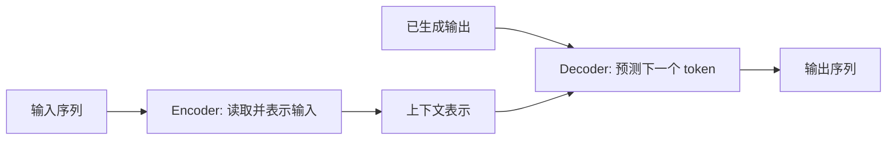
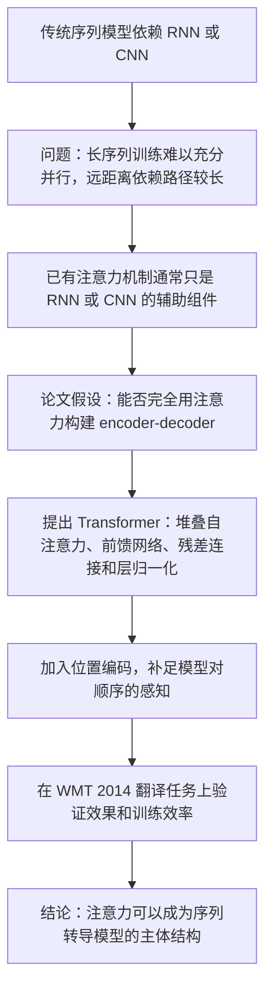
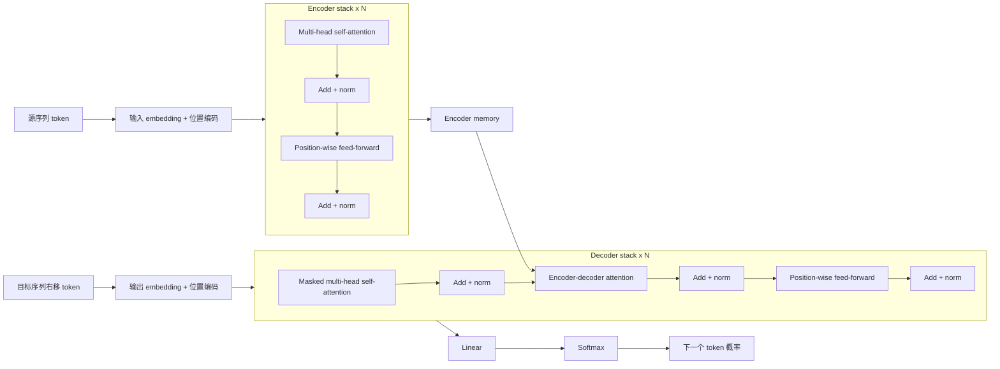

# Attention Is All You Need

## 基本信息

- 论文标题：Attention Is All You Need
- 作者：Ashish Vaswani, Noam Shazeer, Niki Parmar, Jakob Uszkoreit, Llion Jones, Aidan N. Gomez, Lukasz Kaiser, Illia Polosukhin
- 发表会议：NeurIPS 2017
- 本地 PDF：[attention_is_all_you_need.pdf](attention_is_all_you_need.pdf)
- 算法与 CUDA 实现补充：[transformer_algorithm_and_cuda.md](transformer_algorithm_and_cuda.md)
- 外部来源：[arXiv](https://arxiv.org/abs/1706.03762), [NeurIPS Proceedings](https://proceedings.neurips.cc/paper/2017/hash/3f5ee243547dee91fbd053c1c4a845aa-Abstract.html), [Google Research](https://research.google/pubs/attention-is-all-you-need/)

## 核心概括

这篇论文提出 Transformer：一种不依赖循环神经网络和卷积神经网络，而主要依靠注意力机制处理序列到序列任务的模型架构。它的关键价值不是只提出一个新组件，而是证明自注意力可以成为机器翻译这类序列建模任务的主体结构。

## 初学者需要的前置知识

### 序列到序列任务

序列到序列任务指输入和输出都是序列的任务，例如机器翻译。输入可以是一句英文，输出可以是一句德文。传统神经机器翻译常使用 encoder-decoder 结构：encoder 读取输入句子并生成中间表示，decoder 根据中间表示逐步生成输出句子。

### Encoder-decoder 架构

Encoder-decoder 是序列到序列任务中常见的模型组织方式。它把问题拆成两个阶段：

- encoder：负责读取完整输入序列，并把输入压缩或转换成一组连续表示。
- decoder：负责根据 encoder 输出的表示和已经生成的输出，逐步预测下一个 token。

以机器翻译为例，encoder 读取英文句子，生成一组表示英文语义和上下文关系的向量；decoder 读取这些向量，并从起始符开始逐词生成德文句子。这个架构的关键不是某一种具体神经网络，而是一种信息流分工：encoder 解决“理解输入”，decoder 解决“生成输出”。



早期 encoder-decoder 模型通常用 RNN 或 LSTM 实现。后来注意力机制被加入 decoder，使 decoder 在每一步生成时不只依赖一个固定向量，而是可以动态查看 encoder 的所有位置。Transformer 继承了 encoder-decoder 的分工，但把 encoder 和 decoder 内部的主要计算都换成了 self-attention、cross-attention 和 feed-forward network。

需要注意的是，并非所有 Transformer 都必须同时包含 encoder 和 decoder。原始论文面向机器翻译，因此使用完整 encoder-decoder 架构；BERT 主要使用 encoder；GPT 系列主要使用 decoder。

### RNN、CNN 与并行化限制

RNN 按时间步处理序列，第 `t` 个位置依赖第 `t - 1` 个位置的隐藏状态。这种结构适合表达顺序，但训练时难以在同一个样本内部完全并行。CNN 可以并行处理多个位置，但要让远距离词之间建立联系，通常需要堆叠多层卷积。

论文的出发点是：如果模型能够让任意两个位置直接交互，同时又能并行计算，就可能更高效地学习长距离依赖。

### 注意力机制

注意力机制可以理解为一种“按相关性汇总信息”的方法。给定一个查询 `query`，模型会比较它和多个 `key` 的匹配程度，再按权重汇总对应的 `value`。在翻译任务中，这让 decoder 在生成某个词时，可以动态关注输入句子的不同位置。

### 自注意力

自注意力是注意力机制的一种特殊形式：`query`、`key`、`value` 都来自同一个序列。它让序列中的每个位置都可以查看同一序列中的其他位置，并据此更新自己的表示。例如，一个词可以直接参考句子中较远位置的主语、宾语或修饰词。

### BLEU

BLEU 是机器翻译常用指标，用来衡量模型输出译文与参考译文的重合程度。它不是完美的语义指标，但在机器翻译论文中常用于横向比较。

## 论文脉络



论文的论证顺序比较清晰：

1. 先指出 RNN 的核心瓶颈是顺序计算，尤其在长序列上限制训练效率。
2. 再说明 CNN 虽然更容易并行，但远距离位置之间需要多层传递。
3. 然后提出 Transformer，用自注意力直接连接任意两个位置。
4. 接着定义模型结构，包括 encoder、decoder、scaled dot-product attention、multi-head attention、feed-forward network 和 positional encoding。
5. 最后用机器翻译和句法分析实验说明该结构的效果、效率和迁移能力。

## Transformer 的整体结构

Transformer 仍然采用 encoder-decoder 框架，但每一侧都不再使用 RNN 或 CNN。



这张图可以按三条线理解：

- encoder 线：源序列先变成 embedding，并加入位置编码；随后通过 `N` 个 encoder layer，得到 `encoder memory`。
- decoder 线：目标序列右移后进入 decoder；masked self-attention 保证生成当前位置时看不到未来 token。
- cross-attention 线：decoder 在 encoder-decoder attention 中读取 `encoder memory`，把源序列信息用于目标 token 预测。

### Encoder

Encoder 由 `N = 6` 个相同层堆叠而成。每层包含两个子层：

- multi-head self-attention：让输入序列的每个位置关注输入序列中的其他位置。
- position-wise feed-forward network：对每个位置独立应用同一个两层前馈网络。

每个子层外面都有残差连接和层归一化，形式可以概括为：

```text
LayerNorm(x + Sublayer(x))
```

残差连接帮助深层网络训练，层归一化帮助稳定每层的数值分布。

### Decoder

Decoder 也由 `N = 6` 个相同层堆叠而成。相比 encoder，每层多一个 encoder-decoder attention 子层：

- masked multi-head self-attention：只允许当前位置关注已经生成的位置，不能看到未来词。
- encoder-decoder attention：decoder 以自身状态作为 query，关注 encoder 输出的 key 和 value。
- position-wise feed-forward network：对每个输出位置做非线性变换。

这种设计保持了自回归生成方式：生成第 `i` 个 token 时，只能依赖第 `i` 个位置之前的输出。

## 注意力机制的核心

### Scaled Dot-Product Attention

论文使用的注意力形式是 scaled dot-product attention：

```text
Attention(Q, K, V) = softmax(QK^T / sqrt(d_k))V
```

其中：

- `Q` 是 query 矩阵，表示当前要查询什么。
- `K` 是 key 矩阵，表示可被匹配的信息索引。
- `V` 是 value 矩阵，表示最终被加权汇总的信息内容。
- `sqrt(d_k)` 是缩放因子，用来避免点积数值过大导致 softmax 梯度过小。

初学者可以把它理解为三步：

1. 用 `QK^T` 计算每个位置对其他位置的相关性。
2. 用 softmax 把相关性变成权重。
3. 用这些权重对 `V` 做加权求和，得到新的表示。

### Multi-Head Attention

Multi-head attention 不是只做一次注意力，而是把表示投影到多个子空间中并行做注意力，再拼接结果。论文的 base model 使用 `h = 8` 个 head，每个 head 的 `d_k = d_v = 64`。

它的意义是让模型在不同 head 中学习不同关系。例如，一个 head 可能关注主谓关系，另一个 head 可能关注相邻短语，还有一个 head 可能关注长距离依赖。论文也指出，多个 attention head 可以提升模型对不同位置和不同表示子空间的联合建模能力。

## 为什么还需要位置编码

自注意力本身不包含顺序概念。如果打乱输入 token 的顺序，纯注意力机制无法天然知道哪个词在前、哪个词在后。因此 Transformer 在输入 embedding 中加入 positional encoding。

论文采用正弦和余弦函数构造位置编码：

```text
PE(pos, 2i) = sin(pos / 10000^(2i / d_model))
PE(pos, 2i + 1) = cos(pos / 10000^(2i / d_model))
```

选择这种编码的动机是：模型可能更容易学习相对位置关系，并且有机会外推到训练时未见过的更长序列。论文也尝试了 learned positional embedding，结果与正弦位置编码接近。

## 为什么自注意力有优势

论文从三方面比较 self-attention、RNN 和 CNN：

- 计算复杂度：当序列长度 `n` 小于表示维度 `d` 时，自注意力通常比循环层更有优势。
- 并行能力：self-attention 的顺序操作数是 `O(1)`，RNN 是 `O(n)`。
- 长距离依赖路径：self-attention 中任意两个位置可以直接交互，最大路径长度是 `O(1)`；RNN 的路径长度是 `O(n)`。

这解释了为什么 Transformer 在机器翻译中既能提高训练效率，也能更好地处理长距离依赖。

## 训练设置与实验结果

论文主要在 WMT 2014 英德翻译和英法翻译任务上评估模型。

关键训练设置包括：

- 英德数据约 450 万句对，使用 byte-pair encoding，词表约 37000。
- 英法数据约 3600 万句对，使用 word-piece vocabulary，词表约 32000。
- base model 在 8 张 NVIDIA P100 GPU 上训练 100000 step，约 12 小时。
- big model 训练 300000 step，约 3.5 天。
- 优化器使用 Adam，并采用 warmup 后按步数平方根衰减的学习率策略。
- 使用 dropout 和 label smoothing 做正则化。

主要结果：

- WMT 2014 英德翻译：Transformer big 达到 28.4 BLEU，超过此前最佳结果，包括集成模型。
- WMT 2014 英法翻译：Transformer big 达到 41.8 BLEU，训练成本低于此前许多强模型。
- 在英文 constituency parsing 上，Transformer 也取得了有竞争力的结果，说明结构不只适用于翻译。

## 对初学者的阅读建议

第一次读这篇论文时，不必先陷入所有公式和表格。建议按以下顺序理解：

1. 先读摘要和引言，抓住论文要解决的问题：减少序列模型中的顺序计算。
2. 再看 Figure 1，理解 encoder-decoder、attention、feed-forward、residual 和 normalization 的位置关系。
3. 接着读 Section 3.2，弄清 `Q`、`K`、`V` 和 multi-head attention。
4. 再读 Section 3.5，理解为什么没有 RNN/CNN 后必须加入位置编码。
5. 最后读 Section 4 和 Section 6，理解作者如何证明 self-attention 的效率优势和实验效果。

## 这篇论文的核心贡献

这篇论文的贡献可以概括为四点：

1. 提出完全基于注意力机制的 encoder-decoder 架构 Transformer。
2. 用 multi-head attention 提升模型从不同表示子空间捕捉关系的能力。
3. 用 positional encoding 解决无循环、无卷积结构中的顺序信息问题。
4. 在机器翻译任务上同时证明了质量、并行效率和训练成本优势。

## 容易误解的地方

- “Attention is all you need” 并不表示模型只有 attention。Transformer 还包含 embedding、position-wise feed-forward network、残差连接、层归一化、位置编码、softmax 等组件。
- Transformer 的 decoder 生成过程仍然是自回归的。论文减少的是训练和表示计算中的顺序依赖，不是完全消除生成时的逐 token 输出。
- 自注意力的复杂度是 `O(n^2 * d)`，对很长序列并不天然便宜。论文也提到未来可研究局部或受限 attention。
- 位置编码不是可有可无的装饰。没有 RNN/CNN 时，模型需要额外机制获得顺序信息。

## 后续影响

Transformer 后来成为大语言模型、机器翻译、文本理解、多模态模型等领域的重要基础架构。BERT、GPT 系列以及许多视觉和语音模型都可以看作是在 Transformer 思路上的扩展或变体。对初学者来说，这篇论文最重要的学习价值是理解：现代大模型的核心并不是“更大的 RNN”，而是围绕 attention、并行训练和可扩展表示学习重新组织序列建模方式。
