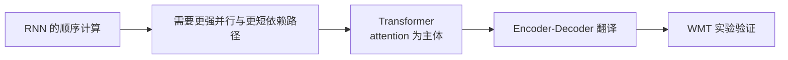
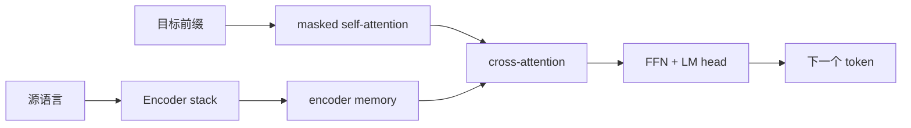

# Attention Is All You Need

## 论文信息

| 项目 | 内容 |
| --- | --- |
| 标题 | Attention Is All You Need |
| 作者 | Ashish Vaswani 等 |
| 发表 | NeurIPS 2017 |
| 本地原文 | [attention_is_all_you_need.pdf](attention_is_all_you_need.pdf) |
| 原始来源 | [arXiv](https://arxiv.org/abs/1706.03762)、[NeurIPS Proceedings](https://proceedings.neurips.cc/paper/2017/hash/3f5ee243547dee91fbd053c1c4a845aa-Abstract.html) |

## 核心结论

论文提出 Transformer：用 attention 作为序列信息交互主体的 Encoder-Decoder 架构。它以 self-attention、FFN、残差、LayerNorm 和位置编码完成机器翻译，并显著提高训练并行性。

## 论文脉络

| 论文问题 | 核心回答 |
| --- | --- |
| 为什么不继续使用 RNN？ | RNN 按时间步计算，训练并行度受限。 |
| token 如何建立远距离关系？ | self-attention 让任意位置可直接交互。 |
| 没有循环，如何表示顺序？ | 将位置编码加到 token embedding。 |
| 如何生成译文？ | Decoder 使用目标前缀和 encoder memory 逐 token 预测。 |

## 原论文结构

| 模块 | 作用 |
| --- | --- |
| Embedding + position | 将 token id 表示为带顺序的向量。 |
| Encoder | 让源语言 token 互相读取上下文。 |
| Encoder memory | 最后一层 Encoder 的上下文表示序列。 |
| Decoder | 读取目标前缀，并通过 cross-attention 读取源句。 |
| 输出层 | 将最终表示映射为词表概率。 |

## 论文的核心组成

| 概念 | 公式或结构 | 专题说明 |
| --- | --- | --- |
| Attention | `softmax(QK^T / sqrt(d_k))V` | [Transformer Attention](transformer_attention.md) |
| Multi-head | 多组 Q/K/V 投影，concat 后经 `W^O` | [Transformer Attention](transformer_attention.md) |
| 输入表示 | embedding + positional encoding | [机器学习基础](machine_learning_prerequisites.md) |
| Decoder 训练 | right shift + causal mask + loss | [Transformer 训练](transformer_training.md) |
| 推理 | 自回归生成、KV cache | [Transformer 推理](transformer_inference.md) |

## 实验结果与边界

论文在 WMT 2014 英德、英法翻译任务上验证模型。Transformer big 在英德任务上达到 28.4 BLEU，在英法任务上达到 41.8 BLEU。

原论文是完整的 Encoder-Decoder 翻译模型，不等同于后来的 BERT 或 GPT：

- BERT 常以 Encoder 为主体，适合理解类任务。
- GPT 类 LLM 常为 decoder-only，重点是自回归生成。
- 原论文中的 Encoder 与 cross-attention 仍是理解翻译、检索增强和多模态模型的重要基础。

## 从论文到 LLM

若目标是理解现代 LLM 的构成，不必先沉入翻译实验细节。建议阅读 [从 Attention Is All You Need 到 LLM](llm_reading_guide.md)，再沿以下分流深入：

| 目标 | 阅读 |
| --- | --- |
| 理解 LLM 的基础结构 | [Decoder-only LLM 总览](decoder_only_llm.md) |
| 理解 checkpoint 和参数布局 | [训练后模型构成](transformer_model_composition.md) |
| 理解训练 | [Decoder-only LLM 训练](decoder_only_llm_training.md) |
| 理解推理 | [Decoder-only LLM 推理](decoder_only_llm_inference.md) |
| 理解算子与 CUDA | [Transformer 算法与 CUDA](transformer_algorithm_and_cuda.md) |
