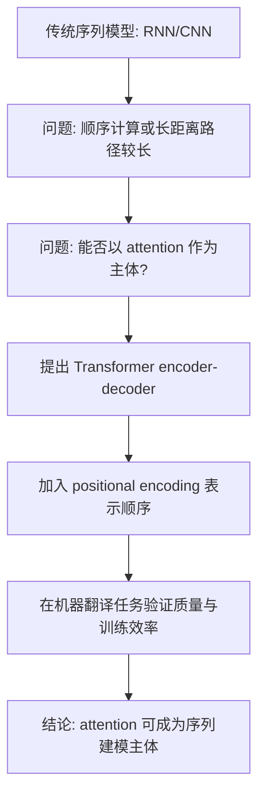
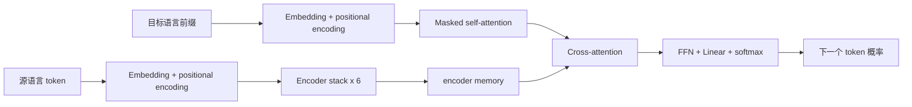

# Attention Is All You Need

## 论文信息

| 项目 | 内容 |
| --- | --- |
| 标题 | Attention Is All You Need |
| 作者 | Ashish Vaswani 等 |
| 发表 | NeurIPS 2017 |
| 本地原文 | [attention_is_all_you_need.pdf](attention_is_all_you_need.pdf) |
| 原始来源 | [arXiv](https://arxiv.org/abs/1706.03762)、[NeurIPS Proceedings](https://proceedings.neurips.cc/paper/2017/hash/3f5ee243547dee91fbd053c1c4a845aa-Abstract.html) |
| 相关笔记 | [前置知识](transformer_prerequisites.md)、[算法与 CUDA 实现](transformer_algorithm_and_cuda.md) |

## 核心结论

论文提出 Transformer：一种以 attention 为主要信息交互机制的 encoder-decoder 架构。它不再依赖 RNN 的逐步状态传递，也不以 CNN 作为序列建模主体；通过 self-attention、前馈网络、残差连接、层归一化和位置编码完成机器翻译。

| 论文回答的问题 | Transformer 的回答 |
| --- | --- |
| RNN 为什么训练慢？ | 同一样本中的位置可并行计算，不必按时间步依次处理。 |
| 如何建立远距离依赖？ | 任意两个位置可在一层 self-attention 中直接交互。 |
| 没有循环结构，如何识别顺序？ | 将 positional encoding 加到 token embedding 上。 |
| 如何生成译文？ | Decoder 结合已生成前缀和 Encoder 输出，逐 token 预测。 |

## 论文脉络



论文的论证顺序如下：

1. 指出 RNN 的顺序计算限制并行训练，长序列中的信息传递路径也较长。
2. 以 attention 替代循环和卷积，构建完整的 encoder-decoder 模型。
3. 说明 scaled dot-product attention、multi-head attention 和位置编码的设计。
4. 在 WMT 2014 英德、英法翻译任务上比较结果与训练成本。

## Transformer 整体结构

原始 Transformer 由 6 层 Encoder 和 6 层 Decoder 组成。源语言句子先被 Encoder 转为 `encoder memory`；Decoder 通过 masked self-attention 阅读已生成前缀，再通过 cross-attention 读取这组 memory，输出下一个 token 的概率。



| 模块 | 主要组成 | 作用 |
| --- | --- | --- |
| 输入表示 | token embedding + positional encoding | 表示 token 内容和位置。 |
| Encoder | self-attention + FFN | 让每个源 token 融合完整输入上下文。 |
| Encoder memory | 最后一层 Encoder 输出 | 给 Decoder 提供源语言上下文。 |
| Decoder | masked self-attention + cross-attention + FFN | 利用输出前缀和源语言信息生成译文。 |
| 输出层 | linear + softmax | 产生词表中各 token 的概率。 |

### Encoder

每层 Encoder 包含两个子层：multi-head self-attention 和 position-wise feed-forward network（FFN）。每个子层均带有残差连接和层归一化。

```text
A = MultiHeadSelfAttention(X, X, X)
H = LayerNorm(X + A)
F = FeedForward(H)
Y = LayerNorm(H + F)
```

Encoder 的输出不是单个句向量，而是一组上下文向量。若源句长度为 `n`，主维度为 `d_model`，则其形状为 `[n, d_model]`。这组向量称为 `encoder memory`。

### Decoder

每层 Decoder 比 Encoder 多一个 cross-attention 子层：

| 子层 | Q 的来源 | K/V 的来源 | 约束 |
| --- | --- | --- | --- |
| Masked self-attention | 目标前缀 | 目标前缀 | 不能看到未来 token。 |
| Cross-attention | Decoder 当前状态 | encoder memory | 可读取全部源 token。 |
| FFN | 当前 Decoder 表示 | 不适用 | 对每个位置独立计算。 |

这种设计保证生成第 `t` 个目标 token 时，只使用已生成部分和源句信息。

## Attention 的核心

论文使用 scaled dot-product attention：

```text
Attention(Q, K, V) = softmax(QK^T / sqrt(d_k))V
```

| 步骤 | 计算 | 输出 |
| --- | --- | --- |
| 匹配 | `QK^T` | query 与各 key 的相关性分数。 |
| 缩放 | `/ sqrt(d_k)` | 防止点积过大。 |
| 归一化 | `softmax(...)` | 每个 query 对各位置的权重，行和为 1。 |
| 汇总 | `weights @ V` | 融合 value 后的新向量。 |

`Q` 表示当前 token 想查找的特征，`K` 表示可供匹配的索引特征，`V` 表示被权重汇总的信息内容。更完整的 token、embedding、softmax 与 Q/K/V 说明见 [前置知识](transformer_prerequisites.md)。

### Multi-head attention

Multi-head attention 使用多组线性投影并行计算 attention：

```text
head_i = Attention(QW_i^Q, KW_i^K, VW_i^V)
MultiHead(Q, K, V) = Concat(head_1, ..., head_h)W^O
```

原论文 base model 使用 8 个 head，`d_model = 512`，每个 head 的 `d_k = d_v = 64`。多个 head 可以在不同表示子空间中学习关系；拼接后再用 `W^O` 混合为下一层所需的 512 维表示。

## 位置编码

attention 本身不携带 token 的先后顺序，因此模型输入为：

```text
input_vector = token_embedding + positional_encoding
```

论文的固定位置编码为：

```text
PE(pos, 2i)     = sin(pos / 10000^(2i / d_model))
PE(pos, 2i + 1) = cos(pos / 10000^(2i / d_model))
```

不同位置会得到不同的向量，不同维度使用不同频率。论文也比较了可学习位置 embedding，结果与正弦/余弦编码接近。

## 为什么 self-attention 有优势

| 维度 | Self-attention | RNN | CNN |
| --- | --- | --- | --- |
| 序列内并行 | 强 | 弱，需要按时间步计算 | 强 |
| 任意两位置的最大路径 | `O(1)` | `O(n)` | 与卷积层数相关 |
| 主要代价 | 注意力矩阵随 `n^2` 增长 | 顺序计算 | 远距离依赖需多层卷积 |

论文强调的不是 self-attention 在任何长度上都更便宜，而是它在适当序列长度下能以较短的信息路径换取更强的并行性。长序列的二次复杂度是其重要限制，也推动了后续稀疏注意力和高效 attention 研究。

## 训练设置与结果

| 项目 | 论文结果 |
| --- | --- |
| 英德数据 | WMT 2014，约 450 万句对，使用 BPE，词表约 37000。 |
| 英法数据 | WMT 2014，约 3600 万句对，使用 word-piece vocabulary，词表约 32000。 |
| 优化 | Adam、warmup 后按步数平方根衰减的学习率、dropout、label smoothing。 |
| 英德 BLEU | Transformer big 为 28.4 BLEU。 |
| 英法 BLEU | Transformer big 为 41.8 BLEU。 |
| 训练成本 | base model 在 8 张 NVIDIA P100 上训练约 12 小时；big model 约 3.5 天。 |

BLEU 衡量译文与参考译文的 n-gram 重合程度，是论文中用于横向比较的机器翻译指标。

## 阅读建议与边界

| 阅读顺序 | 关注点 |
| --- | --- |
| 1. 摘要与引言 | 为什么要减少顺序计算。 |
| 2. Figure 1 与第 3.1 节 | Encoder、Decoder 和残差/归一化的位置。 |
| 3. 第 3.2 节 | Q/K/V、scaled dot-product attention、multi-head attention。 |
| 4. 第 3.5 节 | 位置编码为何必要。 |
| 5. 第 4、6 节 | 效率比较与实验结论。 |

需要避免三种误解：

- “Attention is all you need” 不表示模型只包含 attention；FFN、残差、层归一化、embedding 和位置编码同样必需。
- Decoder 的推理仍是自回归逐 token 生成；Transformer 主要减少训练和表示计算中的顺序依赖。
- 原始 Transformer 是完整 encoder-decoder 架构，不等同于后来的 BERT 或 GPT 结构。

## 延伸阅读

- [Transformer 前置知识](transformer_prerequisites.md)
- [Transformer 算法、计算图与 CUDA 实现](transformer_algorithm_and_cuda.md)
- [Attention Is All You Need - arXiv](https://arxiv.org/abs/1706.03762)
