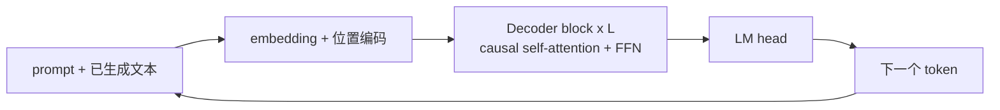
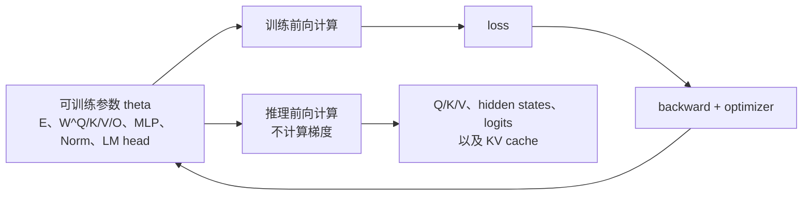

# Decoder-only LLM：架构总览

[上一篇：训练后模型构成](transformer_model_composition.md) | [返回学习路线](transformer_prerequisites.md) | [下一篇：Decoder-only LLM 训练](decoder_only_llm_training.md)

**Decoder-only LLM** 由一串带 causal mask 的 Decoder block 堆叠而成。它把指令、上下文和已生成文本放在同一条 token 序列中，并持续预测下一个 token。



## 它与原论文 Transformer 的关系

`Attention Is All You Need` 的原始模型是 Encoder-Decoder 翻译模型；主流文本生成 LLM 通常保留其中的 **masked self-attention Decoder block**，移除 Encoder 与 cross-attention。

| 对比项 | Encoder-Decoder 翻译模型 | Decoder-only LLM |
| --- | --- | --- |
| 条件信息 | 源句先经 Encoder 形成 `encoder memory M`。 | prompt 直接位于当前序列左侧。 |
| 读取条件信息 | Decoder cross-attention 读取 `M`。 | causal self-attention 读取 prompt 的历史 K/V。 |
| 核心层 | Encoder layer + Decoder layer。 | 重复堆叠同一种 Decoder block。 |
| 典型任务 | 翻译、文本到文本转换。 | 续写、对话、代码生成、指令跟随。 |

## `encoder memory` 与 cross-attention 的替代机制

不是另一个独立的“memory 模块”，而是**同一条序列上的 causal self-attention**。

```text
<bos> 翻译为中文: I love cats <sep> 我 喜欢 猫 <eos>
```

模型预测 `喜欢` 时，可读取左侧的指令、英文源句、分隔符和 `我`。Q/K/V 均来自这条序列当前层的表示：

```text
Q = XW^Q
K = XW^K
V = XW^V
```

| 原论文组件 | Decoder-only 中的对应物 | 边界 |
| --- | --- | --- |
| `encoder memory M` | prompt 在每层形成的历史 K/V 表示 | 不是单一的最终 Encoder 输出。 |
| cross-attention | 当前 token 对左侧上下文的 causal self-attention | Q/K/V 来自同一序列。 |
| Encoder 双向建模 | prompt 的左到右因果建模 | 普通 decoder-only prompt 也不能看右侧。 |

> KV cache 是推理优化：它缓存每层历史 K/V，避免重复计算；概念上承担条件读取的仍是 causal self-attention。

## 训练参数与推理期对象

训练完成的 decoder-only LLM 可以抽象为一组参数 `theta`。训练通过 loss 更新 `theta`；推理加载同一份 `theta`，但不再更新它。

| 模块 | 被训练并保存的参数 | 推理时的作用 |
| --- | --- | --- |
| Token embedding | embedding 表 `E` | 将输入 token id 查成初始向量。 |
| 位置表示 | 可学习位置表 `P`（若采用） | 与 token embedding 相加；若采用 RoPE 等无表方案，则没有这张可训练位置表。 |
| 每层 attention | `W_l^Q`、`W_l^K`、`W_l^V`、`W_l^O`，以及可选 bias | 将当前 layer 表示投影为 Q/K/V，计算 attention，再混合多头输出。 |
| 每层 FFN / MLP | 标准 FFN 的两层权重；现代门控 MLP 常有 gate、up、down 三组权重 | 对每个 token 表示做非线性变换。 |
| 每层 Norm | 缩放参数，及部分实现中的偏移参数 | 稳定 layer 间的数值尺度。 |
| Final Norm | 最后一层归一化的参数 | 规范化送入输出层前的表示。 |
| LM head | 词表投影 `W_vocab` 与可选 bias | 将最后位置表示映射为每个候选 token 的 logit。 |

有些模型会共享输入 embedding 与 LM head 的权重，此时它们不是两份独立矩阵。GQA、MoE、RoPE 等现代变体会改变部分参数形状或模块类型，但“参数在训练更新、推理固定复用”的边界不变。



下表中的对象在推理时也很重要，但它们**不是** checkpoint 中的可训练参数：

| 运行时对象 | 由什么产生 | 是否更新 / 保存为模型权重 |
| --- | --- | --- |
| `Q`、`K`、`V` | 当前 token 表示乘以训练好的 `W_l^Q/K/V` | 否。每次前向计算重新产生。 |
| attention 权重、hidden states、logits | 当前输入和参数的计算结果 | 否。随 prompt 和生成历史变化。 |
| KV cache | 每层历史 token 的 `K/V` | 否。仅服务当前请求，结束后可释放。 |
| token id、tokenizer、模型配置 | 输入文本或模型附带资源 | 否。它们不是神经网络权重。 |

以预测 `我` 为例：`<sep>` 的 embedding 经每层计算得到 `X^l`；再用固定的 `W_l^Q/K/V` 得到 `q_sep/k_sep/v_sep`。这些小写的 `q_sep/k_sep/v_sep` 是本次推理的中间向量；只有大写 `W_l^Q/W_l^K/W_l^V` 是训练得到、长期保存的矩阵。Decode 时，历史 K/V 会写入并复用，但历史 Q 通常不缓存；详见 [Decoder-only LLM Decode](decoder_only_llm_decode.md)。完整计算见 [Decoder-only LLM 计算链](decoder_only_llm_computation.md)。

## 为什么常用于生成式 LLM

| 原因 | 含义 |
| --- | --- |
| 下一 token 目标直接匹配 | 训练 `p(x_t | x_<t)`，生成时也按同一规则续写。 |
| 原始文本即可预训练 | 不必准备严格对齐的输入-输出句对。 |
| 任务可写成 prompt | 指令、示例、上下文和答案统一为 token 序列。 |
| 结构统一 | 参数主要是 embedding、`L` 个 Decoder block 与 LM head。 |

GPT-3 展示了以文本上下文提供任务和示例的方式；OPT 与 Llama 3 均采用 decoder-only Transformer。[GPT-3](https://openai.com/index/language-models-are-few-shot-learners/) [OPT](https://arxiv.org/abs/2205.01068) [Llama 3](https://ai.meta.com/blog/meta-llama-3/)

## 阅读分流

| 想解决的问题 | 阅读 |
| --- | --- |
| RoPE 如何写入 Q/K 的位置关系？ | [RoPE：旋转位置编码](rotary_position_embedding.md) |
| token id 如何变成 embedding、Q/K/V 和下一个 token？ | [Decoder-only LLM 计算链](decoder_only_llm_computation.md) |
| 整段样本如何训练和更新权重？ | [Decoder-only LLM 训练](decoder_only_llm_training.md) |
| 完整 prompt 如何建立 cache？ | [Decoder-only LLM Prefill](decoder_only_llm_prefill.md) |
| 新 token 如何读取 cache 并生成后续 token？ | [Decoder-only LLM Decode](decoder_only_llm_decode.md) |
| 想先比较两个推理阶段？ | [Decoder-only LLM 推理总览](decoder_only_llm_inference.md) |
| checkpoint 中有哪些参数？ | [训练后 Transformer / LLM 模型由什么构成](transformer_model_composition.md) |
| 如何带着 LLM 目标阅读原论文？ | [从 Attention Is All You Need 到 LLM](llm_reading_guide.md) |

Encoder 与 cross-attention 并未过时：在翻译、检索增强和多模态条件生成中仍很有价值。RETRO 就使用编码器与 cross-attention 来读取检索到的外部文本。[RETRO](https://arxiv.org/abs/2112.04426)
