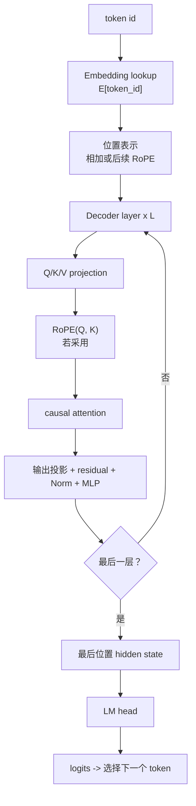

# Decoder-only LLM 计算链：从 Token 到 Logits

[上一篇：Decoder-only LLM 总览](decoder_only_llm.md) | [返回学习路线](transformer_prerequisites.md) | [下一篇：LLM Prefill](decoder_only_llm_prefill.md)

本页解释单条表示如何从 token id 变成下一个 token 的 logits。Prefill 与 Decode 的运行差异分别见 [LLM Prefill](decoder_only_llm_prefill.md) 和 [LLM Decode](decoder_only_llm_decode.md)。

```text
prompt: <bos> 翻译为中文: I love cats <sep>
目标：从最后位置预测 我
```

## 计算链



## 输入表示

| 对象 | 计算 | 形状（忽略 batch） |
| --- | --- | --- |
| token id | 词表中的整数索引 | `[sequence_length]` |
| token embedding | `E[token_id]` | `[sequence_length, d_model]` |
| 初始表示 | embedding 加位置表示 | `[sequence_length, d_model]` |

例如 `<sep>` 的 id 为 `2` 时，embedding lookup 取 `E[2]`。`E` 是可训练参数；id 本身不是语义向量。

## 一层 attention 的计算

第 `l` 层拥有独立参数 `W_l^Q/W_l^K/W_l^V/W_l^O`：

```text
Q = X^l W_l^Q
K = X^l W_l^K
V = X^l W_l^V
P = softmax(QK^T / sqrt(d_k) + causal_mask)
A = P V
```

| 张量 | 含义 | 是否为模型参数 |
| --- | --- | --- |
| `W_l^Q/W_l^K/W_l^V` | 投影矩阵 | 是。 |
| `Q/K/V` | 当前输入计算出的中间结果 | 否。 |
| `P` | attention 权重 | 否。 |
| `A` | attention 输出 | 否。 |

若使用 RoPE，先对 Q/K 按位置旋转，再计算 `QK^T`；详见 [RoPE：旋转位置编码](rotary_position_embedding.md)。

## Attention 后的子层

```text
H^l = Norm(X^l + MultiHeadAttention(X^l))
X^(l+1) = Norm(H^l + MLP(H^l))
```

| 子层 | 作用 |
| --- | --- |
| 多头输出投影 | 合并各 head 的 attention 结果。 |
| residual add + Norm | 保留输入并稳定数值。 |
| MLP | 逐位置进行非线性变换。 |

经过 `L` 层后，最后位置的表示进入 LM head：

```text
logits = h_last W_vocab + b_vocab
probabilities = softmax(logits)
```

若 `我` 的概率最高，greedy decoding 选择 `我`；采样策略则根据概率分布选择。
