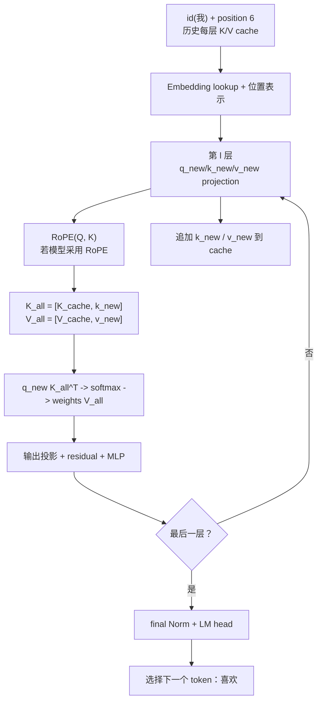
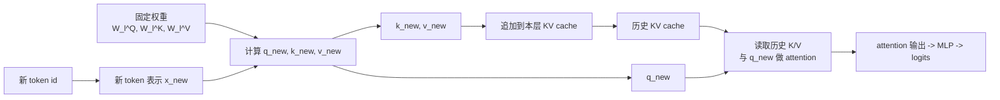
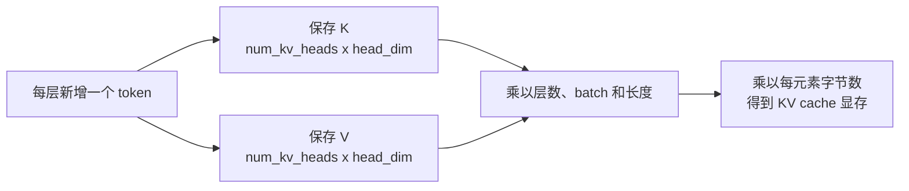

# Decoder-only LLM Decode：生成一个新 Token

[上一篇：LLM Prefill](decoder_only_llm_prefill.md) | [返回学习路线](transformer_prerequisites.md) | [下一篇：算法与 CUDA 实现](transformer_algorithm_and_cuda.md)

**Decode** 是在已有 KV cache 的条件下，让最新 token 通过模型一次，并预测再下一个 token 的阶段。

## 输入、运算与输出

以已生成 `我`、下一步预测 `喜欢` 为例：

| 类型 | 内容 | 示例 |
| --- | --- | --- |
| 输入 | 最新 token id | `input_ids = [id(我)]` |
| 输入 | 新 token 的位置 | `position_id = [6]` |
| 输入 | 每层历史 KV cache | prompt 的 `<bos> ... <sep>` 的 K/V。 |
| 输入 | 固定模型参数 | embedding、attention、MLP、Norm、LM head。 |
| 输出 | 下一个 token logits | `P(喜欢 | prompt, 我)`。 |
| 输出 | 更新后的 KV cache | 每层追加 `我` 的 K/V。 |

> 完整上下文包含 prompt 和 `我`，但程序不重新传入 prompt token id；它们已存在于 cache 中。

## 流程图



## 核心计算

第 `l` 层只对 `我` 产生新的 Q/K/V：

```text
q_new = x_我^l W_l^Q
k_new = x_我^l W_l^K
v_new = x_我^l W_l^V

K_all = [K_cache^l, k_new]
V_all = [V_cache^l, v_new]
z_我 = softmax(q_new K_all^T / sqrt(d_k)) V_all
```

`q_new` 可读取 prompt 中的英文 token 和已生成的中文 token。attention 输出经过输出投影、残差、Norm 和 MLP，逐层得到最终表示；LM head 再给出 `喜欢` 的 logits。

## 固定参数、动态 QKV 与 KV cache

在常规 GPU 推理中，模型 checkpoint 的权重先加载到 GPU 显存中，并在整个请求期间保持不变。每生成一个新 token，会在**每一层**用同一组权重计算新的 Q/K/V；这里的“新”是新的中间向量，不是更新权重。

| 对象 | 来源 | 每轮 Decode 的行为 | 是否随生成过程改变 |
| --- | --- | --- | --- |
| `W_l^Q`、`W_l^K`、`W_l^V` | 训练后的 checkpoint | 被读取并参与当前 token 的投影计算。 | 否，固定参数。 |
| `q_new`、`k_new`、`v_new` | `x_new` 与上述投影矩阵相乘 | 为当前 token 新建。 | 是，每个 token 不同。 |
| 历史 `K/V` | Prefill 和此前 Decode 轮次 | 从该层的 KV cache 读取，不再重新投影。 | cache 随序列追加而增长。 |
| 历史 `Q` | 此前轮次的中间结果 | 通常不保存，也不参与当前 token 的 attention。 | 不适用。 |
| MLP、Norm、LM head 参数 | 训练后的 checkpoint | 对当前 token 的表示继续前向计算。 | 否，固定参数。 |

> `KV cache 命中`在这里表示：当前请求所需的历史 K/V 已经保存在显存的 cache 中，可直接读取。它不是重新查找训练参数，也不等于跳过 attention；当前 token 仍要计算自己的 Q，并与全部历史 K/V 做 attention。



因此，KV cache 节省的是**历史 token 的 K/V 投影计算**：没有 cache 时，生成到第 `t` 个 token 需要反复为前 `t-1` 个位置重新计算 K/V；有 cache 时，只计算新 token 的 K/V 并追加。attention 仍需读取越来越长的 `K_all/V_all`，因此 Decode 仍按 token 串行执行，且 cache 的显存占用与上下文长度一起增长。

## KV cache 的显存占用

KV cache 不属于模型参数；它是每个请求在推理期间额外占用的运行时显存。若不考虑对齐、分页管理和框架元数据，其容量近似为：

```text
KV cache bytes
= batch_size × num_layers × sequence_length
  × 2(K 和 V) × num_kv_heads × head_dim × bytes_per_element
```

| 符号 | 含义 |
| --- | --- |
| `batch_size` | 同时处理的请求数；连续批处理时可理解为同时保留的序列数。 |
| `num_layers` | Decoder block 数；每层都有独立的 K/V。 |
| `sequence_length` | 当前已缓存的 token 数，即 prompt 加已生成 token。 |
| `2` | 每个位置同时保存 K 和 V；Q 通常不保存。 |
| `num_kv_heads` | K/V 的头数；标准 MHA 中等于 query 头数，GQA/MQA 中更少。 |
| `head_dim` | 每个注意力头的向量维度。 |
| `bytes_per_element` | 元素精度：FP16/BF16 为 2 bytes，FP32 为 4 bytes。 |

例如，一个标准多头 attention 模型有 `32` 层、`32` 个 K/V 头、`head_dim = 128`，使用 FP16，单个请求的**每新增一个 token**需要：

```text
1 × 32 × 1 × 2 × 32 × 128 × 2 bytes
= 524,288 bytes
= 512 KiB
```

若上下文长度达到 `4096`，仅 KV cache 约为 `4096 × 512 KiB = 2 GiB`。若使用 GQA，将 K/V 头数从 `32` 降为 `8`，其他条件不变，则约为 `512 MiB`。这也是现代 LLM 常采用 GQA/MQA、KV cache 量化或分页管理的原因。



模型权重的显存约为“参数量 × 每参数字节数”；KV cache 的显存则主要随 `batch_size` 和 `sequence_length` 增长。两者需要分别估算。

## 算子表

| 算子 | 本轮数据 | 作用 |
| --- | --- | --- |
| Embedding lookup | `我` 的一个 id | 生成新 token 初始向量。 |
| QKV projection（GEMM/GEMV） | 新 token 表示 | 生成 `q_new/k_new/v_new`。 |
| KV cache 读取 | 历史 K/V | 提供 prompt 和历史输出上下文。 |
| `q_new K_all^T`、softmax、`P V_all` | 一个 query 对全部历史位置 | 从上下文读取信息。 |
| KV cache 追加 | `k_new/v_new` | 供下一轮复用。 |
| MLP、LM head、采样 | 新 token 最终表示 | 选择下一 token。 |

## 两轮生成示例

| 本轮输入 | 固定读取 | 新计算 | cache 复用与更新 | 输出 token |
| --- | --- | --- | --- | --- |
| `我` | 每层的 `W_l^Q/W_l^K/W_l^V` 等固定参数 | `我` 在每层的 `q_new/k_new/v_new` | 读取 prompt 的 K/V；将 `我` 的 K/V 追加到 cache。 | `喜欢` |
| `喜欢` | 与上一轮相同的固定参数 | `喜欢` 在每层的 `q_new/k_new/v_new` | 读取 prompt + `我` 的 K/V；将 `喜欢` 的 K/V 追加到 cache。 | `猫` |

第二轮不需要再次计算 `我` 的 K/V；但它仍需读取 `我` 已缓存的 K/V，以便 `喜欢` 能关注到前文。这正是 cache 的复用边界。
