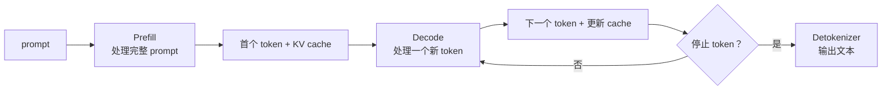

# Decoder-only LLM 推理：Prefill 与 Decode

[上一篇：Decoder-only LLM 训练](decoder_only_llm_training.md) | [返回学习路线](transformer_prerequisites.md) | [下一篇：算法与 CUDA 实现](transformer_algorithm_and_cuda.md)

推理时参数固定，没有 labels、loss、backward 或 optimizer。过程由 Prefill 和连续的 Decode 组成。



## 两阶段对比

| 维度 | Prefill | Decode |
| --- | --- | --- |
| 输入 | 完整 prompt token id。 | 最新生成的一个 token id。 |
| 计算 | prompt 全部位置并行前向。 | 单 token 前向。 |
| KV cache | 创建每层 prompt K/V。 | 读取历史 K/V，追加新 K/V。 |
| 输出 | 首个生成 token。 | 后续一个生成 token。 |
| 并行性 | token 维度可并行。 | token 间必须顺序执行。 |

## 示例

```text
prompt: <bos> 翻译为中文: I love cats <sep>
Prefill 输出: 我
Decode 1: 输入 我，输出 喜欢
Decode 2: 输入 喜欢，输出 猫
Decode 3: 输入 猫，输出 <eos>
```

## 深入阅读

| 关注点 | 文档 |
| --- | --- |
| 完整 prompt 如何计算并建立 cache | [Decoder-only LLM Prefill](decoder_only_llm_prefill.md) |
| 一个新 token 的输入、算子与输出 | [Decoder-only LLM Decode](decoder_only_llm_decode.md) |
| token 到 logits 的层内计算 | [Decoder-only LLM 计算链](decoder_only_llm_computation.md) |
| 推理引擎的调度与缓存管理 | [LLM 推理框架](/Users/fanghaolei/Workplace/Markdown/notebook/ai/ai_infra/llm_inference_frameworks.md) |
