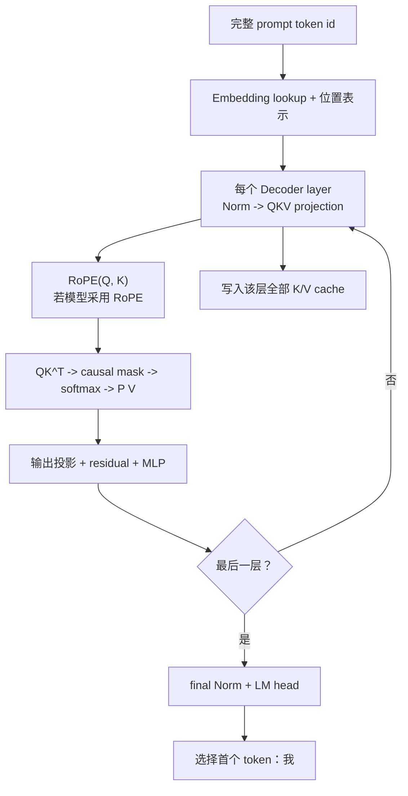

# Decoder-only LLM Prefill：处理完整 Prompt

[上一篇：LLM 计算链](decoder_only_llm_computation.md) | [返回学习路线](transformer_prerequisites.md) | [下一篇：LLM Decode](decoder_only_llm_decode.md)

**Prefill** 是推理的第一阶段：完整 prompt 一次通过模型，得到首个生成 token，并建立每层 KV cache。

## 输入与输出

| 类型 | 内容 | 示例 |
| --- | --- | --- |
| 输入 | 完整 prompt 的 token id | `<bos> 翻译为中文: I love cats <sep>` |
| 输入 | 位置 id、固定模型参数 | 位置 `0..5`，训练后的权重。 |
| 输出 | 首个 token 的 logits 与选择结果 | 从 `<sep>` 的 logits 选择 `我`。 |
| 输出 | 每层 prompt K/V cache | 供后续 Decode 读取。 |

## 流程图



## 主要算子

| 算子 | 处理范围 | 作用 |
| --- | --- | --- |
| Embedding lookup | 全部 `n` 个 prompt token | id 转为 `[n, d_model]` 表示。 |
| 位置表示 / RoPE | 全部位置 | 注入顺序信息；RoPE 作用于 Q/K。 |
| QKV projection（GEMM） | 每层全部位置 | 生成 Q、K、V。 |
| `QK^T`、mask、softmax、`PV` | 每层全部可见位置对 | 完成 causal attention。 |
| 输出投影、Norm、MLP | 每层全部位置 | 生成下一层表示。 |
| KV cache 写入 | 每层全部 K/V | 保存 prompt 上下文。 |
| LM head、选择 | 最后一个位置 | 预测首个输出 token。 |

## 示例：预测 `我`

`<sep>` 是 prompt 的最后一个 token。经过 `L` 层后，它的最终表示 `h_sep` 进入 LM head：

```text
logits = h_sep W_vocab + b
softmax(logits) -> 选择 我
```

同时，第 `l` 层保存：

```text
K_cache^l = [k_bos^l, ..., k_sep^l]
V_cache^l = [v_bos^l, ..., v_sep^l]
```

这些 cache 不是模型参数；它们只是当前请求的运行时状态。Q、attention 权重和中间 hidden state 通常不会跨轮保留。

## 与 Decode 的区别

| 维度 | Prefill | Decode |
| --- | --- | --- |
| 新输入 | 整段 prompt | 一个最新 token。 |
| 计算方式 | 对 `n` 个已知 token 并行计算。 | 每轮只计算一个新 token。 |
| cache | 创建 prompt 的 K/V。 | 读取历史 K/V，并追加新 K/V。 |
| 主要结果 | 首个 token。 | 后续每个 token。 |

RoPE 的具体位置见 [RoPE：旋转位置编码](rotary_position_embedding.md)。
