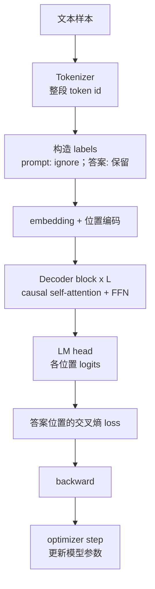

# Decoder-only LLM 训练：整段序列如何更新参数

[上一篇：Decoder-only LLM 总览](decoder_only_llm.md) | [返回学习路线](transformer_prerequisites.md) | [下一篇：Decoder-only LLM 推理](decoder_only_llm_inference.md)

训练目标只有一个：根据左侧 token，为真实下一个 token 分配更高概率。

本文聚焦 labels、loss 与参数更新。`token id -> embedding -> Q/K/V -> logits` 的逐层计算见 [Decoder-only LLM 计算链](decoder_only_llm_computation.md)。

## 示例：把翻译写成一条序列

```text
<bos> 翻译为中文: I love cats <sep> 我 喜欢 猫 <eos>
```

在监督微调中，prompt 负责提供条件，通常只对答案区域计算 loss：

| 当前 token | 应预测的下一个 token | 是否计入 loss |
| --- | --- | --- |
| `<bos>` 到 `cats` | 后续 prompt token 或 `<sep>` | 否。 |
| `<sep>` | `我` | 是。 |
| `我` | `喜欢` | 是。 |
| `喜欢` | `猫` | 是。 |
| `猫` | `<eos>` | 是。 |

常见训练接口可表示为：

```text
input_ids = [<bos>, 翻译为中文:, I, love, cats, <sep>, 我, 喜欢, 猫, <eos>]
labels    = [ignore, ignore, ignore, ignore, ignore, ignore, 我, 喜欢, 猫, <eos>]
```

许多框架会在内部将 logits 与 labels 错开一位。因此 `<sep>` 位置的 logits 与标签 `我` 比较。`ignore` 表示该 token 仍作为上下文参与计算，但不计入 loss。通用预训练通常不使用 `ignore`，而是几乎对整段原始文本求 next-token loss。

## 训练流程



## 分步骤理解

1. **拼接上下文与答案**：模型只接收一条序列；指令、输入和答案的边界由 token 与格式表示。
2. **生成监督标签**：每个位置学习预测下一个 token；SFT 常屏蔽 prompt 的 loss，让训练重点落在答案。
3. **并行前向计算**：整段已知，因此所有位置可同时经过 `L` 个 Decoder block。
4. **causal mask 限制可见范围**：预测 `喜欢` 只能读取左侧，不能看到 `猫`。
5. **计算 loss**：LM head 将每个位置表示投影到词表；答案位置的预测与真实 token 比较。
6. **更新权重**：loss 反向传播到 embedding、attention 投影、FFN、Norm 和 LM head，优化器更新这些参数。

```text
loss = -sum_(t in answer_positions) log p(next_token_t | tokens_<=t)
```

## 训练时为什么能并行

```text
预测 我   可看: <bos> ... <sep>
预测 喜欢 可看: <bos> ... <sep> 我
预测 猫   可看: <bos> ... <sep> 我 喜欢
```

正确答案在训练前已知，模型可以一次处理整段；causal mask 只控制每个位置能读取哪些 token。因此“自回归规则”仍被保留，但训练不必逐 token 执行。

## 参数与中间结果

| 类别 | 示例 | 是否被优化器更新 |
| --- | --- | --- |
| 参数 | embedding、`W^Q/W^K/W^V/W^O`、FFN、Norm、LM head | 是。 |
| 中间结果 | Q/K/V、attention 权重、hidden states、logits、loss | 否。每个 batch 重新生成。 |
| 训练状态 | 梯度、优化器动量等 | 用于继续训练，部署推理通常不需要。 |

更多参数布局见 [训练后 Transformer / LLM 模型由什么构成](transformer_model_composition.md)；原始 Encoder-Decoder 的 right shift 与 teacher forcing 见 [Transformer 训练](transformer_training.md)。
