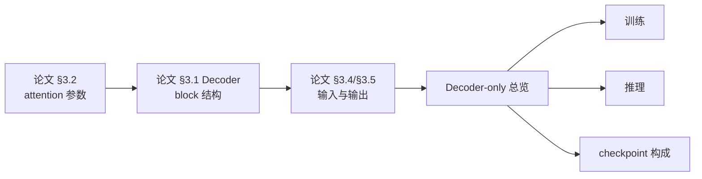

# 从 Attention Is All You Need 到 LLM：阅读指南

[上一篇：Decoder-only LLM 总览](decoder_only_llm.md) | [返回学习路线](transformer_prerequisites.md) | [下一篇：训练后模型构成](transformer_model_composition.md)

原论文是 Encoder-Decoder 翻译模型，不是现代 decoder-only LLM 的完整架构说明。但现代 LLM 的关键组成模块可在论文中找到对应基础：attention、Decoder block、embedding、位置编码、输出 softmax。

## 面向 LLM 构成的精读顺序

| 优先级 | 论文部分 | 要带走的知识 | 对应当前文档 |
| --- | --- | --- | --- |
| 必读 | §3.2.1 Scaled Dot-Product Attention | `QK^T`、softmax、`V` 加权汇总。 | [Transformer Attention](transformer_attention.md) |
| 必读 | §3.2.2 Multi-Head Attention | `W^Q/W^K/W^V/W^O` 是 attention 参数主体。 | [Transformer Attention](transformer_attention.md) |
| 必读 | §3.1 Decoder stack | causal mask、FFN、residual add、LayerNorm。 | [Decoder-only LLM 总览](decoder_only_llm.md) |
| 必读 | §3.4 Embeddings and Softmax | token embedding、LM head、权重共享。 | [模型构成](transformer_model_composition.md) |
| 必读 | §3.5 Positional Encoding | token 顺序如何进入模型。 | [机器学习基础](machine_learning_prerequisites.md) |
| 建议 | §4 Why Self-Attention | 并行性与 `O(n^2)` 注意力成本。 | [算法与 CUDA](transformer_algorithm_and_cuda.md) |
| 对照 | §3.2.3 Applications of Attention | 三类 attention 的分工。 | 理解 LLM 保留 masked self-attention、通常去除另外两类。 |
| 后读 | §5、§6 | 翻译训练、BLEU、beam search 与实验结果。 | 用作论文背景。 |

## 读论文时的取舍

| 对理解 LLM 的价值 | 内容 |
| --- | --- |
| 直接保留 | Decoder masked self-attention、FFN、残差、归一化、embedding、词表输出。 |
| 作为对照理解 | Encoder、encoder memory、cross-attention。 |
| 了解问题而非照搬实现 | 正弦位置编码；现代 LLM 常使用 RoPE 等变体。 |
| 论文任务特有 | WMT 数据、BLEU、翻译 beam search。 |

阅读重点：**先理解一个 Decoder block 的参数与 causal self-attention 计算，再用 Encoder 与 cross-attention 理解其他条件生成模型。**

## 推荐路径

阅读原文时可配合 [本地 PDF](attention_is_all_you_need.pdf) 与 [论文导读](attention_is_all_you_need.md)。
