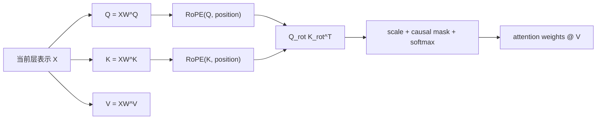

# RoPE：旋转位置编码

[上一篇：机器学习基础](machine_learning_prerequisites.md) | [返回学习路线](transformer_prerequisites.md) | [下一篇：Decoder-only LLM 计算链](decoder_only_llm_computation.md)

**RoPE（Rotary Position Embedding，旋转位置编码）**是一种将位置信息写入 attention 的方法。它不把位置向量直接加到 token embedding，而是在 Q/K 投影后，按 token 位置旋转 Q 和 K 的二维分量。

RoPE 最初由 RoFormer 提出：它用旋转矩阵编码绝对位置，并使 attention 分数显式包含相对位置信息。[RoFormer 论文](https://arxiv.org/abs/2104.09864)

## 解决什么问题

self-attention 只比较向量内容，不知道 token 顺序。若交换 `I love cats` 中的 token，单靠 attention 无法知道原顺序。

| 位置方法 | 写入位置的位置 | 特点 |
| --- | --- | --- |
| 原论文正弦/余弦编码 | token embedding 后相加 | 固定位置向量。 |
| 可学习位置 embedding | token embedding 后相加 | 位置表由训练更新。 |
| RoPE | Q/K 投影后旋转 | attention 分数同时反映内容与相对距离。 |

## 核心计算

RoPE 将向量相邻两个维度看作一个二维平面。对位置 `p`，以角度 `p * theta_i` 旋转第 `i` 个二维分量：

```text
[x'_(2i)    ]   [ cos(p*theta_i)  -sin(p*theta_i) ] [x_(2i)    ]
[x'_(2i + 1)] = [ sin(p*theta_i)   cos(p*theta_i) ] [x_(2i + 1)]
```

不同维度对使用不同频率 `theta_i`。不必手算这些角度；实现会按位置预先生成或即时生成 sin/cos 值。

## 它位于 Q/K 流程的哪里



注意两点：

- RoPE 旋转 **Q 和 K**，通常不旋转 V。
- `W^Q/W^K/W^V` 仍是模型参数；RoPE 的 sin/cos 通常由公式生成，不是一张需要训练的位置 embedding 表。

## 例子：`我` 如何带上位置

设 prompt 为：

```text
<bos> 翻译为中文: I love cats <sep>
```

Prefill 后，`<sep>` 位于位置 5。模型选择 `我` 后，Decode 将 `我` 放到位置 6：

```text
q_我 = x_我 W^Q
k_我 = x_我 W^K
q_我_rot = RoPE(q_我, 6)
k_我_rot = RoPE(k_我, 6)
```

历史 prompt 的 K 在 Prefill 时已经按各自位置旋转并缓存。`q_我_rot` 与这些历史 K 的点积同时反映：

```text
我在查询什么内容？
历史 token 提供什么内容？
两者相隔多远？
```

这就是“相对位置信息进入 attention 分数”的直观含义。

## Prefill 与 Decode 中的 RoPE

| 阶段 | Q/K 的处理 | cache 行为 |
| --- | --- | --- |
| Prefill | 为完整 prompt 的所有位置计算 Q/K，再按各自位置旋转。 | 通常保存旋转后的 K 与原 V。 |
| Decode | 只为新 token 计算 Q/K，并按其新位置旋转。 | 新 K 追加到对应 layer 的 cache；新 Q 查询历史 K。 |

RoPE 不改变“Prefill 并行、Decode 逐 token”的基本规律；它只改变 Q/K 参与点积前的表示方式。

## 常见误解

| 误解 | 正确理解 |
| --- | --- |
| RoPE 是一张位置 embedding 表。 | 通常不是；它由位置和频率计算旋转用的 sin/cos。 |
| RoPE 会旋转 Q/K/V。 | 标准做法旋转 Q 和 K，不旋转 V。 |
| RoPE 取代 causal mask。 | 不会。RoPE 表示位置；causal mask 限制可见范围。 |
| RoPE 直接生成下一个 token。 | 不会。它只改变 attention 中 Q/K 的匹配方式。 |

## 下一步

- 理解 token 到 Q/K/V 的完整链路：阅读 [Decoder-only LLM 计算链](decoder_only_llm_computation.md)。
- 理解完整 prompt 如何应用 RoPE：阅读 [Decoder-only LLM Prefill](decoder_only_llm_prefill.md)。
- 理解新 token 如何应用 RoPE：阅读 [Decoder-only LLM Decode](decoder_only_llm_decode.md)。
