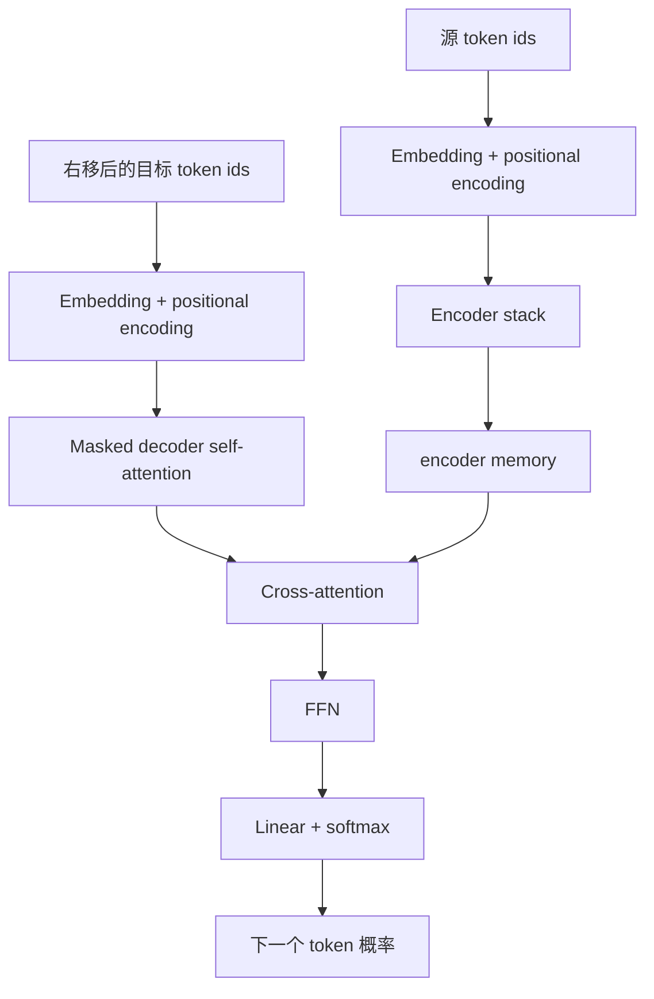
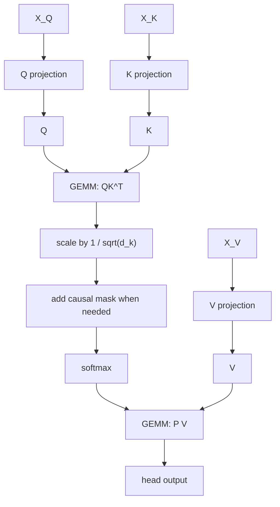
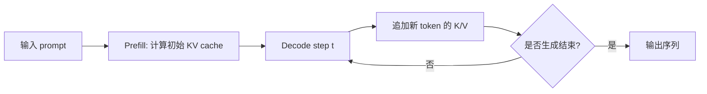

# Transformer algorithm and CUDA implementations

本文从实现视角补充 [Attention Is All You Need](attention_is_all_you_need.md)。重点是 Transformer 的前向计算、计算图、核心算子，以及已有 CUDA 实现的分工。基础概念见 [Transformer prerequisites](transformer_prerequisites.md)。

| 层次 | 关注内容 | 典型问题 |
| --- | --- | --- |
| 论文算法 | Encoder、Decoder、attention、FFN | 模型在数学上如何计算？ |
| 框架实现 | PyTorch、TensorFlow 的层和算子 | 张量如何组织和调用 GPU？ |
| CUDA 优化 | GEMM、softmax、融合 kernel、KV cache | 如何减少显存读写并提高吞吐？ |

## 前向计算总览

原始 Transformer 是 encoder-decoder 模型：

```text
encoder_memory = Encoder(source_tokens)
target_logits = Decoder(target_tokens_shifted_right, encoder_memory)
```

`encoder_memory` 是与源序列等长的上下文向量序列，不是单个固定长度向量。Decoder 的每个位置可通过 cross-attention 从其中读取不同源位置的信息。



## Encoder 与 Decoder 算法

### Encoder layer

对输入 `X`，一个 Encoder layer 的计算可写为：

```text
A = MultiHeadSelfAttention(X, X, X)
H = LayerNorm(X + Dropout(A))
F = FeedForward(H)
Y = LayerNorm(H + Dropout(F))
```

| 阶段 | 张量角色 | 计算目的 |
| --- | --- | --- |
| Self-attention | `Q = K = V = X` | 每个源位置读取完整源序列。 |
| Residual + LayerNorm | `X + A` | 保留输入并稳定数值。 |
| FFN | 对每个位置独立应用 | 增强非线性表达。 |
| Residual + LayerNorm | `H + F` | 形成下一层输入。 |

Encoder 连续堆叠后，得到 `M = encoder_memory`。

### Decoder layer

对 Decoder 表示 `Y` 和 encoder memory `M`：

```text
A1 = MultiHeadAttention(Y, Y, Y, mask=causal_mask)
H1 = LayerNorm(Y + Dropout(A1))

A2 = MultiHeadAttention(query=H1, key=M, value=M)
H2 = LayerNorm(H1 + Dropout(A2))

F = FeedForward(H2)
Z = LayerNorm(H2 + Dropout(F))
```

| Attention 类型 | Q 来源 | K/V 来源 | 是否使用 mask |
| --- | --- | --- | --- |
| Encoder self-attention | Encoder 输入 | Encoder 输入 | 否。 |
| Decoder self-attention | Decoder 当前序列 | Decoder 当前序列 | 是，屏蔽未来位置。 |
| Cross-attention | Decoder 当前状态 | encoder memory | 否。 |

## Multi-head attention 算法

对第 `i` 个 attention head：

```text
Q_i = X_Q W_i^Q
K_i = X_K W_i^K
V_i = X_V W_i^V

S_i = Q_i K_i^T / sqrt(d_k)
P_i = softmax(S_i + mask)
head_i = P_i V_i
```

再合并各 head：

```text
O = Concat(head_1, ..., head_h) W^O
```

| 阶段 | 主要算子 | 常见形状（忽略 batch） |
| --- | --- | --- |
| Q/K/V 投影 | GEMM / linear | `[seq_len, d_model] -> [seq_len, d_k]` |
| 分数计算 | batched GEMM | `QK^T -> [seq_len, seq_len]` |
| 缩放与 mask | elementwise scale / add | `[seq_len, seq_len]` |
| 权重归一化 | softmax | `[seq_len, seq_len]` |
| Value 汇总 | batched GEMM | `PV -> [seq_len, d_v]` |
| 多头合并 | transpose / reshape / concat / GEMM | 回到 `[seq_len, d_model]` |

### Attention 计算图



Self-attention 取 `X_Q = X_K = X_V`。Cross-attention 则取 `X_Q` 为 Decoder 表示，`X_K = X_V` 为 encoder memory。

## Transformer 核心算子

| 模块 | 主要算子 | 计算内容 | GPU 优化重点 |
| --- | --- | --- | --- |
| 输入表示 | embedding lookup、add | token id 查表并加入位置向量。 | 高效 gather、减少额外张量。 |
| Q/K/V | GEMM、bias add、reshape | 生成多头的 Q/K/V。 | 合并 QKV 投影、利用 Tensor Cores。 |
| Attention 分数 | batched GEMM、scale | `QK^T / sqrt(d_k)`。 | 高吞吐矩阵乘法。 |
| Mask 与 softmax | masked fill/add、softmax | 屏蔽未来位置并归一化分数。 | 融合 kernel、数值稳定。 |
| Value 汇总 | batched GEMM | `P @ V`。 | 降低中间矩阵读写。 |
| 多头输出 | transpose、reshape、concat、GEMM | 合并 head 并输出投影。 | 避免不必要的数据重排。 |
| 残差和归一化 | add、layer norm、dropout | 稳定训练和梯度流动。 | 融合逐元素算子。 |
| FFN | GEMM、activation、GEMM | 逐位置非线性变换。 | 融合 bias/activation，使用高效 GEMM。 |
| 输出与损失 | GEMM、softmax、cross entropy | 得到词表概率并计算训练损失。 | 融合 softmax-cross-entropy。 |

在标准 attention 中，最关键的两次矩阵乘法是 `QK^T` 与 `PV`。softmax 的算术量较小，但读取和写入大矩阵时会形成显存带宽压力。

## 训练与推理

| 阶段 | Decoder 计算方式 | 关键特点 |
| --- | --- | --- |
| 训练 | 对完整右移目标序列并行计算，并应用 causal mask。 | 可并行；需要保存中间结果用于反向传播。 |
| 推理 | 每次生成一个 token。 | 自回归，延迟受单步计算影响。 |

推理会使用 KV cache：对历史 token 已算出的 key/value 进行缓存，第 `t` 步只计算新 token 的 K/V，并与历史缓存一起参与 attention。



KV cache 减少重复计算，但不会取消逐 token 的生成顺序。随着上下文增长，缓存本身的显存占用和读取成本也会增加。

## CUDA 实现与适用范围

| 项目 | 覆盖范围 | 适合学习的问题 |
| --- | --- | --- |
| [Tensor2Tensor](https://github.com/tensorflow/tensor2tensor) | TensorFlow 中的 Transformer 模型实现，依赖框架 GPU 后端。 | 论文模型如何落到框架代码。 |
| [NVIDIA FasterTransformer](https://github.com/NVIDIA/FasterTransformer) | CUDA/C++ 高性能 Transformer encoder/decoder 推理实现；项目已转向 TensorRT-LLM。 | 完整推理系统如何拆分 kernels、layers 与模型模块。 |
| [FlashAttention](https://github.com/Dao-AILab/flash-attention) | attention 前向/反向的高性能 CUDA 实现。 | 如何通过分块和在线 softmax 降低显存读写。 |
| [NVIDIA Transformer Engine](https://github.com/NVIDIA/TransformerEngine) | Transformer 训练/推理加速库，覆盖低精度与融合算子。 | FP8/FP4、fused kernels 与框架集成。 |

### FasterTransformer

FasterTransformer 更接近完整 Transformer 推理实现。其代码按基础 kernel、layer、model 和框架绑定分层，适合理解 attention、FFN、layer norm、decoder 与采样等模块怎样在 CUDA/C++ 工程中组合。

### FlashAttention

FlashAttention 聚焦 attention 子模块，而不是完整 encoder-decoder。它将 `QK^T -> softmax -> PV` 分块处理，并用在线 softmax 避免物化完整 attention 矩阵，从而降低 HBM 读写和中间存储压力。

### Transformer Engine

Transformer Engine 面向现代 NVIDIA GPU 训练和推理，提供低精度计算、融合 kernel，以及与 PyTorch/JAX 和训练框架的集成。它是工程加速库，而不是原始论文的教学实现。

## 阅读路径

| 目标 | 建议阅读顺序 |
| --- | --- |
| 理解论文算法 | 论文导读 -> 前置知识 -> Encoder/Decoder 伪代码。 |
| 理解 attention 计算 | QKV 投影 -> `QK^T` -> softmax -> `PV` -> 计算图。 |
| 理解 CUDA 优化 | GEMM 与显存访问 -> FlashAttention -> 融合算子。 |
| 理解完整推理系统 | KV cache -> FasterTransformer / TensorRT-LLM 类工程。 |
| 理解现代训练加速 | Transformer Engine、低精度、并行与 fused kernels。 |

## 参考资料

- [Attention Is All You Need - arXiv](https://arxiv.org/abs/1706.03762)
- [Tensor2Tensor - GitHub](https://github.com/tensorflow/tensor2tensor)
- [NVIDIA FasterTransformer - GitHub](https://github.com/NVIDIA/FasterTransformer)
- [FlashAttention - GitHub](https://github.com/Dao-AILab/flash-attention)
- [NVIDIA Transformer Engine - GitHub](https://github.com/NVIDIA/TransformerEngine)
