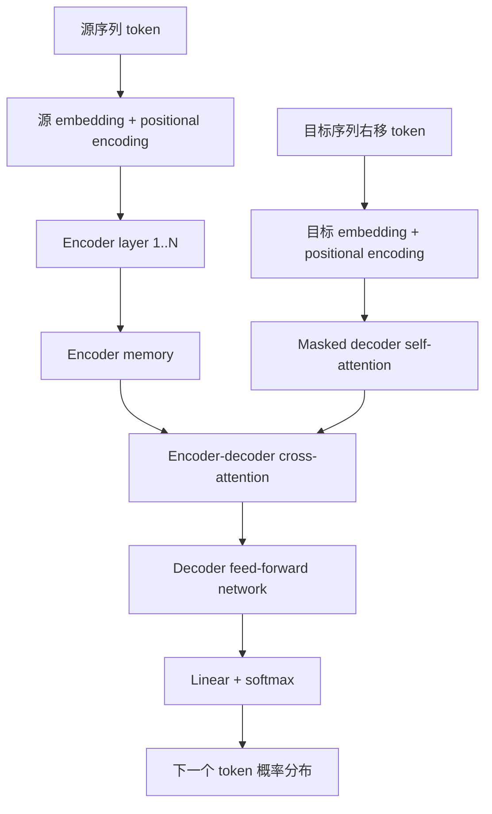
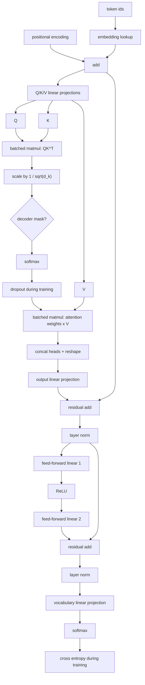
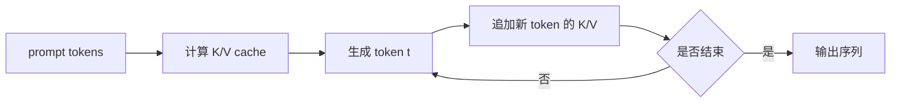

# Transformer algorithm and CUDA implementations

## 说明范围

本文补充 [Attention Is All You Need](attention_is_all_you_need.md) 的算法实现视角，重点解释 Transformer 在一次前向计算中如何流动，以及现有 CUDA 相关实现分别覆盖了哪些层次。

需要先区分三类实现：

- 论文级算法：描述 encoder-decoder、multi-head attention、feed-forward network、位置编码、残差连接和层归一化。
- 深度学习框架实现：使用 TensorFlow 或 PyTorch 表达模型，由框架和后端库调度 GPU。
- CUDA/C++ 优化实现：直接实现或封装 attention、FFN、layer norm、解码等 kernel，用于训练或推理加速。

## Transformer 前向算法

原始 Transformer 是 encoder-decoder 架构。输入序列先经过 encoder 得到上下文表示，decoder 在已生成 token 的基础上逐步生成输出，并通过 cross-attention 读取 encoder 输出。

从接口角度看，encoder 和 decoder 的输入输出关系可以写成：

```text
encoder_memory = Encoder(source_tokens)
target_logits = Decoder(target_tokens_shifted_right, encoder_memory)
```

其中 `encoder_memory` 不是单个向量，而是与源序列长度对应的一组向量表示。这样 decoder 在生成每个目标位置时，可以通过 cross-attention 选择性读取源序列的不同位置。对机器翻译来说，这比把整句输入压缩成一个固定长度向量更稳健。



### Encoder layer

一个 encoder layer 可以按如下顺序理解：

```text
input: X

A = MultiHeadSelfAttention(X, X, X)
X = LayerNorm(X + Dropout(A))

F = FeedForward(X)
X = LayerNorm(X + Dropout(F))

return X
```

其中 `MultiHeadSelfAttention(X, X, X)` 表示 `Q`、`K`、`V` 都来自同一序列。每个位置都可以读取所有输入位置，因此 encoder 不需要 causal mask。

### Decoder layer

一个 decoder layer 多了 cross-attention：

```text
input: Y, encoder_memory: M

A1 = MultiHeadSelfAttention(Y, Y, Y, mask=causal_mask)
Y = LayerNorm(Y + Dropout(A1))

A2 = MultiHeadAttention(query=Y, key=M, value=M)
Y = LayerNorm(Y + Dropout(A2))

F = FeedForward(Y)
Y = LayerNorm(Y + Dropout(F))

return Y
```

`causal_mask` 的作用是禁止当前位置看到未来 token。训练时可以并行处理整段目标序列，但 mask 会让第 `i` 个位置只依赖第 `i` 个位置之前的输出。

## Multi-head attention 的算法拆解

给定输入矩阵 `X`，单个 self-attention head 的计算可以拆成四步：

```text
Q = XW_Q
K = XW_K
V = XW_V

S = QK^T / sqrt(d_k)
P = softmax(S)
O = PV
```

multi-head attention 会并行计算多个 head：

```text
head_i = Attention(XW_Q_i, XW_K_i, XW_V_i)
O = Concat(head_1, ..., head_h)W_O
```

初学者容易忽略的是：attention 的主要计算量来自两个矩阵乘法：

- `QK^T`：计算 token 之间的相关性。
- `PV`：按注意力权重汇总 value。

softmax 本身计算量未必最大，但它会带来较高的内存读写压力。后续 CUDA 优化通常围绕“减少中间矩阵落到显存”和“提升矩阵乘法/softmax 融合效率”展开。

## Transformer 涉及的核心算子

从计算图角度看，Transformer 主要由张量变换、矩阵乘法、归一化、逐元素运算和概率化算子组成。下表按前向计算顺序归纳常见算子。

| 模块 | 主要算子 | 作用 |
| --- | --- | --- |
| 输入表示 | embedding lookup, positional encoding, add | 把 token id 转成向量，并注入位置信息。 |
| Q/K/V 投影 | linear projection, GEMM, bias add | 由输入表示生成 query、key、value。 |
| 注意力分数 | batched matrix multiplication, scale | 计算 `QK^T / sqrt(d_k)`，得到 token 间相关性。 |
| mask | masked fill, add | 在 decoder self-attention 中屏蔽未来位置。 |
| 注意力权重 | softmax, dropout | 把分数转成概率分布，并在训练时正则化。 |
| value 汇总 | batched matrix multiplication | 计算 `softmax(QK^T)V`，得到每个 head 的输出。 |
| 多头合并 | concat, reshape, transpose, linear projection | 合并多个 head，并投影回 `d_model`。 |
| 残差与归一化 | add, layer normalization | 保持梯度流动并稳定激活分布。 |
| 前馈网络 | GEMM, bias add, ReLU, GEMM | 对每个位置独立做非线性变换。 |
| 输出层 | linear projection, softmax | 把 decoder 表示转换为下一个 token 的概率分布。 |
| 训练损失 | cross entropy, label smoothing | 计算预测分布与目标 token 的差异。 |

如果从 GPU kernel 的角度观察，最重要的算子通常是 GEMM、batched GEMM、softmax、layer norm、elementwise add/dropout、activation 和 reshape/transpose。训练时还会出现反向传播中的梯度 GEMM、softmax backward、layer norm backward、activation backward，以及多 GPU 训练中的 all-reduce 等通信算子。



这张图表示一个 attention block 加前馈网络的核心计算路径。encoder self-attention、decoder masked self-attention 和 encoder-decoder cross-attention 使用的算子基本相同，区别主要在 `Q`、`K`、`V` 的来源和是否使用 mask。

## 训练与推理中的差异

训练阶段通常一次处理完整输入和完整右移目标序列。decoder 使用 causal mask 保持自回归约束，但底层矩阵计算仍可并行。

推理阶段通常逐 token 生成。第 `t` 步生成时，前面 `1..t-1` 的 key 和 value 可以缓存，称为 KV cache。这样每一步不需要重复计算所有历史 token 的 `K` 和 `V`，但生成过程本身仍然是逐步推进的。



## CUDA 实现现状

已经存在 CUDA 相关实现，但它们关注的层次不同。

| 实现 | 覆盖范围 | 适合阅读的重点 |
| --- | --- | --- |
| [Tensor2Tensor](https://github.com/tensorflow/tensor2tensor) | 原论文团队相关的 TensorFlow 模型库，可通过 `tensor2tensor.models.transformer.Transformer` 使用 Transformer；依赖 TensorFlow GPU 后端，不是手写 CUDA kernel 教程。 | 理解论文模型如何落到框架代码。 |
| [NVIDIA FasterTransformer](https://github.com/NVIDIA/FasterTransformer) | CUDA、cuBLAS、cuBLASLt 和 C++ 上的高性能 Transformer encoder/decoder 推理实现；仓库说明其开发已转向 TensorRT-LLM。 | 理解工程推理栈如何拆分 kernels、layers、models、framework bindings。 |
| [FlashAttention](https://github.com/Dao-AILab/flash-attention) | 官方实现 FlashAttention 和 FlashAttention-2，并提供 CUDA 版本的 attention 前向/反向 kernel。 | 理解 attention kernel 如何通过分块减少显存读写。 |
| [NVIDIA Transformer Engine](https://github.com/NVIDIA/TransformerEngine) | 面向 NVIDIA GPU 加速 Transformer 训练和推理，提供 FP8/FP4、融合 kernel、PyTorch/JAX 等集成，并支持 FlashAttention-2/3。 | 理解现代训练框架如何封装低精度和 fused kernels。 |

### FasterTransformer

FasterTransformer 是更接近“完整 Transformer CUDA/C++ 推理实现”的项目。其 README 说明该项目实现了高度优化的 transformer-based encoder 和 decoder 组件，并基于 CUDA、cuBLAS、cuBLASLt 和 C++ 构建，同时提供 TensorFlow、PyTorch 和 Triton backend 等集成入口。

它的目录也体现了典型工程分层：

- `src/fastertransformer/kernels`：CUDA kernels，例如 bias、residual、layer norm 等基础操作。
- `src/fastertransformer/layers`：attention layer、FFN layer 等层级封装。
- `src/fastertransformer/models`：BERT、GPT 等模型级封装。
- `examples`：C++、TensorFlow、PyTorch、TensorRT 接口示例。

对于学习者，FasterTransformer 更适合回答“Transformer 在推理系统中如何拆成 CUDA kernels 和 C++ 层级模块”。

### FlashAttention

FlashAttention 不是完整 encoder-decoder Transformer，而是 attention 子模块的高性能 CUDA 实现。它针对标准 attention 中 `QK^T`、softmax、`PV` 产生的大量显存访问做优化，通过分块和在线 softmax 避免完整 attention score 矩阵反复落到 HBM。

其仓库提供多个 `.cu` 文件，按 head dimension、数据类型、causal/non-causal、前向/反向等维度拆分。例如 `flash_fwd_hdim64_fp16_causal_sm80.cu` 这类文件名表示：前向、head dimension 64、FP16、causal mask、面向 SM80 架构。

对于学习者，FlashAttention 更适合回答“scaled dot-product attention 如何写成高效 CUDA kernel”。

### Transformer Engine

Transformer Engine 是 NVIDIA 面向现代 Transformer 训练和推理的加速库。它提供易用的 Transformer layer 模块、FP8/FP4 支持、融合 kernel，以及与 DeepSpeed、Megatron-LM、NeMo、Hugging Face Accelerate 等框架的集成。

它不是复现 2017 年论文的教学项目，而是面向当前大模型训练和推理的工程库。其价值在于展示现代 Transformer 实现已经从“单个 attention 公式”扩展到低精度、并行策略、fused operation、FlashAttention 集成和框架适配。

## 如何选择阅读路径

如果目标是理解原始论文算法，先读本目录中的论文笔记，再按 encoder layer、decoder layer、multi-head attention 三段伪代码手写一个小型 PyTorch 版本。

如果目标是理解 CUDA 上的 attention 优化，优先读 FlashAttention。它聚焦 attention 的核心瓶颈，适合从 `QK^T -> softmax -> PV` 的显存访问问题入手。

如果目标是理解完整 Transformer 推理系统，优先读 FasterTransformer。它覆盖 encoder、decoder、decoding、framework binding 和 benchmark，更接近真实部署中的模块边界。

如果目标是理解现代大模型训练加速，优先读 Transformer Engine。它关注 FP8/FP4、融合算子、FlashAttention 集成和训练框架生态。

## 归档结论

已经存在 CUDA 上的 Transformer 相关实现，但没有一个单一项目等同于“原论文的完整手写 CUDA 教学版”。更准确的归档方式是：

- 原论文模型与研究代码线索：Tensor2Tensor。
- 完整 encoder/decoder 推理优化实现：NVIDIA FasterTransformer。
- attention kernel 的核心 CUDA 优化实现：FlashAttention。
- 现代 NVIDIA GPU 训练和推理加速库：Transformer Engine。

这些实现共同说明：Transformer 的工程瓶颈不只在数学公式本身，还在矩阵乘法、softmax、显存访问、KV cache、低精度计算和 kernel fusion 的组合优化。

## 参考资料

- [Attention Is All You Need - arXiv](https://arxiv.org/abs/1706.03762)
- [Tensor2Tensor - GitHub](https://github.com/tensorflow/tensor2tensor)
- [NVIDIA FasterTransformer - GitHub](https://github.com/NVIDIA/FasterTransformer)
- [FlashAttention - GitHub](https://github.com/Dao-AILab/flash-attention)
- [NVIDIA Transformer Engine - GitHub](https://github.com/NVIDIA/TransformerEngine)
