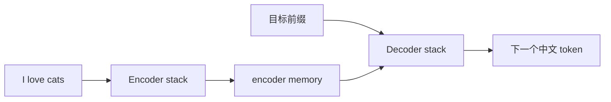
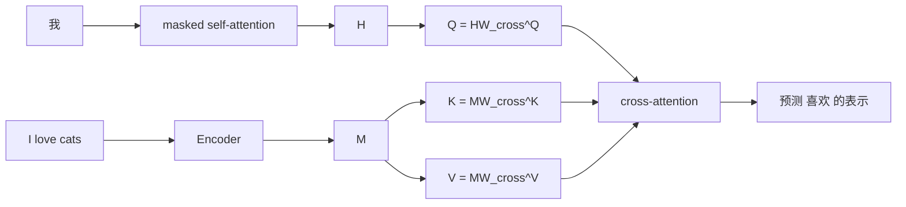

# Transformer 架构：Encoder、Decoder 与 Memory

[上一篇：机器学习基础](machine_learning_prerequisites.md) | [返回学习路线](transformer_prerequisites.md) | [下一篇：Transformer Attention](transformer_attention.md)

原始 Transformer 是 Encoder-Decoder 架构。以下使用 `I love cats -> 我喜欢猫` 说明信息流。

## Encoder-Decoder 分工



| 模块 | 输入 | 输出 | 职责 |
| --- | --- | --- | --- |
| Encoder | 源序列向量 | encoder memory | 为每个源位置建立上下文表示。 |
| Decoder | 目标前缀与 encoder memory | 下一个 token 概率 | 自回归生成目标序列。 |

## Encoder：构建 Memory

原论文堆叠 6 个 Encoder layer：

```text
A = MultiHeadSelfAttention(X, X, X)
H = LayerNorm(X + A)
F = FeedForward(H)
Y = LayerNorm(H + F)
```

| 组件 | 作用 |
| --- | --- |
| Self-attention | 源 token 相互读取上下文。 |
| Residual add | 保留子层输入，并加入子层输出。 |
| LayerNorm | 规范化单个 token 的特征维。 |
| FFN | 对每个位置进行非线性变换。 |

### Residual add 与 LayerNorm

```text
Residual: r = x + Sublayer(x)
LayerNorm: gamma * (r - mu) / sqrt(variance + epsilon) + beta
```

原论文使用 Post-LN：`LayerNorm(x + Sublayer(x))`。后续模型也常使用 Pre-LN：`x + Sublayer(LayerNorm(x))`。

### Encoder memory

最后一层 Encoder 输出为：

```text
M: [source_length, d_model]
M = [M_I, M_love, M_cats]
```

每个 `M_*` 是经过多层 self-attention 和 FFN 更新后的上下文向量，不是初始 embedding。

## Decoder：读取前缀与 Memory

| 子层 | Q 来源 | K/V 来源 | 作用 |
| --- | --- | --- | --- |
| Masked self-attention | 目标端前缀 | 目标端前缀 | 读取已生成 token，屏蔽未来位置。 |
| Cross-attention | Decoder 当前表示 | encoder memory | 从源序列读取相关信息。 |
| FFN | 当前表示 | 不适用 | 逐位置非线性变换。 |

Cross-attention 的输入为：

```text
Q = HW_cross^Q
K = MW_cross^K
V = MW_cross^V
```

| 符号 | 来源 | 含义 |
| --- | --- | --- |
| `H` | masked self-attention 输出 | 当前目标前缀的上下文表示。 |
| `M` | Encoder 最终输出 | 源序列的上下文表示。 |

当模型已生成 `<bos> 我` 并预测 `喜欢` 时，`H_我` 作为 query 查询 `M_I/M_love/M_cats`。它通常会关注 `M_love`，同时结合主语与对象信息。



## Attention 计算

Q/K/V、scaled dot-product attention、多头机制、参数初始化和三类 attention 参数见 [Transformer Attention](transformer_attention.md)。

## 下一步

继续阅读 [Transformer Attention](transformer_attention.md)，再进入 [Transformer 训练](transformer_training.md)。
