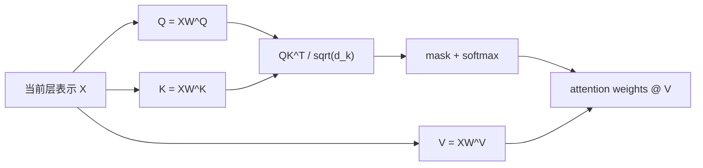

# Transformer Attention：Q、K、V 与多头机制

[上一篇：Transformer 架构](transformer_architecture.md) | [返回学习路线](transformer_prerequisites.md) | [下一篇：Transformer 训练](transformer_training.md)

本页说明 attention 的计算、参数与三种使用方式。结构分工和 encoder memory 见 [Transformer 架构](transformer_architecture.md)。

## Scaled Dot-Product Attention

```text
Attention(Q, K, V) = softmax(QK^T / sqrt(d_k))V
```



| 符号 | 作用 |
| --- | --- |
| `Q` | 当前 token 的查询特征。 |
| `K` | 每个位置的匹配特征。 |
| `V` | 每个位置可被汇总的内容。 |
| `QK^T` | query 与 key 的相关性分数。 |
| softmax | 将分数转换为权重。 |

## Q/K/V 的来源与参数

```text
Q = XW^Q
K = XW^K
V = XW^V
```

| 对象 | 是否为参数 | 说明 |
| --- | --- | --- |
| `W^Q/W^K/W^V` | 是 | 独立的可训练投影矩阵。 |
| `Q/K/V` | 否 | 当前输入与投影矩阵相乘得到的中间张量。 |
| attention 权重 | 否 | 当前输入的计算结果。 |

`W^Q` 中的上标 `Q` 是名称标签；`XW^Q` 才表示矩阵乘法。训练初始化并更新的是 `W^Q/W^K/W^V`，不是 Q/K/V 本身。

### 简化数值例子

设 `X = [1.00, 0.50, -1.00, 0.00]`，一个 head 的维度为 2：

```text
W^Q = [[ 0.10, -0.20], [ 0.30, 0.05], [-0.10, 0.20], [0.20, 0.10]]
W^K = [[ 0.05,  0.10], [-0.20, 0.15], [ 0.25,-0.05], [0.10, 0.20]]
W^V = [[ 0.20,  0.10], [ 0.10,-0.20], [-0.15, 0.05], [0.05, 0.10]]

Q = XW^Q = [ 0.35, -0.375]
K = XW^K = [-0.30,  0.225]
V = XW^V = [ 0.40, -0.05]
```

## Multi-Head Attention

每个 head 使用独立投影，在不同表示子空间中计算 attention：

```text
head_i = Attention(XW_i^Q, XW_i^K, XW_i^V)
MultiHead(X) = Concat(head_1, ..., head_h)W^O
```

| 步骤 | 作用 |
| --- | --- |
| 每头投影 | 得到各 head 的 Q/K/V。 |
| 各头 attention | 并行读取不同类型的关系。 |
| Concat | 沿特征维拼接各 head 输出。 |
| `W^O` | 混合拼接后的结果。 |

原论文 base model 使用 `d_model = 512`、`h = 8`、`d_k = d_v = 64`。

## 三类 Attention 与独立参数

| 子层 | Q 来源 | K/V 来源 | 独立参数组 | 用途 |
| --- | --- | --- | --- | --- |
| Encoder self-attention | 源序列 `X` | 源序列 `X` | `W_enc^Q/K/V/O` | 建立源序列上下文。 |
| Decoder masked self-attention | 目标前缀 `Y` | 目标前缀 `Y` | `W_dec_self^Q/K/V/O` | 读取已生成目标 token。 |
| Decoder cross-attention | Decoder 表示 `H` | encoder memory `M` | `W_cross^Q/K/V/O` | 从源序列读取条件信息。 |

三组参数互不共享。原论文的 6 个 Encoder layer 与 6 个 Decoder layer 共包含 18 个 attention 子层；每个子层均有独立的投影参数。

## 与 RoPE 的关系

现代 decoder-only LLM 常在 Q/K 投影后应用 RoPE，再计算 `QK^T`。RoPE 不改变 `W^Q/W^K/W^V` 的定义，也不旋转 V。详见 [RoPE：旋转位置编码](rotary_position_embedding.md)。
