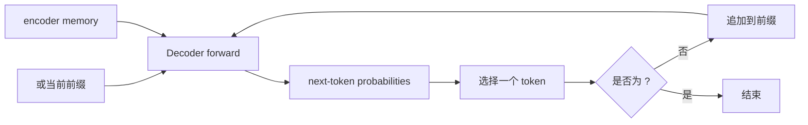
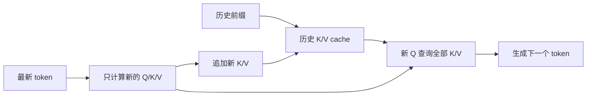

# Transformer 推理：从前缀到生成序列

[上一篇：Transformer 训练](transformer_training.md) | [返回学习路线](transformer_prerequisites.md) | [下一篇：算法与 CUDA 实现](transformer_algorithm_and_cuda.md)

推理时模型参数已经固定。目标是从 `<bos>` 或 prompt 开始，逐 token 产生输出序列。

## 自回归生成

对 `I love cats -> 我喜欢猫`，Encoder 先计算一次：

```text
M = Encoder(I love cats)
```

随后 Decoder 重复执行：

```text
目标前缀
-> masked self-attention
-> cross-attention(M)
-> FFN
-> 词表概率
-> 选择下一个 token
-> 将 token 追加到前缀
```

| 步骤 | 已知前缀 | 选择结果 |
| --- | --- | --- |
| 1 | `<bos>` | `我` |
| 2 | `<bos> 我` | `喜欢` |
| 3 | `<bos> 我 喜欢` | `猫` |
| 4 | `<bos> 我 喜欢 猫` | `<eos>`，停止生成。 |



训练时真实前缀已知，因此可并行处理各位置；推理时第 `t` 步输入依赖第 `t-1` 步刚生成的 token，因此必须顺序推进。

## Token selection

| 策略 | 做法 | 常见特点 |
| --- | --- | --- |
| Greedy decoding | 选择最大概率 token。 | 简单、确定。 |
| Sampling | 按概率随机采样。 | 输出更多样。 |
| Top-k / nucleus sampling | 只在高概率候选集中采样。 | 控制随机性与低概率噪声。 |
| Beam search | 同时保留多个候选前缀。 | 常用于机器翻译。 |

## KV cache：避免重复计算

Decoder self-attention 中，历史目标 token 的 key/value 在未来步骤不会改变，因此推理可缓存它们：



| 无 KV cache | 有 KV cache |
| --- | --- |
| 每一步重新计算全部历史 token 的 K/V。 | 复用历史 K/V，只计算最新 token 的 K/V。 |
| 计算重复较多。 | 计算更少，但 cache 随序列长度增长。 |

KV cache 不会消除逐 token 的数据依赖，通常只用于推理。[Hugging Face Caching](https://huggingface.co/docs/transformers/cache_explanation)

## Prefill 与 decode

在 decoder-only 大语言模型中：

| 阶段 | 已知输入 | 主要行为 |
| --- | --- | --- |
| Prefill | 完整 prompt | 并行处理 prompt，建立初始 KV cache。 |
| Decode | 最新 token 与 cache | 逐 token 生成并追加 K/V。 |

原始 Encoder-Decoder Transformer 并不等同于 decoder-only 模型：它先计算完整源句的 encoder memory，再从 `<bos>` 生成目标端。两者共享的原则是：**已知输入可以并行处理，未知输出必须顺序生成。**

对于 decoder-only LLM，prompt 不会先被转换为单一的 encoder memory；prefill 会为每一层建立 prompt 的 K/V cache，后续 token 通过 causal self-attention 读取它。详细对照见 [Decoder-only LLM 总览](decoder_only_llm.md)。

## 推理模式与资源

| 设置 | 作用 |
| --- | --- |
| `model.eval()` | 切换 Dropout 等模块到推理行为。 |
| `no_grad()` / `inference_mode()` | 关闭 autograd，减少额外内存和计算。 |

推理的常见瓶颈包括单步延迟、KV cache 显存和并发请求调度。对 decoder-only LLM，prefill 常影响 TTFT，decode 常影响 TPOT。

## 下一步

[上一篇：Transformer 训练](transformer_training.md) | [返回学习路线](transformer_prerequisites.md) | [下一篇：算法与 CUDA 实现](transformer_algorithm_and_cuda.md)
