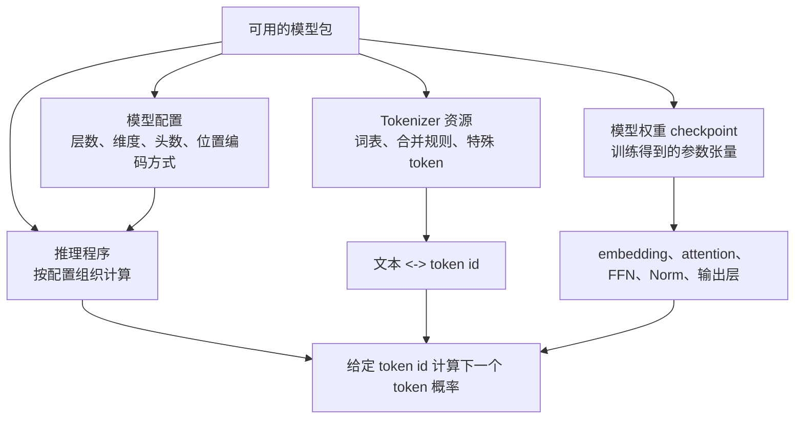
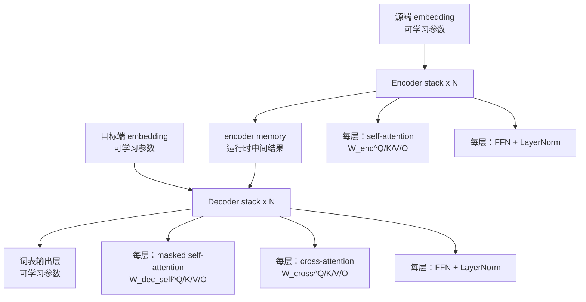

# 训练后 Transformer / LLM 模型由什么构成

[上一篇：Transformer 架构](transformer_architecture.md) | [返回学习路线](transformer_prerequisites.md) | [下一篇：Transformer 训练](transformer_training.md)

这一页的目标是回答：**训练完成后，所谓“一个大模型”究竟由哪些部分组成？**

核心结论：模型的核心是一组训练后固定的数值张量（参数）；完整运行还需要 tokenizer、模型结构配置和推理程序。



## 先建立边界：参数、模型包与运行时状态

| 对象 | 是否由训练直接学习 | 是否通常随模型发布 | 作用 |
| --- | --- | --- | --- |
| **模型参数（权重）** | 是 | 是 | 数值张量，承载模型在训练中形成的能力。 |
| **模型配置** | 否，通常由设计者设定 | 是 | 告诉程序层数、隐藏维度、注意力头数等结构。 |
| **Tokenizer** | 通常在模型训练前单独训练或制作 | 是 | 把文本变为模型可处理的 token id，并把 id 还原为文本。 |
| **优化器状态** | 训练过程中产生 | 仅训练 checkpoint 常保存 | 供断点续训使用；部署推理通常不需要。 |
| **梯度、激活、loss** | 训练时临时产生 | 否 | 用于计算参数应如何更新。 |
| **KV cache** | 推理时临时产生 | 否 | 缓存当前对话前缀的 K/V，加速后续 token 生成。 |

因此，下载一个“可推理模型”时，最关键的是权重、配置和 tokenizer；下载一个“可继续训练 checkpoint”时，往往还会有优化器状态、训练步数和随机数状态。

> 重要理解：权重不是一张“事实字典”。它们是大量浮点数矩阵；训练通过不断降低 loss，让这些矩阵共同形成预测下一个 token 的能力。一个概念或事实通常分散地体现在许多参数及层之间。

## 原论文 Transformer 的参数地图

`Attention Is All You Need` 是用于机器翻译的 **Encoder-Decoder Transformer**：Encoder 处理源句，Decoder 生成目标句，并通过 cross-attention 读取 encoder memory。论文使用 `N = 6` 个 Encoder layer 和 `N = 6` 个 Decoder layer；每个 Encoder layer 有 self-attention 与 FFN，Decoder layer 额外有 cross-attention。[原论文第 3.1 节](https://arxiv.org/abs/1706.03762)



### 参数清单

| 位置 | 可训练参数 | 训练后负责什么 |
| --- | --- | --- |
| 输入 / 输出 embedding | token embedding 表；有些模型与输出层共享权重 | 为 token 提供初始向量；输出层把最终表示映射回词表。 |
| Encoder 每层 self-attention | `W_enc^Q`、`W_enc^K`、`W_enc^V`、`W_enc^O`，以及可选 bias | 学习源序列内部哪些 token 应相互读取。 |
| Encoder 每层 FFN | 两个线性层的权重与 bias | 对每个位置的表示做更丰富的非线性特征变换。 |
| Encoder LayerNorm | `gamma`、`beta` | 调整每层激活的尺度与偏移。 |
| Decoder 每层 masked self-attention | `W_dec_self^Q`、`W_dec_self^K`、`W_dec_self^V`、`W_dec_self^O` | 学习如何利用已生成的目标端前缀。 |
| Decoder 每层 cross-attention | `W_cross^Q`、`W_cross^K`、`W_cross^V`、`W_cross^O` | 学习当前应从源序列 memory 中读取什么信息。 |
| Decoder 每层 FFN / LayerNorm | FFN 权重与 bias；`gamma`、`beta` | 继续变换并稳定目标端表示。 |
| 位置编码 | 可学习位置表，或无参数的固定正弦/余弦值 | 让模型区分 token 的位置。 |

同一种层在不同深度拥有**不同的参数**。例如，第 1 个 Encoder layer 的 `W_enc^Q` 与第 2 个 Encoder layer 的 `W_enc^Q` 不是同一张矩阵；层的结构相同，不代表权重共享。

## 一层大约有多少参数

记隐藏维度为 `d_model`，FFN 中间维度为 `d_ff`。忽略 bias 后：

| 模块 | 参数量近似值 | 原因 |
| --- | --- | --- |
| 一组多头 attention | `4 * d_model^2` | Q、K、V、输出投影各约一张 `d_model x d_model` 矩阵。 |
| 一组 FFN | `2 * d_model * d_ff` | 两次线性变换：`d_model -> d_ff -> d_model`。 |
| 一组 LayerNorm | `2 * d_model` | `gamma` 和 `beta` 各一条长度为 `d_model` 的向量。 |

所以原论文结构中，单个 Encoder layer 约为：

```text
attention + FFN + 2 个 LayerNorm
≈ 4 * d_model^2 + 2 * d_model * d_ff + 4 * d_model
```

单个 Decoder layer 有两组 attention，约为：

```text
masked self-attention + cross-attention + FFN + 3 个 LayerNorm
≈ 8 * d_model^2 + 2 * d_model * d_ff + 6 * d_model
```

这解释了一个常见现象：在标准 Transformer 中，**FFN 与 attention 的投影矩阵通常是参数量主体**；当词表很大时，embedding / 输出层也会占据大量参数。实际总数还取决于是否共享 embedding 与输出层、是否含 bias、词表大小 `V`、层数 `N` 等配置。

### 一个小型结构估算例子

假设 `d_model = 512`、`d_ff = 2048`、`N = 6`，并暂时忽略 bias 与 LayerNorm：

| 部分 | 估算 |
| --- | --- |
| 1 个 Encoder layer | `4 * 512^2 + 2 * 512 * 2048 ≈ 3.15M` |
| 6 个 Encoder layer | `≈ 18.9M` |
| 1 个 Decoder layer | `8 * 512^2 + 2 * 512 * 2048 ≈ 4.19M` |
| 6 个 Decoder layer | `≈ 25.2M` |
| 两个 stack 合计 | `≈ 44.1M`，再加 embedding / 输出层。 |

这不是原论文某个具体 checkpoint 的精确统计，而是帮助你从配置推导“参数主要在哪里”的结构估算。

## 为什么现代 LLM 的构成常常不同

原论文讨论的是翻译模型，因此需要 Encoder、Decoder 和 cross-attention。但多数文本生成 LLM 采用 **decoder-only** 架构：输入 token 经过 embedding 后，依次通过多层带 causal mask 的 Decoder block，最后由词表输出层预测下一个 token。

以 Llama 3 为例，Meta 明确说明其采用 decoder-only Transformer，并使用 GQA 改善推理效率；其模型卡也列出 8B、70B 等参数规模。[Meta Llama 3 架构说明](https://ai.meta.com/blog/meta-llama-3/) [Llama 3 模型卡](https://github.com/meta-llama/llama3/blob/main/MODEL_CARD.md)

| 对比项 | 原论文 Encoder-Decoder Transformer | 常见 decoder-only LLM |
| --- | --- | --- |
| 主要任务 | 条件生成，如英文翻译为中文 | 根据已有文本继续生成。 |
| Encoder stack | 有 | 通常没有。 |
| Cross-attention | 有，需要读取 encoder memory | 通常没有。 |
| Decoder self-attention | 有，且使用 causal mask | 有，是每层的核心。 |
| 推理输入 | 源序列 + 已生成目标前缀 | 提示词 + 已生成文本。 |
| 常见现代变体 | 标准多头 attention、正弦位置编码 | RoPE、RMSNorm、GQA、SwiGLU、MoE 等，具体取决于模型。 |

因此，阅读某个“大模型”的配置前，先确认它是 **encoder-only**、**encoder-decoder** 还是 **decoder-only**。这一步决定了 checkpoint 中是否应该出现 Encoder 参数、cross-attention 参数和 encoder memory 相关计算。

想进一步理解为什么许多生成式 LLM 选择 decoder-only、它如何以 causal self-attention 读取 prompt，以及它和翻译 Transformer 在训练、推理上的具体差异，请阅读 [Decoder-only LLM 总览](decoder_only_llm.md)。

## 用配置理解一个 checkpoint

看到模型配置时，可按下面顺序把“数字”还原成结构：

| 配置项 | 要问的问题 | 对参数构成的影响 |
| --- | --- | --- |
| `vocab_size` | 词表有多少 token？ | 决定 embedding 与输出层的行数。 |
| `hidden_size` / `d_model` | 每个 token 表示有多宽？ | 决定 attention、FFN、LayerNorm 的主要维度。 |
| `num_hidden_layers` | 堆叠多少层？ | 各层参数通常随层数近似线性增长。 |
| `num_attention_heads` | attention 分成多少头？ | 决定每头维度及张量组织；标准 MHA 总投影规模通常仍约为 `4 * d_model^2`。 |
| `num_key_value_heads` | K/V 是否少于 Q 头？ | GQA / MQA 会减少 K/V 投影参数与 KV cache 大小。 |
| `intermediate_size` / `d_ff` | FFN 中间层有多宽？ | 直接决定 FFN 的大部分参数量。 |
| `tie_word_embeddings` | 输入 embedding 与输出层是否共享？ | 影响是否重复保存一大块 `vocab_size x hidden_size` 权重。 |
| 位置编码类型 | 是正弦、可学习表还是 RoPE？ | 决定位置相关参数 / 计算如何存在。 |

## 从“参数”到“能力”的正确理解

训练并不是逐一给某个参数赋予“猫”“翻译”或“语法”这样的标签。每个训练样本都会让 loss 对大量参数产生梯度；优化器把这些微小更新累计起来。最终能力来自所有层、所有矩阵的协同计算：embedding 提供初始表示，attention 负责跨 token 信息交互，FFN 改写每个位置的特征，输出层给出下一个 token 的分布。

所以，理解“训练所得的大模型的构成”，应同时回答四个问题：

1. **它的结构是什么？** Encoder-Decoder 还是 decoder-only，多少层、多宽、多头。
2. **每层有哪些可训练张量？** embedding、attention 投影、FFN、Norm、输出层等。
3. **这些张量如何在推理时被组织起来？** token id -> embedding -> 多层计算 -> logits -> 下一个 token。
4. **哪些对象不是模型权重？** tokenizer、配置、优化器状态、梯度和 KV cache 分别承担不同职责。

## 继续阅读

- 想回到各个模块的计算含义：阅读 [Transformer 架构](transformer_architecture.md)。
- 想理解这些参数如何被更新：阅读 [Transformer 训练](transformer_training.md)。
- 想理解加载权重后如何逐 token 生成：阅读 [Transformer 推理](transformer_inference.md)。
- 想从算子和 CUDA 实现角度理解参数参与的计算：阅读 [Transformer 算法与 CUDA 实现](transformer_algorithm_and_cuda.md)。
