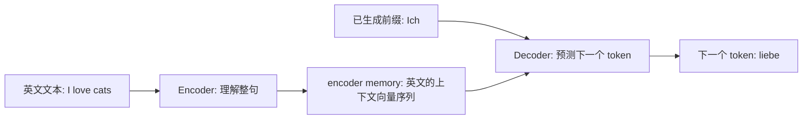
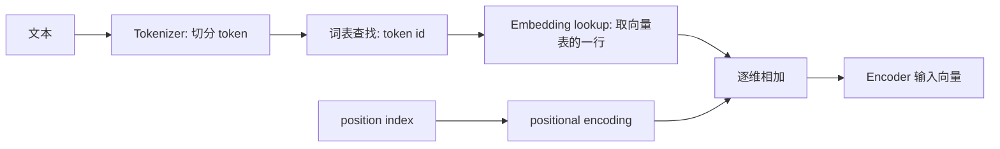
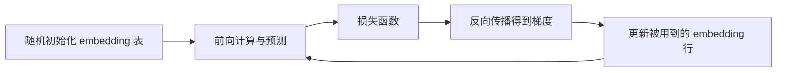
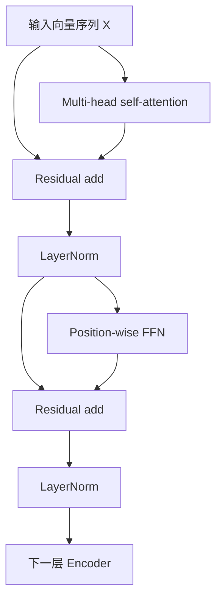
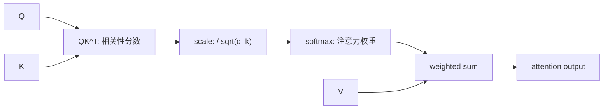
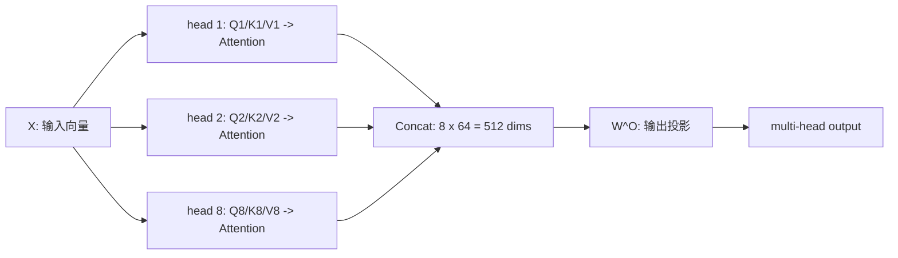
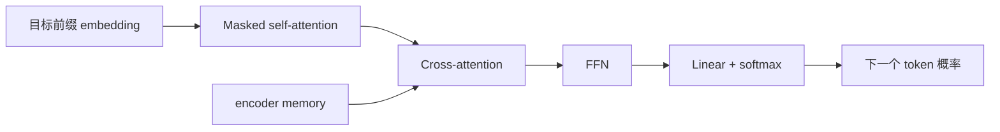

# Transformer prerequisites

本文整理阅读 [Attention Is All You Need](attention_is_all_you_need.md) 所需的前置知识。推荐按“文本如何表示 -> Encoder 如何理解输入 -> Attention 如何交换信息 -> Decoder 如何生成输出”的顺序阅读。

| 问题 | 对应章节 | 概要结论 |
| --- | --- | --- |
| 文字如何进入模型？ | [文本到输入向量](#文本到输入向量) | 文本先变成 token id，再通过 embedding lookup 变成向量。 |
| 模型怎样知道顺序？ | [位置编码](#位置编码) | 将位置向量加到 token embedding 上。 |
| Encoder 做什么？ | [Encoder stack 与 encoder memory](#encoder-stack-与-encoder-memory) | 让每个输入位置吸收全句上下文，输出一组上下文向量。 |
| Attention 公式怎样工作？ | [Scaled Dot-Product Attention](#scaled-dot-product-attention) | 先计算相关性，再按权重汇总信息。 |
| 为什么要多个 head？ | [Multi-head self-attention](#multi-head-self-attention) | 以多个投影视角并行建模 token 关系。 |
| Decoder 怎样翻译？ | [Decoder 与自回归生成](#decoder-与自回归生成) | 结合已生成前缀和 encoder memory，预测下一个 token。 |

## 序列到序列与 encoder-decoder

序列到序列（sequence-to-sequence）任务的输入和输出都是序列，例如机器翻译、摘要和语音识别。原始 Transformer 面向机器翻译，使用 encoder-decoder 架构：

| 模块 | 输入 | 输出 | 职责 |
| --- | --- | --- | --- |
| Encoder | 源语言 token 向量序列 | encoder memory | 理解完整输入。 |
| Decoder | 已生成的目标语言前缀和 encoder memory | 下一个 token 的概率 | 逐步生成输出。 |

以 `I love cats` 翻译为 `Ich liebe Katzen` 为例：encoder 先阅读完整英文句子，得到每个英文位置结合上下文后的表示；decoder 从起始符开始，根据这些表示依次生成 `Ich`、`liebe`、`Katzen`。



这里的“理解”不是产生一条人类可读的中文解释，而是把输入转换为适合后续计算的一组向量。早期 RNN encoder 往往把整句压缩为一个固定向量；Transformer 保留每个源位置的向量，因此 decoder 可以在生成每个词时动态读取不同输入位置。

> 不是所有 Transformer 都同时有 encoder 和 decoder。BERT 主要使用 encoder；GPT 系列主要使用 decoder；原始论文因机器翻译任务而使用二者。

## 文本到输入向量

模型不能直接对字符串做矩阵乘法。每个 token 进入 Encoder 前要经历如下路径：



以 `I love cats` 为例，数字和向量只用于说明，真实值由模型词表和训练参数决定：

| 步骤 | 结果 | 含义 |
| --- | --- | --- |
| 原始文本 | `I love cats` | 人类可读字符串。 |
| 分词 | `["I", "love", "cat", "s"]` | token 可以是词、子词或特殊符号。 |
| 词表查找 | `[31, 842, 5179, 98]` | 每个 token 对应一个整数地址。 |
| embedding lookup | `E[31], E[842], E[5179], E[98]` | 从 embedding 表取出对应行。 |
| 加入位置 | `E[id] + PE[pos]` | 同时保留内容和顺序信息。 |

### Token 如何映射为 token id

词表（vocabulary）是一张固定映射表。token id 只是 token 在词表中的编号，不含语义，也没有数值大小关系。

| token | token id | 说明 |
| --- | --- | --- |
| `<pad>` | 0 | 补齐长度的特殊符号。 |
| `<bos>` | 1 | 句子开始符。 |
| `<eos>` | 2 | 句子结束符。 |
| `I` | 31 | 普通 token。 |
| `love` | 842 | 普通 token。 |
| `cat` | 5179 | 普通 token。 |

例如 `5179` 不比 `31` 更大或更接近某个含义；它只表示“去词表的第 5179 个位置查找”。

### Embedding 的定义

Embedding 是将离散对象表示为连续向量的方法。在 Transformer 输入层中，它通常是一张可训练矩阵：

```text
E: [vocab_size, d_model]
```

若词表大小为 `10000`、模型维度为 `4`，则 `E` 有 10000 行、每行 4 个数。token id 为 `31` 时：

```text
token id 31 -> E[31] -> [0.12, -0.08, 0.44, 0.30]
```

| 概念 | 例子 | 是否有可学习语义 |
| --- | --- | --- |
| token | `cat` | 否，是离散符号。 |
| token id | `5179` | 否，是词表地址。 |
| token embedding | `[0.05, 0.62, -0.14, ...]` | 是，是模型参数。 |
| contextual embedding | Encoder 后 `cat` 位置的输出向量 | 是，且融合了具体句子的上下文。 |

embedding lookup 本质是“按 id 取矩阵的一行”。它也可等价写成 one-hot 向量乘矩阵：

```text
one_hot(31) @ E = E[31]
```

工程实现不会显式构造稀疏的 one-hot 向量，而是直接索引 `E[31]`。

### Embedding 表如何形成

embedding 表不是人工为每个词填写含义，而是模型参数的一部分：



训练开始时，`E[31]` 等向量只是小随机数。模型预测错误时，损失函数的梯度会更新本次出现 token 对应的行；经过大量样本后，向量逐步学到对任务有用的统计特征。

常见 embedding 的区别如下：

| 方式 | 是否依赖上下文 | 是否可训练 | 典型用途 |
| --- | --- | --- | --- |
| One-hot | 否 | 否 | 解释查表的数学等价形式。 |
| 静态词向量 | 否 | 通常预训练后固定，也可微调 | Word2Vec、GloVe。 |
| Token embedding | 否 | 是 | Transformer 输入层。 |
| Contextual embedding | 是 | 是 | Transformer 各层输出。 |
| Position embedding / encoding | 与位置有关 | 可训练或固定 | 注入顺序信息。 |

## 位置编码

自注意力本身不按顺序处理 token。没有位置信息时，`dog bites man` 与 `man bites dog` 包含同一组 token，模型难以仅凭内容向量分辨顺序。因此输入向量为：

```text
input[pos] = token_embedding[token_id] + positional_encoding[pos]
```

| 信息来源 | 回答的问题 | 示例 |
| --- | --- | --- |
| token embedding | “这是什么 token？” | `love` 的内容向量。 |
| positional encoding | “它位于哪个位置？” | 第 2 个 token 的位置向量。 |
| 相加后的输入 | “哪个 token 位于哪里？” | 送入 Encoder 的向量。 |

原始论文使用固定的正弦/余弦位置编码：

```text
PE(pos, 2i)     = sin(pos / 10000^(2i / d_model))
PE(pos, 2i + 1) = cos(pos / 10000^(2i / d_model))
```

其中 `pos` 是位置编号，`i` 是向量维度对的编号。偶数维使用 `sin`，奇数维使用 `cos`，不同维度使用不同频率。

若 `d_model = 4`，位置 0 和位置 1 的编码约为：

| position | positional encoding |
| --- | --- |
| 0 | `[0.00, 1.00, 0.00, 1.00]` |
| 1 | `[0.84, 0.54, 0.01, 1.00]` |

另一种常见方案是 learned positional embedding：维护位置表 `P: [max_position, d_model]`，按位置查表。两种方案目标相同，都是生成与 token embedding 同维的向量。

## Encoder stack 与 encoder memory

Encoder stack 是多个相同 Encoder layer 的堆叠。原论文使用 `N = 6` 层。每一层都让每个位置读取全句信息，再对每个位置做非线性变换。



一个 Encoder layer 可概括为：

```text
A = MultiHeadSelfAttention(X, X, X)
H = LayerNorm(X + A)
F = FeedForward(H)
Y = LayerNorm(H + F)
```

| 部分 | 行为 | 输出变化 |
| --- | --- | --- |
| Self-attention | 每个位置根据相关性读取所有输入位置。 | token 表示融合句子上下文。 |
| Residual add | 将子层输入直接加回输出。 | 保留原信息，帮助深层训练。 |
| LayerNorm | 按特征维度规范化数值。 | 稳定训练。 |
| Position-wise FFN | 对每个位置独立应用同一两层前馈网络。 | 对已融合上下文的表示做非线性变换。 |

最后一层的输出称为 **encoder memory**，通常记为 `M`。它不是一个单独的句向量，而是一组与源序列等长的上下文向量：

```text
M: [source_length, d_model]
```

例如源句有 4 个 token，`d_model = 512`，则 `M` 的形状为 `[4, 512]`。`M[2]` 对应第 3 个源 token，但已吸收整句的信息。Decoder 在 cross-attention 中以 `M` 作为 key 和 value，从中选择需要的源语言信息。

## Scaled Dot-Product Attention

注意力机制可以理解为“按相关性读取信息”。给定 query、key、value：

```text
Attention(Q, K, V) = softmax(QK^T / sqrt(d_k))V
```

| 符号 | 作用 | 直观问题 |
| --- | --- | --- |
| `Q` (query) | 发起查询 | 当前 token 想找什么信息？ |
| `K` (key) | 用于匹配 | 每个 token 提供什么索引特征？ |
| `V` (value) | 被加权汇总 | 每个 token 实际提供什么内容？ |
| `d_k` | key 向量维度 | 用于缩放点积。 |

计算过程分为四步：

1. `QK^T`：每个 query 与每个 key 做点积，得到相关性分数矩阵。
2. `/ sqrt(d_k)`：缩小分数，避免数值过大使 softmax 过于尖锐。
3. `softmax(...)`：每一行转换为和为 1 的注意力权重。
4. `weights @ V`：用权重对 value 加权求和，得到新的表示。



### Softmax 如何计算

softmax 将任意实数分数转为非负、总和为 1 的权重：

```text
softmax(z_i) = exp(z_i) / sum_j(exp(z_j))
```

例如分数为 `[2.0, 1.0, 0.0]`：

| 项 | `exp(score)` | softmax 权重 |
| --- | --- | --- |
| 2.0 | 7.39 | 0.665 |
| 1.0 | 2.72 | 0.245 |
| 0.0 | 1.00 | 0.090 |

最高分会获得最大权重，但其他位置不会被完全丢弃。实现时通常先减去最大分数以避免指数溢出：

```text
softmax(z_i) = exp(z_i - max(z)) / sum_j(exp(z_j - max(z)))
```

## Multi-head self-attention

Self-attention 指 `Q`、`K`、`V` 来自同一序列；在 Encoder 中，它们都由输入 `X` 生成。Multi-head 是将这套计算并行做多次，每个 head 有自己的投影参数。

```text
Q_i = XW_i^Q
K_i = XW_i^K
V_i = XW_i^V
head_i = Attention(Q_i, K_i, V_i)
MultiHead(X) = Concat(head_1, ..., head_h)W^O
```

原论文 base model 中：`d_model = 512`、`h = 8`、`d_k = d_v = 64`。

| 阶段 | 输入形状 | 输出形状 | 说明 |
| --- | --- | --- | --- |
| 输入 `X` | `[seq_len, 512]` | `[seq_len, 512]` | 每个位置一个输入向量。 |
| 单个 Q/K/V 投影 | `[seq_len, 512]` | `[seq_len, 64]` | 第 `i` 个 head 的视角。 |
| 单个 `head_i` | Q/K/V 各 `[seq_len, 64]` | `[seq_len, 64]` | 每个位置读取全序列。 |
| Concat 8 个 head | 8 个 `[seq_len, 64]` | `[seq_len, 512]` | 沿特征维拼接。 |
| 输出投影 `W^O` | `[seq_len, 512]` | `[seq_len, 512]` | 混合多头信息并对齐层维度。 |



### Q、K、V 投影与参数矩阵

`W_i^Q`、`W_i^K`、`W_i^V`、`W^O` 都是可学习参数，不是由当前句子临时生成。在训练开始前，它们通常被随机初始化；随后由损失函数的梯度通过反向传播更新。

| 参数 | 形状（base model，单 head） | 用途 |
| --- | --- | --- |
| `W_i^Q` | `[512, 64]` | 将输入映射为 query。 |
| `W_i^K` | `[512, 64]` | 将输入映射为 key。 |
| `W_i^V` | `[512, 64]` | 将输入映射为 value。 |
| `W^O` | `[512, 512]` | 将拼接后的多头输出重新混合。 |

原论文使用的是可学习线性投影。工程实现常将三次矩阵乘法合为一次：

```text
W_QKV = [W_Q, W_K, W_V]
[Q, K, V] = XW_QKV
```

这与分别计算 `XW_Q`、`XW_K`、`XW_V` 数学等价，但可减少 kernel 调用和内存读写。后续模型还会使用共享 K/V（MQA/GQA）、低秩或卷积投影等变体；这些不是原始论文的核心设计。

### Concat 做什么

`Concat` 只负责沿特征维度把多个 head 的结果并排连接：它不是相加，也不是平均。8 个 64 维 head 拼接后恰好恢复为 512 维。随后 `W^O` 学习如何混合这些不同视角，供下一层使用。

## Decoder 与自回归生成

Decoder 同样由多层堆叠组成，但每层比 Encoder 多一个 cross-attention 子层：

| 子层 | Q 来源 | K/V 来源 | 作用 |
| --- | --- | --- | --- |
| Masked self-attention | 目标前缀 | 目标前缀 | 读取已生成 token，禁止查看未来。 |
| Cross-attention | decoder 当前表示 | encoder memory `M` | 从源语言表示中读取相关信息。 |
| FFN | 当前 decoder 表示 | 不适用 | 对每个目标位置做非线性变换。 |

训练时，目标句会右移一位作为 decoder 输入：

| 生成位置 | Decoder 输入 | 监督目标 |
| --- | --- | --- |
| 1 | `<bos>` | `Ich` |
| 2 | `<bos> Ich` | `liebe` |
| 3 | `<bos> Ich liebe` | `Katzen` |



causal mask 确保第 `t` 个位置只能关注 `1..t` 的目标 token。训练时可在 mask 约束下并行计算整段目标序列；推理时仍需逐 token 生成。

## 与 RNN/CNN 的关系

| 模型 | 同一序列内的并行性 | 任意两位置的信息路径 |
| --- | --- | --- |
| RNN | 弱，位置依赖前一隐藏状态 | 最长为 `O(n)`。 |
| CNN | 可以并行 | 需堆叠卷积层扩大感受野。 |
| Self-attention | 强 | 一层内可直接交互，路径为 `O(1)`。 |

这正是论文将 self-attention 作为主体结构的动机：减少顺序计算，并缩短长距离依赖的信息路径。其代价是完整注意力需要构造与序列长度平方相关的关系矩阵，长序列时显存和计算成本会升高。

## 补充术语

| 术语 | 含义 |
| --- | --- |
| BLEU | 机器翻译中常用的自动评价指标，衡量候选译文与参考译文的 n-gram 重合程度。 |
| `d_model` | Transformer 中每个 token 表示的主维度，例如原论文 base model 的 512。 |
| `d_k` / `d_v` | 单个 attention head 的 key / value 维度。 |
| KV cache | 推理时缓存历史 token 的 key/value，避免重复计算。 |

## 延伸阅读

- [论文笔记：Attention Is All You Need](attention_is_all_you_need.md)
- [算法、计算图与 CUDA 实现](transformer_algorithm_and_cuda.md)
- [Attention Is All You Need - arXiv](https://arxiv.org/abs/1706.03762)
- [Accurate Computation of the Log-Sum-Exp and Softmax Functions - arXiv](https://arxiv.org/abs/1909.03469)
- [PyTorch MultiheadAttention](https://docs.pytorch.org/docs/stable/generated/torch.nn.MultiheadAttention.html)
