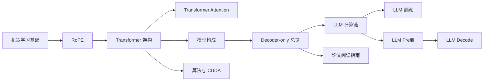

# Transformer 学习路线

本页是 [Attention Is All You Need](attention_is_all_you_need.md) 的学习入口。内容按“基础概念 -> 论文架构 -> 模型构成 -> LLM 运行过程”的顺序拆分，避免将不同层次的问题混在同一页。



| 阶段 | 文档 | 阅读目标 | 完成标志 |
| --- | --- | --- | --- |
| 1 | [机器学习基础](machine_learning_prerequisites.md) | 理解 token、id、embedding、位置编码、softmax 和交叉熵。 | 能解释文本为何先变成向量。 |
| 1.5 | [RoPE：旋转位置编码](rotary_position_embedding.md) | 理解位置如何在 Q/K 点积前进入 attention。 | 能区分“加位置向量”和“旋转 Q/K”。 |
| 2 | [Transformer 架构](transformer_architecture.md) | 理解 Encoder、Decoder、attention、encoder memory 和 cross-attention。 | 能说明 Decoder 如何从 memory 读取源语言信息。 |
| 2.1 | [Transformer Attention](transformer_attention.md) | 理解 Q/K/V、多头机制和三类 attention 参数。 | 能说明 attention 如何读取上下文。 |
| 3 | [训练后模型构成](transformer_model_composition.md) | 理解 checkpoint、参数张量、配置、tokenizer 与运行时状态的边界。 | 能说明一个 LLM 权重包里有什么，以及原论文模型与 decoder-only LLM 的区别。 |
| 4 | [Decoder-only LLM 总览](decoder_only_llm.md) | 理解 LLM 如何用 causal self-attention 读取 prompt。 | 能说明为何通常不需要独立 Encoder memory 与 cross-attention。 |
| 5 | [Decoder-only LLM 计算链](decoder_only_llm_computation.md) | 理解 token id、embedding、Q/K/V、attention、FFN 与 LM head。 | 能从 prompt 跟到下一个 token。 |
| 6 | [Decoder-only LLM 训练](decoder_only_llm_training.md) | 理解整段序列、标签遮罩、loss 与参数更新。 | 能解释训练为何可并行。 |
| 7 | [Decoder-only LLM 推理总览](decoder_only_llm_inference.md) | 比较 prefill、decode、KV cache 与 token 选择。 | 能解释推理为何逐 token 进行。 |
| 7.1 | [Decoder-only LLM Prefill](decoder_only_llm_prefill.md) | 理解完整 prompt 的算子链和 cache 创建。 | 能说明首个 token 如何产生。 |
| 7.2 | [Decoder-only LLM Decode](decoder_only_llm_decode.md) | 理解单 token 的输入、算子和 cache 追加。 | 能说明后续 token 如何产生。 |
| 按需 | [原论文训练](transformer_training.md)、[原论文推理](transformer_inference.md) | 对照理解翻译 Encoder-Decoder 的 teacher forcing、cross-attention 和 source memory。 | 能区分翻译模型与 decoder-only LLM。 |
| 按需 | [从 Attention Is All You Need 到 LLM](llm_reading_guide.md) | 按“理解 LLM 构成”的目标精读原论文。 | 能判断哪些论文部分优先阅读。 |
| 扩展 | [算法与 CUDA 实现](transformer_algorithm_and_cuda.md) | 从算子、计算图与 GPU 优化角度理解实现。 | 能区分模型算法与工程优化。 |

建议始终使用同一个例子：

```text
源序列: I love cats
目标序列: 我 喜欢 猫 <eos>
```

建议先完成架构与计算链阅读，再进入 CUDA、KV cache 或采样策略。遇到术语时可返回本页定位相关文档。

## 相关文档

- [论文导读](attention_is_all_you_need.md)
- [Decoder-only LLM 总览](decoder_only_llm.md)
- [从 Attention Is All You Need 到 LLM](llm_reading_guide.md)
- [训练与推理总览入口](transformer_training_and_inference.md)
- [Attention Is All You Need - arXiv](https://arxiv.org/abs/1706.03762)
