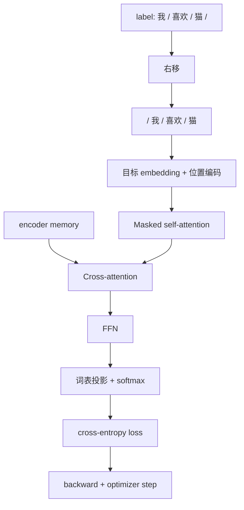
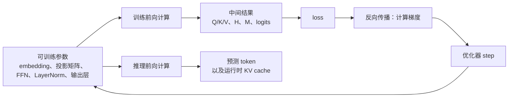

# Transformer 训练：从真实目标到参数更新

[上一篇：Transformer 架构](transformer_architecture.md) | [返回学习路线](transformer_prerequisites.md) | [下一篇：Transformer 推理](transformer_inference.md)

训练的目标是让模型在源序列和正确目标前缀条件下，为真实下一个 token 分配更高概率，并据此更新参数。

## 右移目标序列与 teacher forcing

设源序列为 `I love cats`，真实目标为：

```text
label = [我, 喜欢, 猫, <eos>]
```

训练输入将 label 右移一位，并在开头补 `<bos>`：

```text
decoder_input = [<bos>, 我, 喜欢, 猫]
```

| 位置 | Decoder 输入 | 监督目标 |
| --- | --- | --- |
| 0 | `<bos>` | `我` |
| 1 | `我` | `喜欢` |
| 2 | `喜欢` | `猫` |
| 3 | `猫` | `<eos>` |

这称为 teacher forcing：训练时，目标前缀来自数据中的真实 token，而不是模型先前预测的 token。

## 训练前向计算

右移序列仍需经过目标端 embedding lookup 与位置编码：

```text
Y0 = TargetEmbedding(decoder_input_ids) + PositionalEncoding
```

随后，Decoder 每层执行：

```text
A1 = MaskedMultiHeadAttention(Y0, Y0, Y0)
H1 = LayerNorm(Y0 + A1)

A2 = MultiHeadAttention(query=H1, key=M, value=M)
H2 = LayerNorm(H1 + A2)

F = FeedForward(H2)
Y1 = LayerNorm(H2 + F)
```



### Causal mask 为什么必要

训练时整条 `decoder_input` 一次进入模型，但 causal mask 保证位置 `t` 只能读取左侧前缀：

| 输出位置 | 可读取的 Decoder 输入 | 预测目标 |
| --- | --- | --- |
| 0 | `<bos>` | `我` |
| 1 | `<bos>, 我` | `喜欢` |
| 2 | `<bos>, 我, 喜欢` | `猫` |
| 3 | `<bos>, 我, 喜欢, 猫` | `<eos>` |

因此模型在预测 `喜欢` 时不能访问 `猫`。完整目标序列在训练开始时已知，所以所有位置的矩阵计算仍可并行执行。

## 损失、反向传播与训练态

Decoder 最终表示被投影到词表大小，产生 logits；softmax 后得到各 token 概率。交叉熵损失为：

```text
loss = -sum_t log p(y_t | y_<t, source)
```

| 阶段 | 作用 |
| --- | --- |
| Forward | 计算 logits、概率和 loss，并保存部分中间激活。 |
| Backward | 计算 embedding、Q/K/V、FFN、输出层等参数的梯度。 |
| Optimizer step | 根据梯度更新模型参数。 |

训练通常启用 dropout 等正则化。原论文还使用 label smoothing。[Attention Is All You Need](https://arxiv.org/abs/1706.03762)

## 模型参数：训练更新与推理使用

先区分两类对象：**模型参数**会保存在 checkpoint 中，并由优化器迭代更新；**中间结果**只在一次前向计算期间产生，不会被优化器直接更新。

| 类别 | 典型内容 | 训练时发生什么 | 推理时如何使用 |
| --- | --- | --- | --- |
| Token embedding | 源/目标 token 的 embedding 表 | 当前 batch 中被查到的行接收梯度，并随优化器更新。 | 根据输入 token id 查同一张训练好的表。 |
| Attention 投影 | 三类 attention 中各自的 `W^Q`、`W^K`、`W^V`、`W^O`，以及可选 bias | 反向传播计算梯度，优化器更新参数。 | 用固定参数把输入表示投影为 Q、K、V，再完成 attention。 |
| FFN | 两层线性层的权重与 bias | 根据 loss 更新。 | 用固定参数完成逐位置变换。 |
| LayerNorm | 缩放参数 `gamma` 与平移参数 `beta` | 根据 loss 更新。 | 用固定参数规范化当前激活。 |
| 词表输出层 | 输出投影权重与 bias | 根据目标 token 的交叉熵 loss 更新。 | 将 Decoder 表示变为 logits，供选出下一个 token。 |
| 位置编码 | 可学习位置表（若采用） | 作为参数更新。 | 查表并加到 token embedding。 |
| 正弦/余弦位置编码 | 固定公式生成的数值 | 不更新，它不是可训练参数。 | 按位置直接取用并相加。 |

原论文共享源端 embedding、目标端 embedding 和 softmax 前的输出权重；现代实现是否共享这些权重取决于具体模型配置。

下表中的对象也可能以矩阵或向量形式出现，但它们不是模型参数：

| 运行时对象 | 是什么 | 是否由优化器更新 |
| --- | --- | --- |
| `Q`、`K`、`V`、attention 权重 | 由当前输入和投影矩阵计算出的中间张量 | 否。它们每次前向计算都会重新生成。 |
| `H`、`M`（encoder memory）、logits | 当前样本的表示或预测结果 | 否。它们随输入变化。 |
| loss、梯度 | 衡量误差及其对参数的更新方向 | 否。梯度被优化器使用后通常会清除或覆盖。 |
| KV cache | 推理时缓存历史 K/V，避免重复计算 | 否。它是运行时状态，不会写回模型参数。 |



因此，训练的核心循环是“前向计算 -> loss -> 反向传播 -> 更新参数”；推理只加载训练后的参数，关闭梯度计算和参数更新，反复执行前向计算生成 token。推理中的 KV cache 能加速生成，但不属于模型学到的知识。详细过程见 [Transformer 推理](transformer_inference.md)。

如果你的目标是理解训练完成后 checkpoint 中究竟保存了哪些部分，以及原论文模型和现代 decoder-only LLM 的参数布局有何不同，请继续阅读 [训练后 Transformer / LLM 模型由什么构成](transformer_model_composition.md)。

## 下一步

训练时已有真实前缀；推理时不存在真实答案，模型必须使用自己的输出作为下一步输入。继续阅读 [Transformer 推理](transformer_inference.md)。

[上一篇：Transformer 架构](transformer_architecture.md) | [返回学习路线](transformer_prerequisites.md) | [下一篇：Transformer 推理](transformer_inference.md)
