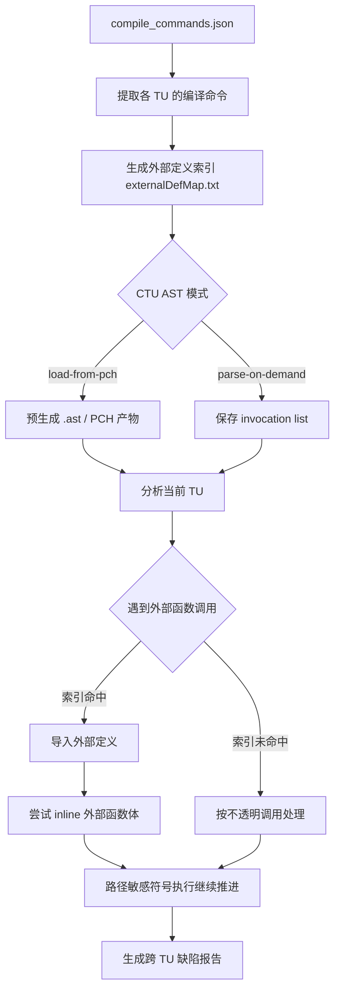
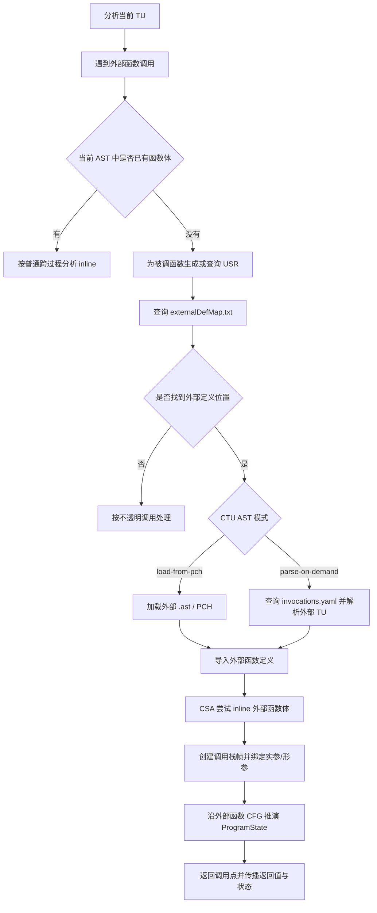
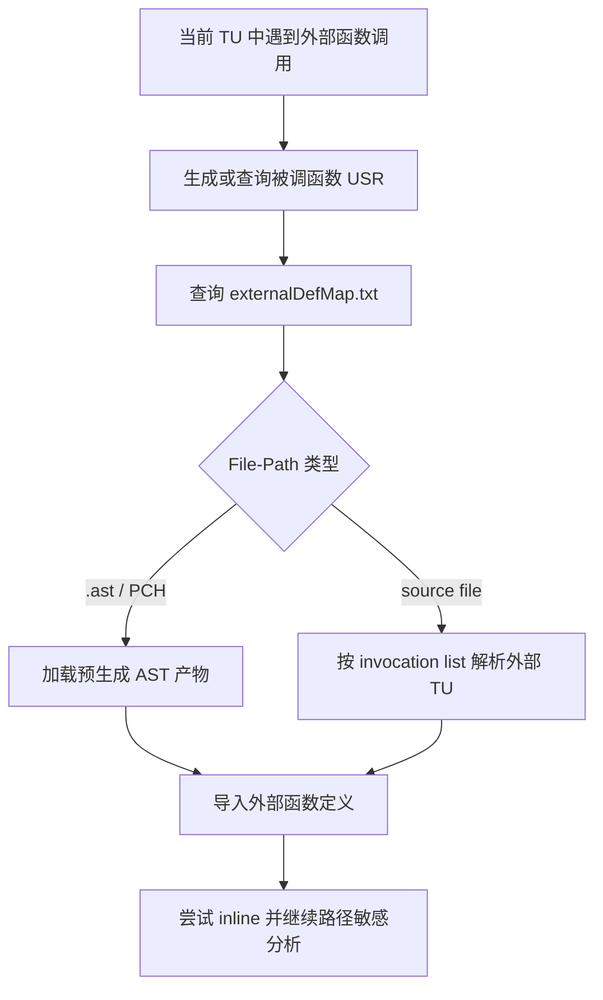
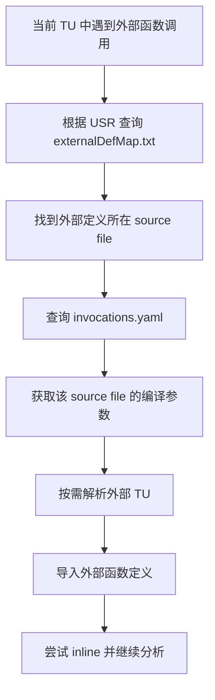
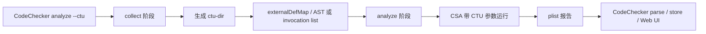
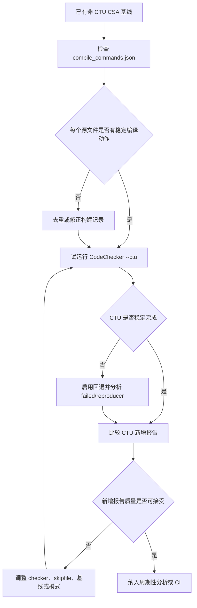

# Clang CTU Analysis

调研日期：2026-07-03

## 核心结论

CTU（Cross Translation Unit）分析是 Clang Static Analyzer（CSA）用于突破单 translation unit 边界的一种跨文件分析机制。普通 CSA 分析通常只在当前 translation unit 内推演路径；CTU 会为外部 translation unit 建立函数定义索引，并在当前分析过程中导入外部函数定义，使分析器能够 inline 跨文件调用，从而发现单文件分析看不到的路径缺陷。

CTU 的核心收益是提高跨文件调用链上的缺陷检出能力，例如跨文件返回值契约、资源所有权、空值传播和除零路径。其主要局限也较为明确：配置链路更长，依赖准确的 compilation database，索引和 AST 产物会增加存储和构建成本，外部定义导入会增加 CPU 与内存压力，并可能放大 CSA 原有的路径爆炸、建模不完整和误报问题。

## 能力与边界概览

| 维度 | CTU 能力 | 边界 |
| --- | --- | --- |
| 分析目标 | 导入其他 translation unit 中的外部函数定义 | 不合并整个项目为单一 translation unit。 |
| 核心机制 | 通过索引定位外部定义，并尝试 inline | inline 失败时会退化为普通不透明调用。 |
| 依赖输入 | `compile_commands.json`、外部定义索引、AST/PCH 或 invocation 信息 | 编译命令不准确会直接影响分析结果。 |
| 适合问题 | 跨文件返回值、资源所有权、空值传播、除零路径、API 契约 | 对纯局部缺陷收益有限。 |
| 工程入口 | 建议由 CodeChecker 驱动 collect/analyze 流程 | CodeChecker 不能改变 CTU 的语义边界。 |
| 链接语义 | 不关注真实链接过程 | 不解析 `.o`、`.a`、`.so` 的最终符号绑定。 |

## 问题背景

C/C++ 项目通常按多个 translation unit 编译。一个 `.cpp` 文件和它包含的头文件会被编译成一个 translation unit，而另一个 `.cpp` 文件中的函数实现并不天然出现在当前 translation unit 的 AST 中。

普通 CSA 在分析当前文件时，如果遇到外部函数调用但拿不到函数体，只能把调用当作不透明边界处理。这样可以保持分析成本较低，但会丢失跨文件路径信息。

例如：

```cpp
// main.cpp
int foo();

int main() {
  return 3 / foo();
}

// foo.cpp
int foo() {
  return 0;
}
```

如果只分析 `main.cpp`，分析器只能看到 `foo()` 的声明，无法知道它返回 `0`。启用 CTU 后，分析器可以把 `foo.cpp` 中的 `foo` 定义导入到 `main.cpp` 的分析过程中，因此能发现除零路径。

## 基本原理

CTU 并不是把整个项目合并成一个巨大的 translation unit，而是以“按需跨文件 inline”的方式扩展当前分析上下文：

1. 基于 compilation database 获取各 translation unit 的真实编译参数。
2. 为项目中的外部定义生成索引，通常以函数 USR（Unified Symbol Resolution）映射到定义所在文件或 AST 产物。
3. 分析当前 translation unit 时，如果遇到外部函数调用，CSA 通过索引查找对应定义。
4. 根据 CTU 模式加载预生成 AST，或按需用原始编译命令解析外部源文件。
5. 将可用的外部函数体作为 inline 候选，接入 CSA 的路径敏感符号执行。



从 CSA 内部机制看，CTU 的关键仍然是 inlining。CSA 的 interprocedural analysis 通过 call enter、stack frame 切换、call exit 和状态清理来模拟函数调用。CTU 只是把“函数体可见”的范围从当前 translation unit 扩展到其他 translation unit。

## CTU Inlining 过程

CTU 中的 inlining 不是编译优化中的函数内联，而是 CSA 在静态分析过程中导入外部函数体，并把该函数体接入当前路径敏感符号执行。它发生在源码/AST 层，不涉及目标文件、链接符号或机器码。

典型过程如下：



该过程可以拆成四个阶段：

| 阶段 | 主要动作 | 说明 |
| --- | --- | --- |
| 调用识别 | 在当前 TU 的调用点判断是否已有可分析函数体 | 当前 AST 中已有函数体时，直接按普通跨过程分析处理。 |
| 外部定义定位 | 使用被调函数 USR 查询 `externalDefMap.txt` | 索引命中后才能进入 CTU 导入流程；未命中时按不透明调用处理。 |
| 外部 AST 获取 | 根据 CTU 模式加载 `.ast` / PCH，或根据 `invocations.yaml` 按需解析源码 | 该阶段恢复外部 TU 的 AST 和编译上下文。 |
| 路径敏感 inline | 创建新的 stack frame，绑定实参和形参，沿外部函数 CFG 更新 `ProgramState` | 返回时将返回值、约束和 checker 状态带回调用点。 |

导入成功并不等于一定完成 inline。CSA 仍会根据函数类型、调用形式、递归深度、路径数量、inline 策略和资源预算决定是否进入函数体。若 AST 导入失败、外部 TU 无法解析、函数体不适合 inline，或分析达到内部限制，CSA 会退化为普通不透明调用。

## AST 导入模式

Clang CTU 文档描述了两类导入方式：PCH-based analysis 和 on-demand analysis。CodeChecker 对应提供 `--ctu-ast-mode load-from-pch` 与 `--ctu-ast-mode parse-on-demand`。

| 模式 | 基本机制 | 关键产物 | 优点 | 缺点 |
| --- | --- | --- | --- | --- |
| `load-from-pch` | collect 阶段预生成 `.ast` / PCH 形式的序列化 AST，索引映射到 `.ast` 文件 | `.ast` / PCH、`externalDefMap.txt` | analyze 阶段加载直接，外部定义准备充分 | 预生成产物占用磁盘，collect 成本高 |
| `parse-on-demand` | collect 阶段保存外部定义索引和 invocation list，analyze 阶段按需解析外部 TU | `externalDefMap.txt`、`invocations.yaml` | 减少预生成 AST 的磁盘成本，适合按需导入 | analyze 阶段 CPU 开销更高，对编译命令准确性更敏感 |

PCH-based 模式需要为相关 translation unit 生成 AST dump，并通过 `clang-extdef-mapping` 建立 USR 到 `.ast` 的映射。On-demand 模式不预先生成 `.ast`，索引指向源码文件，同时需要 invocation list 告诉 analyzer 如何重新解析对应 translation unit。

## 与链接过程的边界

CSA 的 CTU 分析不关注真实链接过程。它是 source-level / AST-level 的跨 translation unit 函数体导入机制，目标是在分析当前 translation unit 时找到外部函数定义，并将其作为 inline 候选接入路径敏感分析。

CTU 依赖 `compile_commands.json` 中的编译命令，是为了还原每个 translation unit 的编译上下文，例如宏、include path、target triple 和源文件路径，而不是为了分析 `.o` 文件最终如何被 linker 绑定成可执行文件。

| 事项 | CTU 是否关注 | 说明 |
| --- | --- | --- |
| `compile_commands.json` | 关注 | 用于还原每个 translation unit 的真实编译参数。 |
| 宏、include path、target triple | 关注 | 这些信息决定外部源文件能否被正确解析为 AST。 |
| 外部定义索引 `externalDefMap.txt` | 关注 | 用 USR 将外部函数或定义映射到源文件或 `.ast` 产物。 |
| AST / PCH dump | 关注 | PCH-based 模式通过预生成 AST 产物导入外部定义。 |
| invocation list | 关注 | On-demand 模式用它按需重新解析外部 translation unit。 |
| 当前 TU 分析时导入外部函数体 | 关注 | 这是 CTU 增强跨文件缺陷发现能力的核心动作。 |
| 生成 `.o` 文件后的链接过程 | 不关注 | CTU 不模拟目标文件如何被链接成最终二进制。 |
| linker 符号解析和链接顺序 | 不关注 | CTU 不按链接器规则解析 weak symbol、archive member 或链接顺序。 |
| 动态库或静态库最终绑定 | 不关注 | 若只有已编译库而没有源码或 AST，CTU 通常无法导入函数体。 |
| LTO 或最终全程序优化 | 不关注 | CTU 不是 LTO，也不是 link-time whole-program analysis。 |

因此，CTU 能回答的是“分析当前文件时，是否可以找到并导入另一个 translation unit 中的函数定义”。它不能回答“最终链接产物实际绑定了哪个实现”。如果分析目标依赖真实链接语义、动态库选择或运行时加载行为，需要结合构建系统、链接产物、符号表或运行时证据另行分析。

## CTU 中间产物概览

CTU 运行时会产生源码之外的辅助文件。它们服务于 AST 导入和编译上下文还原，不服务于真实链接。

| 产物 | 所属模式 | 主要作用 | 不是 |
| --- | --- | --- | --- |
| `externalDefMap.txt` | 两种模式均使用 | 将 USR 映射到外部定义所在源码或 `.ast` 产物 | 不是链接器符号表，也不是全项目调用图 |
| `.ast` / PCH serialized AST | `load-from-pch` | 保存预生成的外部 TU AST，供分析阶段加载 | 不是目标文件或可执行产物 |
| `invocations.yaml` | `parse-on-demand` | 将源码文件映射到重新解析该 TU 所需的编译命令参数 | 不是链接命令，也不是构建依赖图 |
| `ctu-dir/` | CodeChecker CTU | 统一保存 CTU collect 阶段生成的索引、AST 或 invocation 信息 | 不是最终报告库 |
| `*.plist` | analyzer 输出 | 保存 CSA 结构化缺陷报告 | 不是 CTU 索引文件 |

## externalDefMap.txt

`externalDefMap.txt` 是 CTU 的外部定义索引文件。它不是链接器符号表，也不是全项目调用图，而是用于帮助 CSA 在当前 translation unit 分析过程中定位外部定义的位置。

每一行的基本格式如下：

```text
<USR-Length>:<USR> <File-Path>
```

示例：

```text
9:c:@F@foo# /path/to/your/project/foo.cpp.ast
9:c:@F@foo# /path/to/your/project/foo.cpp
```

字段含义如下：

| 字段 | 示例 | 含义 |
| --- | --- | --- |
| `USR-Length` | `9` | 后续 USR 字符串的长度。 |
| `:` | `:` | 分隔 USR 长度和 USR 内容。 |
| `USR` | `c:@F@foo#` | Unified Symbol Resolution，Clang 用来稳定标识函数、方法、全局变量等声明或定义的符号 ID。 |
| 空格 | ` ` | 分隔 USR 和外部定义位置。 |
| `File-Path` | `/path/to/project/foo.cpp.ast` 或 `/path/to/project/foo.cpp` | 外部定义所在位置。PCH-based 模式指向 `.ast` / PCH 产物；on-demand 模式指向源码文件。 |

两种 CTU 模式对 `File-Path` 的要求不同：

| CTU 模式 | `File-Path` 指向 | 说明 |
| --- | --- | --- |
| PCH-based / `load-from-pch` | `.ast` 文件 | index entry 必须带 `.ast` 后缀，表示 analyzer 应从预生成 AST/PCH 产物中导入定义。 |
| On-demand / `parse-on-demand` | 源码文件 | index entry 不应带 `.ast` 后缀，表示 analyzer 应结合 invocation list 按需重新解析该 translation unit。 |

生成方式如下：

```bash
# PCH-based 模式：先生成 AST/PCH dump
clang++ -emit-ast -o foo.cpp.ast foo.cpp

# 再生成 externalDefMap.txt
clang-extdef-mapping -p . foo.cpp.ast > externalDefMap.txt

# On-demand 模式：直接基于源码生成映射
clang-extdef-mapping -p . foo.cpp > externalDefMap.txt
```

其中 `-p .` 指定 compilation database 所在目录，使 `clang-extdef-mapping` 能从 `compile_commands.json` 获取编译参数。

`externalDefMap.txt` 的主要作用是建立以下查找链路：



从内容范围看，`externalDefMap.txt` 的核心目标是记录可导入外部定义，最常见、最关键的是函数或方法定义，因为 CTU 的主要收益来自跨 translation unit 导入函数体并 inline。全局变量定义在部分场景中可能被记录或参与导入，但不应把该文件理解为全局变量数据库。`typedef`、类型别名、`struct`、`class` 等类型定义通常不会作为独立查询入口写入该索引；当导入函数体需要相关类型时，类型声明或定义会作为 AST 依赖被一并导入。

| 内容类别 | 是否通常写入 `externalDefMap.txt` | 说明 |
| --- | --- | --- |
| 函数定义 | 是 | CTU 最主要的导入目标。 |
| C++ 方法定义 | 是 | 用于跨 TU inline 成员函数实现。 |
| 全局变量定义 | 可能 | 部分场景中可能参与索引或导入，但不应将该文件视为全局变量库。 |
| `typedef` / 类型别名 | 通常否 | 一般作为函数体导入时的 AST 依赖出现。 |
| `struct` / `class` 定义 | 通常否 | 不作为主要查询入口；需要时随 AST 依赖导入。 |
| 链接后的最终符号 | 否 | CTU 不记录 linker 选择结果。 |

因此，`externalDefMap.txt` 的准确定位是“USR 到外部定义位置的映射表”，用于支持源码/AST 层的跨 translation unit 函数体导入。它不表示最终链接符号绑定，不记录 `.o`、`.a`、`.so` 的链接选择，也不等价于完整项目级调用图。

## invocations.yaml

`invocations.yaml` 是 CTU on-demand 模式使用的编译命令映射文件。它不是链接命令、调用图或缺陷报告，而是用于告诉 analyzer：当需要按需解析某个外部 translation unit 时，应使用哪些编译参数重新解析该源文件。

`externalDefMap.txt` 和 `invocations.yaml` 的职责不同：

| 文件 | 回答的问题 | 作用 |
| --- | --- | --- |
| `externalDefMap.txt` | 某个 USR 对应的外部定义在哪个源文件中 | 定位外部定义。 |
| `invocations.yaml` | 如果要解析这个源文件，应使用什么编译命令 | 还原外部 translation unit 的编译上下文。 |

典型内容如下：

```yaml
"/path/to/your/project/foo.cpp":
  - "clang++"
  - "-c"
  - "/path/to/your/project/foo.cpp"
  - "-o"
  - "/path/to/your/project/foo.o"

"/path/to/your/project/main.cpp":
  - "clang++"
  - "-c"
  - "/path/to/your/project/main.cpp"
  - "-o"
  - "/path/to/your/project/main.o"
```

字段含义如下：

| 字段 | 含义 |
| --- | --- |
| YAML key | translation unit 主源文件的绝对路径。 |
| YAML value | 编译该 translation unit 的命令参数列表。 |
| 编译器命令 | 例如 `clang++`，表示用于解析该 TU 的编译器驱动。 |
| `-c` | 表示编译但不链接；该命令用于还原编译上下文，不用于执行链接过程。 |
| 源文件路径 | 当前 translation unit 的主源文件。 |
| `-o ...` | 原始编译命令中的输出路径，主要用于保持 invocation 结构。 |
| 其他编译参数 | 宏定义、include path、语言标准、target triple、feature flag 等真实编译参数。 |

On-demand 模式需要 `invocations.yaml`，因为它不预先为所有外部 translation unit 生成 `.ast` / PCH 产物。分析当前 translation unit 时，如果 `externalDefMap.txt` 指向某个源码文件，analyzer 需要根据 `invocations.yaml` 找到该源文件对应的编译命令，然后按需重新解析 AST。



因此，`invocations.yaml` 的准确定位是“source file 到编译命令参数列表的映射”。它服务于源码级 AST 解析，不表示链接命令、链接符号绑定、最终二进制依赖或运行时加载关系。

## CodeChecker 执行模型

真实项目中不建议手工维护 CTU 所需的 AST、索引和 analyzer 参数。Clang 官方文档与 CodeChecker 文档都把 CodeChecker 作为更适合工程化 CTU 的入口。

常用命令：

```bash
# 默认 CTU，CodeChecker 执行 collect 和 analyze 两个阶段
CodeChecker analyze --ctu compile_commands.json -o reports

# 指定 PCH-based 模式
CodeChecker analyze --ctu --ctu-ast-mode load-from-pch compile_commands.json -o reports

# 只执行 CTU collect，生成 reports/ctu-dir，不运行 analyzer
CodeChecker analyze --ctu-collect compile_commands.json -o reports

# 基于已存在的 reports/ctu-dir 执行 analyze
CodeChecker analyze --ctu-analyze compile_commands.json -o reports

# CTU 失败时回退为非 CTU 分析
CodeChecker analyze --ctu --ctu-reanalyze-on-failure compile_commands.json -o reports
```

CodeChecker 的 CTU 流程可分成两个阶段：



需要注意，CodeChecker 文档明确说明 CTU 需要 Clang Static Analyzer 本身支持 Cross-TU；默认 `CodeChecker analyze` 不启用 CTU。CTU 还要求每个源文件最好只有一个 compilation action，因此 CodeChecker 在 CTU 模式下会涉及 compilation database 去重策略。

CodeChecker 与 CSA / CTU 的关系可以概括如下：

| 对象 | 定位 | 与 CTU 的关系 |
| --- | --- | --- |
| CSA | LLVM/Clang 中的静态分析框架 | 真正执行路径敏感分析和 CTU 外部定义导入。 |
| CTU | CSA 的跨 translation unit 分析能力 | 扩展 CSA 可见的外部函数体范围。 |
| CodeChecker | 独立的工程化分析平台，不属于 LLVM 项目 | 驱动 CSA/clang-tidy，管理 CTU collect/analyze、报告、基线和 Web UI。 |

### CodeChecker 中间产物

CodeChecker 的价值在于把编译命令采集、analyzer 调用、CTU collect/analyze、报告解析和结果治理串成可重复流程。它会产生或管理多类中间产物：

| 中间产物 | 产生阶段 | 作用 |
| --- | --- | --- |
| build log / `compile_commands.json` / `build.json` | `CodeChecker log` 或外部构建系统 | 记录编译动作，是 `CodeChecker analyze` 的主要输入。 |
| `reports/` | `CodeChecker analyze -o reports` | 保存 analyzer 输出、CTU 目录和分析元信息。 |
| `*.plist` | CSA / clang-tidy 分析后 | CodeChecker 常用的结构化报告格式，供 `parse`、`store` 和 Web UI 使用。 |
| `compiler_info.json` | 分析阶段 | 记录编译器隐式 include path、define 等信息，使分析环境更接近真实编译环境。 |
| `ctu-dir/` | 启用 CTU collect 时 | 保存 CTU 所需额外文件，例如外部定义索引、AST 产物或 invocation 信息。 |
| `externalDefMap.txt` | CTU collect 阶段 | 将 USR 映射到外部定义所在源码或 `.ast` 产物。 |
| `.ast` / PCH serialized AST | `--ctu-ast-mode load-from-pch` | 预生成外部 translation unit 的 AST/PCH 产物，供 analyze 阶段加载。 |
| invocation list | `--ctu-ast-mode parse-on-demand` | 保存按需解析外部 translation unit 所需的编译命令信息。 |
| 去重后的 compilation actions | CTU 分析准备阶段 | 确保每个源文件尽量只有一个稳定 compilation action。 |
| `failed/` | 分析失败时 | 保存失败分析动作相关输出，便于诊断。 |
| `success/` | 使用 `--capture-analysis-output` 时 | 保存成功 analyzer invocation 的 stdout/stderr。 |
| `reproducer/` | 使用 `--generate-reproducer` 时 | 收集复现某个分析动作所需的信息。 |
| CodeChecker server/database 中的 run/report 数据 | `CodeChecker store` | 保存报告、review status、false positive、confirmed 等治理状态。 |

这些产物服务于源码级静态分析和报告治理，不是链接器中间产物。

### 对链接过程边界的影响

CodeChecker 能缓解 CTU 的工程复杂度，但不能改变 CTU 的语义边界。它不能让 CSA CTU 变成 link-level whole-program analysis。

| 链接相关问题 | CodeChecker 能否解决 | 说明 |
| --- | --- | --- |
| 根据构建过程知道哪些源文件被编译 | 部分能 | `CodeChecker log` 可以记录构建过程中实际出现的编译动作。 |
| 让 CTU 更稳定地找到外部函数定义 | 能改善 | CodeChecker 可以生成 `ctu-dir`，并管理 CTU collect/analyze 流程。 |
| 处理同一源文件多个 compilation action | 能改善 | CTU 模式下可通过 compile uniqueing 策略减少冲突。 |
| 让分析环境接近真实编译环境 | 能改善 | 通过编译命令、编译器信息、宏、include path 等还原编译上下文。 |
| 感知最终链接产物绑定了哪个实现 | 不能 | CodeChecker 不模拟 linker。 |
| 解析 `.o`、`.a`、`.so` 的最终符号绑定 | 不能 | 这些属于 link-level 或 binary-level 语义。 |
| 处理 weak symbol、链接顺序、archive member 选择 | 不能 | CodeChecker 不按链接器规则选择最终符号实现。 |
| 对只有二进制库、没有源码的函数做 CTU inline | 不能 | CTU 需要源码或 AST 可见的外部定义。 |
| 将 CSA CTU 变成 LTO / whole-program analysis | 不能 | CTU 是跨 translation unit 函数体导入，不是最终链接期全程序优化。 |

因此，CodeChecker 适合解决“如何可靠运行 CTU、保存报告、复现失败和治理误报”的问题；若分析目标依赖最终链接产物、符号表、动态库绑定或运行时加载行为，应结合 link map、`nm`/`objdump`、构建系统链接图、二进制分析或运行时证据。

## 能发现的问题类型

CTU 适合提升以下问题的检出率：

- **跨文件返回值约束**：外部函数返回固定值、空指针、错误码或特殊枚举，调用方未处理。
- **跨文件资源所有权**：资源在一个文件中分配或返回，在另一个文件中释放、重复释放或泄漏。
- **跨文件状态机错误**：初始化、使用、销毁分散在不同 translation unit。
- **跨文件安全缺陷**：外部 helper 函数隐藏了输入来源、边界条件或危险 API 参数。
- **跨文件空值传播**：外部函数可能返回 null，但调用方在当前文件中直接解引用。

CTU 对“声明可见但定义不可见”的调用最有价值。如果缺陷完全发生在单个 translation unit 内，或者外部函数已经在头文件中内联可见，CTU 的额外收益会较低。

## CTU 的缺陷

### 1. 配置复杂度高

CTU 对构建信息的依赖比普通 CSA 更强。普通分析只要当前 translation unit 的编译参数足够准确；CTU 还需要其他 translation unit 的编译参数、外部定义索引、AST 产物或 invocation list 都保持一致。

常见失败原因包括：

- `compile_commands.json` 不完整。
- 同一个源文件存在多个不同 compilation action。
- 宏定义、include path、target triple 与真实构建不一致。
- 源文件路径经过 symlink、生成目录或构建缓存后无法稳定映射。
- collect 阶段和 analyze 阶段使用的源码或编译命令不一致。

### 2. 性能与存储成本增加

CSA 本身已经是路径敏感符号执行，分析时间受 entry point 数量、路径数量、checker 行为和 inline 深度影响。CTU 会扩大可 inline 的函数集合，因此会增加外部 AST 加载、函数体解析、路径探索和状态维护成本。

`load-from-pch` 主要消耗磁盘空间和 collect 时间；`parse-on-demand` 主要把解析成本转移到 analyze 阶段。两者都可能让 CI 运行时间和缓存策略变得更复杂。

### 3. 路径爆炸风险更高

跨文件 inline 会让调用链更完整，但也会让路径数量增长。外部函数内部的分支、循环、模板实例、C++ 构造析构和虚调用都会进入当前分析上下文。CSA 有最大 block count、stack frame 深度、loop 处理等限制；一旦触发限制，分析器可能放弃部分路径、重放不 inline 的路径，或只保留保守近似。

因此 CTU 并不等于“全程序精确分析”。它是在成本边界内扩大可见函数体，仍然受到符号执行可扩展性的约束。

### 4. 误报可能增加

CTU 能发现更多真实缺陷，也可能暴露更多不完整建模带来的误报。常见来源包括：

- 外部函数被 inline 后，引入调用方实际依赖但代码中未表达的前置条件。
- C++ 标准库、容器、模板或自定义框架模型不完整。
- 路径敏感约束不足，导致不可行路径被报告。
- 跨文件宏配置不一致，使导入的外部定义不符合实际构建语义。

这类误报不是 CTU 独有，但 CTU 会扩大分析范围，使这些问题更容易显现。

### 5. 覆盖仍然不完整

即使启用 CTU，仍可能无法 inline 某些调用：

- 索引中没有对应定义。
- 外部定义无法用当前编译参数成功解析。
- CFG 或 liveness 构造失败。
- 调用涉及 variadic function、自定义 `operator new/delete`、复杂 C++ 构造析构、动态分发或递归深度限制。
- 分析器认为 inline 不再有收益，或达到内部资源阈值。

因此 CTU 报告缺陷时有更强证据，但 CTU 没有报告缺陷不代表跨文件路径一定安全。

## 工程使用策略

建议按以下顺序引入 CTU：

1. 先让普通 CSA 或 CodeChecker 非 CTU 分析稳定运行。
2. 清理 compilation database，保证每个关键源文件只有明确的 compilation action。
3. 使用 CodeChecker 的默认 `parse-on-demand` CTU 进行试运行。
4. 对比非 CTU 与 CTU 的新增报告，按 checker、目录、缺陷类型建立基线。
5. 如果 analyze 阶段 CPU 压力过大，再评估 `load-from-pch` 是否更适合当前 CI 缓存模型。
6. 对 CTU 失败的文件启用 `--ctu-reanalyze-on-failure`，避免因为 CTU 不稳定导致整体覆盖下降。
7. 将 CTU 作为增量质量门禁前，先建立 suppression、review status 和报告 hash 策略。



## 缺陷治理建议

对 CTU 自身缺陷的治理重点不是“强制全量开启”，而是把它作为更高成本、更高上下文覆盖的分析层。

| 缺陷 | 治理方式 |
| --- | --- |
| 配置复杂 | 用 CodeChecker 驱动 CTU，避免手写 `ctu-dir`、`externalDefMap.txt` 和 invocation list |
| 编译动作重复 | 使用 CodeChecker compilation uniqueing 策略，必要时按目标或路径拆分分析 |
| 性能过高 | 先限定目录或 checker，观察 trace / timeout，再扩展范围 |
| 磁盘占用大 | 在 `parse-on-demand` 与 `load-from-pch` 之间按 CI 缓存能力选择 |
| CTU 失败导致覆盖下降 | 使用 `--ctu-reanalyze-on-failure` 回退到普通分析 |
| 误报增加 | 维护基线、review status、suppression，并优先处理新增高置信报告 |
| 结果不可复现 | 保存 CodeChecker reports、failed/reproducer、编译数据库和 analyzer 版本 |

## 与普通 CSA 的关系

普通 CSA 和 CTU CSA 应作为两层分析，而不是互相替代：

| 分析层 | 上下文范围 | 主要优势 | 主要成本 | 推荐用途 |
| --- | --- | --- | --- | --- |
| 普通 CSA | 当前 translation unit 内可见的代码 | 成本较低，接入简单，适合快速反馈 | 跨文件调用通常按不透明调用处理 | 日常检查、默认 CI、基础缺陷基线 |
| CTU CSA | 当前 TU 加上可导入的外部函数定义 | 跨文件调用链更完整，缺陷证据更强 | 配置、存储、CPU、误报治理成本更高 | 周期性深度扫描、关键模块扫描、release 前风险收敛 |

在工程实践中，稳定的非 CTU 基线比不稳定的 CTU 全量扫描更重要。CTU 应在构建信息、报告治理和资源预算具备基础后再接入。

## 资料来源

- [Clang Cross Translation Unit Analysis](https://clang.llvm.org/docs/analyzer/user-docs/CrossTranslationUnit.html)
- [Clang Command Line Usage: scan-build and CodeChecker](https://clang.llvm.org/docs/analyzer/user-docs/CommandLineUsage.html)
- [Clang Static Analyzer Inlining](https://clang.llvm.org/docs/analyzer/developer-docs/IPA.html)
- [Clang Static Analyzer Performance Investigation](https://clang.llvm.org/docs/analyzer/developer-docs/PerformanceInvestigation.html)
- [CodeChecker Analyzer User Guide](https://codechecker.readthedocs.io/en/latest/analyzer/user_guide/)
- [Scaling Symbolic Execution to Large Software Systems](https://arxiv.org/abs/2408.01909)
- [SMT-Based Refutation of Spurious Bug Reports in the Clang Static Analyzer](https://arxiv.org/abs/1810.12041)
