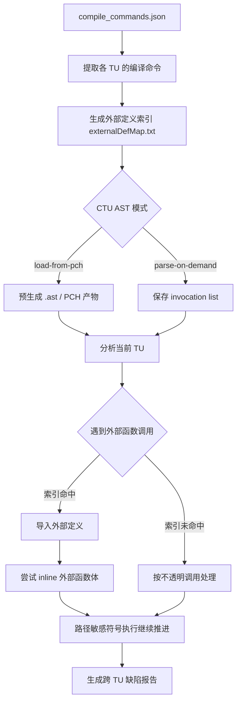
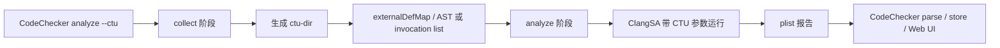
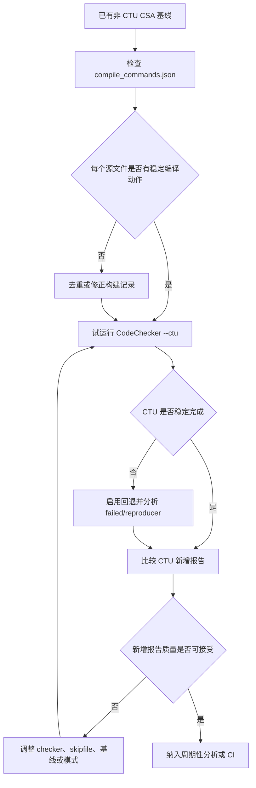

# Clang CTU Analysis

调研日期：2026-07-03

## 核心结论

CTU（Cross Translation Unit）分析是 Clang Static Analyzer（CSA）用于突破单 translation unit 边界的一种跨文件分析机制。普通 CSA 分析通常只在当前 translation unit 内推演路径；CTU 会为外部 translation unit 建立函数定义索引，并在当前分析过程中导入外部函数定义，使分析器能够 inline 跨文件调用，从而发现单文件分析看不到的路径缺陷。

CTU 的核心收益是提高跨文件调用链上的缺陷检出能力，例如跨文件返回值契约、资源所有权、空值传播和除零路径。它的核心缺陷也很明确：配置链路更长，依赖准确的 compilation database，索引和 AST 产物会增加存储和构建成本，外部定义导入会增加 CPU 与内存压力，并可能放大 CSA 原有的路径爆炸、建模不完整和误报问题。

## 背景问题

C/C++ 项目通常按多个 translation unit 编译。一个 `.cpp` 文件和它包含的头文件会被编译成一个 translation unit，而另一个 `.cpp` 文件中的函数实现并不天然出现在当前 translation unit 的 AST 中。

普通 CSA 在分析当前文件时，如果遇到外部函数调用但拿不到函数体，只能把调用当作不透明边界处理。这样可以保持分析成本较低，但会丢失跨文件路径信息。

例如：

```cpp
// main.cpp
int foo();

int main() {
  return 3 / foo();
}

// foo.cpp
int foo() {
  return 0;
}
```

如果只分析 `main.cpp`，分析器只能看到 `foo()` 的声明，无法知道它返回 `0`。启用 CTU 后，分析器可以把 `foo.cpp` 中的 `foo` 定义导入到 `main.cpp` 的分析过程中，因此能发现除零路径。

## 基本原理

CTU 并不是把整个项目合并成一个巨大的 translation unit。它更接近“按需跨文件 inline”：

1. 基于 compilation database 获取各 translation unit 的真实编译参数。
2. 为项目中的外部定义生成索引，通常以函数 USR（Unified Symbol Resolution）映射到定义所在文件或 AST 产物。
3. 分析当前 translation unit 时，如果遇到外部函数调用，CSA 通过索引查找对应定义。
4. 根据 CTU 模式加载预生成 AST，或按需用原始编译命令解析外部源文件。
5. 将可用的外部函数体作为 inline 候选，接入 CSA 的路径敏感符号执行。



从 CSA 内部机制看，CTU 的关键仍然是 inlining。CSA 的 interprocedural analysis 通过 call enter、stack frame 切换、call exit 和状态清理来模拟函数调用。CTU 只是把“函数体可见”的范围从当前 translation unit 扩展到其他 translation unit。

## 两种 AST 导入模式

Clang CTU 文档描述了两类导入方式：PCH-based analysis 和 on-demand analysis。CodeChecker 对应提供 `--ctu-ast-mode load-from-pch` 与 `--ctu-ast-mode parse-on-demand`。

| 模式 | 基本机制 | 优点 | 缺点 |
| --- | --- | --- | --- |
| `load-from-pch` | collect 阶段预生成 `.ast` / PCH 形式的序列化 AST，索引映射到 `.ast` 文件 | analyze 阶段加载较直接，外部定义准备充分 | 预生成产物占用较多磁盘，collect 成本高 |
| `parse-on-demand` | collect 阶段保存外部定义索引和 invocation list，analyze 阶段按需解析外部 TU | 减少预生成 AST 的磁盘成本，适合按需导入 | analyze 阶段可能增加 CPU 开销，对编译命令准确性更敏感 |

PCH-based 模式需要为相关 translation unit 生成 AST dump，并通过 `clang-extdef-mapping` 建立 USR 到 `.ast` 的映射。On-demand 模式不预先生成 `.ast`，索引指向源文件，同时需要 invocation list 来告诉 analyzer 如何重新解析对应 translation unit。

## CodeChecker 执行模型

真实项目中不建议手工维护 CTU 所需的 AST、索引和 analyzer 参数。Clang 官方文档与 CodeChecker 文档都把 CodeChecker 作为更适合工程化 CTU 的入口。

常用命令：

```bash
# 默认 CTU，CodeChecker 执行 collect 和 analyze 两个阶段
CodeChecker analyze --ctu compile_commands.json -o reports

# 指定 PCH-based 模式
CodeChecker analyze --ctu --ctu-ast-mode load-from-pch compile_commands.json -o reports

# 只执行 CTU collect，生成 reports/ctu-dir，不运行 analyzer
CodeChecker analyze --ctu-collect compile_commands.json -o reports

# 基于已存在的 reports/ctu-dir 执行 analyze
CodeChecker analyze --ctu-analyze compile_commands.json -o reports

# CTU 失败时回退为非 CTU 分析
CodeChecker analyze --ctu --ctu-reanalyze-on-failure compile_commands.json -o reports
```

CodeChecker 的 CTU 流程可分成两个阶段：



需要注意，CodeChecker 文档明确说明 CTU 需要 Clang Static Analyzer 本身支持 Cross-TU；默认 `CodeChecker analyze` 不启用 CTU。CTU 还要求每个源文件最好只有一个 compilation action，因此 CodeChecker 在 CTU 模式下会涉及 compilation database 去重策略。

## 能发现的问题类型

CTU 适合提升以下问题的检出率：

- **跨文件返回值约束**：外部函数返回固定值、空指针、错误码或特殊枚举，调用方未处理。
- **跨文件资源所有权**：资源在一个文件中分配或返回，在另一个文件中释放、重复释放或泄漏。
- **跨文件状态机错误**：初始化、使用、销毁分散在不同 translation unit。
- **跨文件安全缺陷**：外部 helper 函数隐藏了输入来源、边界条件或危险 API 参数。
- **跨文件空值传播**：外部函数可能返回 null，但调用方在当前文件中直接解引用。

CTU 对“声明可见但定义不可见”的调用最有价值。如果缺陷完全发生在单个 translation unit 内，或者外部函数已经在头文件中内联可见，CTU 的额外收益会较低。

## CTU 的缺陷

### 1. 配置复杂度高

CTU 对构建信息的依赖比普通 CSA 更强。普通分析只要当前 translation unit 的编译参数足够准确；CTU 还需要其他 translation unit 的编译参数、外部定义索引、AST 产物或 invocation list 都保持一致。

常见失败原因包括：

- `compile_commands.json` 不完整。
- 同一个源文件存在多个不同 compilation action。
- 宏定义、include path、target triple 与真实构建不一致。
- 源文件路径经过 symlink、生成目录或构建缓存后无法稳定映射。
- collect 阶段和 analyze 阶段使用的源码或编译命令不一致。

### 2. 性能与存储成本增加

CSA 本身已经是路径敏感符号执行，分析时间受 entry point 数量、路径数量、checker 行为和 inline 深度影响。CTU 会扩大可 inline 的函数集合，因此会增加外部 AST 加载、函数体解析、路径探索和状态维护成本。

`load-from-pch` 主要消耗磁盘空间和 collect 时间；`parse-on-demand` 主要把解析成本转移到 analyze 阶段。两者都可能让 CI 运行时间和缓存策略变得更复杂。

### 3. 路径爆炸风险更高

跨文件 inline 会让调用链更完整，但也会让路径数量增长。外部函数内部的分支、循环、模板实例、C++ 构造析构和虚调用都会进入当前分析上下文。CSA 有最大 block count、stack frame 深度、loop 处理等限制；一旦触发限制，分析器可能放弃部分路径、重放不 inline 的路径，或只保留保守近似。

因此 CTU 并不等于“全程序精确分析”。它是在成本边界内扩大可见函数体，仍然受到符号执行可扩展性的约束。

### 4. 误报可能增加

CTU 能发现更多真实缺陷，也可能暴露更多不完整建模带来的误报。常见来源包括：

- 外部函数被 inline 后，引入调用方实际依赖但代码中未表达的前置条件。
- C++ 标准库、容器、模板或自定义框架模型不完整。
- 路径敏感约束不足，导致不可行路径被报告。
- 跨文件宏配置不一致，使导入的外部定义不符合实际构建语义。

这类误报不是 CTU 独有，但 CTU 会扩大分析范围，使这些问题更容易显现。

### 5. 覆盖仍然不完整

即使启用 CTU，仍可能无法 inline 某些调用：

- 索引中没有对应定义。
- 外部定义无法用当前编译参数成功解析。
- CFG 或 liveness 构造失败。
- 调用涉及 variadic function、自定义 `operator new/delete`、复杂 C++ 构造析构、动态分发或递归深度限制。
- 分析器认为 inline 不再有收益，或达到内部资源阈值。

因此 CTU 报告缺陷时有更强证据，但 CTU 没有报告缺陷不代表跨文件路径一定安全。

## 工程使用策略

建议按以下顺序引入 CTU：

1. 先让普通 CSA 或 CodeChecker 非 CTU 分析稳定运行。
2. 清理 compilation database，保证每个关键源文件只有明确的 compilation action。
3. 使用 CodeChecker 的默认 `parse-on-demand` CTU 进行试运行。
4. 对比非 CTU 与 CTU 的新增报告，按 checker、目录、缺陷类型建立基线。
5. 如果 analyze 阶段 CPU 压力过大，再评估 `load-from-pch` 是否更适合当前 CI 缓存模型。
6. 对 CTU 失败的文件启用 `--ctu-reanalyze-on-failure`，避免因为 CTU 不稳定导致整体覆盖下降。
7. 将 CTU 作为增量质量门禁前，先建立 suppression、review status 和报告 hash 策略。



## 缺陷治理建议

对 CTU 自身缺陷的治理重点不是“强制全量开启”，而是把它作为更高成本、更高上下文覆盖的分析层。

| 缺陷 | 治理方式 |
| --- | --- |
| 配置复杂 | 用 CodeChecker 驱动 CTU，避免手写 `ctu-dir`、`externalDefMap.txt` 和 invocation list |
| 编译动作重复 | 使用 CodeChecker compilation uniqueing 策略，必要时按目标或路径拆分分析 |
| 性能过高 | 先限定目录或 checker，观察 trace / timeout，再扩展范围 |
| 磁盘占用大 | 在 `parse-on-demand` 与 `load-from-pch` 之间按 CI 缓存能力选择 |
| CTU 失败导致覆盖下降 | 使用 `--ctu-reanalyze-on-failure` 回退到普通分析 |
| 误报增加 | 维护基线、review status、suppression，并优先处理新增高置信报告 |
| 结果不可复现 | 保存 CodeChecker reports、failed/reproducer、编译数据库和 analyzer 版本 |

## 与普通 CSA 的关系

普通 CSA 和 CTU CSA 应作为两层分析，而不是互相替代：

- 普通 CSA：成本较低，适合作为默认日常检查和快速反馈。
- CTU CSA：上下文更完整，适合周期性深度扫描、关键模块扫描和 release 前风险收敛。

在工程实践中，稳定的非 CTU 基线比不稳定的 CTU 全量扫描更重要。CTU 应在构建信息、报告治理和资源预算具备基础后再接入。

## 资料来源

- [Clang Cross Translation Unit Analysis](https://clang.llvm.org/docs/analyzer/user-docs/CrossTranslationUnit.html)
- [Clang Command Line Usage: scan-build and CodeChecker](https://clang.llvm.org/docs/analyzer/user-docs/CommandLineUsage.html)
- [Clang Static Analyzer Inlining](https://clang.llvm.org/docs/analyzer/developer-docs/IPA.html)
- [Clang Static Analyzer Performance Investigation](https://clang.llvm.org/docs/analyzer/developer-docs/PerformanceInvestigation.html)
- [CodeChecker Analyzer User Guide](https://codechecker.readthedocs.io/en/latest/analyzer/user_guide/)
- [Scaling Symbolic Execution to Large Software Systems](https://arxiv.org/abs/2408.01909)
- [SMT-Based Refutation of Spurious Bug Reports in the Clang Static Analyzer](https://arxiv.org/abs/1810.12041)
