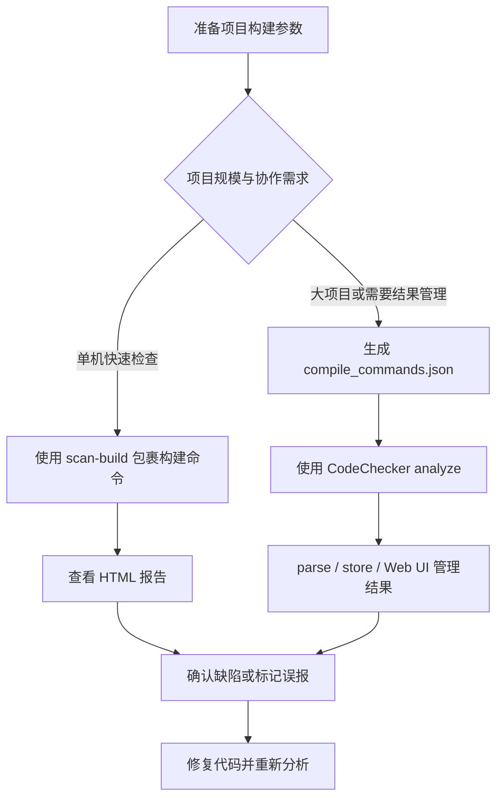
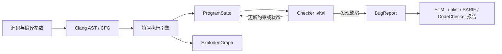
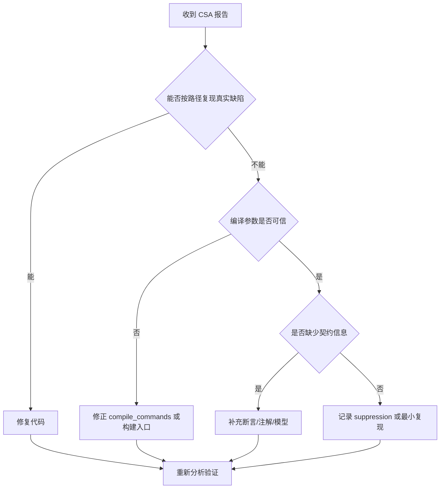

# Clang Static Analyzer

调研日期：2026-07-03

## 核心结论

Clang Static Analyzer（CSA）是 Clang 项目中的源代码静态分析框架，主要用于发现 C、C++ 和 Objective-C 程序中的缺陷。它不只是一个命令行工具，而是一套基于 Clang 前端、路径敏感符号执行和 checker 扩展机制构建的分析基础设施。

工程使用 CSA 时，应优先把它理解为“编译驱动的缺陷发现流程”：它需要准确的编译参数，需要按 translation unit 执行分析，需要用 HTML、plist、SARIF 或 CodeChecker 等方式管理结果。对于单机快速检查，`scan-build` 足够直接；对于大项目、增量结果管理、协作分流或跨 translation unit（CTU）分析，官方文档更推荐 CodeChecker。

## 定义与定位

CSA 的目标是分析源代码并自动发现 bug。它与普通编译告警不同：编译告警通常检查局部语法、类型或简单模式，而 CSA 会沿程序路径推演状态，尝试发现需要运行时调试或测试才能暴露的缺陷，例如空指针解引用、除零、释放后使用、资源泄漏、未初始化值、危险 API 使用等。

CSA 属于 Clang 项目的一部分，并以 C++ library 的形式实现，因此既可以通过 `clang --analyze`、`scan-build` 等工具直接运行，也可以被 IDE、CodeChecker、clang-tidy 的 `clang-analyzer-*` checks 等上层工具集成。

## 运行入口

常见运行方式可以分为四类：

| 入口 | 适用场景 | 典型命令或方式 |
| --- | --- | --- |
| `clang --analyze` | 单文件或复现某个分析问题 | `clang --analyze file.c` |
| `scan-build` | 本地按构建过程扫描项目并生成 HTML 报告 | `scan-build make` |
| CodeChecker | 大项目、结果管理、增量分析、协作处理 | `CodeChecker analyze compile_commands.json -o reports` |
| clang-tidy | 在 clang-tidy 流程中启用 CSA checker | 启用 `clang-analyzer-*` checks |

`scan-build` 的核心机制是在项目构建时拦截编译器调用，使源文件在正常编译的同时被 CSA 分析。它的优点是接入简单，缺点是结果管理、增量分析和 CTU 支持有限。

CodeChecker 的定位更接近工程化平台：它可以基于 compilation database 运行 CSA，保存报告，比较多次分析结果，提供 Web UI 管理缺陷，也可以同时运行 clang-tidy 等工具。



## Checker 体系

CSA 通过 checker 实现具体缺陷规则。官方 checker 文档将规则按 family 分类，常见类别包括：

- `core`：基础错误，例如除零、空指针、未初始化值、无效调用。
- `cplusplus`：C++ 相关错误，例如 `new/delete`、move、纯虚函数调用、内部指针失效。
- `deadcode`：死存储等无效代码。
- `nullability`：Objective-C 和带 nullability 注解代码中的空值契约问题。
- `optin`：默认不一定开启、需要主动选择的规则。
- `security`：安全相关 API 和内存使用问题。
- `unix`：Unix / POSIX API 使用问题，例如 malloc、stream、cstring。
- `osx`：macOS / Cocoa / CoreFoundation 相关 API 使用问题。
- `alpha.*`：实验性 checker，默认关闭，可能存在更高误报或稳定性风险。
- `debug.*`：面向 CSA 开发者的调试 checker。

选择 checker 时，应先启用默认规则并观察报告质量，再按项目风险逐步增加 `optin` 或特定 family。`alpha.*` 更适合作为规则评估或定向调研输入，不适合作为默认阻塞门禁。

## 分析模型

CSA 的核心分析方式是路径敏感符号执行。分析器会把输入值抽象为 symbolic values，并沿控制流图探索可能路径。每条路径上的状态由 `ProgramState` 表示，主要包含：

- `Environment`：表达式到符号值的映射。
- `Store`：内存区域到符号值的映射。
- `GenericDataMap`：约束和 checker 自定义状态。

分析过程会形成 `ExplodedGraph`。图中的节点通常由 `ProgramPoint` 和 `ProgramState` 组成：前者表示程序位置或分析事件，后者表示该位置上的抽象状态。checker 在分析引擎遍历语句、调用、符号生命周期、指针逃逸等事件时被回调，可以读取状态、更新状态或发出 bug report。



这个模型解释了 CSA 的两类典型现象：

- 精度收益来自路径和状态推理，因此它能发现普通 AST 模式匹配难以发现的深层缺陷。
- 性能成本和误报风险也来自路径探索、约束求解和抽象模型不完整，复杂代码中需要通过配置、注解、断言和结果 triage 控制噪声。

## 控制流与数据流能力

CSA 具备控制流分析能力，也具备数据流或状态流分析能力。不过，它不是以传统独立 data-flow pass 的方式运行，而是在基于 CFG 的路径敏感符号执行过程中同时维护控制路径和程序状态。

### 控制流能力

CSA 使用 Clang CFG 作为核心程序表示之一。CFG 由 AST 构建，表示函数或语句级别的控制流，包含 basic block、入口、出口、分支、循环、异常边等结构。CSA 沿 CFG 探索可能执行路径，并用 `ProgramPoint` 标识当前分析位置。

在 CSA 中，控制流分析主要表现为：

- 按 CFG 遍历语句、分支、循环和函数调用点。
- 在不同分支条件下生成不同的分析路径。
- 用 `ExplodedGraph` 记录控制流路径与状态变化。
- 通过 call enter、call exit 和 inline 机制进行跨过程路径探索。
- 通过 debug checker 查看 CFG、dominator tree、live variables、live expressions 和 `ExplodedGraph`。

因此，CSA 的控制流能力不是只判断代码是否可达，而是服务于后续路径敏感状态推理。

### 数据流与状态流能力

CSA 同样会跟踪值、内存和约束如何沿路径传播。它的核心载体是 `ProgramState`：

- `Environment` 保存表达式到符号值的映射。
- `Store` 保存内存区域到符号值的映射。
- `GenericDataMap` 保存约束和 checker 自定义状态。

这使 CSA 能够表达多类数据流或状态流问题：

- 变量、表达式和返回值在赋值、分支、调用后的符号值变化。
- 指针是否可能为空，整数是否可能为零，范围条件是否成立。
- 资源句柄是否已打开、关闭、逃逸或泄漏。
- 内存对象是否已经释放，是否存在重复释放或释放后使用。
- checker 自定义的 API 状态机或业务状态是否被破坏。

与普通数据流分析相比，CSA 更强调路径敏感性。传统数据流分析通常在 CFG 上传播抽象事实，并在控制流汇合处执行 join；CSA 则尽量为不同路径保留不同的 `ProgramState`，用路径条件和约束减少不可行路径带来的误报。代价是更容易遇到路径爆炸，因此需要通过 inline 深度、循环限制、约束求解预算、模型库和报告裁剪控制成本。

## 配置与结果输出

CSA 支持全局 analyzer options 和单个 checker options。官方文档提示，`clang -cc1` 的 analyzer 配置更偏内部接口，普通用户更应通过 `clang --analyze`、`scan-build` 或 CodeChecker 间接传递参数。

常见配置方向包括：

| 配置方向 | 作用 |
| --- | --- |
| `mode=deep` / `mode=shallow` | 控制分析深度和默认策略 |
| `prune-paths` | 控制报告路径中无关片段是否裁剪 |
| `suppress-null-return-paths` | 抑制部分经过防御式空返回路径的报告 |
| `crosscheck-with-z3` | 用 Z3 对 bug report 做额外可满足性检查 |
| checker option | 针对单个 checker 调整行为，例如 pedantic 模式 |

结果输出不应只依赖终端文本。小规模本地分析可以查看 HTML；工具集成或流水线应优先使用 plist、SARIF 或 CodeChecker 的结构化结果，以便做去重、过滤、基线比较和增量治理。

## CTU 分析

默认情况下，静态分析通常在一个 translation unit 内运行。CTU 分析允许 CSA 在分析当前文件时导入其他 translation unit 中的函数定义，从而发现跨文件调用路径上的问题。

CTU 的收益是能发现单 TU 分析看不到的问题；成本是准备步骤更多、性能更重、配置更复杂。官方 CTU 文档说明可通过 PCH-based 或 on-demand 的方式导入外部定义，并明确建议真实项目优先使用 CodeChecker 自动化驱动，而不是手工维护 AST dump、USR 映射和 analyzer 参数。

适合启用 CTU 的场景：

- 缺陷常跨文件传播，例如接口返回值契约、资源所有权、封装层调用。
- 项目已有可靠的 `compile_commands.json`。
- 团队愿意为更高检出率承担更长分析时间和更多 triage 成本。

不适合直接启用 CTU 的场景：

- 基础编译数据库不稳定。
- 当前默认 checker 的误报尚未收敛。
- CI 时间预算很紧，且缺少结果基线机制。

## 误报处理

CSA 官方文档明确提示静态分析可能产生 false positives。工程化使用时，应把误报治理作为流程的一部分，而不是只关注“是否能跑出报告”。

建议处理顺序：

1. 先确认构建参数是否准确，避免由错误 include、宏或 target 配置导致的伪路径。
2. 分析是否缺少断言、注解或 API 契约信息。
3. 使用 Debug 配置运行，因为断言可以帮助分析器裁剪不可行路径。
4. 对稳定误报建立 suppression 或基线，避免每次扫描重复消耗人力。
5. 对疑似 analyzer 问题，提取最小复现并保留 verbose 分析命令。



## Checker 开发入口

如果需要实现自定义规则，应先判断该规则是否真的需要路径敏感分析：

- 只依赖语法、命名或局部 AST 模式时，优先考虑 Clang warning 或 clang-tidy check。
- 需要沿路径跟踪资源、状态机、所有权、约束或跨语句关系时，才适合写 CSA checker。

CSA checker 通常需要关注三类设计：

| 设计点 | 说明 |
| --- | --- |
| 回调事件 | 选择 `PreCall`、`PostCall`、`DeadSymbols`、`PointerEscape`、AST callback 等事件 |
| 自定义状态 | 通过 `ProgramState` 存储 checker 需要跟踪的符号、集合或映射 |
| 报告构造 | 使用 `BugType`、`BugReport` 和 `CheckerContext::emitReport` 输出缺陷 |

开发和调试常用命令包括：

```bash
clang -cc1 -analyze -analyzer-checker=core.DivideZero test.c
clang -cc1 -analyzer-checker-help
clang -cc1 -help | grep analyzer
clang -cc1 -analyze -analyzer-checker=debug.ViewCFG test.c
clang -cc1 -analyze -analyzer-checker=debug.DumpCFG test.c
clang -cc1 -analyze -analyzer-checker=debug.DumpDominators test.c
clang -cc1 -analyze -analyzer-checker=debug.DumpLiveVars test.c
clang -cc1 -analyze -analyzer-checker=debug.DumpLiveExprs test.c
clang -cc1 -analyze -analyzer-checker=debug.ViewExplodedGraph test.c
```

测试应放在 Clang 的 analyzer 回归测试目录中。官方开发手册提到 analyzer 相关源码位于 `include/clang/StaticAnalyzer`、`lib/StaticAnalyzer` 和 `test/Analysis`。

## 工程落地建议

CSA 的落地路径应分层推进：

1. **先跑通默认分析**：确保项目能稳定生成 compilation database 或能被 `scan-build` 包裹构建。
2. **建立结果基线**：把历史问题和误报从新增问题中分离。
3. **按风险启用 checker**：从默认规则开始，再扩展到 security、unix、cplusplus、optin。
4. **结构化保存结果**：优先使用 CodeChecker、plist 或 SARIF，避免只保存终端日志。
5. **再考虑 CTU 和自定义 checker**：在基础报告质量稳定后，再投入更高成本的跨文件分析和规则开发。

## 常用命令速查

```bash
# 单文件分析
clang --analyze file.c

# 使用 scan-build 包裹 make
scan-build make

# 指定 HTML 输出目录并完成后打开
scan-build -o reports -V make

# 生成 compilation database 后使用 CodeChecker 分析
CodeChecker analyze compile_commands.json -o reports

# 在命令行查看 CodeChecker 结果
CodeChecker parse --print-steps reports

# 导出 HTML 结果
CodeChecker parse reports -e html -o reports_html

# 启用 CTU 分析
CodeChecker analyze --ctu compile_commands.json -o reports
```

## 资料来源

- [Clang Static Analyzer official site](https://clang-analyzer.llvm.org/)
- [Available Checkers](https://clang.llvm.org/docs/analyzer/checkers.html)
- [Command Line Usage: scan-build and CodeChecker](https://clang.llvm.org/docs/analyzer/user-docs/CommandLineUsage.html)
- [Configuring the Analyzer](https://clang.llvm.org/docs/analyzer/user-docs/Options.html)
- [Cross Translation Unit Analysis](https://clang.llvm.org/docs/analyzer/user-docs/CrossTranslationUnit.html)
- [Checker Developer Manual](https://clang-analyzer.llvm.org/checker_dev_manual.html)
- [Debug Checks](https://clang.llvm.org/docs/analyzer/developer-docs/DebugChecks.html)
- [Clang CFG class reference](https://clang.llvm.org/doxygen/classclang_1_1CFG.html)
- [Performance Investigation](https://clang.llvm.org/docs/analyzer/developer-docs/PerformanceInvestigation.html)
