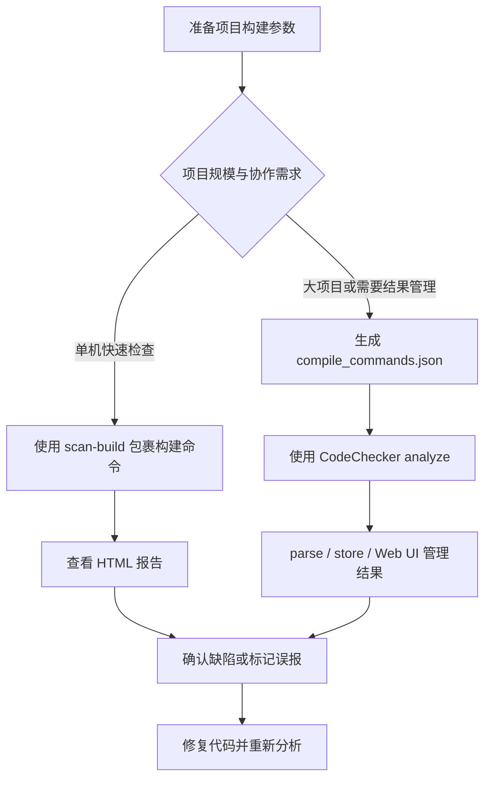
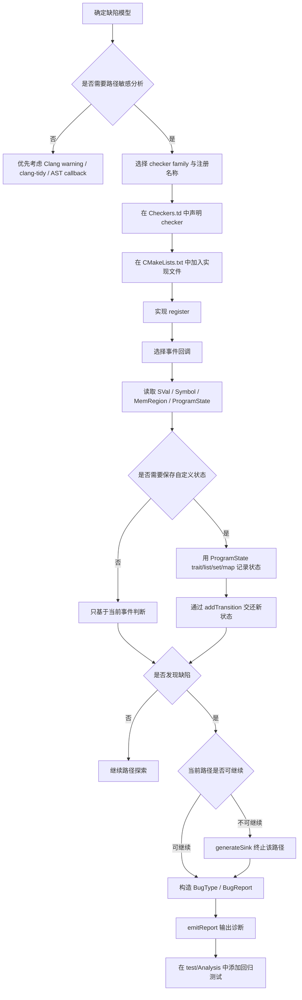
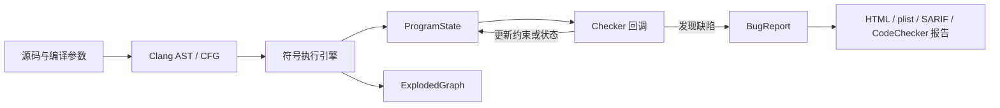
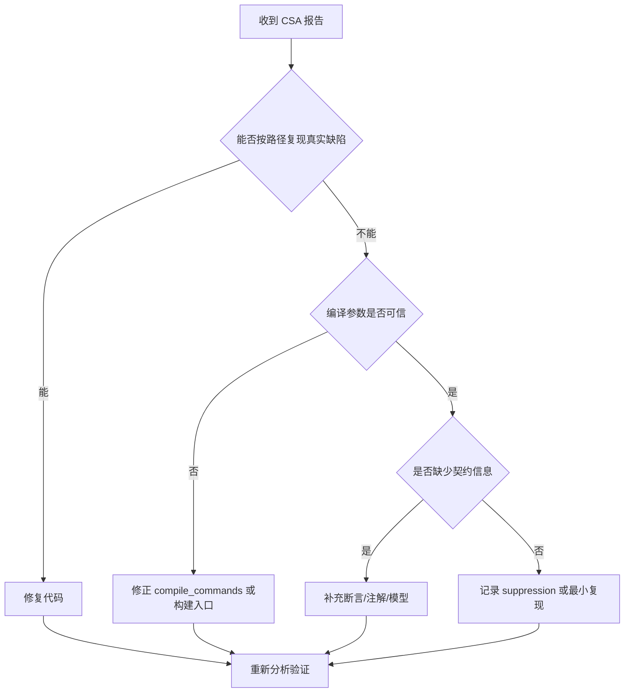

# Clang Static Analyzer

调研日期：2026-07-03

## 核心结论

Clang Static Analyzer（CSA）是 Clang 项目中的源代码静态分析框架，主要用于发现 C、C++ 和 Objective-C 程序中的缺陷。它并非单一命令行工具，而是一套基于 Clang 前端、路径敏感符号执行和 checker 扩展机制构建的分析基础设施。

工程使用 CSA 时，应优先将其理解为“编译驱动的缺陷发现流程”：它需要准确的编译参数，需要按 translation unit 执行分析，也需要通过 HTML、plist、SARIF 或 CodeChecker 等方式管理结果。单机快速检查可使用 `scan-build`；大项目、增量结果管理、协作分流或跨 translation unit（CTU）分析更适合使用 CodeChecker。

## 能力与特性概览

| 特点或能力 | 支持情况 | 说明 |
| --- | --- | --- |
| 目标语言 | 支持 C、C++、Objective-C | 依托 Clang 前端解析源码、类型和 AST。 |
| 核心分析方式 | 支持路径敏感符号执行 | 沿 CFG 探索路径，用符号值和约束推演程序状态。 |
| 控制流分析 | 支持 | 使用 Clang CFG 表示分支、循环、调用点、入口和出口。 |
| 数据流与状态流分析 | 支持 | 通过 `ProgramState` 跟踪表达式值、内存绑定、约束和 checker 自定义状态。 |
| 跨过程分析 | 支持 | 通过函数 inline、调用栈和状态切换分析函数间行为。 |
| 跨 translation unit 分析 | 可支持 | 通过 CTU 导入其他 translation unit 中的外部函数定义，通常建议由 CodeChecker 驱动。 |
| Checker 扩展 | 支持 | 可开发自定义 checker，跟踪资源、状态机、所有权、API 契约等问题。 |
| 常见缺陷类型 | 支持 | 适合发现空指针、除零、未初始化值、资源泄漏、释放后使用、double free 等问题。 |
| 输出与集成 | 支持 | 可生成 HTML、plist、SARIF 等结果，也可通过 CodeChecker 管理报告。 |
| 工程门禁 | 适合分层接入 | 适合先建立默认 checker 和基线，再扩展到 CTU、自定义 checker 或专项规则。 |
| 主要限制 | 存在 | 依赖准确构建参数，可能出现误报/漏报，并受路径爆炸和模型完整性影响。 |

CSA 的定位可概括为：以 Clang 前端为输入基础，以路径敏感符号执行为核心，以 checker 为缺陷规则载体，以 CodeChecker 等工具补足工程化结果管理。

## 定义与定位

CSA 的目标是分析源代码并自动发现缺陷。它与普通编译告警不同：编译告警通常检查局部语法、类型或简单模式；CSA 会沿程序路径推演状态，尝试发现需要运行时调试或测试才能暴露的缺陷，例如空指针解引用、除零、释放后使用、资源泄漏、未初始化值和危险 API 使用。

CSA 属于 Clang 项目的一部分，并以 C++ library 的形式实现，因此既可以通过 `clang --analyze`、`scan-build` 等工具直接运行，也可以被 IDE、CodeChecker、clang-tidy 的 `clang-analyzer-*` checks 等上层工具集成。

| 维度 | 编译告警 / lint | CSA |
| --- | --- | --- |
| 主要输入 | 语法、类型、局部 AST 模式 | AST、CFG、符号值、路径状态 |
| 分析粒度 | 多为局部规则 | 可跨语句、跨函数、部分跨 TU |
| 典型问题 | 风格、可疑写法、简单误用 | 空值、释放后使用、资源泄漏、路径相关 API 误用 |
| 结果特征 | 快速、稳定、误报通常较低 | 上下文更深，但成本和误报治理压力更高 |

## 在静态分析方法谱系中的位置

结合本目录的静态分析方法笔记，可以把 CSA 放在“路径敏感缺陷发现”这一层。它不是单纯的 AST 规则工具，也不是面向全仓库检索的语义查询数据库。

| 方法或工具层次 | 代表工具 | 优势 | 不足 | CSA 的关系 |
| --- | --- | --- | --- | --- |
| 编译器告警 | GCC/Clang warning | 快速、稳定、适合局部问题 | 难以表达复杂路径状态 | CSA 比告警更重，适合补充深层缺陷发现。 |
| AST / lint 规则 | clang-tidy、AST matcher | 适合语法结构、命名、API 局部误用 | 不擅长跨路径状态推理 | 不需要路径敏感性时应优先使用这一层。 |
| 数据流分析 | 通用 data-flow pass | 适合变量定义、传播、活跃性等问题 | 合流处通常会损失路径条件 | CSA 在数据流基础上保留更多路径状态。 |
| 路径敏感符号执行 | CSA、KLEE | 适合空值、除零、资源、状态机等路径相关缺陷 | 成本较高，受路径爆炸和模型完整性影响 | CSA 的核心能力位于这一层。 |
| 语义查询 / 污点分析 | CodeQL 等 | 适合跨文件模式、source/sink、安全规则复用 | 查询与数据库构建成本较高，规则语义不同 | CSA 可发现路径缺陷，但不是查询数据库。 |
| 工程化结果平台 | CodeChecker | 适合报告存储、基线、增量比较、协作处理 | 本身不替代底层分析器 | CodeChecker 可驱动 CSA 并治理结果。 |

## 运行入口

常见入口可分为四类：

| 入口 | 适用场景 | 典型命令或方式 |
| --- | --- | --- |
| `clang --analyze` | 单文件或复现某个分析问题 | `clang --analyze file.c` |
| `scan-build` | 本地按构建过程扫描项目并生成 HTML 报告 | `scan-build make` |
| CodeChecker | 大项目、结果管理、增量分析、协作处理、CTU | `CodeChecker analyze compile_commands.json -o reports` |
| clang-tidy | 在 clang-tidy 流程中启用 CSA checker | 启用 `clang-analyzer-*` checks |

`scan-build` 适合快速接入：它在项目构建时拦截编译器调用，使源文件在正常编译的同时被 CSA 分析。它的优势是简单直接，短板是结果管理、增量分析和 CTU 支持有限。

CodeChecker 的定位是工程化分析平台：它可以基于 compilation database 运行 CSA，保存报告，比较多次分析结果，提供 Web UI 管理缺陷，也可以同时运行 clang-tidy 等工具。需要说明的是，CodeChecker 不是 LLVM 项目的一部分，而是围绕 CSA、clang-tidy 等工具构建的独立工程化封装。



## Checker 体系与能力边界

### Checker 能力边界

自定义 checker 的核心能力，是在路径敏感符号执行过程中识别并维护领域状态。它适合表达“状态如何沿路径变化，以及某个事件发生时是否违反契约”的问题。

| 规则类型 | 是否适合 Checker | 说明 |
| --- | --- | --- |
| 资源生命周期 | 适合 | 适合跟踪 open/close、alloc/free、lock/unlock、retain/release 等成对状态。 |
| API 使用契约 | 适合 | 适合检查调用前置条件、参数非空、返回值必须检查、错误码处理等约束。 |
| 错误码和状态机 | 适合 | 适合表达 init/use/destroy 顺序、handle 状态、请求对象状态等路径相关协议。 |
| 所有权与逃逸 | 适合 | 适合判断资源是否被转移、指针是否逃逸、对象是否仍由当前路径负责。 |
| 路径相关缺陷 | 适合 | 适合发现空指针、除零、释放后使用、double free、未初始化值等缺陷。 |
| 命名、格式、局部语法结构 | 不优先使用 | 通常用 Clang warning、clang-tidy、AST matcher 或 lint 更直接。 |
| 简单 API 禁用或机械重构 | 不优先使用 | 若不依赖路径状态，AST 规则的实现和诊断成本更低。 |
| 全程序精确证明 | 不适合 | CSA 是缺陷发现工具，不是完备证明系统。 |
| 运行时环境强相关问题 | 不适合单独使用 | 并发调度、反射、动态加载、外部服务状态等问题通常需要动态证据或专门模型。 |
| 跨仓库审计和复杂 source/sink 规则 | 视场景而定 | 若需要稳定查询复用和规则版本化，CodeQL 或专用语义查询工具可能更合适。 |

| 限制 | 对 Checker 的影响 |
| --- | --- |
| 路径探索有限 | 循环、递归、异常、模板、虚调用和复杂库函数可能触发路径爆炸或预算限制。 |
| 建模不完整 | 标准库、系统 API、业务框架或自定义 allocator 若缺少模型，可能产生误报或漏报。 |
| 状态设计成本 | checker 状态过宽会增加误报和性能成本，状态过窄会漏掉真实缺陷。 |
| 输入依赖强 | 宏、include path、target triple、编译参数不准确时，checker 结论不稳定。 |
| 跨文件能力有限 | 默认分析以 translation unit 为边界；跨文件依赖 CTU、inline 成功率和外部定义可见性。 |
| 诊断可解释性要求高 | 若报告缺少路径说明、关键状态转移和修复方向，工程落地会变成噪声。 |

因此，checker 开发应从高置信、状态边界清晰、诊断路径可解释的问题开始。若规则容易受业务约定、运行时环境或框架模型影响，应先以非阻塞方式试运行，建立基线和 suppression 机制，再考虑进入 CI 门禁。

### Checker family

CSA 通过 checker 实现具体缺陷规则。官方 checker 文档将规则按 family 分类，常见类别包括：

- `core`：基础错误，例如除零、空指针、未初始化值、无效调用。
- `cplusplus`：C++ 相关错误，例如 `new/delete`、move、纯虚函数调用、内部指针失效。
- `deadcode`：死存储等无效代码。
- `nullability`：Objective-C 和带 nullability 注解代码中的空值契约问题。
- `optin`：默认不一定开启、需要主动选择的规则。
- `security`：安全相关 API 和内存使用问题。
- `unix`：Unix / POSIX API 使用问题，例如 malloc、stream、cstring。
- `osx`：macOS / Cocoa / CoreFoundation 相关 API 使用问题。
- `alpha.*`：实验性 checker，默认关闭，可能存在更高误报或稳定性风险。
- `debug.*`：面向 CSA 开发者的调试 checker。

选择 checker 时，应先启用默认规则并观察报告质量，再按项目风险逐步增加 `optin` 或特定 family。`alpha.*` 更适合作为规则评估或定向调研输入，不适合作为默认阻塞门禁。

## Checker 工作流程

CSA checker 不是独立扫描完整源码的插件，而是嵌入 analyzer engine 的事件处理单元。Analyzer engine 负责构建 CFG、执行路径敏感符号执行、维护 `ProgramState` 和 `ExplodedGraph`；checker 通过注册事件，在特定程序点读取状态、更新状态或报告缺陷。

典型工作流程如下：



### 1. 设计缺陷模型

开发 checker 前应先判断规则是否真的需要 CSA。官方开发手册建议先回答两个问题：

- 这个检查是否可以不用路径敏感分析实现。
- 需要监听哪些事件，以及是否需要在 `ProgramState` 中保存 checker 专属状态。

如果问题只依赖局部语法、命名、类型或简单 AST 结构，优先考虑 Clang warning、clang-tidy 或 AST callback。只有当规则需要沿路径跟踪资源、状态机、所有权、返回值约束或指针状态时，才适合写路径敏感 checker。

### 2. 注册 checker

新 checker 通常需要完成三件事：

1. 在 `clang/lib/StaticAnalyzer/Checkers` 下新增实现文件。
2. 在 `include/clang/StaticAnalyzer/Checkers/Checkers.td` 中选择 package 并声明 checker。
3. 在 `lib/StaticAnalyzer/Checkers/CMakeLists.txt` 中加入实现文件，并实现 `register<CheckerName>` 注册函数。

官方手册建议新 checker 先作为 `alpha.*` 开发，再根据稳定性、误报率和维护状态进入默认或非 alpha family。

### 3. 选择事件回调

checker 通过继承 `Checker<...>` 模板声明自己关心的事件。常见事件包括：

| 回调 | 触发时机 | 适合用途 |
| --- | --- | --- |
| `PreCall` | 函数或方法调用前 | 检查参数、调用前置条件、禁止 API 使用。 |
| `PostCall` | 函数或方法调用后 | 建模返回值、资源获取、所有权转移。 |
| `DeadSymbols` | 符号生命周期结束 | 检查资源泄漏，清理不再可达的 checker 状态。 |
| `PointerEscape` | 指针或资源逃逸出分析器可跟踪范围 | 标记未知状态，避免因无法跟踪外部行为而误报。 |
| AST callback | 遍历声明或代码体 | 处理不需要路径敏感推理的结构性规则。 |

以 stream API 为例，checker 可以在 `PostCall` 处理 `fopen` 的返回值，在 `PreCall` 检查 `fclose` 参数，在 `DeadSymbols` 检查仍未关闭的 stream，在 `PointerEscape` 中标记逃逸 stream，避免将无法继续跟踪的资源误判为泄漏。

### 4. 更新 ProgramState

checker 不应把路径相关状态保存在 checker 对象本身。原因是 analyzer 可能按不同顺序探索路径，也不保证所有路径都被完整探索。路径相关信息应保存在 `ProgramState` 中。

常见自定义状态形式包括：

| ProgramState 扩展宏 | 适合保存的状态 |
| --- | --- |
| `REGISTER_TRAIT_WITH_PROGRAMSTATE` | 单个值或全局标记。 |
| `REGISTER_LIST_WITH_PROGRAMSTATE` | 有序列表状态。 |
| `REGISTER_SET_WITH_PROGRAMSTATE` | 符号、资源或对象集合。 |
| `REGISTER_MAP_WITH_PROGRAMSTATE` | 从 `SymbolRef`、`MemRegion` 或对象到状态枚举的映射。 |

`ProgramState` 是不可变对象。checker 更新状态时会得到一个新状态，并通过 `CheckerContext::addTransition` 把新状态交还给 analyzer core。这样 `ExplodedGraph` 才能记录“某个路径在某个程序点进入了新的抽象状态”。

### 5. 构造缺陷报告

checker 发现问题后通常构造 `BugType` 和 `BugReport`：

- `BugType` 表示缺陷类别，例如资源泄漏、空指针解引用、API 误用。
- `BugReport` 表示一次具体报告，包含缺陷说明、位置和到达该位置的 `ExplodedNode` 上下文。

报告时需要判断当前路径是否还能继续：

- 资源泄漏等问题通常不必终止路径，可以基于当前或新生成的 `ExplodedNode` 报告。
- 空指针解引用这类问题意味着当前路径无法继续，应使用 `generateSink` 生成 sink node，再构造报告。

最后通过 `CheckerContext::emitReport` 输出诊断。

## 分析模型：CFG、ProgramState 与 ExplodedGraph

CSA 的核心分析方式是路径敏感符号执行。分析器会把输入值抽象为 symbolic values，并沿控制流图探索可能路径。每条路径上的状态由 `ProgramState` 表示，主要包含：

- `Environment`：表达式到符号值的映射。
- `Store`：内存区域到符号值的映射。
- `GenericDataMap`：约束和 checker 自定义状态。

分析过程会形成 `ExplodedGraph`。图中的节点通常由 `ProgramPoint` 和 `ProgramState` 组成：前者表示程序位置或分析事件，后者表示该位置上的抽象状态。checker 在分析引擎遍历语句、调用、符号生命周期、指针逃逸等事件时被回调，可以读取状态、更新状态或发出 bug report。



这个模型决定了 CSA 的两类典型现象：

- 精度收益来自路径和状态推理，因此它能发现普通 AST 模式匹配难以发现的深层缺陷。
- 性能成本和误报风险也来自路径探索、约束求解和抽象模型不完整，复杂代码中需要通过配置、注解、断言和结果 triage 控制噪声。

## 控制流与数据流能力

CSA 具备控制流分析能力，也具备数据流或状态流分析能力。它不是以传统独立 data-flow pass 的方式运行，而是在基于 CFG 的路径敏感符号执行过程中同时维护控制路径和程序状态。

| 能力 | CSA 中的实现方式 | 主要用途 | 边界 |
| --- | --- | --- | --- |
| 控制流分析 | Clang CFG、`ProgramPoint`、`ExplodedGraph` | 表示分支、循环、调用点和路径位置 | 仍受循环、递归、异常和资源预算限制 |
| 数据流分析 | `Environment`、`Store`、符号值传播 | 跟踪表达式值、内存绑定和返回值 | 对复杂库函数和外部行为依赖模型 |
| 状态流分析 | `ProgramState` 与 checker 自定义状态 | 表达资源生命周期、API 状态机、所有权 | 状态设计不当会导致误报、漏报或性能问题 |
| 跨过程分析 | 函数 inline、call enter/exit、调用栈切换 | 分析函数间传播的约束和缺陷 | 函数体不可见或 inline 失败时会退化 |
| 跨 TU 分析 | CTU 导入外部函数定义 | 分析跨文件调用链 | 不是链接期全程序分析，依赖 CTU 产物和编译命令 |

### 控制流能力

CSA 使用 Clang CFG 作为核心程序表示之一。CFG 由 AST 构建，表示函数或语句级别的控制流，包含 basic block、入口、出口、分支、循环、异常边等结构。CSA 沿 CFG 探索可能执行路径，并用 `ProgramPoint` 标识当前分析位置。

在 CSA 中，控制流分析主要表现为：

- 按 CFG 遍历语句、分支、循环和函数调用点。
- 在不同分支条件下生成不同的分析路径。
- 用 `ExplodedGraph` 记录控制流路径与状态变化。
- 通过 call enter、call exit 和 inline 机制进行跨过程路径探索。
- 通过 debug checker 查看 CFG、dominator tree、live variables、live expressions 和 `ExplodedGraph`。

因此，CSA 的控制流能力不是只判断代码是否可达，而是服务于后续路径敏感状态推理。

### 数据流与状态流能力

CSA 同样会跟踪值、内存和约束如何沿路径传播。它的核心载体是 `ProgramState`：

- `Environment` 保存表达式到符号值的映射。
- `Store` 保存内存区域到符号值的映射。
- `GenericDataMap` 保存约束和 checker 自定义状态。

这使 CSA 能够表达多类数据流或状态流问题：

- 变量、表达式和返回值在赋值、分支、调用后的符号值变化。
- 指针是否可能为空，整数是否可能为零，范围条件是否成立。
- 资源句柄是否已打开、关闭、逃逸或泄漏。
- 内存对象是否已经释放，是否存在重复释放或释放后使用。
- checker 自定义的 API 状态机或业务状态是否被破坏。

与普通数据流分析相比，CSA 更强调路径敏感性。传统数据流分析通常在 CFG 上传播抽象事实，并在控制流汇合处执行 join；CSA 则尽量为不同路径保留不同的 `ProgramState`，用路径条件和约束减少不可行路径带来的误报。代价是更容易遇到路径爆炸，因此需要通过 inline 深度、循环限制、约束求解预算、模型库和报告裁剪控制成本。

## 配置与结果输出

CSA 支持全局 analyzer options 和单个 checker options。官方文档提示，`clang -cc1` 的 analyzer 配置更偏内部接口，普通用户更应通过 `clang --analyze`、`scan-build` 或 CodeChecker 间接传递参数。

常见配置方向包括：

| 配置方向 | 作用 |
| --- | --- |
| `mode=deep` / `mode=shallow` | 控制分析深度和默认策略 |
| `prune-paths` | 控制报告路径中无关片段是否裁剪 |
| `suppress-null-return-paths` | 抑制部分经过防御式空返回路径的报告 |
| `crosscheck-with-z3` | 用 Z3 对 bug report 做额外可满足性检查 |
| checker option | 针对单个 checker 调整行为，例如 pedantic 模式 |

结果输出不应只依赖终端文本。小规模本地分析可以查看 HTML；工具集成或流水线应优先使用 plist、SARIF 或 CodeChecker 的结构化结果，以便进行去重、过滤、基线比较和增量治理。

## CTU 分析

默认情况下，静态分析通常在一个 translation unit 内运行。CTU 分析允许 CSA 在分析当前文件时导入其他 translation unit 中的函数定义，从而发现跨文件调用路径上的问题。

CTU 的收益是能发现单 TU 分析看不到的问题；成本是准备步骤更多、性能更重、配置更复杂。官方 CTU 文档说明可通过 PCH-based 或 on-demand 的方式导入外部定义，并明确建议真实项目优先使用 CodeChecker 自动化驱动，而不是手工维护 AST dump、USR 映射和 analyzer 参数。

| 场景 | 是否适合启用 CTU | 原因 |
| --- | --- | --- |
| 缺陷常跨文件传播，例如返回值契约、资源所有权、封装层调用 | 适合 | CTU 能导入外部函数体，提升跨文件路径可见性。 |
| 项目已有可靠 `compile_commands.json` | 适合 | CTU 强依赖各 TU 的真实编译参数。 |
| 团队愿意承担更长分析时间和 triage 成本 | 适合 | CTU 通常带来更多报告和更高资源消耗。 |
| 编译数据库不稳定 | 不适合直接启用 | 外部定义解析容易失败，报告可信度下降。 |
| 默认 checker 误报尚未收敛 | 不适合直接启用 | CTU 会扩大分析范围，可能放大噪声。 |
| CI 时间预算很紧且缺少基线机制 | 不适合直接启用 | 成本不可控，难以区分新增问题和历史问题。 |

## 误报处理

CSA 官方文档明确提示静态分析可能产生 false positives。工程化使用时，应把误报治理作为流程的一部分，而不是只关注“是否能跑出报告”。

建议处理顺序：

1. 先确认构建参数是否准确，避免由错误 include、宏或 target 配置导致的伪路径。
2. 分析是否缺少断言、注解或 API 契约信息。
3. 使用 Debug 配置运行，因为断言可以帮助分析器裁剪不可行路径。
4. 对稳定误报建立 suppression 或基线，避免每次扫描重复消耗人力。
5. 对疑似 analyzer 问题，提取最小复现并保留 verbose 分析命令。



## 开发与调试要点

自定义 checker 的开发入口可以压缩为三个设计决策：

| 设计点 | 关键问题 | 典型选择 |
| --- | --- | --- |
| 规则形态 | 是否需要路径敏感状态 | 不需要时优先使用 warning、clang-tidy 或 AST callback；需要时使用 CSA checker。 |
| 状态建模 | 需要保存哪些路径状态 | 使用 `ProgramState` trait、set、list 或 map 记录资源、符号、对象状态。 |
| 报告语义 | 发现问题后路径是否还能继续 | 可继续路径直接报告；不可继续路径使用 `generateSink` 后报告。 |

开发和调试常用命令包括：

```bash
clang -cc1 -analyze -analyzer-checker=core.DivideZero test.c
clang -cc1 -analyzer-checker-help
clang -cc1 -help | grep analyzer
clang -cc1 -analyze -analyzer-checker=debug.ViewCFG test.c
clang -cc1 -analyze -analyzer-checker=debug.DumpCFG test.c
clang -cc1 -analyze -analyzer-checker=debug.DumpDominators test.c
clang -cc1 -analyze -analyzer-checker=debug.DumpLiveVars test.c
clang -cc1 -analyze -analyzer-checker=debug.DumpLiveExprs test.c
clang -cc1 -analyze -analyzer-checker=debug.ViewExplodedGraph test.c
```

测试应放在 Clang 的 analyzer 回归测试目录中。官方开发手册提到 analyzer 相关源码位于 `include/clang/StaticAnalyzer`、`lib/StaticAnalyzer` 和 `test/Analysis`。

## 工程落地建议

CSA 的落地路径应分层推进：

1. **先跑通默认分析**：确保项目能稳定生成 compilation database 或能被 `scan-build` 包裹构建。
2. **建立结果基线**：把历史问题和误报从新增问题中分离。
3. **按风险启用 checker**：从默认规则开始，再扩展到 security、unix、cplusplus、optin。
4. **结构化保存结果**：优先使用 CodeChecker、plist 或 SARIF，避免只保存终端日志。
5. **再考虑 CTU 和自定义 checker**：在基础报告质量稳定后，再投入更高成本的跨文件分析和规则开发。

## 常用命令速查

```bash
# 单文件分析
clang --analyze file.c

# 使用 scan-build 包裹 make
scan-build make

# 指定 HTML 输出目录并完成后打开
scan-build -o reports -V make

# 生成 compilation database 后使用 CodeChecker 分析
CodeChecker analyze compile_commands.json -o reports

# 在命令行查看 CodeChecker 结果
CodeChecker parse --print-steps reports

# 导出 HTML 结果
CodeChecker parse reports -e html -o reports_html

# 启用 CTU 分析
CodeChecker analyze --ctu compile_commands.json -o reports
```

## 资料来源

- [Clang Static Analyzer official site](https://clang-analyzer.llvm.org/)
- [Available Checkers](https://clang.llvm.org/docs/analyzer/checkers.html)
- [Command Line Usage: scan-build and CodeChecker](https://clang.llvm.org/docs/analyzer/user-docs/CommandLineUsage.html)
- [Configuring the Analyzer](https://clang.llvm.org/docs/analyzer/user-docs/Options.html)
- [Cross Translation Unit Analysis](https://clang.llvm.org/docs/analyzer/user-docs/CrossTranslationUnit.html)
- [Checker Developer Manual](https://clang-analyzer.llvm.org/checker_dev_manual.html)
- [Debug Checks](https://clang.llvm.org/docs/analyzer/developer-docs/DebugChecks.html)
- [CheckerDocumentation.cpp](https://clang.llvm.org/doxygen/CheckerDocumentation_8cpp.html)
- [Clang CFG class reference](https://clang.llvm.org/doxygen/classclang_1_1CFG.html)
- [Performance Investigation](https://clang.llvm.org/docs/analyzer/developer-docs/PerformanceInvestigation.html)
