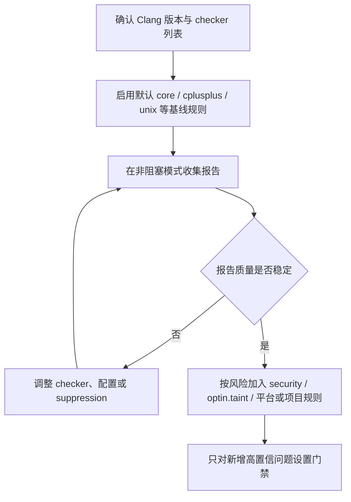

# Clang Static Analyzer Checkers

调研日期：2026-07-16

本文整理 Clang Static Analyzer 官方文档中已经提供的 C/C++ 相关 checker，并按照 checker 的演进状态、规则能力和工程使用边界进行分类。Objective-C、Cocoa 本地化、macOS Objective-C 引用计数等非 C/C++ 重点规则不作为本文关注范围。

官方入口：[Available Checkers](https://clang.llvm.org/docs/analyzer/checkers.html)

## 官方分类总览

官方文档将 checker 分为 default、experimental 和 debug 三类。Default checker 面向普通用户；`alpha.*` checker 处于开发或实验阶段，默认关闭，可能崩溃或产生更多误报；`debug.*` checker 面向 analyzer 开发者，用于观察 CFG、调用图、`ExplodedGraph`、taint 状态等内部信息。

| 官方分类 | 典型 family | 默认状态 | 误报容忍度 | 工程定位 |
| --- | --- | --- | --- | --- |
| Default Checkers | `core`、`cplusplus`、`deadcode`、`security`、`unix`、`webkit` 等 | 面向常规分析使用 | 低 | 通用 C/C++ 缺陷、安全风险、API 误用、项目专用规则。 |
| Experimental Checkers | `alpha.*` | 默认关闭 | 较高 | 新规则试验、专项调研、能力验证，不宜直接作为阻塞门禁。 |
| Debug Checkers | `debug.*` | 默认关闭 | 不适用 | 调试 analyzer 内部结构，不面向用户缺陷报告。 |

从社区演进角度看，一个 checker 通常先在 `alpha.*` 中验证规则边界和误报情况；当规则足够稳定、适用面明确、测试充分、误报可控后，才适合进入更稳定的 family 或被工程默认启用。

## C/C++ Checker 按能力类型分类

CSA checker 的能力边界由路径敏感符号执行、`ProgramState`、AST/CFG 建模和平台 API 模型共同决定。按漏洞或缺陷形态，可以归纳为以下几类：

| 能力类型 | 代表 checker | 适合发现的问题 | 演进与误报特征 |
| --- | --- | --- | --- |
| 核心语言未定义行为 | `core.DivideZero`、`core.NullDereference`、`core.BitwiseShift`、`core.VLASize` | 除零、空指针、非法位移、非法 VLA 长度 | 通用性强，适合作为默认基础能力。 |
| 未初始化值传播 | `core.uninitialized.*`、`core.UndefinedBinaryOperatorResult` | 未初始化值参与分支、赋值、返回、数组长度等 | 依赖路径和符号值推理，误报需通过约束和建模控制。 |
| C/C++ 内存与资源生命周期 | `unix.Malloc`、`unix.Stream`、`cplusplus.NewDelete`、`cplusplus.NewDeleteLeaks`、`unix.MismatchedDeallocator` | 泄漏、重复释放、释放后使用、分配/释放器不匹配、close 后使用 | 最适合 CSA checker 的状态机类问题。 |
| API 契约与参数约束 | `core.NonNullParamChecker`、`unix.StdCLibraryFunctions`、`security.insecureAPI.*` | 非空参数、返回值必须检查、危险 API、C/POSIX 标准库参数约束 | 规则清晰时适合默认启用；契约不稳定时更适合 optin/alpha。 |
| C++ 对象生命周期 | `cplusplus.InnerPointer`、`cplusplus.Move`、`cplusplus.PureVirtualCall`、`cplusplus.StringChecker` | move 后使用、内部指针失效、构造/析构期虚调用 | 依赖 C++ 语义模型，复杂模板和库模型会影响精度。 |
| 安全漏洞模式 | `security.ArrayBound`、`security.MmapWriteExec`、`security.SetgidSetuidOrder`、`optin.taint.*` | 越界、W+X 内存、降权顺序、污染数据流向 sink | 安全价值高，但污点规则和上下文建模决定误报。 |
| 并发、锁与阻塞调用 | `unix.BlockInCriticalSection`、`alpha.core.C11Lock`、`alpha.unix.PthreadLock` | 临界区阻塞调用、C11/pthread lock 状态问题 | 通常适合专项启用，误报受锁模型完整性影响。 |
| C/C++ 污点分析 | `optin.taint.GenericTaint`、`optin.taint.TaintedAlloc`、`optin.taint.TaintedDiv` | 不可信输入流向命令执行、分配大小、除数等 sink | 安全价值高，但 source/sink/sanitizer 配置决定有效性。 |
| 项目专用 C++ 规则 | `webkit.*`、`alpha.webkit.*` | WebKit 引用计数、裸指针、lambda 捕获、局部变量生命周期约束 | 适合对应代码库；跨项目默认启用价值有限。 |
| 结构性或风格规则 | `deadcode.DeadStores`、`optin.performance.Padding`、`alpha.llvm.Conventions` | 死存储、结构体 padding、LLVM 编码约定 | 未必需要路径敏感分析，门禁策略应谨慎。 |

## 按演进状态分类

| 演进状态 | 官方 checker 范围 | 进入条件 | 使用建议 |
| --- | --- | --- | --- |
| 默认稳定规则 | Default Checkers 中的通用 family | 问题定义清晰、适用面广、误报较低、有回归测试 | 可作为基础扫描能力，但仍建议先建立基线。 |
| 主动启用规则 | `optin.*`、`optin.taint.*` 等 | 有价值但可能成本更高或适用面更窄 | 建议 report-only 试运行后再进入门禁。 |
| 实验规则 | `alpha.*` | 规则仍在演进，可能崩溃或产生较多误报 | 用于调研、专项扫描或规则验证，不建议默认阻塞。 |
| 调试规则 | `debug.*` | 观察 analyzer 内部结构 | 用于 checker 开发和问题定位，不用于缺陷治理。 |

下面的 default family 细表保留 C/C++ 相关 checker 的功能说明；后文再列出 C/C++ 相关 `alpha.*` 和通用 `debug.*` checker 的社区提供范围。

## core

`core` family 建模核心语言特性，覆盖除零、空指针、未初始化值、无效调用等基础错误。官方文档也强调这类 checker 通常应保持开启，因为其他 checker 可能依赖它们的基础建模能力。

| Checker | 支持语言 | 具体功能 |
| --- | --- | --- |
| `core.BitwiseShift` | C, C++ | 检查整数左移或右移导致的未定义行为，例如右操作数为负数、位移量超过左操作数类型位宽；pedantic 模式下还会检查更多有符号位移问题。 |
| `core.CallAndMessage` | C, C++ | 检查函数调用中的逻辑错误，例如空函数指针、未初始化实参、空或未初始化的 `this`、实参数量不足等。 |
| `core.DivideZero` | C, C++ | 检查除法或取模运算中除数可能为 0 的路径。 |
| `core.NonNullParamChecker` | C, C++ | 检查向引用参数、`nonnull` 标注参数或系统 API 中声明为非空的参数传入空指针。 |
| `core.NullDereference` | C, C++ | 检查空指针解引用，包括通过成员访问、数组访问、间接调用等方式触发的空指针访问。 |
| `core.NullPointerArithm` | C, C++ | 检查空指针参与指针算术，例如对空指针执行加减或数组下标运算。 |
| `core.StackAddressEscape` | C | 检查栈上对象地址逃逸出其生命周期，例如返回局部变量地址、把局部变量地址写入全局变量、返回捕获局部变量的 block。 |
| `core.UndefinedBinaryOperatorResult` | C | 检查二元运算结果未定义的情况，典型场景是操作数来自未初始化值。 |
| `core.VLASize` | C | 检查变长数组大小表达式是否为未定义、0、负数或受污染值。 |
| `core.uninitialized.ArraySubscript` | C | 检查未初始化值作为数组下标使用。 |
| `core.uninitialized.Assign` | C | 检查把未初始化值赋给变量或对象。 |
| `core.uninitialized.Branch` | C | 检查未初始化值作为分支条件、循环条件或条件表达式。 |
| `core.uninitialized.CapturedBlockVariable` | C | 检查 block 捕获并使用未初始化变量。 |
| `core.uninitialized.UndefReturn` | C | 检查函数返回未初始化值。 |
| `core.uninitialized.NewArraySize` | C++ | 检查 `new[]` 的数组长度来自未初始化值。 |

## cplusplus

`cplusplus` family 面向 C++ 语言特性、对象生命周期、标准库对象和内存管理。

| Checker | 支持语言 | 具体功能 |
| --- | --- | --- |
| `cplusplus.ArrayDelete` | C++ | 检查通过不合适的静态类型删除数组对象，尤其是多态数组 `delete[]` 可能只调用错误析构函数的情况。 |
| `cplusplus.InnerPointer` | C++ | 检查从对象内部取出的指针在原对象修改、析构或失效后继续使用，例如 `std::string::c_str()` 返回值失效后仍被访问。 |
| `cplusplus.Move` | C++ | 检查 moved-from 对象的错误使用、重复 move、自 move 或 move 后仍当作有效值使用。 |
| `cplusplus.NewDelete` | C++ | 检查 `new` / `delete` 相关内存错误，例如释放后使用、重复释放、释放非堆对象、错误释放数组或对象。 |
| `cplusplus.NewDeleteLeaks` | C++ | 检查通过 `new` 分配但没有释放的内存泄漏。 |
| `cplusplus.PlacementNew` | C++ | 检查 placement new 的目标缓冲区是否足够容纳要构造的对象。 |
| `cplusplus.SelfAssignment` | C++ | 检查拷贝赋值或移动赋值中的自赋值问题。 |
| `cplusplus.StringChecker` | C++ | 检查 `std::string` 常见误用，例如用空 C 字符串构造或赋值。 |
| `cplusplus.PureVirtualCall` | C++ | 检查构造或析构过程中调用纯虚函数。 |

## deadcode

| Checker | 支持语言 | 具体功能 |
| --- | --- | --- |
| `deadcode.DeadStores` | C | 检查写入后再也没有被读取的变量赋值，即 dead store。 |

## nullability

`nullability` family 主要面向带 nullability 注解的代码。官方列表中大多数规则偏 Objective-C；C/C++ 视角下主要关注可用于 C/C++ 的非空返回契约。

| Checker | 支持语言 | 具体功能 |
| --- | --- | --- |
| `nullability.NullReturnedFromNonnull` | C, C++ | 检查声明为 `_Nonnull` 返回类型的函数返回 null。 |

## optin

`optin` family 覆盖可移植性、性能、可选安全规则和编码风格规则。它们位于官方 `Default Checkers` 章节下，但在工程中通常仍需要结合项目风险和误报成本选择性启用。

| Checker | 支持语言 | 具体功能 |
| --- | --- | --- |
| `optin.core.EnumCastOutOfRange` | C, C++ | 检查整数转换为枚举后没有对应枚举值的情况。 |
| `optin.core.FixedAddressDereference` | C, C++ | 检查硬编码固定地址或可推导为固定数值地址的指针被解引用。 |
| `optin.core.UnconditionalVAArg` | C, C++ | 检查可变参数函数中无条件调用 `va_arg()`，即如果调用方没有传入可变参数就会触发未定义行为的模式。 |
| `optin.cplusplus.UninitializedObject` | C++ | 检查对象构造完成后成员或子对象仍未初始化的情况。 |
| `optin.cplusplus.VirtualCall` | C++ | 检查构造或析构期间看似虚调用、实际受 C++ 构造析构规则限制而不会分派到派生类实现的调用。 |
| `optin.mpi.MPI-Checker` | C | 检查 MPI 非阻塞请求使用问题，例如请求未等待、请求对象被复用、`MPI_Wait` 没有匹配的非阻塞操作。 |
| `optin.performance.Padding` | C, C++ | 检查结构体存在过多 padding，可能浪费内存并影响缓存效率。 |
| `optin.portability.UnixAPI` | C / Unix | 检查 Unix API 的可移植性问题，例如零大小内存分配等在不同实现上行为可能不同的用法。 |

## optin.taint

`optin.taint` family 使用污点分析跟踪不可信输入是否流入敏感操作。

| Checker | 支持语言 | 具体功能 |
| --- | --- | --- |
| `optin.taint.GenericTaint` | C, C++ | 检查受污染数据流向敏感 sink，例如命令执行、动态库加载、格式字符串、系统调用参数等。 |
| `optin.taint.TaintedAlloc` | C, C++ | 检查受污染值作为内存分配大小，可能导致拒绝服务或异常资源消耗。 |
| `optin.taint.TaintedDiv` | C, C++ | 检查受污染值作为除数，可能触发除零。 |

## security

`security` family 主要检查安全相关的内存访问、危险 API、权限处理和标准库误用。

| Checker | 支持语言 | 具体功能 |
| --- | --- | --- |
| `security.ArrayBound` | C, C++ | 检查数组、堆对象、字符串或其他连续内存区域的越界访问。 |
| `security.cert.env.InvalidPtr` | C | 检查环境变量相关 API 导致旧指针失效后继续使用的问题，例如 `getenv()` 返回值在后续环境修改后失效。 |
| `security.FloatLoopCounter` | C | 检查使用浮点变量作为循环计数器，避免精度和终止条件不可预测。 |
| `security.insecureAPI.UncheckedReturn` | C | 检查安全敏感函数的返回值被忽略，例如不检查调用是否失败。 |
| `security.insecureAPI.bcmp` | C | 检查使用已废弃或不推荐的 `bcmp()`。 |
| `security.insecureAPI.bcopy` | C | 检查使用已废弃或不推荐的 `bcopy()`。 |
| `security.insecureAPI.bzero` | C | 检查使用已废弃或不推荐的 `bzero()`。 |
| `security.insecureAPI.getpw` | C | 检查使用不安全的 `getpw()`。 |
| `security.insecureAPI.gets` | C | 检查使用无法限制输入长度的 `gets()`。 |
| `security.insecureAPI.mkstemp` | C | 检查 `mkstemp()` 模板是否满足安全要求，例如末尾是否有足够数量的 `X`。 |
| `security.insecureAPI.mktemp` | C | 检查使用不安全的 `mktemp()`。 |
| `security.insecureAPI.rand` | C | 检查使用弱随机数 API，例如 `rand()`、`random()`、`drand48()`。 |
| `security.insecureAPI.strcpy` | C | 检查使用容易导致缓冲区溢出的 `strcpy()`、`strcat()` 等字符串拷贝或拼接 API。 |
| `security.insecureAPI.vfork` | C | 检查使用危险或不推荐的 `vfork()`。 |
| `security.insecureAPI.DeprecatedOrUnsafeBufferHandling` | C | 检查已废弃或不安全的 buffer 处理函数，例如 `sprintf`、`scanf`、`memcpy`、`strncpy` 等在特定模式下可能不安全的调用。 |
| `security.MmapWriteExec` | C | 检查 `mmap()` 同时申请可写和可执行权限，避免形成可被覆盖执行的内存区域。 |
| `security.PointerSub` | C | 检查两个不同内存对象之间的指针相减；C 标准只允许同一数组对象内部的指针相减。 |
| `security.PutenvStackArray` | C | 检查 `putenv()` 传入栈上数组，因为 `putenv()` 不复制字符串，函数返回后环境指针可能悬空。 |
| `security.SetgidSetuidOrder` | C | 检查降权时先 `setuid(getuid())` 再 `setgid(getgid())` 的错误顺序，可能导致 group 权限无法正确放弃。 |
| `security.VAList` | C, C++ | 检查 `va_list` 生命周期错误，例如未初始化使用、释放后使用、`va_start` 与 `va_end` 不配对。 |

## unix

`unix` family 建模 Unix / POSIX API、C 标准库和 C 字符串函数。

| Checker | 支持语言 | 具体功能 |
| --- | --- | --- |
| `unix.API` | C | 检查 Unix API 使用错误，例如 `open()` 使用 `O_CREAT` 但缺少 mode 参数、分配 0 字节、`pthread_once` 使用局部变量等。 |
| `unix.BlockInCriticalSection` | C, C++ | 检查临界区或锁保护区域内调用阻塞函数，例如 `sleep`、`read`、`recv`、`getc`、`fgets`。 |
| `unix.Chroot` | C | 检查 `chroot(path)` 后没有立即调用 `chdir("/")`，避免 jail 目录限制不完整。 |
| `unix.Errno` | C | 检查在函数未明确失败时读取 `errno`，因为成功调用后 `errno` 的值可能未定义或无意义。 |
| `unix.Malloc` | C | 检查 `malloc` / `free` 相关问题，例如内存泄漏、重复释放、释放后使用、释放非分配内存。 |
| `unix.MallocSizeof` | C | 检查 `malloc(sizeof(...))` 中 `sizeof` 对象类型与接收指针类型不匹配等可疑分配大小。 |
| `unix.MismatchedDeallocator` | C, C++ | 检查分配器和释放器不匹配，例如 `malloc` 配 `delete`、`new` 配 `free`、`new[]` 配 `delete`。 |
| `unix.Vfork` | C | 检查 `vfork()` 之后子进程执行不允许的操作，例如修改父进程栈、调用普通函数或直接 return。 |
| `unix.cstring.BadSizeArg` | C | 检查 C 字符串或内存函数的 size 参数错误，例如长度参数与目标对象大小不匹配。 |
| `unix.cstring.NotNullTerminated` | C | 检查传给字符串函数的缓冲区不是以 null 结尾的字符串。 |
| `unix.cstring.NullArg` | C | 检查传给 `strlen`、`strcpy`、`strcmp`、`strncpy` 等 C 字符串函数的参数为空指针。 |
| `unix.cstring.UninitializedRead` | C | 检查 `strlen`、`strcmp`、`memcpy` 等函数读取未初始化内存。 |
| `unix.StdCLibraryFunctions` | C | 对 C 标准库和部分 POSIX 函数建模并检查参数约束，例如字符分类函数参数范围、缓冲区大小、返回值约束等。 |
| `unix.Stream` | C | 检查 `FILE *` 流使用错误，例如空流、关闭后使用、文件流泄漏、EOF 后继续读、`fseek` 参数错误。 |

## fuchsia

| Checker | 支持语言 | 具体功能 |
| --- | --- | --- |
| `fuchsia.HandleChecker` | Fuchsia | 检查 Fuchsia handle 生命周期错误，例如 handle 泄漏、重复 close、close 后使用。 |

## webkit

| Checker | 支持语言 | 具体功能 |
| --- | --- | --- |
| `webkit.RefCntblBaseVirtualDtor` | WebKit | 检查引用计数基类是否缺少虚析构函数，避免通过基类指针销毁派生对象时析构不完整。 |
| `webkit.NoUncountedMemberChecker` | WebKit | 检查类成员中保存未计数对象的裸指针或引用，避免对象生命周期没有被引用计数保护。 |
| `webkit.UncountedLambdaCapturesChecker` | WebKit | 检查 lambda 捕获未计数对象的裸指针或引用，避免异步或延迟执行时出现悬空引用。 |

## alpha experimental checkers

`alpha.*` checker 是官方文档列出的实验性 checker。它们已经随社区代码提供，但默认关闭，适合用于专项调研、规则验证或在项目中进行非阻塞试运行。若要进入工程门禁，应先评估误报、崩溃风险、性能成本和源码适用范围。

| Family | Checker | 主要方向 |
| --- | --- | --- |
| `alpha.clone` | `alpha.clone.CloneChecker` | 代码克隆或重复逻辑检测。 |
| `alpha.core` | `alpha.core.BoolAssignment` | 条件表达式中可疑布尔赋值。 |
| `alpha.core` | `alpha.core.C11Lock` | C11 lock API 使用问题。 |
| `alpha.core` | `alpha.core.CastToStruct` | 可疑结构体类型转换。 |
| `alpha.core` | `alpha.core.Conversion` | 可疑类型转换或隐式转换问题。 |
| `alpha.core` | `alpha.core.PointerArithm` | 指针算术相关风险。 |
| `alpha.core` | `alpha.core.StackAddressAsyncEscape` | 栈地址异步逃逸。 |
| `alpha.core` | `alpha.core.StdVariant` | `std::variant` 使用相关检查。 |
| `alpha.core` | `alpha.core.TestAfterDivZero` | 除零之后再测试除数的可疑路径。 |
| `alpha.core` | `alpha.core.StoreToImmutable` | 向不可变对象或区域写入。 |
| `alpha.cplusplus` | `alpha.cplusplus.DeleteWithNonVirtualDtor` | 通过非虚析构基类删除派生对象。 |
| `alpha.cplusplus` | `alpha.cplusplus.InvalidatedIterator` | 迭代器失效后继续使用。 |
| `alpha.cplusplus` | `alpha.cplusplus.IteratorRange` | 迭代器范围不匹配或非法范围。 |
| `alpha.cplusplus` | `alpha.cplusplus.MismatchedIterator` | 来自不同容器或不匹配上下文的迭代器误用。 |
| `alpha.cplusplus` | `alpha.cplusplus.SmartPtr` | 智能指针使用相关实验检查。 |
| `alpha.deadcode` | `alpha.deadcode.UnreachableCode` | 不可达代码。 |
| `alpha.fuchsia` | `alpha.fuchsia.Lock` | Fuchsia lock 使用相关检查。 |
| `alpha.llvm` | `alpha.llvm.Conventions` | LLVM 项目编码约定。 |
| `alpha.security` | `alpha.security.ReturnPtrRange` | 返回指针范围相关安全检查。 |
| `alpha.unix` | `alpha.unix.PthreadLock` | pthread lock 使用错误。 |
| `alpha.unix` | `alpha.unix.SimpleStream` | 简化版 stream 生命周期检查。 |
| `alpha.unix.cstring` | `alpha.unix.cstring.BufferOverlap` | C 字符串或内存函数缓冲区重叠。 |
| `alpha.unix.cstring` | `alpha.unix.cstring.OutOfBounds` | C 字符串或内存函数越界。 |
| `alpha.webkit` | `alpha.webkit.ForwardDeclChecker` | WebKit 前向声明约定。 |
| `alpha.webkit` | `alpha.webkit.MemoryUnsafeCastChecker` | WebKit 内存不安全类型转换。 |
| `alpha.webkit` | `alpha.webkit.NoDeleteChecker` | WebKit 禁止 delete 或所有权约定相关检查。 |
| `alpha.webkit` | `alpha.webkit.NoUncheckedPtrMemberChecker` | 成员中未受检查的指针使用。 |
| `alpha.webkit` | `alpha.webkit.NoUnretainedMemberChecker` | 成员中未保留对象的生命周期风险。 |
| `alpha.webkit` | `alpha.webkit.UnretainedLambdaCapturesChecker` | lambda 捕获未保留对象。 |
| `alpha.webkit` | `alpha.webkit.UncountedCallArgsChecker` | 调用参数中未计数对象风险。 |
| `alpha.webkit` | `alpha.webkit.UncheckedCallArgsChecker` | 调用参数中未检查指针风险。 |
| `alpha.webkit` | `alpha.webkit.UncheckedLambdaCapturesChecker` | lambda 捕获未检查指针风险。 |
| `alpha.webkit` | `alpha.webkit.UnretainedCallArgsChecker` | 调用参数中未保留对象风险。 |
| `alpha.webkit` | `alpha.webkit.UncountedLocalVarsChecker` | 局部变量中未计数对象风险。 |
| `alpha.webkit` | `alpha.webkit.UncheckedLocalVarsChecker` | 局部变量中未检查指针风险。 |
| `alpha.webkit` | `alpha.webkit.UnretainedLocalVarsChecker` | 局部变量中未保留对象风险。 |
| `alpha.webkit` | `webkit.RetainPtrCtorAdoptChecker` | WebKit `RetainPtr` adopt 构造约定。 |

从能力类型看，`alpha.*` 中最接近 CSA 优势区间的是资源/生命周期、迭代器失效、锁状态、指针逃逸和 WebKit 所有权规则；更偏编码约定、克隆、局部模式的规则，即使进入社区，也不一定适合作为路径敏感 checker 的默认能力。

## debug checkers

`debug.*` checker 不用于发现用户代码缺陷，而用于观察 analyzer 的内部表示和执行过程。它们对开发自定义 checker、定位误报、理解路径探索非常有价值。

| Checker | 作用 |
| --- | --- |
| `debug.AnalysisOrder` | 输出 analyzer 遍历和回调顺序。 |
| `debug.ConfigDumper` | 输出 analyzer 配置。 |
| `debug.DumpCFG` | 打印当前函数 CFG。 |
| `debug.DumpCallGraph` | 打印调用图。 |
| `debug.DumpCalls` | 打印调用相关信息。 |
| `debug.DumpDominators` | 打印 dominator 信息。 |
| `debug.DumpLiveVars` | 打印 live variables 信息。 |
| `debug.DumpTraversal` | 打印遍历过程。 |
| `debug.ExprInspection` | 支持 `clang_analyzer_*` 调试函数，用于 analyzer 回归测试和路径状态检查。 |
| `debug.Stats` | 输出 analyzer 统计信息。 |
| `debug.TaintTest` | 检查和展示 taint 状态传播。 |
| `debug.ViewCFG` | 可视化 CFG。 |
| `debug.ViewCallGraph` | 可视化调用图。 |
| `debug.ViewExplodedGraph` | 可视化路径敏感分析产生的 `ExplodedGraph`。 |

## 使用建议

实际项目中可以按风险分层启用：



| 层级 | 建议关注 |
| --- | --- |
| 基线层 | `core`、`cplusplus`、`deadcode`、`unix` 中与内存、空指针、未初始化值相关的规则。 |
| 安全层 | `security`、`optin.taint`，用于发现危险 API、越界、污染输入流向敏感操作等问题。 |
| 平台/项目层 | `fuchsia`、`webkit`，只在对应 C/C++ 平台或项目代码中启用。 |
| 质量与性能层 | `optin.performance.*`、`optin.core.*`、`nullability`，结合误报率逐步纳入门禁。 |

如果要在命令行中查看当前 Clang 版本实际支持的 checker，优先使用本机工具确认：

```bash
clang -cc1 -analyzer-checker-help
```

不同 Clang 版本的 checker 名称、默认启用状态和 checker option 可能变化；工程门禁中应固定工具链版本，并把启用列表写入 CI 或 CodeChecker 配置。
