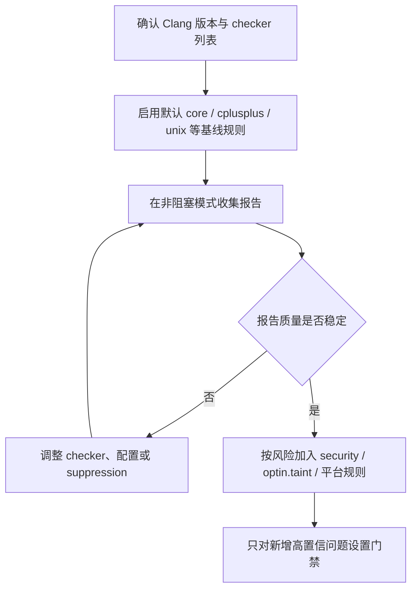

# Clang Static Analyzer Default Checkers

调研日期：2026-07-07

本文整理 Clang Static Analyzer 官方文档中 `Default Checkers` 章节列出的 checker，并简要说明每个 checker 主要检查的问题。这里的“default checkers”指官方文档该章节下的分组范围，不包含 `alpha.*` 实验 checker 和 `debug.*` 开发调试 checker。

官方入口：[Available Checkers](https://clang.llvm.org/docs/analyzer/checkers.html#default-checkers)

## core

`core` family 建模核心语言特性，覆盖除零、空指针、未初始化值、无效调用等基础错误。官方文档也强调这类 checker 通常应保持开启，因为其他 checker 可能依赖它们的基础建模能力。

| Checker | 支持语言 | 具体功能 |
| --- | --- | --- |
| `core.BitwiseShift` | C, C++ | 检查整数左移或右移导致的未定义行为，例如右操作数为负数、位移量超过左操作数类型位宽；pedantic 模式下还会检查更多有符号位移问题。 |
| `core.CallAndMessage` | C, C++, ObjC | 检查函数调用和 Objective-C message 表达式中的逻辑错误，例如空函数指针、未初始化实参、空或未初始化的 `this`、Objective-C receiver 未初始化、实参数量不足等。 |
| `core.DivideZero` | C, C++, ObjC | 检查除法或取模运算中除数可能为 0 的路径。 |
| `core.NonNullParamChecker` | C, C++, ObjC | 检查向引用参数、`nonnull` 标注参数或系统 API 中声明为非空的参数传入空指针。 |
| `core.NullDereference` | C, C++, ObjC | 检查空指针解引用，包括通过成员访问、数组访问、间接调用等方式触发的空指针访问。 |
| `core.NullPointerArithm` | C, C++ | 检查空指针参与指针算术，例如对空指针执行加减或数组下标运算。 |
| `core.StackAddressEscape` | C | 检查栈上对象地址逃逸出其生命周期，例如返回局部变量地址、把局部变量地址写入全局变量、返回捕获局部变量的 block。 |
| `core.UndefinedBinaryOperatorResult` | C | 检查二元运算结果未定义的情况，典型场景是操作数来自未初始化值。 |
| `core.VLASize` | C | 检查变长数组大小表达式是否为未定义、0、负数或受污染值。 |
| `core.uninitialized.ArraySubscript` | C | 检查未初始化值作为数组下标使用。 |
| `core.uninitialized.Assign` | C | 检查把未初始化值赋给变量或对象。 |
| `core.uninitialized.Branch` | C | 检查未初始化值作为分支条件、循环条件或条件表达式。 |
| `core.uninitialized.CapturedBlockVariable` | C | 检查 block 捕获并使用未初始化变量。 |
| `core.uninitialized.UndefReturn` | C | 检查函数返回未初始化值。 |
| `core.uninitialized.NewArraySize` | C++ | 检查 `new[]` 的数组长度来自未初始化值。 |

## cplusplus

`cplusplus` family 面向 C++ 语言特性、对象生命周期、标准库对象和内存管理。

| Checker | 支持语言 | 具体功能 |
| --- | --- | --- |
| `cplusplus.ArrayDelete` | C++ | 检查通过不合适的静态类型删除数组对象，尤其是多态数组 `delete[]` 可能只调用错误析构函数的情况。 |
| `cplusplus.InnerPointer` | C++ | 检查从对象内部取出的指针在原对象修改、析构或失效后继续使用，例如 `std::string::c_str()` 返回值失效后仍被访问。 |
| `cplusplus.Move` | C++ | 检查 moved-from 对象的错误使用、重复 move、自 move 或 move 后仍当作有效值使用。 |
| `cplusplus.NewDelete` | C++ | 检查 `new` / `delete` 相关内存错误，例如释放后使用、重复释放、释放非堆对象、错误释放数组或对象。 |
| `cplusplus.NewDeleteLeaks` | C++ | 检查通过 `new` 分配但没有释放的内存泄漏。 |
| `cplusplus.PlacementNew` | C++ | 检查 placement new 的目标缓冲区是否足够容纳要构造的对象。 |
| `cplusplus.SelfAssignment` | C++ | 检查拷贝赋值或移动赋值中的自赋值问题。 |
| `cplusplus.StringChecker` | C++ | 检查 `std::string` 常见误用，例如用空 C 字符串构造或赋值。 |
| `cplusplus.PureVirtualCall` | C++ | 检查构造或析构过程中调用纯虚函数。 |

## deadcode

| Checker | 支持语言 | 具体功能 |
| --- | --- | --- |
| `deadcode.DeadStores` | C | 检查写入后再也没有被读取的变量赋值，即 dead store。 |

## nullability

`nullability` family 检查 `_Nullable`、`_Nonnull` 等空值契约被违反的路径。

| Checker | 支持语言 | 具体功能 |
| --- | --- | --- |
| `nullability.NullPassedToNonnull` | ObjC | 检查确定为 null 的指针被传给 `_Nonnull` 参数。 |
| `nullability.NullReturnedFromNonnull` | C, C++, ObjC | 检查声明为 `_Nonnull` 返回类型的函数返回 null。 |
| `nullability.NullableDereferenced` | ObjC | 检查 `_Nullable` 指针在没有充分判空的情况下被解引用。 |
| `nullability.NullablePassedToNonnull` | ObjC | 检查 `_Nullable` 指针被传给 `_Nonnull` 参数。 |
| `nullability.NullableReturnedFromNonnull` | ObjC | 检查声明为 `_Nonnull` 返回类型的函数返回 `_Nullable` 值。 |

## optin

`optin` family 覆盖可移植性、性能、可选安全规则和编码风格规则。它们位于官方 `Default Checkers` 章节下，但在工程中通常仍需要结合项目风险和误报成本选择性启用。

| Checker | 支持语言 | 具体功能 |
| --- | --- | --- |
| `optin.core.EnumCastOutOfRange` | C, C++ | 检查整数转换为枚举后没有对应枚举值的情况。 |
| `optin.core.FixedAddressDereference` | C, C++, ObjC | 检查硬编码固定地址或可推导为固定数值地址的指针被解引用。 |
| `optin.core.UnconditionalVAArg` | C, C++ | 检查可变参数函数中无条件调用 `va_arg()`，即如果调用方没有传入可变参数就会触发未定义行为的模式。 |
| `optin.cplusplus.UninitializedObject` | C++ | 检查对象构造完成后成员或子对象仍未初始化的情况。 |
| `optin.cplusplus.VirtualCall` | C++ | 检查构造或析构期间看似虚调用、实际受 C++ 构造析构规则限制而不会分派到派生类实现的调用。 |
| `optin.mpi.MPI-Checker` | C | 检查 MPI 非阻塞请求使用问题，例如请求未等待、请求对象被复用、`MPI_Wait` 没有匹配的非阻塞操作。 |
| `optin.osx.cocoa.localizability.EmptyLocalizationContextChecker` | ObjC | 检查 `NSLocalizedString` 等本地化宏缺少有效上下文注释。 |
| `optin.osx.cocoa.localizability.NonLocalizedStringChecker` | ObjC | 检查传给用户界面 API 的字符串没有通过本地化宏处理。 |
| `optin.performance.GCDAntipattern` | ObjC / Apple 平台 | 检查 Grand Central Dispatch 使用中的性能反模式。 |
| `optin.performance.Padding` | C, C++, ObjC | 检查结构体存在过多 padding，可能浪费内存并影响缓存效率。 |
| `optin.portability.UnixAPI` | C / Unix | 检查 Unix API 的可移植性问题，例如零大小内存分配等在不同实现上行为可能不同的用法。 |

## optin.taint

`optin.taint` family 使用污点分析跟踪不可信输入是否流入敏感操作。

| Checker | 支持语言 | 具体功能 |
| --- | --- | --- |
| `optin.taint.GenericTaint` | C, C++ | 检查受污染数据流向敏感 sink，例如命令执行、动态库加载、格式字符串、系统调用参数等。 |
| `optin.taint.TaintedAlloc` | C, C++ | 检查受污染值作为内存分配大小，可能导致拒绝服务或异常资源消耗。 |
| `optin.taint.TaintedDiv` | C, C++, ObjC | 检查受污染值作为除数，可能触发除零。 |

## security

`security` family 主要检查安全相关的内存访问、危险 API、权限处理和标准库误用。

| Checker | 支持语言 | 具体功能 |
| --- | --- | --- |
| `security.ArrayBound` | C, C++ | 检查数组、堆对象、字符串或其他连续内存区域的越界访问。 |
| `security.cert.env.InvalidPtr` | C | 检查环境变量相关 API 导致旧指针失效后继续使用的问题，例如 `getenv()` 返回值在后续环境修改后失效。 |
| `security.FloatLoopCounter` | C | 检查使用浮点变量作为循环计数器，避免精度和终止条件不可预测。 |
| `security.insecureAPI.UncheckedReturn` | C | 检查安全敏感函数的返回值被忽略，例如不检查调用是否失败。 |
| `security.insecureAPI.bcmp` | C | 检查使用已废弃或不推荐的 `bcmp()`。 |
| `security.insecureAPI.bcopy` | C | 检查使用已废弃或不推荐的 `bcopy()`。 |
| `security.insecureAPI.bzero` | C | 检查使用已废弃或不推荐的 `bzero()`。 |
| `security.insecureAPI.decodeValueOfObjCType` | C / ObjC | 检查不安全的 Objective-C 类型解码 API 使用。 |
| `security.insecureAPI.getpw` | C | 检查使用不安全的 `getpw()`。 |
| `security.insecureAPI.gets` | C | 检查使用无法限制输入长度的 `gets()`。 |
| `security.insecureAPI.mkstemp` | C | 检查 `mkstemp()` 模板是否满足安全要求，例如末尾是否有足够数量的 `X`。 |
| `security.insecureAPI.mktemp` | C | 检查使用不安全的 `mktemp()`。 |
| `security.insecureAPI.rand` | C | 检查使用弱随机数 API，例如 `rand()`、`random()`、`drand48()`。 |
| `security.insecureAPI.strcpy` | C | 检查使用容易导致缓冲区溢出的 `strcpy()`、`strcat()` 等字符串拷贝或拼接 API。 |
| `security.insecureAPI.vfork` | C | 检查使用危险或不推荐的 `vfork()`。 |
| `security.insecureAPI.DeprecatedOrUnsafeBufferHandling` | C | 检查已废弃或不安全的 buffer 处理函数，例如 `sprintf`、`scanf`、`memcpy`、`strncpy` 等在特定模式下可能不安全的调用。 |
| `security.MmapWriteExec` | C | 检查 `mmap()` 同时申请可写和可执行权限，避免形成可被覆盖执行的内存区域。 |
| `security.PointerSub` | C | 检查两个不同内存对象之间的指针相减；C 标准只允许同一数组对象内部的指针相减。 |
| `security.PutenvStackArray` | C | 检查 `putenv()` 传入栈上数组，因为 `putenv()` 不复制字符串，函数返回后环境指针可能悬空。 |
| `security.SetgidSetuidOrder` | C | 检查降权时先 `setuid(getuid())` 再 `setgid(getgid())` 的错误顺序，可能导致 group 权限无法正确放弃。 |
| `security.VAList` | C, C++ | 检查 `va_list` 生命周期错误，例如未初始化使用、释放后使用、`va_start` 与 `va_end` 不配对。 |

## unix

`unix` family 建模 Unix / POSIX API、C 标准库和 C 字符串函数。

| Checker | 支持语言 | 具体功能 |
| --- | --- | --- |
| `unix.API` | C | 检查 Unix API 使用错误，例如 `open()` 使用 `O_CREAT` 但缺少 mode 参数、分配 0 字节、`pthread_once` 使用局部变量等。 |
| `unix.BlockInCriticalSection` | C, C++ | 检查临界区或锁保护区域内调用阻塞函数，例如 `sleep`、`read`、`recv`、`getc`、`fgets`。 |
| `unix.Chroot` | C | 检查 `chroot(path)` 后没有立即调用 `chdir("/")`，避免 jail 目录限制不完整。 |
| `unix.Errno` | C | 检查在函数未明确失败时读取 `errno`，因为成功调用后 `errno` 的值可能未定义或无意义。 |
| `unix.Malloc` | C | 检查 `malloc` / `free` 相关问题，例如内存泄漏、重复释放、释放后使用、释放非分配内存。 |
| `unix.MallocSizeof` | C | 检查 `malloc(sizeof(...))` 中 `sizeof` 对象类型与接收指针类型不匹配等可疑分配大小。 |
| `unix.MismatchedDeallocator` | C, C++ | 检查分配器和释放器不匹配，例如 `malloc` 配 `delete`、`new` 配 `free`、`new[]` 配 `delete`。 |
| `unix.Vfork` | C | 检查 `vfork()` 之后子进程执行不允许的操作，例如修改父进程栈、调用普通函数或直接 return。 |
| `unix.cstring.BadSizeArg` | C | 检查 C 字符串或内存函数的 size 参数错误，例如长度参数与目标对象大小不匹配。 |
| `unix.cstring.NotNullTerminated` | C | 检查传给字符串函数的缓冲区不是以 null 结尾的字符串。 |
| `unix.cstring.NullArg` | C | 检查传给 `strlen`、`strcpy`、`strcmp`、`strncpy` 等 C 字符串函数的参数为空指针。 |
| `unix.cstring.UninitializedRead` | C | 检查 `strlen`、`strcmp`、`memcpy` 等函数读取未初始化内存。 |
| `unix.StdCLibraryFunctions` | C | 对 C 标准库和部分 POSIX 函数建模并检查参数约束，例如字符分类函数参数范围、缓冲区大小、返回值约束等。 |
| `unix.Stream` | C | 检查 `FILE *` 流使用错误，例如空流、关闭后使用、文件流泄漏、EOF 后继续读、`fseek` 参数错误。 |

## osx

`osx` family 面向 macOS、Objective-C、Cocoa 和 CoreFoundation API。

| Checker | 支持语言 | 具体功能 |
| --- | --- | --- |
| `osx.API` | C | 检查 Apple API 使用错误，例如 `dispatch_once()` 使用局部 predicate。 |
| `osx.NumberObjectConversion` | C, C++, ObjC | 检查数字对象和标量数字之间的错误比较或转换，例如把 `NSNumber *` 当作整数比较。 |
| `osx.ObjCProperty` | ObjC | 检查 Objective-C property 使用问题。 |
| `osx.SecKeychainAPI` | C | 检查 Secure Keychain API 的分配、释放和错误路径处理，例如未释放返回数据、释放不匹配或错误释放。 |
| `osx.cocoa.AtSync` | ObjC | 检查 `@synchronized` 使用 nil 或未初始化对象作为 mutex。 |
| `osx.cocoa.AutoreleaseWrite` | ObjC | 检查向 autoreleasing 对象写入时可能跨 autorelease pool 导致崩溃的情况。 |
| `osx.cocoa.ClassRelease` | ObjC | 检查直接向 Class 对象发送 `retain`、`release` 或 `autorelease`。 |
| `osx.cocoa.Dealloc` | ObjC | 检查 Objective-C `-dealloc` 实现错误，例如缺少 `dealloc`、没有调用 `[super dealloc]`、retain/release 不匹配。 |
| `osx.cocoa.IncompatibleMethodTypes` | ObjC | 检查 Objective-C 重写或实现的方法签名类型不兼容。 |
| `osx.cocoa.Loops` | ObjC | 建模 Cocoa 集合循环和快速枚举相关行为，以支持对循环中对象使用的检查。 |
| `osx.cocoa.MissingSuperCall` | ObjC | 检查要求调用 super 的 Objective-C 方法没有调用对应 super 实现。 |
| `osx.cocoa.NSAutoreleasePool` | ObjC | 检查 `NSAutoreleasePool` 使用问题，例如 Objective-C GC 模式下低效或不合适的 autorelease pool 用法。 |
| `osx.cocoa.NSError` | ObjC | 检查 `NSError **` 参数约定，例如错误对象输出参数的空值和返回值语义。 |
| `osx.cocoa.NilArg` | ObjC | 检查向 Cocoa API 中不允许为 nil 的参数传入 nil。 |
| `osx.cocoa.NonNilReturnValue` | ObjC | 建模保证返回非 nil 的 Cocoa API，帮助其他 checker 提高空值推理精度。 |
| `osx.cocoa.ObjCGenerics` | ObjC | 检查 Objective-C 泛型容器的类型不匹配使用。 |
| `osx.cocoa.RetainCount` | ObjC | 检查 Objective-C 和 CoreFoundation 引用计数错误，例如泄漏、过度释放、未按所有权规则释放。 |
| `osx.cocoa.RunLoopAutoreleaseLeak` | ObjC | 检查 run loop 中 autorelease 对象可能因缺少 autorelease pool drain 而泄漏。 |
| `osx.cocoa.SelfInit` | ObjC | 检查 initializer 中 `self` 初始化模式是否正确，例如没有使用 `[super init]` 的返回值。 |
| `osx.cocoa.SuperDealloc` | ObjC | 检查 `[super dealloc]` 的调用顺序和使用规则。 |
| `osx.cocoa.UnusedIvars` | ObjC | 检查未使用的私有 instance variable。 |
| `osx.cocoa.VariadicMethodTypes` | ObjC | 检查 Objective-C 可变参数方法中传入非 Objective-C 对象等类型错误。 |
| `osx.coreFoundation.CFError` | C | 检查 `CFErrorRef *` 输出参数使用约定。 |
| `osx.coreFoundation.CFNumber` | C | 检查 `CFNumber` API 的数值类型、大小和转换使用错误。 |
| `osx.coreFoundation.CFRetainRelease` | C | 检查 `CFRetain`、`CFRelease`、`CFMakeCollectable` 等 CoreFoundation 引用计数 API 的空参数或错误使用。 |
| `osx.coreFoundation.containers.OutOfBounds` | C | 检查 `CFArray` 等 CoreFoundation 容器 API 的索引越界。 |
| `osx.coreFoundation.containers.PointerSizedValues` | C | 检查 `CFArray`、`CFDictionary`、`CFSet` 等容器中把非指针大小的值当作指针值存储。 |

## fuchsia

| Checker | 支持语言 | 具体功能 |
| --- | --- | --- |
| `fuchsia.HandleChecker` | Fuchsia | 检查 Fuchsia handle 生命周期错误，例如 handle 泄漏、重复 close、close 后使用。 |

## webkit

| Checker | 支持语言 | 具体功能 |
| --- | --- | --- |
| `webkit.RefCntblBaseVirtualDtor` | WebKit | 检查引用计数基类是否缺少虚析构函数，避免通过基类指针销毁派生对象时析构不完整。 |
| `webkit.NoUncountedMemberChecker` | WebKit | 检查类成员中保存未计数对象的裸指针或引用，避免对象生命周期没有被引用计数保护。 |
| `webkit.UncountedLambdaCapturesChecker` | WebKit | 检查 lambda 捕获未计数对象的裸指针或引用，避免异步或延迟执行时出现悬空引用。 |

## 使用建议

实际项目中可以按风险分层启用：



| 层级 | 建议关注 |
| --- | --- |
| 基线层 | `core`、`cplusplus`、`deadcode`、`unix` 中与内存、空指针、未初始化值相关的规则。 |
| 安全层 | `security`、`optin.taint`，用于发现危险 API、越界、污染输入流向敏感操作等问题。 |
| 平台层 | `osx`、`fuchsia`、`webkit`，只在对应平台或项目代码中启用。 |
| 质量与性能层 | `optin.performance.*`、`optin.core.*`、`nullability`，结合误报率逐步纳入门禁。 |

如果要在命令行中查看当前 Clang 版本实际支持的 checker，优先使用本机工具确认：

```bash
clang -cc1 -analyzer-checker-help
```

不同 Clang 版本的 checker 名称、默认启用状态和 checker option 可能变化；工程门禁中应固定工具链版本，并把启用列表写入 CI 或 CodeChecker 配置。
