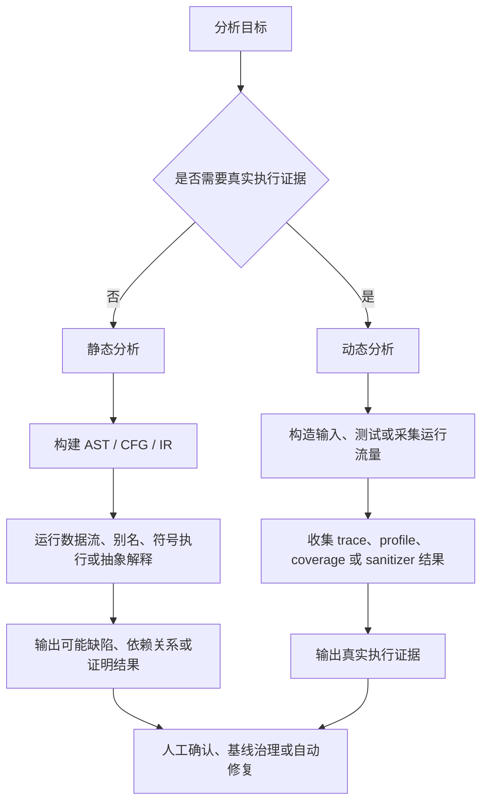
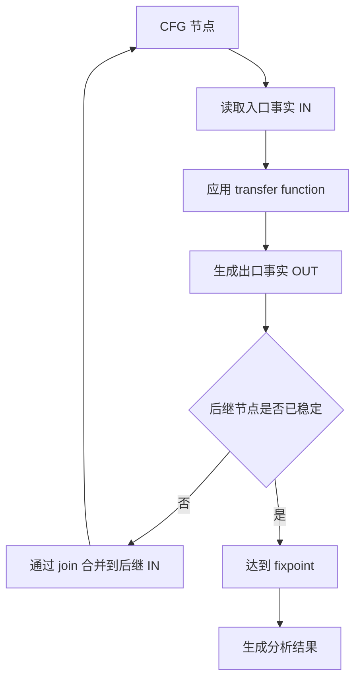
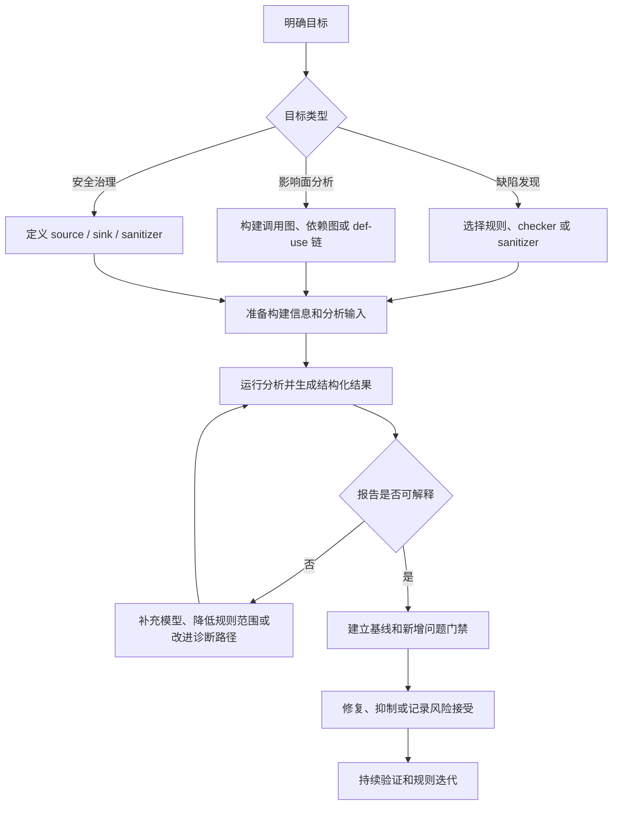

# Program Analysis Fundamentals

调研日期：2026-07-03

## 核心结论

程序分析是通过形式化或工程化方法，从程序文本、编译中间表示、二进制、运行轨迹或系统日志中提取程序性质的技术集合。它的目标不是替代测试或人工审查，而是在可控成本内回答一类问题：程序可能执行哪些路径，哪些值能传播到某个位置，哪些调用关系可能发生，哪些资源状态可能被破坏，哪些输入可能到达敏感操作。

程序分析的核心取舍是精度、完备性、可扩展性和工程可用性。静态分析不执行程序，覆盖面更广，但需要用抽象模型近似真实执行；动态分析观察真实运行，证据更直接，但覆盖依赖测试输入、流量和运行环境。实际工程通常把两者组合使用：静态分析负责提前发现高风险模式和跨路径问题，动态分析负责验证真实行为、收集运行证据和定位复杂环境问题。

## 基本分类

| 类型 | 输入 | 优势 | 限制 | 典型用途 |
| --- | --- | --- | --- | --- |
| 静态分析 | 源码、AST、IR、字节码、二进制 | 不需要运行程序，可覆盖未执行路径 | 需要近似，可能误报或漏报 | 编译优化、缺陷检测、安全扫描、依赖分析 |
| 动态分析 | 测试运行、线上流量、trace、profile | 证据来自真实执行，便于复现 | 只覆盖被执行路径 | 性能分析、覆盖率、运行时错误、根因定位 |
| 混合分析 | 静态模型加运行证据 | 能用运行信息约束静态搜索 | 实现与数据管道更复杂 | 符号执行辅助测试、灰盒 fuzz、线上反馈优化 |

静态分析和动态分析的区别不应被理解为“谁更准确”。静态分析通常回答 may 或 must 问题，例如“该指针是否可能为空”“该变量是否一定被定义”。动态分析回答的是已观察执行中的事实，例如“这次请求路径中出现了空值传播”。两类结论的语义不同，治理方式也不同。

## 程序表示

程序分析通常不会直接在原始文本上工作，而是先把程序转换为更适合算法处理的表示。

| 表示 | 说明 | 常见用途 |
| --- | --- | --- |
| Token / 词法流 | 词法分析后的符号序列 | 格式检查、简单 lint、语言工具前置处理 |
| AST | 保留语法结构和类型上下文的树 | 语法规则、API 用法、重构、clang-tidy 类检查 |
| CFG | basic block 与控制流边构成的图 | 可达性、数据流、路径敏感分析、覆盖率 |
| IR | 编译器中间表示，例如 LLVM IR | 优化、跨语言分析、底层语义推理 |
| SSA | 每个变量定义只赋值一次的形式 | def-use 链、常量传播、优化、依赖分析 |
| Call graph | 函数或方法之间的可能调用关系 | 影响面分析、跨过程分析、死代码识别 |
| PDG / SDG | 程序依赖图或系统依赖图 | 切片、信息流、安全依赖分析 |

表示的选择会影响分析能力。AST 适合表达源语言结构，但不一定适合统一处理复杂控制流。CFG 适合路径和数据流分析，但会弱化部分语法意图。IR 更接近编译器优化语义，但可能丢失源代码层面的命名、宏和框架上下文。

## 控制流分析

控制流分析关注程序可能按什么顺序执行。最常见的基础结构是 CFG。CFG 的节点通常是 basic block，边表示可能的控制转移，例如顺序执行、条件分支、循环、异常边或函数返回。

控制流分析常用于回答以下问题：

- 某段代码是否可达。
- 某个分支条件是否可能成立。
- 循环是否存在不可退出路径。
- 某个缺陷报告路径是否真实可执行。
- 某个函数修改后可能影响哪些调用链。

跨过程控制流分析会进一步构建调用图。对 C 语言中的普通直接调用，调用目标通常较明确；对 C++ 虚调用、函数指针、回调、反射、动态加载、高阶函数或消息分发，调用目标需要结合类型、指针分析、框架模型或运行信息近似。

## 数据流分析

数据流分析关注值、定义、状态或属性如何沿 CFG 传播。它通常把每个程序点上的事实表示为一个集合或抽象值，然后通过 transfer function 更新事实，通过 join operation 合并来自不同路径的事实，最终迭代到 fixpoint。

典型数据流问题包括：

| 分析 | 方向 | 目标 |
| --- | --- | --- |
| Reaching definitions | 前向 | 某个变量使用点可能来自哪些定义 |
| Live variables | 后向 | 某个变量值未来是否还会被读取 |
| Available expressions | 前向 | 某个表达式结果是否已经可复用 |
| Constant propagation | 前向 | 某个变量在程序点上是否可确定为常量 |
| Definite assignment | 前向 | 变量在读取前是否一定已赋值 |

数据流分析的关键不是单个公式，而是四个设计问题：

1. 分析方向是前向还是后向。
2. 抽象域表示什么事实。
3. transfer function 如何处理每条语句。
4. join operation 如何合并多条路径的信息。

## 别名与指针分析

别名分析回答两个表达式是否可能指向同一内存对象。指针分析回答指针变量可能指向哪些对象。它们是 C、C++、Java、JavaScript 等语言中很多高级分析的基础。

常见精度维度包括：

| 维度 | 低成本选择 | 高精度选择 |
| --- | --- | --- |
| Flow sensitivity | 忽略语句顺序 | 区分不同程序点的指向关系 |
| Context sensitivity | 不区分调用上下文 | 区分不同调用栈、调用点或对象上下文 |
| Field sensitivity | 把对象字段合并处理 | 区分不同字段 |
| Path sensitivity | 合并不同分支路径 | 区分路径条件 |

精度越高，计算成本通常越高。工程分析器往往采用分层策略：先用低成本分析构建候选集合，再对高风险路径使用更昂贵的路径敏感或上下文敏感分析。

## 抽象解释

抽象解释是一类静态分析理论框架，用抽象域近似程序的具体执行语义。它的基本思想是：不枚举所有真实状态，而是把无限或巨大状态集合映射到有限、可计算的抽象状态中。

例如，对于整数变量，具体语义可能包含所有可能数值；抽象域可以选择：

- 符号集合：`negative`、`zero`、`positive`。
- 区间：`[0, 10]`、`[5, +inf]`。
- 常量传播域：`unknown`、`constant(3)`、`not_constant`。
- 污点状态：`tainted`、`untainted`、`sanitized`。

抽象解释强调 sound approximation。若分析目标是证明没有某类错误，抽象必须保守覆盖所有可能执行；若目标是缺陷发现，工具可能为了减少噪声和成本接受局部不完备。

## 符号执行与路径敏感分析

符号执行把输入表示为符号变量，并沿程序路径收集路径条件。当分析到断言、危险操作或分支时，分析器可以用约束求解器判断某条路径是否可满足。

它适合发现需要跨多条语句推理的问题，例如：

- 空指针解引用。
- 除零。
- 越界访问。
- 资源泄漏。
- 状态机顺序错误。

主要限制是路径爆炸。分支、循环、递归、异常、虚调用、并发和复杂库函数都会扩大搜索空间。因此工程工具通常会设置 inline 深度、循环展开次数、路径数量、时间预算和库模型。

## 污点分析与信息流

污点分析是数据流分析的一种常见安全应用。它把不可信输入标记为 source，把危险操作标记为 sink，并在程序中追踪 source 是否能到达 sink。sanitizer 或 validator 用于表示中间的净化步骤。

典型三元组如下：

| 元素 | 示例 |
| --- | --- |
| Source | HTTP 参数、环境变量、文件输入、IPC 消息、反序列化数据 |
| Propagation | 字符串拼接、对象字段赋值、容器传递、函数返回 |
| Sink | SQL 执行、命令执行、路径访问、日志输出、网络发送 |

污点分析的难点在于框架建模。真实项目中的 source、sink 和 sanitizer 往往被封装在业务框架、SDK、RPC 层或模板系统中。如果模型不完整，工具会漏报；如果模型过宽，工具会产生大量误报。

## 精度与可扩展性取舍

程序分析中的常见术语需要区分：

| 概念 | 含义 |
| --- | --- |
| Soundness | 若程序存在目标行为，分析不会因为近似而漏掉该行为 |
| Completeness | 若分析报告目标行为，该行为在真实程序中确实存在 |
| False positive | 工具报告问题，但真实执行中不可发生或不构成问题 |
| False negative | 工具未报告问题，但真实程序中存在问题 |
| May analysis | 判断某事实是否可能成立，通常更保守 |
| Must analysis | 判断某事实是否一定成立，通常更难证明 |

Rice 定理和停机问题说明，足够一般的程序性质无法由算法在所有程序上精确判定。因此实际分析器必须选择近似策略。工程上更重要的问题是：该近似是否符合当前目标，报告是否可解释，成本是否能被 CI、IDE 或批处理流程接受。

## 工程落地流程

程序分析工具落地时，应避免只追求“规则数量”。更稳妥的路径是先明确分析目标，再选择表示、算法和结果治理方式。

推荐顺序：

1. 用少量高置信规则验证输入质量。
2. 建立结构化输出，避免只保存终端日志。
3. 为历史问题建立基线，只阻塞新增问题。
4. 对误报建立 suppression、注解或模型补充机制。
5. 在稳定后再扩展到跨过程、跨文件、路径敏感或安全规则。

## 与编译器、测试和安全工具的关系

程序分析不是单一工具品类，而是多个工具链的共同基础：

- 编译器优化依赖控制流、数据流、别名分析和 SSA。
- 静态缺陷扫描依赖 AST、CFG、符号执行、抽象解释和规则系统。
- 单元测试和 fuzzing 可以使用覆盖率、符号约束或污点信息生成更有效输入。
- 安全扫描常把污点分析、依赖分析、语义规则和框架模型结合使用。
- 性能诊断依赖动态 profile、trace、火焰图和调用路径聚合。

因此学习程序分析时，应先掌握共同概念，再进入具体工具。Clang Static Analyzer、clang-tidy、CodeQL、Soot、WALA、Infer、Sanitizers 和编译器优化 pass 都是在不同输入、不同语义模型和不同工程目标下使用这些基础技术。

## 学习路径

建议按以下顺序建立知识框架：

1. 程序表示：AST、CFG、IR、SSA、call graph。
2. 基础算法：图遍历、可达性、fixpoint、worklist。
3. 数据流分析：方向、抽象域、transfer、join。
4. 跨过程分析：调用图、上下文敏感、函数摘要。
5. 内存与对象模型：别名、指针、堆对象、字段敏感。
6. 路径敏感分析：符号执行、约束求解、路径爆炸治理。
7. 安全分析：污点传播、source/sink/sanitizer 建模。
8. 工程治理：结构化报告、基线、误报处理、CI 集成。

## 资料来源

- [Principles of Program Analysis](https://link.springer.com/book/9783540654100)
- [Static Program Analysis by Anders Moller and Michael I. Schwartzbach](https://cs.au.dk/~amoeller/spa/)
- [A Discipline of Programming](https://dl.acm.org/doi/book/10.5555/1243380)
- [Abstract Interpretation: A Unified Lattice Model for Static Analysis of Programs](https://dl.acm.org/doi/10.1145/512950.512973)
- [LLVM Language Reference Manual](https://llvm.org/docs/LangRef.html)
- [Clang Static Analyzer official site](https://clang-analyzer.llvm.org/)
- [CodeQL documentation](https://codeql.github.com/docs/)
- [Infer static analyzer](https://fbinfer.com/docs/next/about-Infer/)
