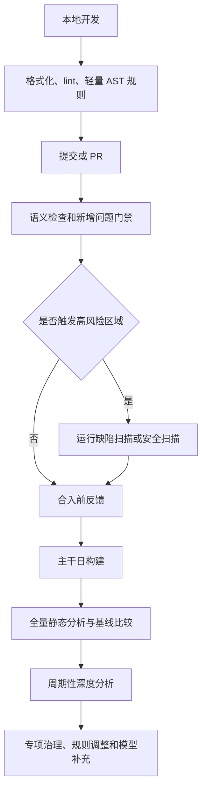
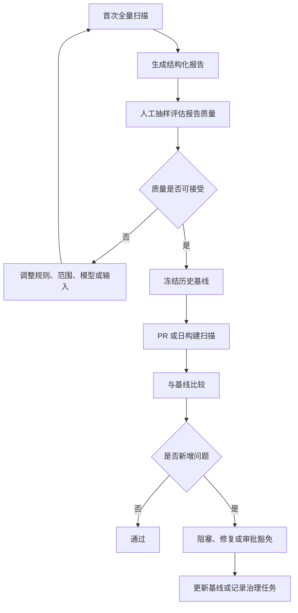

# Static Analysis Engineering Practice

调研日期：2026-07-03

## 核心结论

静态分析落地的核心问题不是“启用多少规则”，而是让分析结果稳定、可解释、可治理。一个工程化静态分析流程至少需要四类能力：准确的分析输入、分层的规则策略、结构化的结果管理和持续的误报治理。

如果缺少构建信息、语言模型或框架模型，复杂分析器会把大量不确定性转化为误报和漏报。如果缺少基线和增量策略，历史问题会淹没新增风险。如果缺少 suppression、owner 和复核流程，工具会逐渐失去可信度。

## 落地分层

| 层级 | 目标 | 典型能力 | 适合阶段 |
| --- | --- | --- | --- |
| 基础 lint | 快速统一编码规则 | 格式、命名、简单 API 禁用 | IDE、本地提交前 |
| 语义检查 | 发现局部 API 和类型问题 | AST 规则、类型检查、轻量数据流 | PR 检查 |
| 缺陷扫描 | 发现运行时风险 | 路径敏感分析、资源状态、空值和越界 | 日构建、主干检查 |
| 安全扫描 | 发现输入传播和敏感操作风险 | 污点分析、source/sink 建模、框架模型 | 安全门禁、版本发布 |
| 深度分析 | 提升跨文件和跨模块覆盖 | CTU、跨过程摘要、全仓查询 | 周期性任务、专项治理 |

分层的价值在于控制反馈时延。开发者本地需要低延迟和高置信；CI 可以承担更重的语义检查；周期性任务可以承担跨文件、路径敏感和安全规则的成本。

## 分析输入治理

静态分析结果质量首先取决于输入质量。对 C/C++ 项目，准确的 `compile_commands.json`、宏定义、include path、target triple 和生成代码路径非常关键。对 Java、JavaScript、Python、Go 等项目，依赖解析、框架入口、构建脚本和生成代码同样会影响结果。

输入治理检查项：

- 构建数据库是否覆盖关键源文件。
- 同一源文件是否存在多个互相冲突的编译动作。
- 宏、target、feature flag 是否与真实构建一致。
- 生成代码、第三方代码、测试代码是否有明确纳入策略。
- 分析器版本、规则版本和依赖模型是否可复现。
- 分析结果是否保存结构化格式，例如 SARIF、plist、JSON 或工具数据库。

输入不稳定时，不应急于扩展规则。先让少量高置信规则稳定运行，再扩大范围。

## 规则策略

规则策略应按风险和置信度分层，而不是把所有规则统一作为阻塞门禁。

| 规则类型 | 建议策略 |
| --- | --- |
| 格式与风格 | 自动修复或本地快速失败 |
| 明确 API 禁用 | PR 阻塞，提供替代接口 |
| 高置信缺陷 | 新增问题阻塞，历史问题进入基线 |
| 中低置信缺陷 | 报告但不阻塞，定期治理 |
| 安全高危 sink | 新增问题阻塞，需安全复核 |
| 实验规则 | 专项扫描，不进入默认门禁 |

规则扩展应保留退出机制。若某条规则在真实项目中误报过高，应先降级为非阻塞报告，再通过建模、规则收窄或 suppression 改善质量。

## 基线与增量治理

大型项目通常已经存在历史问题。若第一次接入静态分析就要求清零所有报告，团队很容易把工具视为噪声来源。更可行的策略是建立基线，只阻塞新增问题。

基线治理流程：

基线不应成为永久忽略列表。它需要定期老化、分配 owner、按模块和风险分批清理。

## 误报治理

误报治理是静态分析工程化的长期工作。误报产生的常见原因包括：构建参数不准确、框架模型缺失、路径约束不完整、库函数摘要过粗、规则边界过宽和业务前置条件未表达。

建议处理顺序：

1. 先确认输入是否准确，避免由错误构建参数制造伪问题。
2. 判断规则是否适合当前代码库，必要时缩小适用范围。
3. 补充注解、断言、类型约束或框架模型。
4. 对稳定误报使用 suppression，并记录原因和过期条件。
5. 对分析器缺陷保留最小复现，便于升级或上游反馈。

suppression 应尽量靠近代码或规则配置，并说明原因。大范围、无原因的忽略规则会降低工具可信度。

## CI 集成

CI 中的静态分析需要明确三件事：运行时机、失败条件和结果展示方式。

| 运行时机 | 适合检查 |
| --- | --- |
| pre-commit | 格式、简单 lint、快速 AST 规则 |
| PR | 新增高置信问题、API 禁用、轻量语义检查 |
| main 日构建 | 全量缺陷扫描、基线比较、趋势统计 |
| release 前 | 安全扫描、深度跨文件分析、专项规则 |

失败条件建议优先基于新增问题，而不是全量问题数量。结果展示应提供文件、行号、规则 ID、路径解释、修复建议和 suppression 入口。若工具支持 SARIF，可接入 GitHub Code Scanning 或同类平台；若使用 CodeChecker 这类系统，应保存报告数据库并支持跨版本比较。

## 指标体系

静态分析指标应同时覆盖工具运行、结果质量和治理效率。

| 指标 | 含义 |
| --- | --- |
| 覆盖文件数 | 被实际分析的源文件数量 |
| 分析成功率 | 成功完成分析的文件或模块比例 |
| 新增问题数 | 相比基线新增的报告 |
| 确认缺陷率 | 报告中被确认真实问题的比例 |
| 误报率 | 被确认不需修复的报告比例 |
| 平均修复时间 | 从报告到修复合入的时间 |
| suppression 数量 | 被主动忽略的问题数量和趋势 |
| 分析耗时 | 对本地、PR、日构建反馈时延的影响 |

指标应服务治理，而不是制造形式化负担。新增问题数和确认缺陷率通常比总报告数更能反映工具价值。

## 工具组合

不同工具适合不同层级，不宜期望单一工具覆盖所有问题。

| 工具类型 | 代表 | 适合用途 |
| --- | --- | --- |
| 编译器告警 | GCC、Clang、TypeScript compiler | 类型、语法和部分局部语义问题 |
| Lint / AST 规则 | clang-tidy、ESLint、Semgrep | 规范、API 使用、可维护性检查 |
| 路径敏感分析器 | Clang Static Analyzer、Infer | 空值、资源、内存、状态类缺陷 |
| 安全查询工具 | CodeQL、Semgrep Pro 等 | 跨文件安全模式、污点分析 |
| 运行时检测 | ASan、UBSan、TSan、Valgrind | 真实执行中的内存、未定义行为和并发问题 |

静态分析与运行时检测可以互补。静态分析覆盖未执行路径，运行时检测提供真实执行证据。对高风险问题，建议同时保留静态报告、测试复现和运行时检测证据。

## 常见失败模式

| 失败模式 | 表现 | 处理方式 |
| --- | --- | --- |
| 一次启用过多规则 | 报告数量过大，团队无法处理 | 从高置信规则和新增问题开始 |
| 只看总报告数 | 历史问题掩盖新增风险 | 建立基线和趋势指标 |
| 缺少 owner | 报告长期无人处理 | 按模块、规则或风险分配责任 |
| suppression 无管理 | 忽略列表持续膨胀 | 要求原因、过期条件和定期复核 |
| 输入不稳定 | 同一代码多次扫描结果不同 | 固化构建参数、工具版本和依赖模型 |
| 报告不可解释 | 开发者难以确认问题 | 输出路径、数据流、调用链和规则文档 |

## 推荐推进路径

1. 选择一个模块和少量高置信规则试点。
2. 固化构建输入和工具版本。
3. 生成结构化报告并人工抽样评估。
4. 冻结历史基线，只阻塞新增高置信问题。
5. 建立 suppression 和 owner 机制。
6. 将结果接入 PR、日构建和趋势看板。
7. 逐步扩展到跨过程、安全和深度分析。

## 资料来源

- [Clang Static Analyzer official site](https://clang-analyzer.llvm.org/)
- [Clang Static Analyzer command line usage](https://clang.llvm.org/docs/analyzer/user-docs/CommandLineUsage.html)
- [Clang Static Analyzer checker list](https://clang.llvm.org/docs/analyzer/checkers.html)
- [CodeChecker analyzer user guide](https://codechecker.readthedocs.io/en/latest/analyzer/user_guide/)
- [SARIF specification](https://docs.oasis-open.org/sarif/sarif/v2.1.0/sarif-v2.1.0.html)
- [GitHub code scanning with CodeQL](https://docs.github.com/en/code-security/code-scanning/introduction-to-code-scanning/about-code-scanning)
- [Semgrep documentation](https://semgrep.dev/docs/)
- [Infer static analyzer documentation](https://fbinfer.com/docs/next/about-Infer/)
