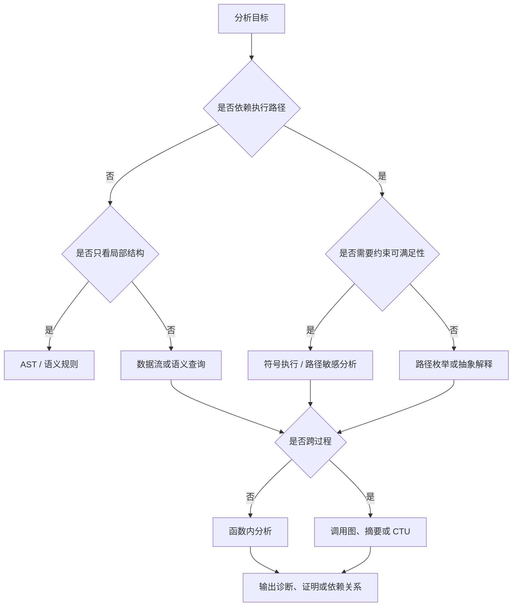
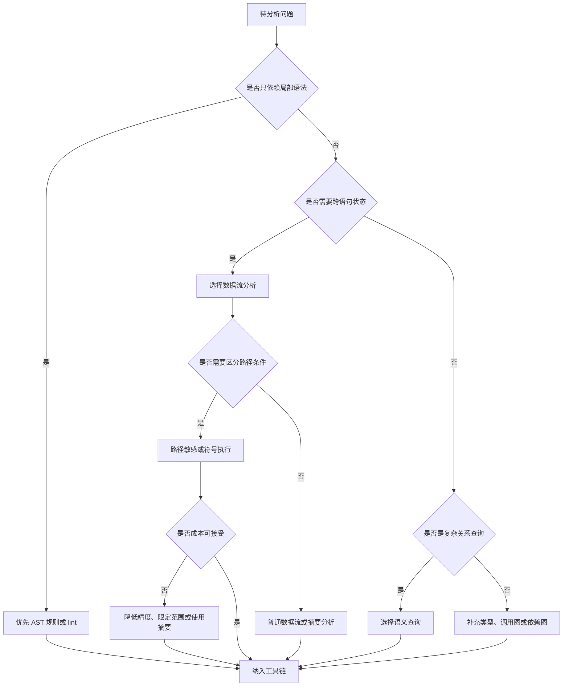

# Static Analysis Method Map

调研日期：2026-07-03

## 核心结论

静态分析不是单一算法，而是一组围绕程序表示、语义近似和结果解释构建的方法体系。理解静态分析时，应先区分三个层次：分析对象是什么，分析事实如何表达，分析结果用于什么工程决策。

从工程视角看，静态分析方法可以分为四类：语法结构分析、数据流分析、路径敏感分析和语义查询分析。它们并不是互斥关系，成熟工具通常会组合使用这些方法。例如 clang-tidy 主要面向 AST 规则和局部语义检查；Clang Static Analyzer 使用路径敏感符号执行；CodeQL 把程序事实写入数据库后用查询语言表达跨过程关系；Infer 使用分离逻辑和过程摘要支持增量分析。

## 方法谱系

| 方法 | 主要输入 | 适合回答的问题 | 典型工具或场景 |
| --- | --- | --- | --- |
| 词法与格式规则 | token、文本、语法片段 | 命名、格式、简单禁用模式 | formatter、lint、简单 SAST 规则 |
| AST 模式匹配 | AST、类型信息、符号表 | API 误用、局部结构问题、重构建议 | clang-tidy、Semgrep |
| 控制流分析 | CFG、异常边、循环结构 | 可达性、死代码、路径结构 | 编译器告警、覆盖率辅助 |
| 数据流分析 | CFG、def-use、抽象状态 | 未初始化、常量传播、资源状态 | 编译器优化、缺陷检测 |
| 别名与指针分析 | 堆对象、指针、字段、调用关系 | 指向关系、逃逸、共享状态 | C/C++ 分析、并发分析 |
| 路径敏感符号执行 | CFG、路径条件、约束求解器 | 空指针、除零、越界、状态机错误 | Clang Static Analyzer、KLEE |
| 抽象解释 | 抽象域、格、transfer function | 数值范围、安全证明、运行时错误证明 | Astrée、Infer 部分分析 |
| 污点分析 | source、sink、sanitizer、传播规则 | 注入、敏感信息泄露、输入校验缺失 | CodeQL、SAST、安全扫描 |
| 语义查询 | 程序事实数据库、关系查询 | 复杂 API 关系、跨文件模式 | CodeQL、Datalog 系分析 |

方法选择应受目标驱动。局部编码规范不需要路径敏感符号执行；跨函数资源泄漏通常不能只靠 AST 模式匹配；安全输入传播需要 source、sink 和 sanitizer 模型；证明某类运行时错误不存在则需要更保守的抽象语义。

## 分析维度

静态分析的精度通常由若干维度共同决定。

| 维度 | 低成本形式 | 高精度形式 | 影响 |
| --- | --- | --- | --- |
| Flow sensitivity | 不区分语句顺序 | 区分每个程序点 | 影响状态更新的准确性 |
| Path sensitivity | 合并所有分支 | 保留路径条件 | 影响不可行路径和误报 |
| Context sensitivity | 合并所有调用上下文 | 区分调用点、调用栈或对象上下文 | 影响跨过程结果精度 |
| Field sensitivity | 合并对象字段 | 区分字段 | 影响对象和结构体分析 |
| Heap sensitivity | 粗略合并堆对象 | 按分配点、类型或上下文区分 | 影响指针和别名分析 |
| Interprocedural scope | 单函数或单文件 | 跨函数、跨文件、跨模块 | 影响覆盖范围和成本 |

这些维度之间存在成本耦合。一个同时具备路径敏感、上下文敏感、字段敏感和跨文件能力的分析器，通常需要更严格的预算控制、缓存机制和结果治理机制。

## AST 规则

AST 规则适合表达局部语法和类型关系。它通常能够稳定定位到源代码结构，诊断信息清晰，性能成本较低，因此常用于编码规范、API 使用约束和机械重构。

适合 AST 规则的问题：

- 禁用某些 API 或宏。
- 检查函数、类型、字段或注解是否符合规范。
- 发现简单资源使用模式，例如打开文件后立即缺少错误检查。
- 识别可机械替换的旧接口。

不适合只靠 AST 规则的问题：

- 需要沿多条分支判断变量状态。
- 需要跨函数追踪资源所有权。
- 需要判断指针是否可能为空。
- 需要证明某个输入是否能到达危险操作。

AST 规则的优势是可解释性强，缺点是容易被封装、别名、条件分支和跨过程调用打断。

## 数据流分析

数据流分析把程序点上的事实作为状态，并沿 CFG 迭代传播。它适合在成本可控的前提下处理“值或属性如何流动”的问题。

常见工程问题包括：

- 变量读取前是否已赋值。
- 资源是否在所有路径上关闭。
- 错误码是否被检查。
- 条件判断后变量范围是否收窄。
- 某个定义是否影响后续使用点。

数据流分析通常比 AST 规则更有语义能力，但诊断解释也更复杂。为了让报告可复核，工具需要输出从 source 到 sink、从定义到使用、或从资源获取到资源泄漏的路径。

## 路径敏感分析

路径敏感分析区分不同分支条件下的状态。它能减少部分误报，也能发现需要多步推理的缺陷。例如在 `if (p != nullptr)` 分支内，分析器可以把 `p` 约束为非空；在另一条分支中则把 `p` 约束为空。

路径敏感分析常用于：

- 空指针解引用。
- 除零和越界。
- use-after-free。
- double free。
- 状态机顺序错误。
- 锁、引用计数、文件句柄等资源状态错误。

主要限制是路径爆炸。真实项目需要通过循环限制、函数 inline 限制、路径裁剪、摘要、约束求解超时和模型库来控制成本。

## 抽象解释

抽象解释适合用有限抽象域保守近似无限执行状态。它常用于数值范围、数组边界、运行时错误证明和高可靠场景。

抽象域的设计决定分析能力：

| 抽象域 | 能表达的问题 | 代价 |
| --- | --- | --- |
| 符号域 | 正、负、零等粗粒度性质 | 成本低，精度有限 |
| 区间域 | 数值上下界 | 适合范围检查，难表达变量关系 |
| Octagon / polyhedra | 变量之间的线性关系 | 精度高，计算成本高 |
| 集合域 | 枚举有限可能值 | 适合枚举、状态机、小范围常量 |
| 污点域 | 输入可信状态 | 适合安全传播，依赖模型质量 |

抽象解释强调保守性，但工程工具常根据目标做取舍：安全证明工具更重视 soundness，缺陷发现工具更重视报告质量和可用成本。

## 语义查询

语义查询方法会先抽取程序事实，例如函数定义、调用关系、类型层级、数据流边和控制流边，再通过查询语言表达规则。CodeQL 是这一类方法的典型代表。

这种方法适合：

- 规则需要跨文件组合多个事实。
- 团队需要审计、复用和版本化查询。
- 安全规则需要对框架 source、sink、sanitizer 做建模。
- 需要把分析结果纳入代码搜索、审计和批量修复流程。

语义查询的关键挑战是事实抽取和模型维护。查询本身可以很清晰，但若语言前端、框架模型或构建信息不准确，结果仍会出现漏报或误报。

## 方法选择建议

一般建议：

1. 从低成本、可解释的规则开始。
2. 当局部规则无法表达跨语句事实时，再引入数据流。
3. 当误报来自不可行路径时，再考虑路径敏感分析。
4. 当规则需要跨项目知识和审计复用时，使用语义查询。
5. 当目标是证明安全性或运行时错误不存在时，评估抽象解释或形式化方法。

## 资料来源

- [Static Program Analysis by Anders Moller and Michael I. Schwartzbach](https://cs.au.dk/~amoeller/spa/)
- [Principles of Program Analysis](https://link.springer.com/book/9783540654100)
- [Abstract Interpretation: A Unified Lattice Model for Static Analysis of Programs](https://dl.acm.org/doi/10.1145/512950.512973)
- [Clang AST Matcher Reference](https://clang.llvm.org/docs/LibASTMatchersReference.html)
- [Clang Static Analyzer official site](https://clang-analyzer.llvm.org/)
- [CodeQL documentation](https://codeql.github.com/docs/)
- [Infer static analyzer documentation](https://fbinfer.com/docs/next/about-Infer/)
